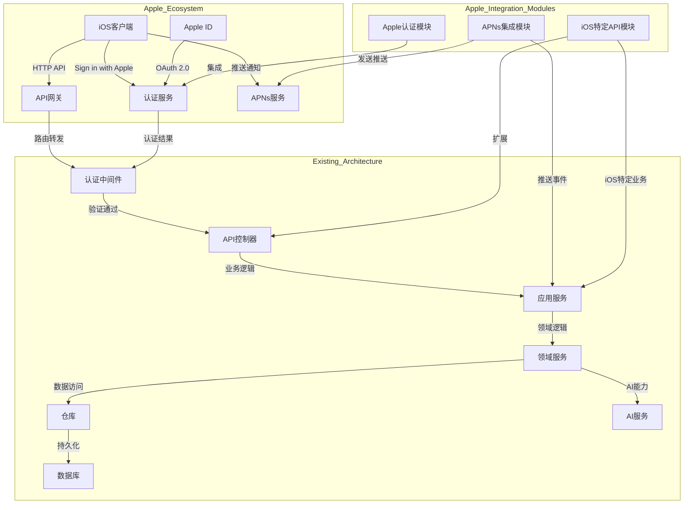
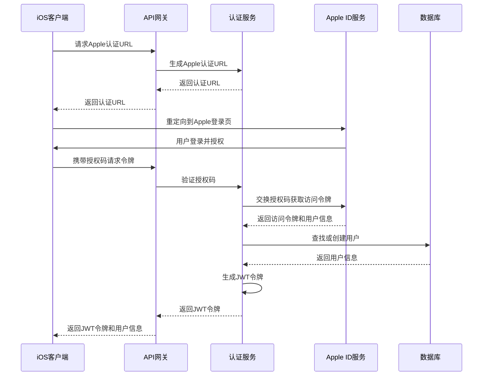
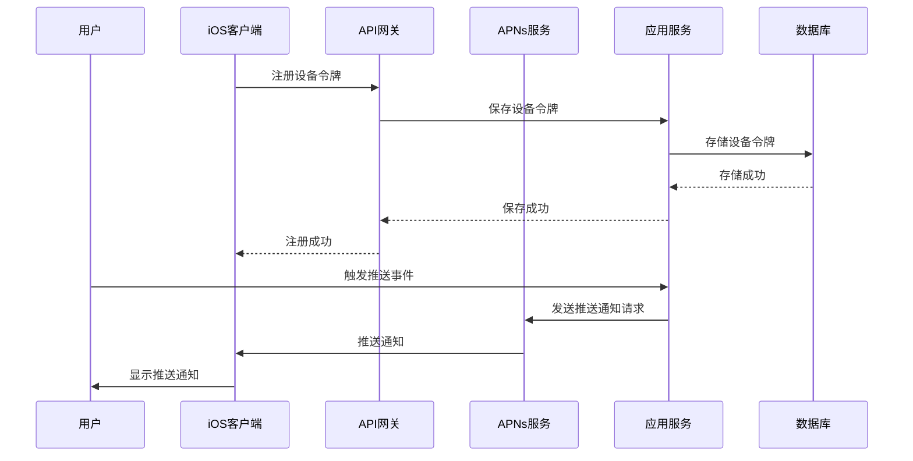

# 苹果后端集成架构设计文档

索引标签：#架构设计 #苹果集成 #认证 #推送通知

## 1. 文档概述

本文档详细描述了AI认知辅助系统与苹果后端的集成架构设计，包括集成原则、架构图、核心模块、技术栈和实施步骤。该集成设计旨在将现有Web后端系统扩展为支持苹果生态，包括iOS客户端、Sign in with Apple、苹果推送通知等功能，同时保持现有Clean Architecture和领域驱动设计(DDD)原则不变。

相关文档：
- [架构对齐](architecture-alignment.md)：系统架构对齐设计
- [API设计](../core-features/api-design.md)：API设计规范和实现
- [苹果认证设计](../core-features/apple-authentication.md)：Sign in with Apple设计
- [苹果推送通知设计](../core-features/apple-push-notification.md)：APNs集成设计
- [表示层设计](../layered-design/presentation-layer-design.md)：表示层设计和实现
- [基础设施层设计](../layered-design/infrastructure-layer-design.md)：基础设施层设计和实现
- [苹果后端开发指南](../development-guides/apple-backend-development.md)：苹果后端开发指导
- [苹果端到端集成](../integration-guides/apple-end-to-end-integration.md)：苹果端到端集成流程
- [苹果后端测试策略](../testing/apple-backend-testing-strategy.md)：苹果后端测试策略

## 2. 设计原则

### 2.1 核心原则

- **保持现有架构不变**：继续遵循Clean Architecture和DDD原则，确保系统的可维护性和可扩展性
- **模块化设计**：将苹果后端集成作为独立模块添加，实现高内聚、低耦合
- **最小侵入性**：尽量减少对现有代码的修改，降低集成风险
- **可扩展性**：设计支持未来苹果生态新功能的扩展点
- **安全性优先**：遵循苹果安全最佳实践，确保用户数据安全
- **一致性**：保持与现有后端相同的代码风格和文档规范
- **用户体验优先**：优化苹果生态下的用户体验，提供原生集成感

### 2.2 设计目标

1. **无缝集成**：苹果后端功能与现有系统无缝集成，提供一致的用户体验
2. **高可用性**：确保苹果后端集成模块的高可用性和可靠性
3. **安全性**：遵循苹果安全规范，保护用户数据和隐私
4. **可扩展性**：支持未来苹果生态新功能的快速集成
5. **易于维护**：模块化设计，便于后续维护和升级
6. **良好的文档**：提供完整的设计文档和开发指南

## 3. 苹果后端集成架构

### 3.1 架构图

### 3.2 架构分层

苹果后端集成采用分层设计，与现有Clean Architecture保持一致，分为以下几层：

1. **表示层**：扩展现有API控制器，添加iOS特定API端点
2. **应用层**：添加苹果后端特定的应用服务和用例
3. **领域层**：保持现有领域模型不变，如需扩展，遵循DDD原则
4. **基础设施层**：添加苹果后端特定的基础设施服务，如APNs客户端、Apple认证客户端等
5. **AI能力层**：扩展现有AI服务，支持苹果生态特定的AI功能

### 3.3 核心集成模块

| 模块名称 | 功能描述 | 位置 | 依赖关系 |
|----------|----------|------|----------|
| **Apple认证模块** | 处理Sign in with Apple认证 | 基础设施层 | Passport.js、appleid-cli |
| **APNs集成模块** | 处理苹果推送通知 | 基础设施层 | node-apn |
| **iOS特定API模块** | 提供iOS客户端特定API | 表示层 | Express/Fastify |
| **苹果生态适配模块** | 适配苹果生态特有的功能需求 | 应用层 | 现有应用服务 |
| **iOS客户端SDK** | 提供iOS客户端集成SDK | 外部 | REST API |

## 4. 技术栈

### 4.1 核心技术栈

| 技术类别 | 技术选型 | 用途 | 版本 |
|----------|----------|------|------|
| **Web框架** | Fastify | 构建API服务 | ^4.0.0 |
| **Apple认证** | Passport.js + appleid-cli | Sign in with Apple集成 | ^0.6.0 |
| **APNs** | node-apn | 苹果推送通知服务集成 | ^5.0.0 |
| **JWT** | jsonwebtoken | 用户认证和授权 | ^9.0.0 |
| **数据验证** | Zod | 请求数据验证 | ^3.0.0 |
| **API文档** | Swagger/OpenAPI | API文档生成 | ^4.0.0 |

### 4.2 技术选型理由

- **Fastify**：高性能、轻量级，支持TypeScript，适合构建API服务
- **Passport.js**：成熟的认证中间件，支持多种认证策略，包括Apple认证
- **node-apn**：官方推荐的Node.js APNs客户端库，功能完整，易于使用
- **jsonwebtoken**：行业标准的JWT库，安全可靠
- **Zod**：类型安全的数据验证库，适合TypeScript项目
- **Swagger/OpenAPI**：自动生成API文档，便于iOS客户端开发者使用

## 5. 核心集成流程

### 5.1 Sign in with Apple流程

### 5.2 苹果推送通知流程

## 6. 安全考虑

### 6.1 Apple认证安全

- 使用HTTPS加密所有与Apple服务器的通信
- 验证Apple ID令牌的签名和有效性
- 存储Apple刷新令牌时使用加密存储
- 定期轮换Apple认证密钥
- 遵循Apple安全最佳实践

### 6.2 APNs安全

- 使用APNs认证密钥或证书进行身份验证
- 定期轮换APNs密钥和证书
- 验证APNs设备令牌的有效性
- 实现推送通知的加密传输
- 遵循Apple推送通知安全规范

### 6.3 API安全

- 对所有API端点实施认证和授权
- 使用JWT令牌进行API身份验证
- 实现API请求速率限制
- 验证所有API请求参数
- 对敏感数据进行加密传输和存储

## 7. 部署与运维

### 7.1 部署架构

苹果后端集成模块与现有系统共享相同的部署架构，支持：

- 容器化部署（Docker）
- 云平台部署（AWS、Azure、GCP等）
- 本地开发环境部署

### 7.2 配置管理

苹果后端集成模块的配置与现有系统分离，包括：

- Apple认证配置（Client ID、Team ID、Key ID等）
- APNs配置（认证密钥、Bundle ID等）
- iOS特定API配置

### 7.3 监控与日志

扩展现有监控和日志系统，添加苹果后端集成模块的监控指标和日志：

- Apple认证成功率和错误率
- APNs推送成功率和错误率
- iOS客户端API请求统计
- 苹果后端集成模块的性能指标

## 8. 测试策略

### 8.1 测试类型

- **单元测试**：测试苹果后端集成模块的单个功能
- **集成测试**：测试苹果后端集成模块与现有系统的集成
- **端到端测试**：测试完整的苹果后端集成流程，包括iOS客户端
- **性能测试**：测试苹果后端集成模块的性能和响应时间
- **安全测试**：测试苹果后端集成模块的安全性

### 8.2 测试工具

| 测试类型 | 工具 | 用途 |
|----------|------|------|
| **单元测试** | Jest | 测试苹果后端集成模块的单个功能 |
| **集成测试** | Supertest | 测试API端点与苹果后端集成模块的集成 |
| **端到端测试** | Detox | 测试iOS客户端与后端的完整流程 |
| **性能测试** | Artillery | 测试苹果后端集成模块的性能 |
| **安全测试** | OWASP ZAP | 测试苹果后端集成模块的安全性 |

### 8.3 测试覆盖率

- 单元测试覆盖率：≥80%
- 集成测试覆盖率：≥70%
- 端到端测试覆盖率：≥50%

## 9. 实施步骤

### 9.1 阶段1：基础集成

1. **设计和实现Apple认证模块**
   - 集成Sign in with Apple
   - 实现Apple ID令牌验证
   - 集成到现有认证系统

2. **设计和实现APNs集成模块**
   - 集成APNs服务
   - 实现设备令牌管理
   - 实现推送通知发送功能

3. **扩展API设计**
   - 添加iOS特定API端点
   - 更新API文档

### 9.2 阶段2：功能扩展

1. **实现iOS客户端SDK**
   - 提供iOS客户端集成SDK
   - 实现API客户端库
   - 提供示例代码

2. **扩展应用服务**
   - 添加苹果后端特定的应用服务
   - 实现iOS客户端特定的业务逻辑

3. **优化用户体验**
   - 优化iOS客户端的API响应格式
   - 实现iOS客户端特定的功能

### 9.3 阶段3：优化和完善

1. **性能优化**
   - 优化苹果后端集成模块的性能
   - 实现缓存机制
   - 优化数据库查询

2. **安全加固**
   - 实施额外的安全措施
   - 进行安全审计和测试
   - 遵循苹果安全最佳实践

3. **文档完善**
   - 完善设计文档
   - 编写开发指南
   - 提供iOS客户端集成文档

4. **测试和验证**
   - 进行全面的测试
   - 修复发现的问题
   - 进行性能和安全测试

## 10. 总结

本文档详细描述了AI认知辅助系统与苹果后端的集成架构设计，包括设计原则、架构图、核心模块、技术栈、集成流程、安全考虑、部署与运维、测试策略和实施步骤。该设计遵循Clean Architecture和DDD原则，采用模块化设计，实现了苹果后端功能与现有系统的无缝集成，同时保持了系统的可维护性和可扩展性。

通过实施这个集成设计，可以使AI认知辅助系统支持苹果生态，包括iOS客户端、Sign in with Apple、苹果推送通知等功能，提供更好的用户体验和更广泛的用户覆盖。

## 11. 文档更新记录

| 更新日期 | 更新内容 | 更新人 |
|----------|----------|--------|
| 2026-01-09 | 1. 初始创建苹果后端集成架构设计文档 2. 定义了设计原则和架构图 3. 详细描述了核心集成模块和技术栈 4. 设计了核心集成流程 5. 制定了安全考虑和部署运维方案 6. 规划了测试策略和实施步骤 | 系统架构师 |