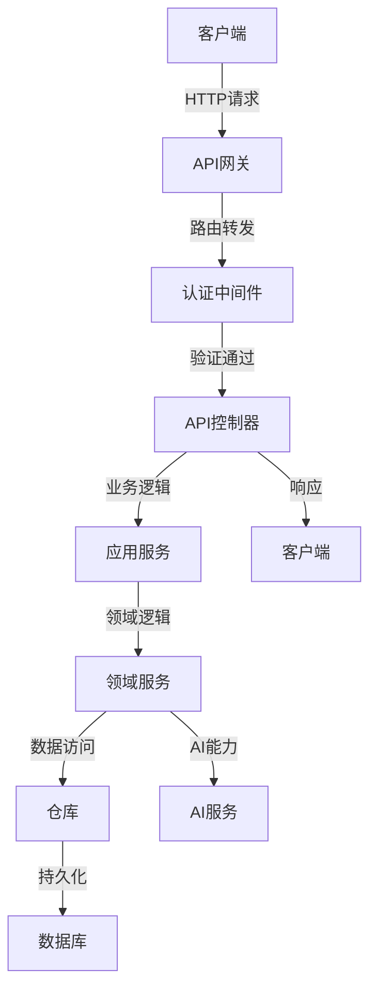

# API设计文档

索引标签：#API设计 #RESTful #安全 #表示层

## 1. 文档概述

本文档详细描述了AI认知辅助系统的API设计，包括设计原则、核心资源、端点定义和交互流程。API设计遵循RESTful架构，确保系统的可扩展性和易用性。

相关文档包括：
- [API规范](api-specification.md)：详细描述API的具体规范和参数
- [表示层设计](../layered-design/presentation-layer-design.md)：详细描述表示层的设计和实现
- [安全策略](security-strategy.md)：详细描述API的安全策略
- [API使用示例](../dev-support/api-usage-examples.md)：提供API的使用示例和代码片段
- [苹果认证设计](apple-authentication.md)：Sign in with Apple设计
- [苹果推送通知设计](apple-push-notification.md)：APNs集成设计
- [苹果后端集成架构设计](../architecture-design/apple-backend-integration.md)：苹果后端集成架构设计

## 2. API设计原则

### 2.1 核心设计理念
- **RESTful架构**：遵循RESTful设计原则，使用HTTP方法和URI表示资源和操作
- **资源导向**：API设计围绕资源展开，每个资源对应一个URI
- **统一接口**：使用统一的接口设计，包括HTTP方法、状态码、请求/响应格式
- **无状态**：API是无状态的，每个请求包含所有必要的信息
- **分层设计**：API设计与系统架构分层对应，便于维护和扩展
- **版本控制**：支持API版本管理，确保向后兼容
- **安全性优先**：实现完善的认证和授权机制
- **可扩展性**：设计支持未来功能扩展的API结构
- **易用性**：提供清晰的文档和示例，便于开发者使用
- **性能优化**：设计高效的API，减少不必要的数据传输
- **兼容性优先**：能加就不改，能兼容就不删除，确保API改动不会破坏现有功能
  - 优先选择新增字段而非修改现有字段
  - 新增功能时优先考虑向后兼容
  - 必须修改时，先兼容旧逻辑，再逐步替换，最后再删除
  - 给前后端足够的缓冲期，避免一次性改动带来的全局BUG

### 2.2 设计约束
- 所有API端点必须使用HTTPS（生产环境）
- 必须实现认证和授权机制，包括Sign in with Apple
- 必须返回标准的HTTP状态码
- 必须使用JSON格式进行数据交换
- 必须支持跨域资源共享（CORS）
- 必须实现请求速率限制
- 必须提供详细的错误信息
- 必须支持API版本控制
- 必须支持苹果推送通知服务（APNs）
- 必须支持iOS客户端特定的API需求

## 3. API技术栈

| 组件类型 | 技术选型 | 用途 | 特点 |
|----------|----------|------|------|
| **Web框架** | Fastify | 构建API服务 | 轻量级、高性能、生态丰富 |
| **API文档** | Swagger/OpenAPI | API文档生成 | 自动生成、交互式文档 |
| **认证授权** | JWT + Passport.js | 用户认证和授权 | 无状态、安全可靠，支持多种认证策略 |
| **Apple认证** | appleid-cli | Sign in with Apple集成 | 官方推荐的Apple ID认证库 |
| **APNs服务** | node-apn | 苹果推送通知服务 | 官方推荐的Node.js APNs客户端 |
| **数据验证** | Zod | 请求数据验证 | 类型安全、运行时验证 |
| **API客户端** | Axios | 内部API调用 | 易用、支持拦截器 |
| **CORS支持** | @fastify/cors | 跨域资源共享 | 配置灵活、安全可靠 |
| **速率限制** | express-rate-limit | API请求速率限制 | 可配置、支持多种存储 |

> 注意：Web框架已从Express更换为Fastify，以提高性能和更好地支持TypeScript。详细的技术选型和依赖版本请参考[依赖对齐文档](../architecture-design/dependency-alignment.md)和[package.json配置示例](../dev-support/package-json-example.md)。
> 
> 关于苹果后端集成的详细设计，请参考[苹果后端集成架构设计](../architecture-design/apple-backend-integration.md)文档。

## 3. API架构设计

### 3.1 API分层架构



### 3.2 API模块划分

| 模块 | 主要功能 | 基础路径 |
|------|----------|----------|
| **认证模块** | 用户注册、登录、令牌刷新，包括Sign in with Apple | `/api/v1/auth` |
| **用户模块** | 用户信息管理 | `/api/v1/users` |
| **认知模型模块** | 认知模型管理 | `/api/v1/models` |
| **概念模块** | 认知概念管理 | `/api/v1/models/{modelId}/concepts` |
| **关系模块** | 认知关系管理 | `/api/v1/models/{modelId}/relations` |
| **思想片段模块** | 思想片段管理 | `/api/v1/thoughts` |
| **洞察模块** | 认知洞察管理 | `/api/v1/models/{modelId}/insights` |
| **建议模块** | 建议管理 | `/api/v1/models/{modelId}/suggestions` |
| **可视化模块** | 认知模型可视化数据 | `/api/v1/models/{modelId}/visualization` |
| **推送通知模块** | 设备令牌管理、推送通知发送 | `/api/v1/apns` |
| **iOS特定功能模块** | iOS客户端特定功能 | `/api/v1/ios` |
| **健康检查模块** | 服务健康检查 | `/api/v1/health` |

## 4. 认证与授权

### 4.1 认证机制

- **JWT认证**：使用JSON Web Token进行用户认证
- **令牌类型**：访问令牌（Access Token）和刷新令牌（Refresh Token）
- **令牌有效期**：
  - 访问令牌：1小时
  - 刷新令牌：7天
- **认证方式**：
  - 传统邮箱/密码登录
  - Sign in with Apple
  - 其他OAuth 2.0提供商（预留扩展）
- **认证流程**：
  1. 用户通过邮箱/密码或Sign in with Apple登录获取访问令牌和刷新令牌
  2. 每次API请求在Authorization头中携带访问令牌
  3. 访问令牌过期后，使用刷新令牌获取新的访问令牌

> 详细的安全策略和认证实现请参考[安全策略文档](security-strategy.md)、[苹果认证设计文档](apple-authentication.md)和[表示层设计文档](../layered-design/presentation-layer-design.md)。

### 4.2 授权机制

- **基于角色的访问控制（RBAC）**：实现不同角色的权限控制
- **权限级别**：
  - 游客：只能访问公开API
  - 用户：可以访问自己的资源
  - 管理员：可以访问所有资源

### 4.3 安全头

| 头名称 | 值 | 用途 |
|--------|-----|------|
| **Authorization** | Bearer {token} | 携带访问令牌 |
| **X-Request-Id** | {uuid} | 唯一标识请求，用于日志和追踪 |
| **X-User-Id** | {userId} | 携带用户ID，用于内部授权 |

## 5. API版本管理

### 5.1 版本控制策略

- **URI路径版本控制**：在URI路径中包含版本号，如 `/api/v1/users`
- **向后兼容**：新版本API必须兼容旧版本API
- **版本生命周期**：
  - 当前版本：最新稳定版本
  - 过时版本：仍受支持但不推荐使用
  - 废弃版本：不再受支持，将被移除

### 5.2 版本迁移策略

- 提供详细的迁移指南
- 支持并行运行多个版本的API
- 逐步废弃旧版本API
- 提供API版本状态端点

## 6. 错误处理

### 6.1 错误类型

| 错误类型 | 描述 | HTTP状态码 |
|----------|------|------------|
| **验证错误** | 请求数据验证失败 | 400 Bad Request |
| **认证错误** | 认证失败或令牌无效 | 401 Unauthorized |
| **授权错误** | 没有权限访问资源 | 403 Forbidden |
| **资源不存在** | 请求的资源不存在 | 404 Not Found |
| **方法不允许** | 请求方法不被允许 | 405 Method Not Allowed |
| **冲突错误** | 请求导致资源冲突 | 409 Conflict |
| **服务器错误** | 服务器内部错误 | 500 Internal Server Error |
| **服务不可用** | 服务器暂时不可用 | 503 Service Unavailable |

### 6.2 错误响应格式

```json
{
  "error": {
    "code": "VALIDATION_ERROR",
    "message": "请求数据验证失败",
    "details": [
      {
        "field": "email",
        "message": "无效的邮箱格式"
      }
    ],
    "requestId": "uuid-1234-5678",
    "timestamp": "2023-10-01T12:00:00.000Z"
  }
}
```

## 7. API端点设计

### 7.1 认证模块

#### 7.1.1 用户注册

```
POST /api/v1/auth/register
```

**请求体**：
```json
{
  "username": "testuser",
  "email": "test@example.com",
  "password": "password123"
}
```

**响应**：
```json
{
  "data": {
    "id": "user-123",
    "username": "testuser",
    "email": "test@example.com",
    "createdAt": "2023-10-01T12:00:00.000Z"
  },
  "meta": {
    "requestId": "uuid-1234-5678",
    "code": 201,
    "message": "User registered successfully"
  }
}
```

#### 7.1.2 用户登录

```
POST /api/v1/auth/login
```

**请求体**：
```json
{
  "email": "test@example.com",
  "password": "password123"
}
```

**响应**：
```json
{
  "data": {
    "accessToken": "eyJhbGciOiJIUzI1NiIsInR5cCI6IkpXVCJ9...",
    "refreshToken": "eyJhbGciOiJIUzI1NiIsInR5cCI6IkpXVCJ9...",
    "tokenType": "Bearer",
    "expiresIn": 3600,
    "user": {
      "id": "user-123",
      "username": "testuser",
      "email": "test@example.com"
    }
  },
  "meta": {
    "requestId": "uuid-1234-5678",
    "code": 200,
    "message": "Login successful"
  }
}
```

#### 7.1.3 刷新令牌

```
POST /api/v1/auth/refresh
```

**请求头**：
```
Authorization: Bearer {refreshToken}
```

**响应**：
```json
{
  "data": {
    "accessToken": "eyJhbGciOiJIUzI1NiIsInR5cCI6IkpXVCJ9...",
    "tokenType": "Bearer",
    "expiresIn": 3600
  },
  "meta": {
    "requestId": "uuid-1234-5678",
    "code": 200,
    "message": "Token refreshed successfully"
  }
}
```

#### 7.1.4 Sign in with Apple - 获取认证URL

```
GET /api/v1/auth/apple/url
```

**请求参数**：
- `redirectUri`：可选，重定向URI，默认使用配置的重定向URI

**响应**：
```json
{
  "data": {
    "authorizationUrl": "https://appleid.apple.com/auth/authorize?client_id=...&redirect_uri=...&response_type=code&scope=email%20name&state=...",
    "state": "random-state-value"
  },
  "meta": {
    "requestId": "uuid-1234-5678",
    "code": 200,
    "message": "Authorization URL generated successfully"
  }
}
```

#### 7.1.5 Sign in with Apple - 回调处理

```
POST /api/v1/auth/apple/callback
```

**请求体**：
```json
{
  "code": "apple-authorization-code",
  "state": "random-state-value"
}
```

**响应**：
```json
{
  "data": {
    "accessToken": "eyJhbGciOiJIUzI1NiIsInR5cCI6IkpXVCJ9...",
    "refreshToken": "eyJhbGciOiJIUzI1NiIsInR5cCI6IkpXVCJ9...",
    "tokenType": "Bearer",
    "expiresIn": 3600,
    "user": {
      "id": "user-123",
      "username": "appleuser",
      "email": "user@example.com",
      "appleId": "apple-user-id"
    }
  },
  "meta": {
    "requestId": "uuid-1234-5678",
    "code": 200,
    "message": "Apple authentication successful"
  }
}
```

#### 7.1.6 Sign in with Apple - 使用ID令牌登录

```
POST /api/v1/auth/apple/login
```

**请求体**：
```json
{
  "idToken": "apple-id-token",
  "nonce": "random-nonce-value"
}
```

**响应**：
```json
{
  "data": {
    "accessToken": "eyJhbGciOiJIUzI1NiIsInR5cCI6IkpXVCJ9...",
    "refreshToken": "eyJhbGciOiJIUzI1NiIsInR5cCI6IkpXVCJ9...",
    "tokenType": "Bearer",
    "expiresIn": 3600,
    "user": {
      "id": "user-123",
      "username": "appleuser",
      "email": "user@example.com",
      "appleId": "apple-user-id"
    }
  },
  "meta": {
    "requestId": "uuid-1234-5678",
    "code": 200,
    "message": "Apple ID token authentication successful"
  }
}
```

### 7.2 用户模块

#### 7.2.1 获取当前用户信息

```
GET /api/v1/users/me
```

**请求头**：
```
Authorization: Bearer {accessToken}
```

**响应**：
```json
{
  "data": {
    "id": "user-123",
    "username": "testuser",
    "email": "test@example.com",
    "createdAt": "2023-10-01T12:00:00.000Z",
    "updatedAt": "2023-10-01T12:00:00.000Z",
    "lastLoginAt": "2023-10-05T14:30:00.000Z"
  },
  "meta": {
    "requestId": "uuid-1234-5678",
    "code": 200,
    "message": "User information retrieved successfully"
  }
}
```

#### 7.2.2 更新用户信息

```
PUT /api/v1/users/me
```

**请求头**：
```
Authorization: Bearer {accessToken}
```

**请求体**：
```json
{
  "username": "newusername",
  "email": "newemail@example.com"
}
```

**响应**：
```json
{
  "data": {
    "id": "user-123",
    "username": "newusername",
    "email": "newemail@example.com",
    "createdAt": "2023-10-01T12:00:00.000Z",
    "updatedAt": "2023-10-05T15:00:00.000Z",
    "lastLoginAt": "2023-10-05T14:30:00.000Z"
  },
  "meta": {
    "requestId": "uuid-1234-5678",
    "code": 200,
    "message": "User information updated successfully"
  }
}
```

### 7.3 认知模型模块

#### 7.3.1 创建认知模型

```
POST /api/v1/models
```

**请求头**：
```
Authorization: Bearer {accessToken}
```

**请求体**：
```json
{
  "modelName": "我的认知模型",
  "isPrimary": false
}
```

**响应**：
```json
{
  "data": {
    "id": "model-123",
    "userId": "user-123",
    "modelName": "我的认知模型",
    "isPrimary": false,
    "healthScore": 100.0,
    "conceptCount": 0,
    "relationCount": 0,
    "createdAt": "2023-10-05T15:30:00.000Z",
    "updatedAt": "2023-10-05T15:30:00.000Z",
    "lastAnalyzedAt": null
  },
  "meta": {
    "requestId": "uuid-1234-5678",
    "code": 201,
    "message": "Cognitive model created successfully"
  }
}
```

#### 7.3.2 获取用户的所有认知模型

```
GET /api/v1/models
```

**请求头**：
```
Authorization: Bearer {accessToken}
```

**响应**：
```json
{
  "data": {
    "items": [
      {
        "id": "model-123",
        "modelName": "我的认知模型",
        "isPrimary": false,
        "healthScore": 100.0,
        "conceptCount": 0,
        "relationCount": 0,
        "createdAt": "2023-10-05T15:30:00.000Z"
      }
    ],
    "total": 1,
    "page": 1,
    "limit": 10
  },
  "meta": {
    "requestId": "uuid-1234-5678",
    "code": 200,
    "message": "Cognitive models retrieved successfully"
  }
}
```

#### 7.3.3 获取认知模型详情

```
GET /api/v1/models/{modelId}
```

**请求头**：
```
Authorization: Bearer {accessToken}
```

**响应**：
```json
{
  "data": {
    "id": "model-123",
    "userId": "user-123",
    "modelName": "我的认知模型",
    "isPrimary": false,
    "healthScore": 100.0,
    "conceptCount": 5,
    "relationCount": 3,
    "createdAt": "2023-10-05T15:30:00.000Z",
    "updatedAt": "2023-10-05T16:00:00.000Z",
    "lastAnalyzedAt": "2023-10-05T15:45:00.000Z"
  },
  "meta": {
    "requestId": "uuid-1234-5678",
    "code": 200,
    "message": "Cognitive model retrieved successfully"
  }
}
```

#### 7.3.4 更新认知模型

```
PUT /api/v1/models/{modelId}
```

**请求头**：
```
Authorization: Bearer {accessToken}
```

**请求体**：
```json
{
  "modelName": "更新后的认知模型",
  "isPrimary": true
}
```

**响应**：
```json
{
  "data": {
    "id": "model-123",
    "userId": "user-123",
    "modelName": "更新后的认知模型",
    "isPrimary": true,
    "healthScore": 100.0,
    "conceptCount": 5,
    "relationCount": 3,
    "createdAt": "2023-10-05T15:30:00.000Z",
    "updatedAt": "2023-10-05T16:30:00.000Z",
    "lastAnalyzedAt": "2023-10-05T15:45:00.000Z"
  },
  "meta": {
    "requestId": "uuid-1234-5678",
    "code": 200,
    "message": "Cognitive model updated successfully"
  }
}
```

#### 7.3.5 删除认知模型

```
DELETE /api/v1/models/{modelId}
```

**请求头**：
```
Authorization: Bearer {accessToken}
```

**响应**：
```json
{
  "data": {
    "success": true,
    "message": "认知模型已成功删除"
  },
  "meta": {
    "requestId": "uuid-1234-5678",
    "code": 200,
    "message": "Cognitive model deleted successfully"
  }
}
```

### 7.4 概念模块

#### 7.4.1 创建认知概念

```
POST /api/v1/models/{modelId}/concepts
```

**请求头**：
```
Authorization: Bearer {accessToken}
```

**请求体**：
```json
{
  "name": "人工智能",
  "description": "人工智能是计算机科学的一个分支",
  "importance": "high"
}
```

**响应**：
```json
{
  "data": {
    "id": "concept-123",
    "modelId": "model-123",
    "name": "人工智能",
    "description": "人工智能是计算机科学的一个分支",
    "importance": "high",
    "occurrenceCount": 1,
    "createdAt": "2023-10-05T16:00:00.000Z",
    "updatedAt": "2023-10-05T16:00:00.000Z"
  },
  "meta": {
    "requestId": "uuid-1234-5678",
    "code": 201,
    "message": "Cognitive concept created successfully"
  }
}
```

#### 7.4.2 获取认知模型的所有概念

```
GET /api/v1/models/{modelId}/concepts
```

**请求头**：
```
Authorization: Bearer {accessToken}
```

**查询参数**：
- `importance`：可选，按重要性过滤（low/medium/high）
- `page`：可选，页码，默认1
- `limit`：可选，每页数量，默认10

**响应**：
```json
{
  "data": {
    "items": [
      {
        "id": "concept-123",
        "name": "人工智能",
        "description": "人工智能是计算机科学的一个分支",
        "importance": "high",
        "occurrenceCount": 1,
        "createdAt": "2023-10-05T16:00:00.000Z"
      }
    ],
    "total": 1,
    "page": 1,
    "limit": 10
  },
  "meta": {
    "requestId": "uuid-1234-5678",
    "code": 200,
    "message": "Cognitive concepts retrieved successfully"
  }
}
```

#### 7.4.3 获取概念详情

```
GET /api/v1/models/{modelId}/concepts/{conceptId}
```

**请求头**：
```
Authorization: Bearer {accessToken}
```

**响应**：
```json
{
  "data": {
    "id": "concept-123",
    "modelId": "model-123",
    "name": "人工智能",
    "description": "人工智能是计算机科学的一个分支",
    "importance": "high",
    "occurrenceCount": 1,
    "createdAt": "2023-10-05T16:00:00.000Z",
    "updatedAt": "2023-10-05T16:00:00.000Z"
  },
  "meta": {
    "requestId": "uuid-1234-5678",
    "code": 200,
    "message": "Cognitive concept retrieved successfully"
  }
}
```

#### 7.4.4 更新概念

```
PUT /api/v1/models/{modelId}/concepts/{conceptId}
```

**请求头**：
```
Authorization: Bearer {accessToken}
```

**请求体**：
```json
{
  "name": "人工智能（AI）",
  "description": "人工智能（AI）是计算机科学的一个分支，研究如何使计算机模拟人类智能",
  "importance": "high"
}
```

**响应**：
```json
{
  "data": {
    "id": "concept-123",
    "modelId": "model-123",
    "name": "人工智能（AI）",
    "description": "人工智能（AI）是计算机科学的一个分支，研究如何使计算机模拟人类智能",
    "importance": "high",
    "occurrenceCount": 1,
    "createdAt": "2023-10-05T16:00:00.000Z",
    "updatedAt": "2023-10-05T16:45:00.000Z"
  },
  "meta": {
    "requestId": "uuid-1234-5678",
    "code": 200,
    "message": "Cognitive concept updated successfully"
  }
}
```

#### 7.4.5 删除概念

```
DELETE /api/v1/models/{modelId}/concepts/{conceptId}
```

**请求头**：
```
Authorization: Bearer {accessToken}
```

**响应**：
```json
{
  "data": {
    "success": true,
    "message": "认知概念已成功删除"
  },
  "meta": {
    "requestId": "uuid-1234-5678",
    "code": 200,
    "message": "Cognitive concept deleted successfully"
  }
}
```

### 7.5 关系模块

#### 7.5.1 创建认知关系

```
POST /api/v1/models/{modelId}/relations
```

**请求头**：
```
Authorization: Bearer {accessToken}
```

**请求体**：
```json
{
  "sourceConceptId": "concept-123",
  "targetConceptId": "concept-456",
  "relationType": "is-a",
  "strength": "strong"
}
```

**响应**：
```json
{
  "data": {
    "id": "relation-123",
    "modelId": "model-123",
    "sourceConceptId": "concept-123",
    "targetConceptId": "concept-456",
    "relationType": "is-a",
    "strength": "strong",
    "occurrenceCount": 1,
    "createdAt": "2023-10-05T17:00:00.000Z",
    "updatedAt": "2023-10-05T17:00:00.000Z"
  },
  "meta": {
    "requestId": "uuid-1234-5678",
    "code": 201,
    "message": "Cognitive relation created successfully"
  }
}
```

#### 7.5.2 获取认知模型的所有关系

```
GET /api/v1/models/{modelId}/relations
```

**请求头**：
```
Authorization: Bearer {accessToken}
```

**查询参数**：
- `sourceConceptId`：可选，按源概念过滤
- `targetConceptId`：可选，按目标概念过滤
- `relationType`：可选，按关系类型过滤
- `strength`：可选，按强度过滤（weak/medium/strong）
- `page`：可选，页码，默认1
- `limit`：可选，每页数量，默认10

**响应**：
```json
{
  "items": [
    {
      "id": "relation-123",
      "sourceConceptId": "concept-123",
      "targetConceptId": "concept-456",
      "relationType": "is-a",
      "strength": "strong",
      "occurrenceCount": 1,
      "createdAt": "2023-10-05T17:00:00.000Z"
    }
  ],
  "meta": {
    "total": 1,
    "page": 1,
    "limit": 10,
    "requestId": "uuid-1234-5678",
    "code": 200,
    "message": "Cognitive relations retrieved successfully"
  }
}
```

#### 7.5.3 获取关系详情

```
GET /api/v1/models/{modelId}/relations/{relationId}
```

**请求头**：
```
Authorization: Bearer {accessToken}
```

**响应**：
```json
{
  "data": {
    "id": "relation-123",
    "modelId": "model-123",
    "sourceConceptId": "concept-123",
    "targetConceptId": "concept-456",
    "relationType": "is-a",
    "strength": "strong",
    "occurrenceCount": 1,
    "createdAt": "2023-10-05T17:00:00.000Z",
    "updatedAt": "2023-10-05T17:00:00.000Z"
  },
  "meta": {
    "requestId": "uuid-1234-5678",
    "code": 200,
    "message": "Cognitive relation retrieved successfully"
  }
}
```

#### 7.5.4 更新关系

```
PUT /api/v1/models/{modelId}/relations/{relationId}
```

**请求头**：
```
Authorization: Bearer {accessToken}
```

**请求体**：
```json
{
  "relationType": "part-of",
  "strength": "medium"
}
```

**响应**：
```json
{
  "data": {
    "id": "relation-123",
    "modelId": "model-123",
    "sourceConceptId": "concept-123",
    "targetConceptId": "concept-456",
    "relationType": "part-of",
    "strength": "medium",
    "occurrenceCount": 1,
    "createdAt": "2023-10-05T17:00:00.000Z",
    "updatedAt": "2023-10-05T17:30:00.000Z"
  },
  "meta": {
    "requestId": "uuid-1234-5678",
    "code": 200,
    "message": "Cognitive relation updated successfully"
  }
}
```

#### 7.5.5 删除关系

```
DELETE /api/v1/models/{modelId}/relations/{relationId}
```

**请求头**：
```
Authorization: Bearer {accessToken}
```

**响应**：
```json
{
  "data": {
    "success": true,
    "message": "认知关系已成功删除"
  },
  "meta": {
    "requestId": "uuid-1234-5678",
    "code": 200,
    "message": "Cognitive relation deleted successfully"
  }
}
```

### 7.6 思想片段模块

#### 7.6.1 创建思想片段

```
POST /api/v1/thoughts
```

**请求头**：
```
Authorization: Bearer {accessToken}
```

**请求体**：
```json
{
  "content": "今天学习了人工智能的基本概念",
  "thoughtType": "text",
  "source": "manual-input",
  "modelId": "model-123"
}
```

**响应**：
```json
{
  "data": {
    "id": "thought-123",
    "userId": "user-123",
    "modelId": "model-123",
    "content": "今天学习了人工智能的基本概念",
    "thoughtType": "text",
    "source": "manual-input",
    "isAnalyzed": false,
    "createdAt": "2023-10-05T18:00:00.000Z",
    "updatedAt": "2023-10-05T18:00:00.000Z"
  },
  "meta": {
    "requestId": "uuid-1234-5678",
    "code": 201,
    "message": "Thought fragment created successfully"
  }
}
```

#### 7.6.2 获取用户的所有思想片段

```
GET /api/v1/thoughts
```

**请求头**：
```
Authorization: Bearer {accessToken}
```

**查询参数**：
- `modelId`：可选，按认知模型过滤
- `thoughtType`：可选，按思想类型过滤
- `isAnalyzed`：可选，按是否已分析过滤
- `startDate`：可选，按开始日期过滤
- `endDate`：可选，按结束日期过滤
- `page`：可选，页码，默认1
- `limit`：可选，每页数量，默认10

**响应**：
```json
{
  "items": [
    {
      "id": "thought-123",
      "content": "今天学习了人工智能的基本概念",
      "thoughtType": "text",
      "source": "manual-input",
      "isAnalyzed": true,
      "createdAt": "2023-10-05T18:00:00.000Z"
    }
  ],
  "meta": {
    "total": 1,
    "page": 1,
    "limit": 10,
    "requestId": "uuid-1234-5678",
    "code": 200,
    "message": "Thought fragments retrieved successfully"
  }
}
```

#### 7.6.3 获取思想片段详情

```
GET /api/v1/thoughts/{thoughtId}
```

**请求头**：
```
Authorization: Bearer {accessToken}
```

**响应**：
```json
{
  "data": {
    "id": "thought-123",
    "userId": "user-123",
    "modelId": "model-123",
    "content": "今天学习了人工智能的基本概念",
    "thoughtType": "text",
    "source": "manual-input",
    "isAnalyzed": true,
    "createdAt": "2023-10-05T18:00:00.000Z",
    "updatedAt": "2023-10-05T18:15:00.000Z"
  },
  "meta": {
    "requestId": "uuid-1234-5678",
    "code": 200,
    "message": "Thought fragment retrieved successfully"
  }
}
```

#### 7.6.4 更新思想片段

```
PUT /api/v1/thoughts/{thoughtId}
```

**请求头**：
```
Authorization: Bearer {accessToken}
```

**请求体**：
```json
{
  "content": "今天深入学习了人工智能的基本概念和应用",
  "thoughtType": "text",
  "source": "manual-input"
}
```

**响应**：
```json
{
  "data": {
    "id": "thought-123",
    "userId": "user-123",
    "modelId": "model-123",
    "content": "今天深入学习了人工智能的基本概念和应用",
    "thoughtType": "text",
    "source": "manual-input",
    "isAnalyzed": false,
    "createdAt": "2023-10-05T18:00:00.000Z",
    "updatedAt": "2023-10-05T18:30:00.000Z"
  },
  "meta": {
    "requestId": "uuid-1234-5678",
    "code": 200,
    "message": "Thought fragment updated successfully"
  }
}
```

#### 7.6.5 删除思想片段

```
DELETE /api/v1/thoughts/{thoughtId}
```

**请求头**：
```
Authorization: Bearer {accessToken}
```

**响应**：
```json
{
  "data": {
    "success": true,
    "message": "思想片段已成功删除"
  },
  "meta": {
    "requestId": "uuid-1234-5678",
    "code": 200,
    "message": "Thought fragment deleted successfully"
  }
}
```

### 7.7 洞察模块

#### 7.7.1 获取认知模型的所有洞察

```
GET /api/v1/models/{modelId}/insights
```

**请求头**：
```
Authorization: Bearer {accessToken}
```

**查询参数**：
- `insightType`：可选，按洞察类型过滤
- `severity`：可选，按严重程度过滤（low/medium/high）
- `isResolved`：可选，按是否已解决过滤
- `page`：可选，页码，默认1
- `limit`：可选，每页数量，默认10

**响应**：
```json
{
  "items": [
    {
      "id": "insight-123",
      "insightType": "concept-gap",
      "title": "缺少相关概念",
      "description": "您的认知模型中缺少与人工智能相关的重要概念",
      "severity": "medium",
      "isResolved": false,
      "createdAt": "2023-10-05T18:45:00.000Z"
    }
  ],
  "meta": {
    "total": 1,
    "page": 1,
    "limit": 10,
    "requestId": "uuid-1234-5678",
    "code": 200,
    "message": "Insights retrieved successfully"
  }
}
```

#### 7.7.2 获取洞察详情

```
GET /api/v1/models/{modelId}/insights/{insightId}
```

**请求头**：
```
Authorization: Bearer {accessToken}
```

**响应**：
```json
{
  "data": {
    "id": "insight-123",
    "modelId": "model-123",
    "insightType": "concept-gap",
    "title": "缺少相关概念",
    "description": "您的认知模型中缺少与人工智能相关的重要概念，如机器学习、深度学习等",
    "severity": "medium",
    "isResolved": false,
    "resolvedAt": null,
    "createdAt": "2023-10-05T18:45:00.000Z",
    "updatedAt": "2023-10-05T18:45:00.000Z"
  },
  "meta": {
    "requestId": "uuid-1234-5678",
    "code": 200,
    "message": "Insight retrieved successfully"
  }
}
```

#### 7.7.3 标记洞察为已解决

```
PUT /api/v1/models/{modelId}/insights/{insightId}/resolve
```

**请求头**：
```
Authorization: Bearer {accessToken}
```

**响应**：
```json
{
  "data": {
    "id": "insight-123",
    "modelId": "model-123",
    "insightType": "concept-gap",
    "title": "缺少相关概念",
    "description": "您的认知模型中缺少与人工智能相关的重要概念，如机器学习、深度学习等",
    "severity": "medium",
    "isResolved": true,
    "resolvedAt": "2023-10-05T19:00:00.000Z",
    "createdAt": "2023-10-05T18:45:00.000Z",
    "updatedAt": "2023-10-05T19:00:00.000Z"
  },
  "meta": {
    "requestId": "uuid-1234-5678",
    "code": 200,
    "message": "Insight resolved successfully"
  }
}
```

### 7.8 建议模块

#### 7.8.1 获取认知模型的所有建议

```
GET /api/v1/models/{modelId}/suggestions
```

**请求头**：
```
Authorization: Bearer {accessToken}
```

**查询参数**：
- `priority`：可选，按优先级过滤（low/medium/high）
- `isTreated`：可选，按是否已处理过滤
- `page`：可选，页码，默认1
- `limit`：可选，每页数量，默认10

**响应**：
```json
{
  "items": [
    {
      "id": "suggestion-123",
      "title": "添加相关概念",
      "description": "建议添加机器学习和深度学习等概念到您的认知模型中",
      "priority": "high",
      "isTreated": false,
      "createdAt": "2023-10-05T19:15:00.000Z"
    }
  ],
  "meta": {
    "total": 1,
    "page": 1,
    "limit": 10,
    "requestId": "uuid-1234-5678",
    "code": 200,
    "message": "Suggestions retrieved successfully"
  }
}
```

#### 7.8.2 获取建议详情

```
GET /api/v1/models/{modelId}/suggestions/{suggestionId}
```

**请求头**：
```
Authorization: Bearer {accessToken}
```

**响应**：
```json
{
  "data": {
    "id": "suggestion-123",
    "modelId": "model-123",
    "insightId": "insight-123",
    "title": "添加相关概念",
    "description": "建议添加机器学习和深度学习等概念到您的认知模型中，这些是人工智能领域的重要组成部分",
    "priority": "high",
    "isTreated": false,
    "treatedAt": null,
    "createdAt": "2023-10-05T19:15:00.000Z",
    "updatedAt": "2023-10-05T19:15:00.000Z"
  },
  "meta": {
    "requestId": "uuid-1234-5678",
    "code": 200,
    "message": "Suggestion retrieved successfully"
  }
}
```

#### 7.8.3 标记建议为已处理

```
PUT /api/v1/models/{modelId}/suggestions/{suggestionId}/treat
```

**请求头**：
```
Authorization: Bearer {accessToken}
```

**响应**：
```json
{
  "data": {
    "id": "suggestion-123",
    "modelId": "model-123",
    "insightId": "insight-123",
    "title": "添加相关概念",
    "description": "建议添加机器学习和深度学习等概念到您的认知模型中，这些是人工智能领域的重要组成部分",
    "priority": "high",
    "isTreated": true,
    "treatedAt": "2023-10-05T19:30:00.000Z",
    "createdAt": "2023-10-05T19:15:00.000Z",
    "updatedAt": "2023-10-05T19:30:00.000Z"
  },
  "meta": {
    "requestId": "uuid-1234-5678",
    "code": 200,
    "message": "Suggestion treated successfully"
  }
}
```

### 7.9 认知模型可视化模块

#### 7.9.1 生成认知模型可视化数据

```
GET /api/v1/models/{modelId}/visualization
```

**请求头**：
```
Authorization: Bearer {accessToken}
```

**查询参数**：
- `visualizationType`：可选，可视化类型（concept-map/hierarchy/network/timeline/cluster），默认concept-map
- `includeInsights`：可选，是否包含洞察，默认false
- `depth`：可选，深度，默认3
- `conceptLimit`：可选，概念数量限制，默认50
- `page`：可选，页码，默认1
- `limit`：可选，每页大小，默认50
- `cursor`：可选，游标，用于游标分页
- `filterByImportance`：可选，按重要性过滤，默认0
- `includeRelations`：可选，是否包含关系，默认true

**响应**：
```json
{
  "data": {
    "modelId": "model-123",
    "visualizationType": "concept-map",
    "createdAt": "2023-10-05T20:00:00.000Z",
    "data": {
      "nodes": [
        {
          "id": "concept-123",
          "type": "concept",
          "label": "人工智能",
          "properties": {
            "name": "人工智能",
            "importance": 0.8,
            "description": "人工智能是计算机科学的一个分支"
          }
        }
      ],
      "edges": [
        {
          "id": "relation-123",
          "source": "concept-123",
          "target": "concept-456",
          "type": "is-a",
          "properties": {
            "strength": 0.9,
            "relationType": "is-a"
          }
        }
      ],
      "metadata": {
        "conceptCount": 5,
        "relationCount": 3,
        "insightCount": 0,
        "suggestionCount": 0,
        "layout": "force-directed"
      }
    },
    "thinkingType": {
      "modelId": "model-123",
      "dominantThinkingTypes": ["analytical", "logical", "sequential"],
      "thinkingTypeScores": {
        "analytical": 8.5,
        "creative": 6.2,
        "practical": 7.1,
        "critical": 7.8,
        "holistic": 5.9,
        "sequential": 8.2,
        "spatial": 6.5,
        "logical": 8.7,
        "intuitive": 5.3,
        "experimental": 6.8
      },
      "description": "您的认知模型显示出较强的分析性和逻辑性思维倾向，善于系统化思考和推理。",
      "suggestions": [
        "可以尝试增加创造性思维的训练，例如发散性思考练习。",
        "考虑从更整体的角度分析概念之间的关系。"
      ]
    },
    "statistics": {
      "modelId": "model-123",
      "conceptCount": 5,
      "relationCount": 3,
      "averageConceptImportance": 0.75,
      "averageRelationStrength": 0.8,
      "conceptGrowthRate": 0.2,
      "relationGrowthRate": 0.15,
      "insightDistribution": {},
      "suggestionDistribution": {},
      "modelHealthScore": 8.5
    }
  },
  "meta": {
    "pagination": {
      "page": 1,
      "limit": 50,
      "total": 120,
      "hasNextPage": true,
      "nextPage": 2,
      "prevPage": null,
      "totalPages": 3,
      "nextCursor": "eyJhbGciOiJIUzI1NiIsInR5cCI6IkpXVCJ9...",
      "prevCursor": null
    },
    "requestId": "uuid-1234-5678",
    "code": 200,
    "message": "Visualization data generated successfully"
  }
}
```

#### 7.9.2 生成概念图数据

```
GET /api/v1/models/{modelId}/visualization/concept-graph
```

**请求头**：
```
Authorization: Bearer {accessToken}
```

**查询参数**：
- `layout`：可选，布局类型（force-directed/hierarchical/circular/grid），默认force-directed
- `filterByImportance`：可选，按重要性过滤，默认0
- `includeRelatedInsights`：可选，是否包含相关洞察，默认false
- `page`：可选，页码，默认1
- `limit`：可选，每页大小，默认50
- `cursor`：可选，游标，用于游标分页
- `sortBy`：可选，排序字段（importance/occurrenceCount/name），默认importance
- `sortOrder`：可选，排序顺序（asc/desc），默认desc

**响应**：
```json
{
  "data": {
    "modelId": "model-123",
    "nodes": [
      {
        "id": "concept-123",
        "name": "人工智能",
        "importance": 0.8,
        "description": "人工智能是计算机科学的一个分支",
        "occurrenceCount": 5
      }
    ],
    "edges": [
      {
        "id": "relation-123",
        "sourceId": "concept-123",
        "targetId": "concept-456",
        "relationType": "is-a",
        "strength": 0.9,
        "occurrenceCount": 3
      }
    ],
    "layout": "force-directed",
    "metadata": {
      "totalNodes": 5,
      "totalEdges": 3,
      "generatedAt": "2023-10-05T20:15:00.000Z"
    }
  },
  "meta": {
    "pagination": {
      "page": 1,
      "limit": 50,
      "totalNodes": 120,
      "totalEdges": 80,
      "hasNextPage": true,
      "nextPage": 2,
      "prevPage": null,
      "totalPages": 3,
      "nextCursor": "eyJhbGciOiJIUzI1NiIsInR5cCI6IkpXVCJ9...",
      "prevCursor": null
    },
    "requestId": "uuid-1234-5678",
    "code": 200,
    "message": "Concept graph data generated successfully"
  }
}
```

#### 7.9.3 分析思维类型

```
GET /api/v1/models/{modelId}/visualization/thinking-type
```

**请求头**：
```
Authorization: Bearer {accessToken}
```

**响应**：
```json
{
  "data": {
    "modelId": "model-123",
    "dominantThinkingTypes": ["analytical", "logical", "sequential"],
    "thinkingTypeScores": {
      "analytical": 8.5,
      "creative": 6.2,
      "practical": 7.1,
      "critical": 7.8,
      "holistic": 5.9,
      "sequential": 8.2,
      "spatial": 6.5,
      "logical": 8.7,
      "intuitive": 5.3,
      "experimental": 6.8
    },
    "description": "您的认知模型显示出较强的分析性和逻辑性思维倾向，善于系统化思考和推理。",
    "suggestions": [
      "可以尝试增加创造性思维的训练，例如发散性思考练习。",
      "考虑从更整体的角度分析概念之间的关系。"
    ]
  },
  "meta": {
    "requestId": "uuid-1234-5678",
    "code": 200,
    "message": "Thinking type analyzed successfully"
  }
}
```

#### 7.9.4 获取模型统计数据

```
GET /api/v1/models/{modelId}/visualization/statistics
```

**请求头**：
```
Authorization: Bearer {accessToken}
```

**响应**：
```json
{
  "data": {
    "modelId": "model-123",
    "conceptCount": 5,
    "relationCount": 3,
    "averageConceptImportance": 0.75,
    "averageRelationStrength": 0.8,
    "conceptGrowthRate": 0.2,
    "relationGrowthRate": 0.15,
    "insightDistribution": {},
    "suggestionDistribution": {},
    "modelHealthScore": 8.5
  },
  "meta": {
    "requestId": "uuid-1234-5678",
    "code": 200,
    "message": "Model statistics retrieved successfully"
  }
}
```

#### 7.9.5 导出可视化数据

```
GET /api/v1/models/{modelId}/visualization/export
```

**请求头**：
```
Authorization: Bearer {accessToken}
```

**查询参数**：
- `format`：导出格式（json/csv/graphml/gexf），默认json

**响应**：
```json
{
  "data": {
    "format": "json",
    "content": "{\"nodes\": [...], \"edges\": [...]}",
    "filename": "model-123-visualization.json",
    "mimeType": "application/json"
  },
  "meta": {
    "requestId": "uuid-1234-5678",
    "code": 200,
    "message": "Visualization data exported successfully"
  }
}
```

### 7.10 苹果推送通知模块

#### 7.10.1 注册设备令牌

```
POST /api/v1/apns/tokens
```

**请求头**：
```
Authorization: Bearer {accessToken}
```

**请求体**：
```json
{
  "deviceToken": "abc123def456...",
  "bundleId": "com.example.ai-cognitive-assistant",
  "deviceType": "iphone",
  "deviceName": "My iPhone",
  "osVersion": "16.1"
}
```

**响应**：
```json
{
  "data": {
    "id": "token-123",
    "userId": "user-123",
    "deviceToken": "abc123def456...",
    "bundleId": "com.example.ai-cognitive-assistant",
    "deviceType": "iphone",
    "deviceName": "My iPhone",
    "osVersion": "16.1",
    "isActive": true,
    "createdAt": "2023-10-05T19:45:00.000Z",
    "updatedAt": "2023-10-05T19:45:00.000Z"
  },
  "meta": {
    "requestId": "uuid-1234-5678",
    "code": 201,
    "message": "Device token registered successfully"
  }
}
```

#### 7.10.2 获取用户设备令牌列表

```
GET /api/v1/apns/tokens
```

**请求头**：
```
Authorization: Bearer {accessToken}
```

**查询参数**：
- `isActive`: 可选，按是否活跃过滤
- `deviceType`: 可选，按设备类型过滤

**响应**：
```json
{
  "items": [
    {
      "id": "token-123",
      "deviceToken": "abc123def456...",
      "bundleId": "com.example.ai-cognitive-assistant",
      "deviceType": "iphone",
      "deviceName": "My iPhone",
      "osVersion": "16.1",
      "isActive": true,
      "createdAt": "2023-10-05T19:45:00.000Z"
    }
  ],
  "meta": {
    "total": 1,
    "page": 1,
    "limit": 10,
    "requestId": "uuid-1234-5678",
    "code": 200,
    "message": "Device tokens retrieved successfully"
  }
}
```

#### 7.10.3 更新设备令牌状态

```
PUT /api/v1/apns/tokens/{tokenId}
```

**请求头**：
```
Authorization: Bearer {accessToken}
```

**请求体**：
```json
{
  "isActive": false,
  "osVersion": "16.2"
}
```

**响应**：
```json
{
  "data": {
    "id": "token-123",
    "userId": "user-123",
    "deviceToken": "abc123def456...",
    "bundleId": "com.example.ai-cognitive-assistant",
    "deviceType": "iphone",
    "deviceName": "My iPhone",
    "osVersion": "16.2",
    "isActive": false,
    "createdAt": "2023-10-05T19:45:00.000Z",
    "updatedAt": "2023-10-05T20:00:00.000Z"
  },
  "meta": {
    "requestId": "uuid-1234-5678",
    "code": 200,
    "message": "Device token updated successfully"
  }
}
```

#### 7.10.4 删除设备令牌

```
DELETE /api/v1/apns/tokens/{tokenId}
```

**请求头**：
```
Authorization: Bearer {accessToken}
```

**响应**：
```json
{
  "data": {
    "success": true,
    "message": "设备令牌已成功删除"
  },
  "meta": {
    "requestId": "uuid-1234-5678",
    "code": 200,
    "message": "Device token deleted successfully"
  }
}
```

#### 7.10.5 发送推送通知

```
POST /api/v1/apns/notifications
```

**请求头**：
```
Authorization: Bearer {accessToken}
```

**请求体**：
```json
{
  "deviceTokenIds": ["token-123"],
  "notification": {
    "title": "新的认知洞察",
    "body": "您有一个新的认知洞察需要查看",
    "sound": "default",
    "badge": 1,
    "data": {
      "type": "insight",
      "insightId": "insight-123"
    }
  }
}
```

**响应**：
```json
{
  "data": {
    "success": true,
    "message": "推送通知已成功发送",
    "notificationId": "notification-123"
  },
  "meta": {
    "requestId": "uuid-1234-5678",
    "code": 200,
    "message": "Push notification sent successfully"
  }
}
```

#### 7.10.6 发送批量推送通知

```
POST /api/v1/apns/notifications/batch
```

**请求头**：
```
Authorization: Bearer {accessToken}
```

**请求体**：
```json
{
  "userIds": ["user-123", "user-456"],
  "notification": {
    "title": "系统更新",
    "body": "AI认知辅助系统已更新至新版本",
    "sound": "default",
    "data": {
      "type": "system",
      "version": "2.0.0"
    }
  }
}
```

**响应**：
```json
{
  "data": {
    "success": true,
    "message": "批量推送通知已成功发送",
    "batchId": "batch-123",
    "totalDevices": 5,
    "sentCount": 5,
    "failedCount": 0
  },
  "meta": {
    "requestId": "uuid-1234-5678",
    "code": 200,
    "message": "Batch push notifications sent successfully"
  }
}
```

### 7.11 iOS特定功能模块

#### 7.11.1 获取iOS客户端配置

```
GET /api/v1/ios/config
```

**请求头**：
```
Authorization: Bearer {accessToken}
```

**查询参数**：
- `bundleId`: 可选，应用Bundle ID
- `version`: 可选，应用版本号

**响应**：
```json
{
  "data": {
    "config": {
      "appStoreUrl": "https://apps.apple.com/app/id123456789",
      "minimumOsVersion": "15.0",
      "featureFlags": {
        "newInsightUI": true,
        "aiSuggestions": true
      },
      "apiEndpoints": {
        "baseUrl": "https://api.example.com/v1",
        "websocketUrl": "wss://api.example.com/ws"
      }
    }
  },
  "meta": {
    "requestId": "uuid-1234-5678",
    "code": 200,
    "message": "iOS config retrieved successfully"
  }
}
```

### 7.12 健康检查模块

#### 7.12.1 健康检查

```
GET /api/v1/health
```

**响应**：
```json
{
  "data": {
    "status": "ok",
    "timestamp": "2023-10-05T19:45:00.000Z",
    "version": "1.0.0",
    "services": {
      "database": "ok",
      "redis": "ok",
      "ai-service": "ok",
      "apns-service": "ok",
      "apple-auth-service": "ok"
    }
  },
  "meta": {
    "requestId": "uuid-1234-5678",
    "code": 200,
    "message": "Health check successful"
  }
}
```

## 8. 请求/响应格式

### 8.1 请求格式

- **HTTP方法**：GET、POST、PUT、DELETE、PATCH
- **请求头**：
  - Content-Type: application/json
  - Authorization: Bearer {token}（需要认证的API）
  - X-Request-Id: {uuid}（可选，用于追踪）
- **请求体**：JSON格式，使用camelCase命名
- **查询参数**：使用camelCase命名，支持数组和布尔值

### 8.2 响应格式

- **成功响应**：
  ```json
  {
    "data": {
      // 响应数据，使用camelCase命名
    },
    "meta": {
      "page": 1,
      "limit": 10,
      "total": 100,
      "requestId": "uuid-1234-5678"
    }
  }
  ```

- **列表响应**：
  ```json
  {
    "items": [
      // 响应数据列表，每个项目使用camelCase命名
    ],
    "meta": {
      "page": 1,
      "limit": 10,
      "total": 100,
      "requestId": "uuid-1234-5678"
    }
  }
  ```

- **错误响应**：
  ```json
  {
    "error": {
      "code": "ERROR_CODE",
      "message": "错误消息",
      "details": [
        // 详细错误信息
      ],
      "requestId": "uuid-1234-5678",
      "timestamp": "2023-10-01T12:00:00.000Z"
    }
  }
  ```

## 9. 示例API调用

### 9.1 使用curl调用API

```bash
# 用户登录
curl -X POST http://localhost:3000/api/auth/login \
  -H "Content-Type: application/json" \
  -d '{"email": "test@example.com", "password": "password123"}'

# 获取用户的认知模型
curl -X GET http://localhost:3000/api/models \
  -H "Authorization: Bearer {accessToken}" \
  -H "Content-Type: application/json"

# 创建认知概念
curl -X POST http://localhost:3000/api/models/{modelId}/concepts \
  -H "Authorization: Bearer {accessToken}" \
  -H "Content-Type: application/json" \
  -d '{"name": "人工智能", "description": "人工智能是计算机科学的一个分支", "importance": "high"}'
```

### 9.2 使用JavaScript调用API

```javascript
// 使用fetch API调用
async function getModels() {
  const accessToken = 'your-access-token';
  
  try {
    const response = await fetch('http://localhost:3000/api/models', {
      method: 'GET',
      headers: {
        'Authorization': `Bearer ${accessToken}`,
        'Content-Type': 'application/json'
      }
    });
    
    if (!response.ok) {
      const errorData = await response.json();
      throw new Error(errorData.error.message);
    }
    
    const data = await response.json();
    console.log('Models:', data.items);
    return data;
  } catch (error) {
    console.error('Error:', error.message);
    throw error;
  }
}

// 调用函数
getModels();
```

## 10. API测试策略

### 10.1 测试类型

- **单元测试**：测试API控制器和服务的单个功能
- **集成测试**：测试API端点与数据库和其他服务的集成
- **端到端测试**：测试完整的API流程，从请求到响应
- **性能测试**：测试API的性能和响应时间
- **安全测试**：测试API的安全性，包括认证、授权和输入验证

### 10.2 测试工具

| 测试类型 | 工具 | 用途 |
|----------|------|------|
| **单元测试** | Jest | 测试API控制器和服务的单个功能 |
| **集成测试** | Supertest | 测试API端点与数据库的集成 |
| **端到端测试** | Cypress | 测试完整的API流程 |
| **性能测试** | Artillery | 测试API的性能和响应时间 |
| **安全测试** | OWASP ZAP | 测试API的安全性 |

### 10.3 测试覆盖率

- 单元测试覆盖率：≥80%
- 集成测试覆盖率：≥70%
- 端到端测试覆盖率：≥50%

## 11. Mock数据使用指南

### 11.1 概述

Mock数据是指模拟真实API返回的数据，用于在开发和测试阶段替代真实后端服务。在前后端分离的开发模式中，Mock数据可以帮助前后端开发团队并行工作，提高开发效率。

### 11.2 Mock数据的优势

- **并行开发**：前端可以在后端API开发完成前，使用Mock数据进行开发和测试
- **隔离依赖**：减少对后端服务的依赖，便于本地开发和测试
- **快速迭代**：可以快速修改和调整Mock数据，验证不同场景下的前端表现
- **降低成本**：不需要搭建完整的后端环境，节省开发和测试成本
- **测试覆盖**：可以模拟各种边界情况和异常场景，提高测试覆盖率

### 11.3 Mock数据使用场景

- **前端开发**：在后端API开发完成前，前端使用Mock数据进行页面开发和功能验证
- **后端开发**：在前端开发完成前，后端使用Mock数据进行API设计和验证
- **测试阶段**：在测试环境中，使用Mock数据模拟各种测试场景
- **演示阶段**：在产品演示中，使用Mock数据展示完整的产品功能

### 11.4 Mock数据工具推荐

| 工具 | 用途 | 特点 |
|------|------|------|
| **Apifox** | 一站式API设计、文档、Mock和测试平台 | 支持OpenAPI、Swagger、Postman等多种格式，支持自动生成Mock数据 |
| **Mock.js** | 前端Mock数据生成库 | 轻量级，支持随机数据生成，支持自定义规则 |
| **EasyMock** | 在线Mock服务 | 支持Swagger导入，支持自定义Mock规则 |
| **Postman** | API开发和测试工具 | 支持Mock服务器，支持多种数据格式 |
| **MSW (Mock Service Worker)** | 基于Service Worker的API mocking库 | 支持浏览器和Node.js环境，支持REST和GraphQL |

### 11.5 Mock数据使用规范

1. **遵循API契约**：Mock数据必须严格遵循API设计文档中定义的请求/响应格式
2. **数据真实性**：Mock数据应尽可能接近真实数据，便于测试和演示
3. **场景覆盖**：覆盖正常场景、边界场景和异常场景
4. **定期更新**：当API契约发生变化时，及时更新Mock数据
5. **版本管理**：对Mock数据进行版本管理，确保与API版本对应

### 11.6 Mock数据集成建议

- **开发环境**：使用Mock数据进行本地开发
- **测试环境**：使用真实API进行集成测试
- **CI/CD流程**：在CI/CD流程中，结合Mock数据和真实API进行自动化测试
- **前后端协作**：通过API设计工具（如Apifox）实现前后端API契约共享和Mock数据同步

## 12. API监控与维护

### 12.1 监控指标

- **请求数量**：每分钟/小时/天的API请求数量
- **响应时间**：平均响应时间、P95、P99响应时间
- **错误率**：API请求的错误率
- **成功率**：API请求的成功率
- **速率限制**：被速率限制的请求数量
- **资源使用**：CPU、内存、磁盘使用情况

> 详细的监控配置和指标定义请参考[监控配置文档](../deployment-ops/monitoring-configuration.md)。

### 12.2 监控工具

| 工具 | 用途 |
|------|------|
| **Prometheus** | 收集和存储监控指标 |
| **Grafana** | 可视化监控指标 |
| **ELK Stack** | 日志收集和分析 |
| **New Relic** | 应用性能监控 |
| **Datadog** | 全面的监控和分析 |

> 详细的日志管理和监控工具配置请参考[日志管理文档](../deployment-ops/logging-management.md)和[监控配置文档](../deployment-ops/monitoring-configuration.md)。

### 12.3 API维护

- **定期更新**：定期更新API，添加新功能和修复bug
- **文档维护**：保持API文档的更新和准确性
- **版本管理**：管理API版本，确保向后兼容
- **安全更新**：及时修复安全漏洞
- **性能优化**：优化API性能，提高响应速度

## 13. 总结

本文档详细描述了 AI 认知辅助系统的 API 设计方案，包括：

1. **设计原则**：RESTful架构、资源导向、统一接口、无状态、分层设计、版本控制、安全性优先、可扩展性、易用性、性能优化、兼容性优先
2. **技术栈**：Express、Swagger/OpenAPI、JWT、Zod、Axios、cors、express-rate-limit
3. **API架构**：分层架构和模块划分
4. **认证与授权**：JWT认证和基于角色的访问控制
5. **版本管理**：URI路径版本控制和向后兼容策略
6. **错误处理**：标准HTTP状态码和统一错误响应格式
7. **API端点**：详细的API端点设计，包括认证、用户、认知模型、概念、关系、思想片段、洞察和建议模块
8. **请求/响应格式**：统一的请求和响应格式规范
9. **示例API调用**：使用curl和JavaScript调用API的示例
10. **测试策略**：不同类型的测试和测试工具
11. **Mock数据使用指南**：Mock数据的优势、使用场景、工具推荐和使用规范
12. **API监控与维护**：监控指标和维护策略

通过实施这个API设计方案，可以确保系统提供一个安全、可靠、易用和可扩展的API，便于前端应用和其他服务集成。同时，良好的API设计也有助于提高系统的可维护性和可扩展性，支持系统未来的功能扩展。

## 相关阶段实现

### 第一阶段：系统地基期
- [HTTP API实现](../../phase-1-foundation/week-4-minimal-system/22-http-api.md)：第一阶段HTTP API的设计和实现
- [HTTP API - 技术实现](../../phase-1-foundation/week-4-minimal-system/22-http-api-技术实现.md)：第一阶段HTTP API的详细技术实现

### 第二阶段：AI融合期
- [LLM客户端实现](../../phase-2-ai-integration/llm-integration/31-llm-client.md)：LLM客户端API的设计和实现
- [LLM客户端 - 技术实现](../../phase-2-ai-integration/llm-integration/31-llm-client-技术实现.md)：LLM客户端API的详细技术实现

### 第三阶段：认知辅助成型期
- [部署与运维API](../../phase-3-cognitive-assistant/deployment-operations/81-docker-deployment.md)：部署与运维相关API的设计和实现
- [监控告警API](../../phase-3-cognitive-assistant/deployment-operations/83-monitoring-alerting.md)：监控告警相关API的设计和实现
## 文档更新记录

| 更新日期 | 版本号 | 更新内容 | 更新人 | 审核人 |
|----------|--------|----------|--------|--------|
| 2026-01-09 | 1.1.0 | 1. 增强了与阶段实现文档的交叉引用<br>2. 完善了API设计原则和技术栈描述<br>3. 添加了详细的API端点设计<br>4. 优化了错误处理和响应格式<br>5. 完善了测试策略和监控维护方案 | 系统架构师 | 技术负责人 |
| 2024-01-08 | 1.0.0 | 初始创建API设计文档 | 系统架构师 | 技术负责人 |
