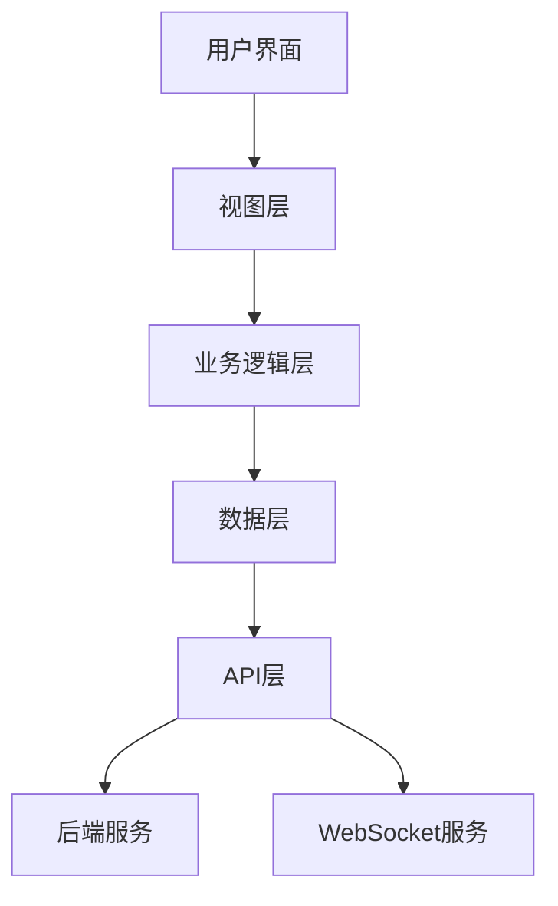

# 前端集成设计文档

索引标签：#前端设计 #可视化 #WebSocket #性能优化 #个性化

## 相关文档

- [WebSocket服务设计](../layered-design/websocket-service-design.md)：详细描述WebSocket服务的设计和实现
- [多维度分析设计](multi-dimensional-analysis-design.md)：详细描述思维类型分析和认知风格评估的设计
- [个性化定制设计](personalization-design.md)：详细描述用户个性化配置的设计和实现
- [API设计](api-design.md)：详细描述API的设计和实现

## 1. 文档概述

本文档详细描述了认知辅助系统前端集成的设计和实现，包括技术选型、架构设计、基础组件设计等内容。前端集成的核心目标是实现认知模型的可视化呈现，提升用户体验，并支持实时更新、个性化定制等功能。

## 2. 设计原则

### 2.1 核心设计理念

- **可视化优先**：以直观、清晰的方式呈现认知模型
- **性能优化**：实现分页和懒加载，支持大规模认知模型的可视化
- **实时性**：通过WebSocket实现数据的实时更新
- **个性化**：允许用户自定义可视化样式和布局
- **可扩展性**：设计模块化的组件架构，便于未来扩展
- **易用性**：提供友好的用户界面和交互体验

### 2.2 设计目标

1. **技术选型**：选择合适的前端技术栈和可视化库
2. **架构设计**：设计清晰的前端架构和组件结构
3. **基础组件**：实现核心可视化组件和交互组件
4. **性能优化**：实现分页、懒加载和缓存机制
5. **实时更新**：集成WebSocket，实现数据的实时推送
6. **个性化定制**：提供可视化样式和布局的自定义功能
7. **多维度分析**：支持多种思维类型和认知风格的评估

## 3. 技术选型

### 3.1 核心技术栈

| 组件类型 | 技术选型 | 用途 | 特点 |
|----------|----------|------|------|
| **前端框架** | React 18 | 构建用户界面 | 组件化、高性能、生态丰富 |
| **类型系统** | TypeScript | 类型安全 | 提高代码质量和可维护性 |
| **状态管理** | Zustand | 状态管理 | 轻量级、易用、性能优良 |
| **HTTP客户端** | Axios | API请求 | 易用、支持拦截器、并发请求 |
| **WebSocket客户端** | Socket.io-client | 实时通信 | 可靠、支持断线重连、跨浏览器 |
| **构建工具** | Vite | 项目构建 | 快速、支持热更新、现代化 |

### 3.2 可视化库选型

| 可视化库 | 类型 | 用途 | 特点 |
|----------|------|------|------|
| **D3.js** | 底层可视化库 | 复杂自定义可视化 | 高度灵活、强大的数据绑定能力 |
| **ECharts** | 高级可视化库 | 通用图表和网络关系图 | 开箱即用、丰富的图表类型、良好的交互体验 |
| **React Flow** | 流程图库 | 概念图、关系图 | 专为React设计、良好的交互体验、可扩展 |
| **Three.js** | 3D可视化库 | 3D认知模型可视化 | 强大的3D渲染能力、支持WebGL |

### 3.3 样式方案

| 样式方案 | 用途 | 特点 |
|----------|------|------|
| **Tailwind CSS** | 样式框架 | 实用优先、响应式设计、快速开发 |
| **CSS Modules** | 组件样式隔离 | 避免样式冲突、局部作用域 |
| **Styled Components** | CSS-in-JS | 组件化样式、动态样式 |

## 4. 前端架构设计

### 4.1 分层架构



### 4.2 核心模块

| 模块名称 | 功能描述 | 主要组件 |
|----------|----------|----------|
| **认知模型可视化** | 认知模型的可视化呈现 | ConceptGraph, HierarchyView, NetworkGraph |
| **数据管理** | 数据获取、缓存和状态管理 | DataService, CacheManager, Store |
| **实时通信** | WebSocket连接管理和消息处理 | WebSocketService, EventManager |
| **用户交互** | 用户界面交互和操作 | InteractionController, Toolbar |
| **个性化定制** | 可视化样式和布局的自定义 | StyleEditor, LayoutManager |
| **思维类型分析** | 思维类型的分析和呈现 | ThinkingTypeAnalyzer, RadarChart |

### 4.3 状态管理设计

```typescript
// Zustand store设计示例
import { create } from 'zustand';
import { devtools, persist } from 'zustand/middleware';

interface CognitiveModelState {
  // 认知模型数据
  models: CognitiveModel[];
  currentModelId: string | null;
  
  // 可视化配置
  visualizationConfig: VisualizationConfig;
  
  // WebSocket状态
  wsConnected: boolean;
  
  // 思维类型数据
  thinkingTypes: ThinkingTypeData | null;
  
  // 操作方法
  setCurrentModel: (modelId: string) => void;
  updateVisualizationConfig: (config: Partial<VisualizationConfig>) => void;
  setThinkingTypes: (data: ThinkingTypeData) => void;
  // ...
}

export const useCognitiveModelStore = create<CognitiveModelState>()(
  devtools(
    persist(
      (set) => ({
        models: [],
        currentModelId: null,
        visualizationConfig: {
          type: 'concept-map',
          layout: 'force-directed',
          depth: 3,
          conceptLimit: 50,
          includeInsights: false,
          includeRelations: true,
          colorScheme: 'default',
          nodeSize: 20,
          edgeWidth: 2
        },
        wsConnected: false,
        thinkingTypes: null,
        
        setCurrentModel: (modelId) => set({ currentModelId: modelId }),
        updateVisualizationConfig: (config) => set((state) => ({
          visualizationConfig: { ...state.visualizationConfig, ...config }
        })),
        setThinkingTypes: (data) => set({ thinkingTypes: data }),
        // ...
      }),
      {
        name: 'cognitive-model-storage'
      }
    )
  )
);
```

## 5. 基础组件设计

### 5.1 认知模型可视化组件

#### 5.1.1 ConceptGraph组件

**功能**：实现概念图可视化，展示认知模型中的概念和关系

**设计要点**：
- 支持多种布局算法（力导向、层次化、圆形、网格）
- 实现节点和边的交互（拖拽、缩放、点击）
- 支持概念和关系的筛选、排序
- 实现分页和懒加载
- 支持实时更新

**技术实现**：
- 基于React Flow实现核心功能
- 集成D3.js实现复杂的布局算法
- 支持自定义节点和边的样式

```typescript
interface ConceptGraphProps {
  modelId: string;
  config: VisualizationConfig;
  onNodeClick?: (node: ConceptNode) => void;
  onEdgeClick?: (edge: ConceptEdge) => void;
  onLayoutChange?: (layout: string) => void;
}

export const ConceptGraph: React.FC<ConceptGraphProps> = ({
  modelId,
  config,
  onNodeClick,
  onEdgeClick,
  onLayoutChange
}) => {
  // 组件实现
};
```

#### 5.1.2 HierarchyView组件

**功能**：实现认知模型的层次化视图

**设计要点**：
- 展示概念之间的层次关系
- 支持展开/折叠节点
- 支持搜索和过滤
- 支持拖拽调整层次结构

**技术实现**：
- 基于D3.js的树状图或树状布局
- 实现虚拟滚动，支持大规模数据

#### 5.1.3 NetworkGraph组件

**功能**：实现认知模型的网络关系图

**设计要点**：
- 展示概念之间的复杂网络关系
- 支持社区检测和聚类
- 支持节点重要性分析
- 实现动态力导向布局

**技术实现**：
- 基于ECharts的关系图
- 集成D3.js的力导向算法

### 5.2 思维类型分析组件

#### 5.2.1 ThinkingTypeRadarChart组件

**功能**：以雷达图形式展示思维类型得分

**设计要点**：
- 展示多种思维类型的得分
- 支持交互式操作（悬停显示详情）
- 支持比较不同时期的思维类型变化

**技术实现**：
- 基于ECharts的雷达图
- 支持自定义样式和主题

#### 5.2.2 ThinkingTypeBarChart组件

**功能**：以柱状图形式展示思维类型得分

**设计要点**：
- 直观展示各思维类型的得分对比
- 支持排序和过滤
- 支持响应式设计

**技术实现**：
- 基于ECharts的柱状图
- 支持动画效果

### 5.3 交互组件

#### 5.3.1 VisualizationToolbar组件

**功能**：可视化操作工具栏

**设计要点**：
- 提供布局切换、缩放控制、筛选、搜索等功能
- 支持自定义配置
- 响应式设计

#### 5.3.2 StyleEditor组件

**功能**：可视化样式编辑器

**设计要点**：
- 支持节点颜色、大小、形状的自定义
- 支持边的颜色、宽度、样式的自定义
- 支持布局参数的调整
- 提供实时预览

### 5.4 数据管理组件

#### 5.4.1 DataService组件

**功能**：封装API请求和WebSocket通信

**设计要点**：
- 提供统一的数据获取接口
- 实现请求缓存和重试机制
- 处理WebSocket连接和消息
- 支持分页和懒加载

**技术实现**：
- 基于Axios实现HTTP请求
- 基于Socket.io-client实现WebSocket通信
- 实现请求拦截器和响应拦截器

```typescript
class DataService {
  private axiosInstance: AxiosInstance;
  private socket: Socket | null = null;
  
  constructor() {
    this.axiosInstance = axios.create({
      baseURL: '/api/v1',
      timeout: 10000,
      headers: {
        'Content-Type': 'application/json'
      }
    });
    
    // 添加请求拦截器
    this.axiosInstance.interceptors.request.use(
      (config) => {
        // 添加认证token
        const token = localStorage.getItem('accessToken');
        if (token) {
          config.headers.Authorization = `Bearer ${token}`;
        }
        return config;
      },
      (error) => {
        return Promise.reject(error);
      }
    );
    
    // 添加响应拦截器
    this.axiosInstance.interceptors.response.use(
      (response) => {
        // 统一处理成功响应，返回data字段
        return response.data.data;
      },
      (error) => {
        // 统一处理错误响应
        const errorMessage = error.response?.data?.error?.message || '请求失败';
        const errorCode = error.response?.data?.error?.code || error.response?.status || 500;
        return Promise.reject({ message: errorMessage, code: errorCode });
      }
    );
  }
  
  // WebSocket连接管理
  connectWebSocket(token: string): void {
    this.socket = io({
      auth: { token },
      transports: ['websocket']
    });
    
    this.socket.on('connect', () => {
      console.log('WebSocket connected');
    });
    
    this.socket.on('disconnect', () => {
      console.log('WebSocket disconnected');
    });
  }
  
  // 订阅认知模型更新
  subscribeToModelUpdates(modelId: string, callback: (data: any) => void): void {
    if (this.socket) {
      this.socket.emit('subscribe.model', { modelId });
      this.socket.on('model.updated', callback);
    }
  }
  
  // 获取认知模型数据
  async getModel(modelId: string): Promise<CognitiveModel> {
    return this.axiosInstance.get(`/models/${modelId}`);
  }
  
  // 获取可视化数据
  async getVisualizationData(modelId: string, params: VisualizationParams): Promise<VisualizationData> {
    return this.axiosInstance.get(`/models/${modelId}/visualization`, { params });
  }
  
  // 获取思维类型数据
  async getThinkingTypes(modelId: string): Promise<ThinkingTypeData> {
    return this.axiosInstance.get(`/models/${modelId}/visualization/thinking-type`);
  }
}

export const dataService = new DataService();
```

## 6. 性能优化设计

### 6.1 数据分页和懒加载

- **分页请求**：对大规模认知模型数据进行分页请求
- **懒加载**：根据视图可见区域动态加载数据
- **虚拟滚动**：对于层次化视图，实现虚拟滚动
- **数据缓存**：缓存已请求的数据，避免重复请求

### 6.2 渲染优化

- **组件懒加载**：使用React.lazy和Suspense实现组件的懒加载
- **Memo优化**：使用React.memo避免不必要的组件重渲染
- **useCallback和useMemo**：优化回调函数和计算值
- **虚拟DOM**：利用React的虚拟DOM机制，减少实际DOM操作

### 6.3 可视化优化

- **节点限制**：根据设备性能动态调整显示的节点数量
- **层级渲染**：根据视图深度分层渲染节点
- **WebGL加速**：对于大规模数据，使用WebGL加速渲染
- **离屏渲染**：对于复杂计算，使用离屏渲染

## 7. 实时更新设计

### 7.1 WebSocket集成

- **连接管理**：实现WebSocket的连接、断开重连机制
- **事件订阅**：支持订阅特定认知模型的更新
- **消息处理**：处理不同类型的实时消息
- **状态同步**：保持前端状态与后端数据的同步

### 7.2 实时事件类型

| 事件类型 | 描述 | 处理方式 |
|----------|------|----------|
| `model.updated` | 认知模型更新 | 更新模型数据和可视化 |
| `visualization.updated` | 可视化数据更新 | 更新可视化组件 |
| `aiTask.completed` | AI任务完成 | 显示任务结果，更新相关数据 |
| `connection.established` | WebSocket连接建立 | 更新连接状态 |
| `connection.closed` | WebSocket连接关闭 | 更新连接状态，尝试重连 |

## 8. 个性化定制设计

### 8.1 可视化配置

- **布局配置**：支持力导向、层次化、圆形、网格等多种布局
- **样式配置**：支持节点颜色、大小、形状的自定义
- **数据配置**：支持显示/隐藏特定类型的数据
- **交互配置**：支持自定义交互行为

### 8.2 用户偏好存储

- **本地存储**：使用localStorage或IndexedDB存储用户偏好
- **云端同步**：支持将用户偏好同步到云端
- **预设模板**：提供多种预设的可视化模板

## 9. 多维度分析设计

### 9.1 思维类型分析

- **主导思维类型**：识别用户的主导思维类型
- **思维类型对比**：比较不同思维类型的得分
- **思维类型变化**：跟踪思维类型随时间的变化
- **思维类型建议**：根据思维类型提供个性化建议

### 9.2 认知模型健康度分析

- **模型完整性**：分析认知模型的完整性
- **概念关联性**：分析概念之间的关联强度
- **洞察发现**：发现认知模型中的盲点和差距
- **优化建议**：提供模型优化建议

## 10. 实现步骤

### 10.1 阶段1：基础架构搭建

1. **创建前端项目**：使用Vite + React + TypeScript创建项目
2. **安装依赖**：安装核心依赖和可视化库
3. **配置项目**：配置TypeScript、ESLint、Prettier等
4. **设计状态管理**：实现Zustand store
5. **封装API服务**：实现DataService

### 10.2 阶段2：核心组件实现

1. **实现概念图组件**：基于React Flow或D3.js
2. **实现思维类型分析组件**：基于ECharts
3. **实现交互组件**：工具栏、样式编辑器等
4. **集成WebSocket**：实现实时更新功能

### 10.3 阶段3：性能优化和测试

1. **实现分页和懒加载**：优化大规模数据处理
2. **优化渲染性能**：使用Memo、useCallback等
3. **编写单元测试**：测试核心组件和功能
4. **编写集成测试**：测试组件之间的集成
5. **性能测试**：测试在不同设备和数据规模下的性能

### 10.4 阶段4：个性化定制和扩展

1. **实现个性化配置**：支持可视化样式和布局的自定义
2. **扩展思维类型分析**：支持更多维度的分析
3. **实现数据导出功能**：支持导出可视化数据
4. **优化用户体验**：改进交互设计和响应式布局

## 11. 文档更新记录

| 更新日期 | 更新内容 | 更新人 |
|----------|----------|--------|
| 2026-01-09 | 初始创建 | 系统架构师 |