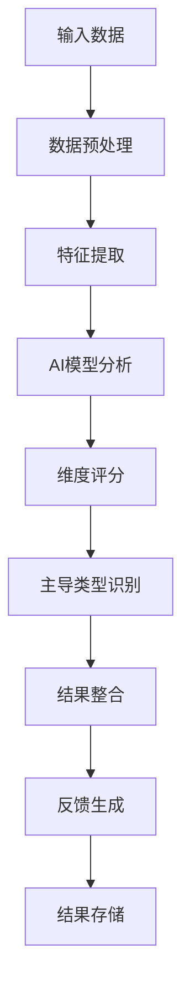

# 多维度分析设计文档

索引标签：#多维度分析 #思维类型 #认知风格 #AI分析 #可视化

## 相关文档

- [数据模型定义](data-model-definition.md)：详细描述系统的数据模型
- [AI能力层设计](../layered-design/ai-capability-layer-design.md)：详细描述AI能力层的设计
- [领域模型设计](../layered-design/domain-model-design.md)：详细描述领域模型的设计
- [前端集成设计](frontend-integration-design.md)：详细描述前端集成的设计

## 1. 文档概述

本文档详细描述了认知辅助系统的多维度分析功能设计，包括思维类型分析算法扩展、多维度认知风格评估、数据模型扩展和可视化设计。多维度分析功能旨在深入了解用户的认知结构和思维模式，提供更全面、准确的认知反馈和改进建议。

## 2. 设计原则

### 2.1 核心设计理念

- **多维度评估**：从多个角度评估用户的认知风格和思维类型
- **科学依据**：基于认知科学和心理学理论设计评估维度
- **数据驱动**：结合AI分析和用户行为数据进行评估
- **动态调整**：根据用户认知模型的变化动态更新评估结果
- **可扩展性**：支持未来扩展更多评估维度
- **个性化反馈**：基于评估结果提供个性化的认知反馈和改进建议
- **可视化呈现**：以直观的方式呈现多维度分析结果

### 2.2 设计目标

1. **扩展思维类型**：增加更多思维类型维度，丰富评估体系
2. **设计分析算法**：设计科学、准确的思维类型分析算法
3. **数据模型扩展**：扩展现有数据模型，支持多维度分析数据存储
4. **API设计**：设计多维度分析的API端点
5. **可视化设计**：设计直观的多维度分析结果可视化
6. **反馈机制**：基于分析结果提供个性化反馈和建议

## 3. 思维类型维度设计

### 3.1 核心思维类型

基于认知科学和心理学理论，设计了以下核心思维类型维度：

| 思维类型维度 | 描述 | 子维度 |
|--------------|------|--------|
| **认知风格** | 信息处理和决策方式 | 分析型、综合型、实用型、创新型 |
| **思维模式** | 思考和推理方式 | 逻辑型、直觉型、序列型、整体型 |
| **学习风格** | 学习和获取知识的方式 | 视觉型、听觉型、读写型、动觉型 |
| **创造力** | 创造性思维能力 | 流畅性、灵活性、原创性、精细性 |
| **问题解决** | 解决问题的方式 | 分析解决、直觉解决、合作解决、试错解决 |
| **决策风格** | 做决策的方式 | 理性决策、直觉决策、情感决策、依赖决策 |
| **注意力风格** | 注意力集中方式 | 专注型、分散型、交替型、环境敏感型 |
| **记忆风格** | 信息记忆方式 | 视觉记忆、听觉记忆、语义记忆、情节记忆 |

### 3.2 思维类型定义

#### 3.2.1 认知风格

| 类型 | 描述 | 特征 |
|------|------|------|
| **分析型** | 注重细节和逻辑分析 | 喜欢分解问题、逻辑推理、注重事实和数据 |
| **综合型** | 注重整体和关系 | 喜欢整合信息、看到大局、识别模式和联系 |
| **实用型** | 注重实际应用和效果 | 喜欢解决实际问题、实用导向、结果驱动 |
| **创新型** | 注重创新和新颖性 | 喜欢产生新想法、挑战常规、寻求创新解决方案 |

#### 3.2.2 思维模式

| 类型 | 描述 | 特征 |
|------|------|------|
| **逻辑型** | 依赖逻辑和推理 | 喜欢演绎推理、因果关系分析、结构化思考 |
| **直觉型** | 依赖直觉和洞察力 | 喜欢归纳推理、凭感觉判断、跳跃性思考 |
| **序列型** | 按顺序处理信息 | 喜欢线性思考、逐步解决问题、注重步骤 |
| **整体型** | 同时处理多个信息 | 喜欢并行思考、全局把握、综合处理信息 |

#### 3.2.3 学习风格

| 类型 | 描述 | 特征 |
|------|------|------|
| **视觉型** | 通过视觉学习 | 喜欢图表、图像、可视化内容 |
| **听觉型** | 通过听觉学习 | 喜欢讲座、讨论、音频内容 |
| **读写型** | 通过阅读和写作学习 | 喜欢阅读文字、做笔记、写作练习 |
| **动觉型** | 通过实践学习 | 喜欢动手操作、实验、实践活动 |

#### 3.2.4 创造力

| 类型 | 描述 | 特征 |
|------|------|------|
| **流畅性** | 产生想法的数量 | 能够快速产生大量想法 |
| **灵活性** | 想法的多样性 | 能够从不同角度思考问题 |
| **原创性** | 想法的新颖性 | 能够产生独特、原创的想法 |
| **精细性** | 想法的详细程度 | 能够详细阐述和完善想法 |

## 4. 思维类型分析算法

### 4.1 分析流程



### 4.2 数据来源

| 数据来源 | 用途 | 权重 |
|----------|------|------|
| **认知模型** | 概念结构和关系 | 40% |
| **思想片段** | 内容和表达方式 | 30% |
| **AI分析结果** | LLM生成的分析 | 20% |
| **用户行为** | 交互模式和偏好 | 10% |

### 4.3 分析算法设计

#### 4.3.1 特征提取算法

**概念结构分析**：
- 计算概念之间的连接密度和聚类系数
- 分析概念层次结构的深度和广度
- 识别核心概念和边缘概念

**思想片段分析**：
- 提取关键词和主题
- 分析语言风格和表达方式
- 识别思维模式和推理方式

**AI辅助分析**：
- 使用LLM分析用户的思维方式
- 生成思维类型评估建议
- 验证和校准自动分析结果

#### 4.3.2 维度评分算法

```typescript
// 思维类型评分算法示例
interface ThinkingTypeScore {
  type: string;
  score: number; // 0-10
  confidence: number; // 0-1
  explanation: string;
}

interface ThinkingTypeAnalysis {
  cognitiveStyle: ThinkingTypeScore[];
  thinkingPattern: ThinkingTypeScore[];
  learningStyle: ThinkingTypeScore[];
  creativity: ThinkingTypeScore[];
  problemSolving: ThinkingTypeScore[];
  decisionMaking: ThinkingTypeScore[];
  attentionStyle: ThinkingTypeScore[];
  memoryStyle: ThinkingTypeScore[];
}

class ThinkingTypeAnalyzer {
  // 计算思维类型得分
  calculateScores(model: UserCognitiveModel): ThinkingTypeAnalysis {
    // 1. 提取认知模型特征
    const conceptFeatures = this.extractConceptFeatures(model);
    const relationFeatures = this.extractRelationFeatures(model);
    
    // 2. 提取思想片段特征
    const thoughtFeatures = this.extractThoughtFeatures(model.thoughtFragments);
    
    // 3. 结合AI分析结果
    const aiAnalysis = this.getAIAnalysis(model);
    
    // 4. 计算各维度得分
    const cognitiveStyle = this.calculateCognitiveStyleScores(conceptFeatures, thoughtFeatures, aiAnalysis);
    const thinkingPattern = this.calculateThinkingPatternScores(conceptFeatures, relationFeatures, aiAnalysis);
    const learningStyle = this.calculateLearningStyleScores(thoughtFeatures, aiAnalysis);
    const creativity = this.calculateCreativityScores(conceptFeatures, relationFeatures, thoughtFeatures);
    const problemSolving = this.calculateProblemSolvingScores(conceptFeatures, aiAnalysis);
    const decisionMaking = this.calculateDecisionMakingScores(aiAnalysis);
    const attentionStyle = this.calculateAttentionStyleScores(conceptFeatures, thoughtFeatures);
    const memoryStyle = this.calculateMemoryStyleScores(thoughtFeatures, aiAnalysis);
    
    return {
      cognitiveStyle,
      thinkingPattern,
      learningStyle,
      creativity,
      problemSolving,
      decisionMaking,
      attentionStyle,
      memoryStyle
    };
  }
  
  // 提取概念特征
  private extractConceptFeatures(model: UserCognitiveModel): ConceptFeatures {
    // 实现概念特征提取逻辑
  }
  
  // 提取关系特征
  private extractRelationFeatures(model: UserCognitiveModel): RelationFeatures {
    // 实现关系特征提取逻辑
  }
  
  // 提取思想片段特征
  private extractThoughtFeatures(thoughts: ThoughtFragment[]): ThoughtFeatures {
    // 实现思想片段特征提取逻辑
  }
  
  // 获取AI分析结果
  private getAIAnalysis(model: UserCognitiveModel): AIAnalysisResult {
    // 实现AI分析结果获取逻辑
  }
  
  // 计算认知风格得分
  private calculateCognitiveStyleScores(
    conceptFeatures: ConceptFeatures,
    thoughtFeatures: ThoughtFeatures,
    aiAnalysis: AIAnalysisResult
  ): ThinkingTypeScore[] {
    // 实现认知风格评分逻辑
  }
  
  // 其他维度评分方法...
}
```

#### 4.3.3 主导类型识别算法

**算法流程**：
1. 对每个维度的得分进行归一化处理
2. 识别每个维度的主导类型（得分最高的类型）
3. 计算主导类型的置信度
4. 整合各维度的主导类型，形成用户的综合认知风格

**置信度计算**：
```
confidence = (maxScore - secondMaxScore) / maxScore
```

### 4.4 AI辅助分析

**提示设计**：
```
分析以下用户的认知模型和思想片段，评估用户的思维类型：

认知模型：
- 概念数量：120
- 关系数量：180
- 概念层次：深度3级
- 核心概念：["人工智能", "机器学习", "深度学习"]
- 聚类系数：0.65

思想片段示例：
1. "我认为解决这个问题需要分步骤分析，首先理解问题的本质，然后分解成小问题，最后逐一解决。"
2. "这个概念让我联想到了之前学习过的另一个概念，它们之间可能存在某种联系。"
3. "我喜欢通过可视化的方式理解复杂问题，图表和思维导图对我很有帮助。"

请从以下维度评估用户的思维类型：
1. 认知风格（分析型、综合型、实用型、创新型）
2. 思维模式（逻辑型、直觉型、序列型、整体型）
3. 学习风格（视觉型、听觉型、读写型、动觉型）

每个维度请提供得分（0-10）和简短解释。
```

## 5. 数据模型扩展

### 5.1 核心数据模型

#### 5.1.1 思维类型分析结果

| 字段名 | 类型 | 描述 |
|--------|------|------|
| `id` | `UUID` | 分析结果ID |
| `modelId` | `UUID` | 认知模型ID |
| `analysisData` | `JSONB` | 多维度分析数据 |
| `dominantThinkingTypes` | `JSONB` | 主导思维类型 |
| `confidenceScores` | `JSONB` | 各维度置信度 |
| `aiAnalysisId` | `UUID` | AI分析任务ID |
| `createdAt` | `TIMESTAMP` | 创建时间 |
| `updatedAt` | `TIMESTAMP` | 更新时间 |

#### 5.1.2 思维类型历史

| 字段名 | 类型 | 描述 |
|--------|------|------|
| `id` | `UUID` | 历史记录ID |
| `modelId` | `UUID` | 认知模型ID |
| `analysisResultId` | `UUID` | 分析结果ID |
| `analysisSnapshot` | `JSONB` | 分析结果快照 |
| `createdAt` | `TIMESTAMP` | 创建时间 |

### 5.2 数据结构示例

**analysisData示例**：
```json
{
  "cognitiveStyle": [
    { "type": "analytical", "score": 8.5, "confidence": 0.8, "explanation": "注重细节和逻辑分析" },
    { "type": "synthetic", "score": 6.2, "confidence": 0.7, "explanation": "能够整合信息，看到大局" },
    { "type": "practical", "score": 7.1, "confidence": 0.75, "explanation": "注重实际应用和效果" },
    { "type": "innovative", "score": 6.8, "confidence": 0.65, "explanation": "能够产生新想法" }
  ],
  "thinkingPattern": [
    { "type": "logical", "score": 8.7, "confidence": 0.85, "explanation": "依赖逻辑和推理" },
    { "type": "intuitive", "score": 5.3, "confidence": 0.6, "explanation": "偶尔依赖直觉" },
    { "type": "sequential", "score": 8.2, "confidence": 0.8, "explanation": "按顺序处理信息" },
    { "type": "holistic", "score": 5.9, "confidence": 0.65, "explanation": "能够同时处理多个信息" }
  ],
  "learningStyle": [
    { "type": "visual", "score": 7.5, "confidence": 0.75, "explanation": "通过视觉学习效果好" },
    { "type": "auditory", "score": 6.1, "confidence": 0.65, "explanation": "通过听觉学习效果一般" },
    { "type": "readingWriting", "score": 7.8, "confidence": 0.8, "explanation": "通过阅读和写作学习效果好" },
    { "type": "kinesthetic", "score": 5.2, "confidence": 0.6, "explanation": "通过实践学习效果一般" }
  ],
  "creativity": [
    { "type": "fluency", "score": 6.5, "confidence": 0.7, "explanation": "能够产生一定数量的想法" },
    { "type": "flexibility", "score": 6.8, "confidence": 0.7, "explanation": "能够从不同角度思考" },
    { "type": "originality", "score": 6.2, "confidence": 0.65, "explanation": "想法具有一定的原创性" },
    { "type": "elaboration", "score": 7.5, "confidence": 0.75, "explanation": "能够详细阐述想法" }
  ]
  // 其他维度...
}
```

**dominantThinkingTypes示例**：
```json
{
  "cognitiveStyle": "analytical",
  "thinkingPattern": "logical",
  "learningStyle": "readingWriting",
  "creativity": "elaboration",
  "problemSolving": "analytical",
  "decisionMaking": "rational",
  "attentionStyle": "focused",
  "memoryStyle": "visual"
}
```

## 6. API设计

### 6.1 API端点设计

| 端点 | 方法 | 描述 | 认证要求 |
|------|------|------|----------|
| `/api/models/{modelId}/analysis/thinking-types` | `GET` | 获取思维类型分析结果 | 需要认证 |
| `/api/models/{modelId}/analysis/thinking-types` | `POST` | 触发思维类型分析 | 需要认证 |
| `/api/models/{modelId}/analysis/thinking-types/history` | `GET` | 获取思维类型分析历史 | 需要认证 |
| `/api/models/{modelId}/analysis/thinking-types/{analysisId}` | `GET` | 获取特定分析结果 | 需要认证 |
| `/api/models/{modelId}/analysis/thinking-types/compare` | `POST` | 比较不同时期的分析结果 | 需要认证 |
| `/api/analysis/thinking-types/suggestions` | `POST` | 获取基于思维类型的建议 | 需要认证 |

### 6.2 API请求/响应示例

#### 6.2.1 获取思维类型分析结果

**请求**：
```http
GET /api/models/model-123/analysis/thinking-types
Authorization: Bearer {accessToken}
```

**响应**：
```json
{
  "success": true,
  "data": {
    "id": "analysis-123",
    "modelId": "model-123",
    "analysisData": {
      "cognitiveStyle": [
        { "type": "analytical", "score": 8.5, "confidence": 0.8, "explanation": "注重细节和逻辑分析" },
        { "type": "synthetic", "score": 6.2, "confidence": 0.7, "explanation": "能够整合信息，看到大局" },
        { "type": "practical", "score": 7.1, "confidence": 0.75, "explanation": "注重实际应用和效果" },
        { "type": "innovative", "score": 6.8, "confidence": 0.65, "explanation": "能够产生新想法" }
      ],
      "thinkingPattern": [
        { "type": "logical", "score": 8.7, "confidence": 0.85, "explanation": "依赖逻辑和推理" },
        { "type": "intuitive", "score": 5.3, "confidence": 0.6, "explanation": "偶尔依赖直觉" },
        { "type": "sequential", "score": 8.2, "confidence": 0.8, "explanation": "按顺序处理信息" },
        { "type": "holistic", "score": 5.9, "confidence": 0.65, "explanation": "能够同时处理多个信息" }
      ]
      // 其他维度...
    },
    "dominantThinkingTypes": {
      "cognitiveStyle": "analytical",
      "thinkingPattern": "logical",
      "learningStyle": "readingWriting",
      "creativity": "elaboration"
      // 其他维度...
    },
    "confidenceScores": {
      "cognitiveStyle": 0.8,
      "thinkingPattern": 0.85,
      "learningStyle": 0.75,
      "creativity": 0.7
      // 其他维度...
    },
    "createdAt": "2023-10-05T12:00:00Z",
    "updatedAt": "2023-10-05T12:00:00Z"
  },
  "error": null,
  "code": 200,
  "message": "Success"
}
```

#### 6.2.2 触发思维类型分析

**请求**：
```http
POST /api/models/model-123/analysis/thinking-types
Authorization: Bearer {accessToken}
Content-Type: application/json

{
  "analysisDepth": "deep",
  "includeHistoricalData": true
}
```

**响应**：
```json
{
  "success": true,
  "data": {
    "analysisId": "analysis-123",
    "status": "pending",
    "message": "思维类型分析已触发，结果将在稍后生成"
  },
  "error": null,
  "code": 202,
  "message": "Accepted"
}
```

## 7. 可视化设计

### 7.1 核心可视化组件

#### 7.1.1 雷达图

**功能**：展示多维度思维类型得分

**设计要点**：
- 每个维度作为雷达图的一个轴
- 得分用多边形面积表示
- 支持多时期对比
- 交互功能：悬停显示详细信息

#### 7.1.2 热图

**功能**：展示思维类型的详细得分分布

**设计要点**：
- 行：思维类型维度
- 列：具体思维类型
- 颜色深浅表示得分高低
- 支持排序和筛选

#### 7.1.3 主导类型卡片

**功能**：展示各维度的主导思维类型

**设计要点**：
- 每个维度一张卡片
- 显示主导类型和置信度
- 支持点击查看详细信息
- 响应式设计，适配不同屏幕尺寸

#### 7.1.4 趋势图

**功能**：展示思维类型随时间的变化趋势

**设计要点**：
- 时间轴为X轴
- 得分或置信度为Y轴
- 支持选择不同维度
- 支持放大、缩小和拖拽

### 7.2 可视化交互设计

**交互功能**：
- **悬停提示**：显示详细的得分和解释
- **点击交互**：深入查看特定维度的详细信息
- **对比功能**：比较不同时期的分析结果
- **筛选功能**：筛选特定维度或类型
- **导出功能**：导出分析结果为图片或PDF
- **分享功能**：分享分析结果

### 7.3 前端实现示例

```typescript
// src/components/analysis/ThinkingTypeRadarChart.tsx

import React from 'react';
import { Radar, RadarChart, PolarGrid, PolarAngleAxis, PolarRadiusAxis, ResponsiveContainer, Tooltip, Legend } from 'recharts';
import { ThinkingTypeAnalysis } from '../../types/ThinkingType';

interface ThinkingTypeRadarChartProps {
  analysis: ThinkingTypeAnalysis;
  dimensions?: string[];
}

const ThinkingTypeRadarChart: React.FC<ThinkingTypeRadarChartProps> = ({ analysis, dimensions }) => {
  // 准备雷达图数据
  const prepareChartData = () => {
    const defaultDimensions = ['cognitiveStyle', 'thinkingPattern', 'learningStyle', 'creativity'];
    const selectedDimensions = dimensions || defaultDimensions;
    
    const data = [];
    
    // 为每个维度创建数据点
    for (const dimension of selectedDimensions) {
      const dimensionData = analysis[dimension as keyof ThinkingTypeAnalysis];
      if (dimensionData) {
        const dimensionName = getDimensionName(dimension);
        
        for (const type of dimensionData) {
          data.push({
            dimension: dimensionName,
            type: getTypeName(type.type),
            score: type.score,
            confidence: type.confidence
          });
        }
      }
    }
    
    return data;
  };

  // 获取维度名称
  const getDimensionName = (dimension: string): string => {
    const dimensionNames: Record<string, string> = {
      cognitiveStyle: '认知风格',
      thinkingPattern: '思维模式',
      learningStyle: '学习风格',
      creativity: '创造力',
      problemSolving: '问题解决',
      decisionMaking: '决策风格',
      attentionStyle: '注意力风格',
      memoryStyle: '记忆风格'
    };
    return dimensionNames[dimension] || dimension;
  };

  // 获取类型名称
  const getTypeName = (type: string): string => {
    const typeNames: Record<string, string> = {
      analytical: '分析型',
      synthetic: '综合型',
      practical: '实用型',
      innovative: '创新型',
      logical: '逻辑型',
      intuitive: '直觉型',
      sequential: '序列型',
      holistic: '整体型',
      visual: '视觉型',
      auditory: '听觉型',
      readingWriting: '读写型',
      kinesthetic: '动觉型',
      fluency: '流畅性',
      flexibility: '灵活性',
      originality: '原创性',
      elaboration: '精细性'
      // 其他类型...
    };
    return typeNames[type] || type;
  };

  const chartData = prepareChartData();

  return (
    <div className="thinking-type-radar-chart">
      <h3>思维类型雷达图</h3>
      <ResponsiveContainer width="100%" height={400}>
        <RadarChart outerRadius={150} data={chartData}>
          <PolarGrid />
          <PolarAngleAxis dataKey="dimension" />
          <PolarRadiusAxis angle={30} domain={[0, 10]} />
          <Radar
            name="得分"
            dataKey="score"
            stroke="#8884d8"
            fill="#8884d8"
            fillOpacity={0.6}
          />
          <Tooltip
            formatter={(value: number, name: string) => [value, name === 'score' ? '得分' : name]}
            labelFormatter={(label) => `维度: ${label}`}
          />
          <Legend />
        </RadarChart>
      </ResponsiveContainer>
    </div>
  );
};

export default ThinkingTypeRadarChart;
```

## 8. 反馈和建议生成

### 8.1 基于思维类型的建议

**建议生成逻辑**：
1. 分析用户的主导思维类型
2. 识别潜在的思维偏向和不平衡
3. 基于认知科学理论生成改进建议
4. 结合用户的认知模型和学习目标
5. 生成个性化的行动建议

**建议示例**：
```json
{
  "success": true,
  "data": {
    "thinkingType": "analytical",
    "strengths": [
      "擅长逻辑分析和问题分解",
      "注重细节和准确性",
      "能够系统地解决问题"
    ],
    "potentialImprovements": [
      "可以尝试增加创造性思维训练",
      "培养从整体角度看问题的能力",
      "学习直觉决策技巧"
    ],
    "suggestions": [
      {
        "type": "learning",
        "content": "尝试使用思维导图来可视化复杂问题，培养整体思维能力",
        "priority": "medium",
        "expectedOutcome": "增强综合思考能力"
      },
      {
        "type": "practice",
        "content": "每天进行10分钟的发散性思考练习，尝试为一个问题生成多种解决方案",
        "priority": "high",
        "expectedOutcome": "提高创造力和灵活性"
      }
    ]
  },
  "error": null,
  "code": 200,
  "message": "Success"
}
```

### 8.2 反馈机制

**反馈类型**：
- **实时反馈**：在用户使用过程中提供即时反馈
- **定期反馈**：定期生成综合反馈报告
- **事件触发反馈**：在特定事件（如认知模型更新）时生成反馈
- **请求反馈**：用户主动请求生成反馈

**反馈渠道**：
- **系统内通知**：在系统内显示反馈信息
- **邮件报告**：定期发送邮件报告
- **可视化仪表板**：在仪表板上展示反馈

## 9. 性能优化设计

### 9.1 分析性能优化

- **异步分析**：思维类型分析作为异步任务执行，避免阻塞API
- **缓存机制**：缓存分析结果，减少重复计算
- **增量分析**：只分析变化的部分，提高效率
- **批量处理**：批量处理多个分析任务
- **资源限制**：限制分析任务的资源使用，避免影响系统性能

### 9.2 可视化性能优化

- **懒加载**：按需加载可视化组件
- **数据压缩**：压缩分析数据，减少传输量
- **虚拟渲染**：对于大量数据使用虚拟渲染
- **WebGL加速**：对于复杂可视化使用WebGL加速
- **缓存渲染结果**：缓存可视化渲染结果，避免重复渲染

## 10. 实现步骤

### 10.1 阶段1：数据模型和API实现

1. **扩展数据模型**：添加思维类型分析结果和历史记录的表结构
2. **实现分析算法**：实现思维类型分析算法
3. **集成AI分析**：实现AI辅助分析功能
4. **设计API**：设计和实现多维度分析的API端点
5. **实现缓存机制**：添加分析结果的缓存机制

### 10.2 阶段2：前端可视化实现

1. **实现核心可视化组件**：雷达图、热图、主导类型卡片、趋势图
2. **实现交互功能**：悬停提示、点击交互、对比功能、筛选功能
3. **集成API**：连接前端可视化与后端API
4. **响应式设计**：适配不同屏幕尺寸
5. **性能优化**：优化可视化性能

### 10.3 阶段3：反馈和建议实现

1. **实现建议生成逻辑**：基于思维类型生成个性化建议
2. **实现反馈机制**：系统内通知、邮件报告、仪表板反馈
3. **集成用户反馈**：收集用户对建议的反馈，优化建议生成算法

### 10.4 阶段4：测试和优化

1. **功能测试**：测试多维度分析的各项功能
2. **性能测试**：测试分析算法和可视化的性能
3. **用户测试**：邀请用户测试，收集反馈
4. **优化改进**：根据测试结果进行优化改进
5. **文档编写**：编写用户使用文档和开发者文档

## 11. 文档更新记录

| 更新日期 | 更新内容 | 更新人 |
|----------|----------|--------|
| 2026-01-09 | 初始创建多维度分析设计文档 | 系统架构师 |