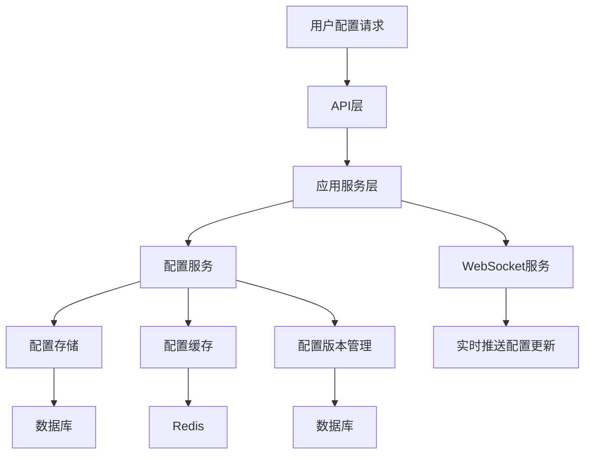
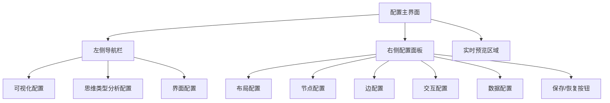

# 个性化定制设计文档

索引标签：#个性化 #配置管理 #前端设计 #WebSocket #实时预览

## 相关文档

- [配置管理](../deployment-ops/config-management.md)：详细描述系统的配置管理设计
- [前端集成设计](frontend-integration-design.md)：详细描述前端集成的设计和实现
- [WebSocket服务设计](../layered-design/websocket-service-design.md)：详细描述WebSocket服务的设计和实现
- [API设计](api-design.md)：详细描述API的设计和实现

## 1. 文档概述

本文档详细描述了认知辅助系统的个性化定制功能设计，包括配置管理扩展、前端配置界面、数据模型和实时更新机制。个性化定制功能允许用户自定义认知模型可视化的样式、布局和交互方式，提升用户体验和系统的灵活性。

## 2. 设计原则

### 2.1 核心设计理念

- **用户中心**：以用户需求为中心，提供灵活的个性化定制选项
- **模块化设计**：将个性化配置按功能模块划分，便于维护和扩展
- **实时预览**：提供实时预览功能，让用户直观感受配置效果
- **版本控制**：支持配置的版本管理，允许用户恢复历史配置
- **默认配置**：提供合理的默认配置，降低用户使用门槛
- **可扩展性**：设计支持未来扩展更多个性化选项
- **性能优化**：确保个性化配置不会影响系统性能

### 2.2 设计目标

1. **配置管理扩展**：扩展现有配置管理系统，支持用户级个性化配置
2. **数据模型设计**：设计个性化配置的数据模型
3. **API设计**：设计个性化配置的API端点
4. **前端配置界面**：设计直观易用的前端配置界面
5. **实时更新**：支持配置变更的实时更新
6. **配置版本管理**：支持配置的版本控制和恢复

## 3. 个性化配置数据模型

### 3.1 核心数据模型

#### 3.1.1 用户个性化配置

| 字段名 | 类型 | 描述 |
|--------|------|------|
| `id` | `UUID` | 配置ID |
| `userId` | `UUID` | 用户ID |
| `modelId` | `UUID` | 认知模型ID（可为空，表示全局配置） |
| `configType` | `VARCHAR(50)` | 配置类型（visualization/thinking-type/interface） |
| `configKey` | `VARCHAR(100)` | 配置键名 |
| `configValue` | `JSONB` | 配置值 |
| `createdAt` | `TIMESTAMP` | 创建时间 |
| `updatedAt` | `TIMESTAMP` | 更新时间 |
| `isActive` | `BOOLEAN` | 是否为当前激活的配置 |

#### 3.1.2 配置版本

| 字段名 | 类型 | 描述 |
|--------|------|------|
| `id` | `UUID` | 版本ID |
| `userId` | `UUID` | 用户ID |
| `configId` | `UUID` | 配置ID |
| `versionNumber` | `INTEGER` | 版本号 |
| `configSnapshot` | `JSONB` | 配置快照 |
| `createdAt` | `TIMESTAMP` | 创建时间 |
| `description` | `TEXT` | 版本描述 |

### 3.2 配置类型定义

#### 3.2.1 可视化配置

```typescript
interface VisualizationConfig {
  // 布局配置
  layout: {
    type: 'force-directed' | 'hierarchical' | 'circular' | 'grid';
    params: {
      // 力导向布局参数
      gravity?: number;
      linkDistance?: number;
      charge?: number;
      // 层次化布局参数
      direction?: 'TB' | 'BT' | 'LR' | 'RL';
      // 其他布局参数
      spacing?: number;
    };
  };
  
  // 节点配置
  node: {
    colorScheme: string;
    size: number;
    shape: 'circle' | 'square' | 'triangle' | 'diamond';
    label: {
      enabled: boolean;
      fontSize: number;
      color: string;
    };
    border: {
      width: number;
      color: string;
    };
  };
  
  // 边配置
  edge: {
    color: string;
    width: number;
    style: 'solid' | 'dashed' | 'dotted';
    label: {
      enabled: boolean;
      fontSize: number;
      color: string;
    };
    arrow: {
      enabled: boolean;
      size: number;
    };
  };
  
  // 交互配置
  interaction: {
    zoomEnabled: boolean;
    dragEnabled: boolean;
    selectEnabled: boolean;
    hoverEnabled: boolean;
    tooltipEnabled: boolean;
  };
  
  // 数据配置
  data: {
    depth: number;
    conceptLimit: number;
    includeInsights: boolean;
    includeRelations: boolean;
    filterByImportance: number;
  };
}
```

#### 3.2.2 思维类型分析配置

```typescript
interface ThinkingTypeConfig {
  // 可视化类型
  visualizationType: 'radar' | 'bar' | 'pie' | 'heatmap';
  
  // 雷达图配置
  radar: {
    maxScore: number;
    axisCount: number;
    shape: 'circle' | 'polygon';
    colorScheme: string;
  };
  
  // 柱状图配置
  bar: {
    orientation: 'horizontal' | 'vertical';
    colorScheme: string;
    showGrid: boolean;
  };
  
  // 数据配置
  data: {
    includeSuggestions: boolean;
    includeDescription: boolean;
    thinkingTypes: string[]; // 要显示的思维类型
  };
}
```

#### 3.2.3 界面配置

```typescript
interface InterfaceConfig {
  // 主题配置
  theme: {
    mode: 'light' | 'dark' | 'system';
    primaryColor: string;
    secondaryColor: string;
    accentColor: string;
  };
  
  // 布局配置
  layout: {
    sidebarCollapsed: boolean;
    toolbarVisible: boolean;
    statusBarVisible: boolean;
    panelLayout: 'vertical' | 'horizontal';
  };
  
  // 语言配置
  language: {
    uiLanguage: string;
    contentLanguage: string;
  };
  
  // 通知配置
  notifications: {
    enabled: boolean;
    soundEnabled: boolean;
    emailEnabled: boolean;
    types: string[]; // 要接收的通知类型
  };
}
```

## 4. 配置管理扩展

### 4.1 配置管理架构



### 4.2 配置服务设计

```typescript
// src/application/services/PersonalizationService.ts

import { injectable } from 'tsyringe';
import { UserPersonalizationConfigRepository } from '../domain/repositories/UserPersonalizationConfigRepository';
import { ConfigVersionRepository } from '../domain/repositories/ConfigVersionRepository';
import { UserPersonalizationConfig } from '../domain/entities/UserPersonalizationConfig';
import { ConfigVersion } from '../domain/entities/ConfigVersion';
import { EventEmitter } from 'events';

@injectable()
export class PersonalizationService {
  constructor(
    private readonly configRepository: UserPersonalizationConfigRepository,
    private readonly versionRepository: ConfigVersionRepository,
    private readonly eventEmitter: EventEmitter
  ) {}

  /**
   * 获取用户个性化配置
   */
  async getUserConfig(
    userId: string,
    configType: string,
    modelId?: string
  ): Promise<UserPersonalizationConfig | null> {
    return this.configRepository.findActiveByUserAndType(userId, configType, modelId);
  }

  /**
   * 获取用户所有个性化配置
   */
  async getUserConfigs(
    userId: string,
    modelId?: string
  ): Promise<UserPersonalizationConfig[]> {
    return this.configRepository.findByUser(userId, modelId);
  }

  /**
   * 创建或更新个性化配置
   */
  async saveUserConfig(
    userId: string,
    configType: string,
    configKey: string,
    configValue: any,
    modelId?: string
  ): Promise<UserPersonalizationConfig> {
    // 查找现有配置
    let config = await this.configRepository.findActiveByUserAndType(userId, configType, modelId);
    
    if (config) {
      // 更新现有配置
      config.configValue = configValue;
      config.updatedAt = new Date();
    } else {
      // 创建新配置
      config = new UserPersonalizationConfig();
      config.userId = userId;
      config.configType = configType;
      config.configKey = configKey;
      config.configValue = configValue;
      config.modelId = modelId || null;
      config.isActive = true;
      config.createdAt = new Date();
      config.updatedAt = new Date();
    }
    
    // 保存配置
    const savedConfig = await this.configRepository.save(config);
    
    // 创建配置版本
    await this.createConfigVersion(savedConfig);
    
    // 触发配置更新事件
    this.eventEmitter.emit('config.updated', {
      userId: savedConfig.userId,
      configId: savedConfig.id,
      configType: savedConfig.configType,
      modelId: savedConfig.modelId
    });
    
    return savedConfig;
  }

  /**
   * 创建配置版本
   */
  private async createConfigVersion(
    config: UserPersonalizationConfig
  ): Promise<ConfigVersion> {
    // 获取当前配置的最新版本
    const latestVersion = await this.versionRepository.findLatestByConfigId(config.id);
    const versionNumber = latestVersion ? latestVersion.versionNumber + 1 : 1;
    
    // 创建新版本
    const version = new ConfigVersion();
    version.userId = config.userId;
    version.configId = config.id;
    version.versionNumber = versionNumber;
    version.configSnapshot = config.configValue;
    version.createdAt = new Date();
    version.description = `自动保存版本 ${versionNumber}`;
    
    return this.versionRepository.save(version);
  }

  /**
   * 获取配置版本历史
   */
  async getConfigVersions(
    configId: string
  ): Promise<ConfigVersion[]> {
    return this.versionRepository.findByConfigId(configId);
  }

  /**
   * 恢复配置到指定版本
   */
  async restoreConfigVersion(
    versionId: string
  ): Promise<UserPersonalizationConfig> {
    // 获取版本信息
    const version = await this.versionRepository.findById(versionId);
    if (!version) {
      throw new Error('配置版本不存在');
    }
    
    // 获取当前配置
    const config = await this.configRepository.findById(version.configId);
    if (!config) {
      throw new Error('配置不存在');
    }
    
    // 更新配置
    config.configValue = version.configSnapshot;
    config.updatedAt = new Date();
    
    // 保存配置
    const savedConfig = await this.configRepository.save(config);
    
    // 创建新的版本记录
    await this.createConfigVersion(savedConfig);
    
    // 触发配置更新事件
    this.eventEmitter.emit('config.updated', {
      userId: savedConfig.userId,
      configId: savedConfig.id,
      configType: savedConfig.configType,
      modelId: savedConfig.modelId
    });
    
    return savedConfig;
  }

  /**
   * 删除配置
   */
  async deleteConfig(
    configId: string
  ): Promise<void> {
    // 删除配置
    await this.configRepository.delete(configId);
    
    // 删除关联的版本历史
    await this.versionRepository.deleteByConfigId(configId);
  }
}
```

### 4.3 配置缓存设计

为了提高性能，使用Redis缓存用户个性化配置，减少数据库查询次数。

```typescript
// src/infrastructure/cache/PersonalizationCacheService.ts

import { injectable } from 'tsyringe';
import { RedisClient } from './RedisClient';
import { UserPersonalizationConfig } from '../../domain/entities/UserPersonalizationConfig';

@injectable()
export class PersonalizationCacheService {
  private readonly CACHE_PREFIX = 'personalization:';
  private readonly CACHE_TTL = 3600; // 1小时

  constructor(private readonly redisClient: RedisClient) {}

  /**
   * 生成缓存键
   */
  private generateCacheKey(
    userId: string,
    configType: string,
    modelId?: string
  ): string {
    const modelPart = modelId ? `:${modelId}` : '';
    return `${this.CACHE_PREFIX}${userId}:${configType}${modelPart}`;
  }

  /**
   * 从缓存获取配置
   */
  async getConfig(
    userId: string,
    configType: string,
    modelId?: string
  ): Promise<UserPersonalizationConfig | null> {
    const key = this.generateCacheKey(userId, configType, modelId);
    const value = await this.redisClient.get(key);
    
    if (value) {
      return JSON.parse(value) as UserPersonalizationConfig;
    }
    
    return null;
  }

  /**
   * 缓存配置
   */
  async setConfig(
    config: UserPersonalizationConfig
  ): Promise<void> {
    const key = this.generateCacheKey(
      config.userId,
      config.configType,
      config.modelId || undefined
    );
    
    await this.redisClient.set(
      key,
      JSON.stringify(config),
      this.CACHE_TTL
    );
  }

  /**
   * 删除缓存
   */
  async deleteConfig(
    userId: string,
    configType: string,
    modelId?: string
  ): Promise<void> {
    const key = this.generateCacheKey(userId, configType, modelId);
    await this.redisClient.del(key);
  }

  /**
   * 清除用户所有配置缓存
   */
  async clearUserCache(
    userId: string
  ): Promise<void> {
    const pattern = `${this.CACHE_PREFIX}${userId}:*`;
    const keys = await this.redisClient.keys(pattern);
    
    if (keys.length > 0) {
      await this.redisClient.del(...keys);
    }
  }
}
```

## 5. API设计

### 5.1 API端点设计

| 端点 | 方法 | 描述 | 认证要求 |
|------|------|------|----------|
| `/api/users/me/configs` | `GET` | 获取当前用户的所有个性化配置 | 需要认证 |
| `/api/users/me/configs/{configType}` | `GET` | 获取当前用户指定类型的个性化配置 | 需要认证 |
| `/api/users/me/configs/{modelId}/{configType}` | `GET` | 获取当前用户指定模型和类型的个性化配置 | 需要认证 |
| `/api/users/me/configs` | `POST` | 创建或更新个性化配置 | 需要认证 |
| `/api/users/me/configs/{configId}` | `PUT` | 更新指定个性化配置 | 需要认证 |
| `/api/users/me/configs/{configId}` | `DELETE` | 删除指定个性化配置 | 需要认证 |
| `/api/users/me/configs/{configId}/versions` | `GET` | 获取配置版本历史 | 需要认证 |
| `/api/users/me/configs/versions/{versionId}/restore` | `POST` | 恢复配置到指定版本 | 需要认证 |

### 5.2 API请求/响应示例

#### 5.2.1 获取可视化配置

**请求**：
```http
GET /api/users/me/configs/visualization
Authorization: Bearer {accessToken}
```

**响应**：
```json
{
  "success": true,
  "data": {
    "id": "config-123",
    "userId": "user-123",
    "configType": "visualization",
    "modelId": null,
    "configKey": "default",
    "configValue": {
      "layout": {
        "type": "force-directed",
        "params": {
          "gravity": 0.1,
          "linkDistance": 100,
          "charge": -300
        }
      },
      "node": {
        "colorScheme": "category10",
        "size": 20,
        "shape": "circle"
      },
      "edge": {
        "color": "#ccc",
        "width": 2,
        "style": "solid"
      }
    },
    "createdAt": "2023-10-05T12:00:00Z",
    "updatedAt": "2023-10-05T12:00:00Z",
    "isActive": true
  },
  "error": null,
  "code": 200,
  "message": "Success"
}
```

#### 5.2.2 创建或更新配置

**请求**：
```http
POST /api/users/me/configs
Authorization: Bearer {accessToken}
Content-Type: application/json

{
  "configType": "visualization",
  "modelId": "model-123",
  "configKey": "custom",
  "configValue": {
    "layout": {
      "type": "hierarchical",
      "params": {
        "direction": "TB"
      }
    },
    "node": {
      "colorScheme": "viridis",
      "size": 25,
      "shape": "square"
    }
  }
}
```

**响应**：
```json
{
  "success": true,
  "data": {
    "id": "config-456",
    "userId": "user-123",
    "configType": "visualization",
    "modelId": "model-123",
    "configKey": "custom",
    "configValue": {
      "layout": {
        "type": "hierarchical",
        "params": {
          "direction": "TB"
        }
      },
      "node": {
        "colorScheme": "viridis",
        "size": 25,
        "shape": "square"
      }
    },
    "createdAt": "2023-10-05T13:00:00Z",
    "updatedAt": "2023-10-05T13:00:00Z",
    "isActive": true
  },
  "error": null,
  "code": 201,
  "message": "Created"
}
```

## 6. 前端配置界面设计

### 6.1 界面架构



### 6.2 核心组件设计

#### 6.2.1 配置主界面

**功能**：个性化配置的主界面，包含导航栏、配置面板和实时预览区域

**设计要点**：
- 响应式设计，适配不同屏幕尺寸
- 清晰的视觉层次，便于用户操作
- 实时预览，让用户直观感受配置效果
- 提供保存、重置、恢复等操作按钮

#### 6.2.2 配置导航组件

**功能**：提供配置类型的导航，包括可视化配置、思维类型分析配置和界面配置

**设计要点**：
- 清晰的分类导航
- 选中状态高亮显示
- 支持折叠/展开子菜单

#### 6.2.3 布局配置组件

**功能**：配置可视化布局的类型和参数

**设计要点**：
- 提供多种布局类型选择（力导向、层次化、圆形、网格）
- 根据布局类型动态显示相关参数
- 提供参数调整滑块或输入框
- 实时更新预览效果

#### 6.2.4 节点配置组件

**功能**：配置节点的样式和行为

**设计要点**：
- 支持颜色方案选择
- 支持节点大小调整
- 支持节点形状选择
- 支持节点标签配置
- 实时更新预览效果

#### 6.2.5 边配置组件

**功能**：配置边的样式和行为

**设计要点**：
- 支持边颜色调整
- 支持边宽度调整
- 支持边样式选择（实线、虚线、点线）
- 支持边标签配置
- 支持箭头配置
- 实时更新预览效果

#### 6.2.6 交互配置组件

**功能**：配置可视化交互行为

**设计要点**：
- 支持启用/禁用缩放功能
- 支持启用/禁用拖拽功能
- 支持启用/禁用选择功能
- 支持启用/禁用悬停提示
- 支持启用/禁用工具提示

#### 6.2.7 配置版本组件

**功能**：管理配置的版本历史

**设计要点**：
- 显示版本列表，包含版本号、创建时间和描述
- 支持恢复到指定版本
- 支持删除旧版本
- 支持添加版本描述

### 6.3 前端实现示例

```typescript
// src/components/personalization/VisualizationConfigPanel.tsx

import React, { useState, useEffect } from 'react';
import { useCognitiveModelStore } from '../../stores/cognitiveModelStore';
import { dataService } from '../../services/DataService';
import LayoutConfig from './LayoutConfig';
import NodeConfig from './NodeConfig';
import EdgeConfig from './EdgeConfig';
import InteractionConfig from './InteractionConfig';
import DataConfig from './DataConfig';
import ConfigVersionHistory from './ConfigVersionHistory';

const VisualizationConfigPanel: React.FC = () => {
  const { visualizationConfig, updateVisualizationConfig } = useCognitiveModelStore();
  const [isSaving, setIsSaving] = useState(false);
  const [configId, setConfigId] = useState<string | null>(null);

  // 加载配置
  useEffect(() => {
    const loadConfig = async () => {
      try {
        const config = await dataService.getUserConfig('visualization');
        if (config) {
          setConfigId(config.id);
          updateVisualizationConfig(config.configValue);
        }
      } catch (error) {
        console.error('Failed to load visualization config:', error);
      }
    };

    loadConfig();
  }, []);

  // 保存配置
  const handleSave = async () => {
    try {
      setIsSaving(true);
      const config = await dataService.saveUserConfig('visualization', 'default', visualizationConfig);
      setConfigId(config.id);
      alert('配置保存成功！');
    } catch (error) {
      console.error('Failed to save visualization config:', error);
      alert('配置保存失败，请重试！');
    } finally {
      setIsSaving(false);
    }
  };

  // 重置配置
  const handleReset = () => {
    if (window.confirm('确定要重置配置吗？这将丢失所有自定义设置。')) {
      const defaultConfig = {
        layout: {
          type: 'force-directed',
          params: {
            gravity: 0.1,
            linkDistance: 100,
            charge: -300
          }
        },
        node: {
          colorScheme: 'category10',
          size: 20,
          shape: 'circle',
          label: {
            enabled: true,
            fontSize: 12,
            color: '#333'
          },
          border: {
            width: 1,
            color: '#666'
          }
        },
        edge: {
          color: '#ccc',
          width: 2,
          style: 'solid',
          label: {
            enabled: false,
            fontSize: 10,
            color: '#666'
          },
          arrow: {
            enabled: true,
            size: 6
          }
        },
        interaction: {
          zoomEnabled: true,
          dragEnabled: true,
          selectEnabled: true,
          hoverEnabled: true,
          tooltipEnabled: true
        },
        data: {
          depth: 3,
          conceptLimit: 50,
          includeInsights: false,
          includeRelations: true,
          filterByImportance: 0
        }
      };
      updateVisualizationConfig(defaultConfig);
    }
  };

  return (
    <div className="visualization-config-panel">
      <div className="config-header">
        <h2>可视化配置</h2>
        <div className="config-actions">
          <button onClick={handleReset} className="btn btn-secondary">
            重置
          </button>
          <button 
            onClick={handleSave} 
            className="btn btn-primary"
            disabled={isSaving}
          >
            {isSaving ? '保存中...' : '保存配置'}
          </button>
        </div>
      </div>
      
      <div className="config-content">
        <LayoutConfig />
        <NodeConfig />
        <EdgeConfig />
        <InteractionConfig />
        <DataConfig />
        
        {configId && (
          <ConfigVersionHistory configId={configId} />
        )}
      </div>
    </div>
  );
};

export default VisualizationConfigPanel;
```

## 7. 实时更新机制

### 7.1 WebSocket事件设计

| 事件类型 | 描述 | 处理方式 |
|----------|------|----------|
| `config.updated` | 配置更新事件 | 更新客户端配置，刷新可视化效果 |
| `config.saved` | 配置保存事件 | 显示保存成功提示 |
| `config.restored` | 配置恢复事件 | 显示恢复成功提示，刷新可视化效果 |

### 7.2 前端实时更新实现

```typescript
// src/services/WebSocketService.ts

import { io, Socket } from 'socket.io-client';
import { useCognitiveModelStore } from '../stores/cognitiveModelStore';

class WebSocketService {
  private socket: Socket | null = null;

  // 连接WebSocket
  connect(token: string): void {
    this.socket = io({
      auth: { token },
      transports: ['websocket']
    });

    this.setupEventListeners();
  }

  // 设置事件监听器
  private setupEventListeners(): void {
    if (!this.socket) return;

    // 配置更新事件
    this.socket.on('config.updated', (data: any) => {
      const { configType, configValue } = data;
      const { updateVisualizationConfig, updateThinkingTypeConfig, updateInterfaceConfig } = useCognitiveModelStore.getState();

      switch (configType) {
        case 'visualization':
          updateVisualizationConfig(configValue);
          break;
        case 'thinking-type':
          updateThinkingTypeConfig(configValue);
          break;
        case 'interface':
          updateInterfaceConfig(configValue);
          break;
        default:
          console.warn(`Unknown config type: ${configType}`);
      }
    });

    // 配置保存事件
    this.socket.on('config.saved', (data: any) => {
      console.log('Config saved:', data);
      // 显示保存成功提示
    });

    // 配置恢复事件
    this.socket.on('config.restored', (data: any) => {
      console.log('Config restored:', data);
      // 显示恢复成功提示
    });
  }

  // 断开连接
  disconnect(): void {
    if (this.socket) {
      this.socket.disconnect();
      this.socket = null;
    }
  }
}

export const webSocketService = new WebSocketService();
```

## 8. 性能优化设计

### 8.1 配置加载优化

- **缓存机制**：使用Redis缓存用户个性化配置，减少数据库查询次数
- **懒加载**：只在需要时加载配置，避免不必要的请求
- **批量加载**：一次加载多个配置项，减少HTTP请求次数

### 8.2 配置更新优化

- **增量更新**：只更新变化的配置项，减少数据传输量
- **防抖处理**：对用户输入进行防抖处理，避免频繁保存配置
- **异步保存**：使用异步方式保存配置，不阻塞用户操作

### 8.3 可视化性能优化

- **虚拟渲染**：对于大规模数据，使用虚拟渲染技术
- **分层渲染**：根据视图深度分层渲染节点
- **WebGL加速**：对于复杂可视化，使用WebGL加速渲染
- **配置验证**：验证配置的合理性，避免无效配置导致性能问题

## 9. 实现步骤

### 9.1 阶段1：数据模型和API实现

1. **设计数据模型**：设计个性化配置和配置版本的数据模型
2. **实现数据库迁移**：创建数据库表结构
3. **实现Repository**：实现个性化配置和配置版本的Repository接口
4. **实现Service**：实现PersonalizationService，处理业务逻辑
5. **实现API**：实现个性化配置的API端点
6. **集成WebSocket**：实现配置更新的实时推送

### 9.2 阶段2：前端配置界面实现

1. **设计UI/UX**：设计配置界面的UI和交互流程
2. **实现核心组件**：实现布局配置、节点配置、边配置等核心组件
3. **实现实时预览**：实现配置变更的实时预览功能
4. **实现版本管理**：实现配置版本历史和恢复功能
5. **集成API**：将前端界面与后端API集成
6. **测试和优化**：测试配置界面的功能和性能，进行优化

### 9.3 阶段3：集成和测试

1. **系统集成**：将个性化定制功能集成到系统中
2. **功能测试**：测试个性化定制功能的各项功能
3. **性能测试**：测试个性化配置对系统性能的影响
4. **用户测试**：邀请用户测试个性化定制功能，收集反馈
5. **文档编写**：编写用户使用文档和开发者文档
6. **部署发布**：部署个性化定制功能到生产环境

## 10. 文档更新记录

| 更新日期 | 更新内容 | 更新人 |
|----------|----------|--------|
| 2026-01-09 | 初始创建个性化定制设计文档 | 系统架构师 |