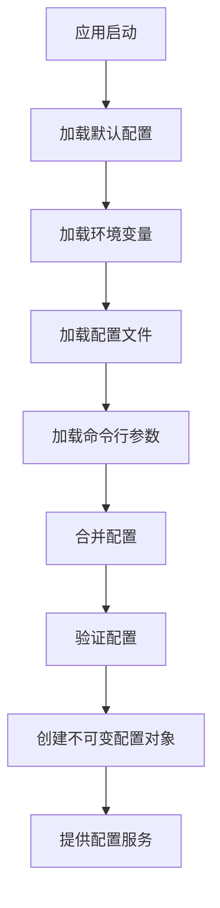

# 配置管理文档

索引标签：#部署运维 #配置管理 #环境管理 #敏感配置

## 相关文档

- [多环境实现](multi-environment-implementation.md)：详细描述多环境的实现方案
- [部署指南](deployment-guide.md)：详细描述系统的部署流程和配置要求
- [开发环境设置](../dev-support/development-environment-setup.md)：详细描述开发环境的配置和设置
- [基础设施层设计](../layered-design/infrastructure-layer-design.md)：详细描述基础设施层的设计，包括配置管理的实现
- [日志管理](logging-management.md)：详细描述日志系统的配置
- [监控配置](monitoring-configuration.md)：详细描述监控系统的配置

## 1. 文档概述

本文档详细描述了认知辅助系统的配置管理设计原则、架构和实现方案。配置管理是系统的重要组成部分，负责管理系统在不同环境下的配置信息，确保系统的可配置性和可扩展性。

## 2. 配置管理设计原则

### 1.1 核心设计理念
- **集中管理**：所有配置集中管理，便于维护和更新
- **分层配置**：根据系统架构分层组织配置
- **环境隔离**：不同环境（开发、测试、生产）的配置相互隔离
- **类型安全**：使用 TypeScript 确保配置的类型安全
- **不可变性**：配置加载后不可修改，确保系统状态一致性
- **可扩展性**：支持新配置项的添加，不影响现有功能
- **可测试性**：便于在测试中模拟和替换配置
- **优先级明确**：明确配置来源的优先级，避免冲突

### 1.2 设计约束
- 配置必须符合最小权限原则，只包含必要的信息
- 敏感配置（如密码、API密钥）必须加密或通过安全方式注入
- 配置变更必须可审计，便于追踪变更历史
- 配置加载过程必须可测试，便于单元测试和集成测试
- 配置必须支持热重载，便于在运行时更新配置（如需要）

## 2. 配置技术栈

| 组件类型 | 技术选型 | 用途 | 特点 |
|----------|----------|------|------|
| **配置库** | dotenv + config | 加载和管理配置 | 简单易用、支持环境变量、类型安全 |
| **类型系统** | TypeScript | 确保配置类型安全 | 静态类型检查、IDE支持 |
| **配置来源** | 环境变量 + 配置文件 | 存储配置信息 | 环境隔离、便于部署 |
| **敏感配置** | AWS Secrets Manager / HashiCorp Vault | 管理敏感配置 | 安全可靠、审计友好 |

## 3. 配置来源与优先级

### 3.1 配置来源

| 来源 | 格式 | 用途 | 特点 |
|------|------|------|------|
| **环境变量** | 键值对 | 部署环境特定配置 | 安全、便于容器化部署 |
| **配置文件** | JSON/YAML | 共享配置和默认值 | 便于版本控制、可读性好 |
| **命令行参数** | 键值对 | 运行时临时配置 | 灵活、优先级高 |
| **秘密管理服务** | 加密存储 | 敏感配置 | 安全、审计友好 |

### 3.2 优先级顺序

配置来源按以下优先级从高到低排列：

1. **命令行参数**：最高优先级，可覆盖其他配置
2. **环境变量**：部署环境特定配置
3. **环境特定配置文件**：如 `.env.production`, `config.production.json`
4. **默认配置文件**：如 `.env.default`, `config.default.json`
5. **代码默认值**：最低优先级，作为最终 fallback

## 4. 配置结构设计

### 4.1 配置分层

配置按照系统架构和功能模块进行分层组织：

```
├── application           # 应用程序级配置
├── database              # 数据库配置
├── redis                 # Redis配置
├── ai                    # AI服务配置
├── logging               # 日志配置
├── security              # 安全配置
├── server                # 服务器配置
└── monitoring            # 监控配置
```

### 4.2 核心配置结构

#### 4.2.1 应用程序配置

```typescript
interface ApplicationConfig {
  /** 应用程序名称 */
  name: string;
  /** 应用程序版本 */
  version: string;
  /** 运行环境 */
  environment: 'development' | 'test' | 'production';
  /** 是否启用调试模式 */
  debug: boolean;
  /** 应用程序描述 */
  description?: string;
}
```

#### 4.2.2 服务器配置

```typescript
interface ServerConfig {
  /** 服务器端口 */
  port: number;
  /** 服务器主机名 */
  host: string;
  /** 是否启用HTTPS */
  https: boolean;
  /** HTTPS证书路径 */
  sslCertPath?: string;
  /** HTTPS私钥路径 */
  sslKeyPath?: string;
  /** 请求超时时间（毫秒） */
  requestTimeout: number;
  /** 最大请求体大小 */
  maxBodySize: string;
}
```

#### 4.2.3 数据库配置

```typescript
interface DatabaseConfig {
  /** 数据库类型 */
  type: 'sqlite' | 'postgres' | 'mysql';
  /** 数据库连接字符串 */
  url?: string;
  /** 数据库主机名 */
  host?: string;
  /** 数据库端口 */
  port?: number;
  /** 数据库名称 */
  database?: string;
  /** 数据库用户名 */
  username?: string;
  /** 数据库密码 */
  password?: string;
  /** 是否启用同步模式（仅开发环境） */
  synchronize: boolean;
  /** 是否启用日志 */
  logging: boolean;
  /** 连接池配置 */
  pool: {
    /** 最小连接数 */
    min: number;
    /** 最大连接数 */
    max: number;
    /** 连接超时时间（毫秒） */
    acquireTimeoutMillis: number;
    /** 空闲连接超时时间（毫秒） */
    idleTimeoutMillis: number;
  };
}
```

#### 4.2.4 Redis配置

```typescript
interface RedisConfig {
  /** Redis主机名 */
  host: string;
  /** Redis端口 */
  port: number;
  /** Redis密码 */
  password?: string;
  /** Redis数据库索引 */
  db: number;
  /** 连接超时时间（毫秒） */
  connectTimeout: number;
  /** 重试策略配置 */
  retryStrategy: {
    /** 最大重试次数 */
    maxAttempts: number;
    /** 重试延迟（毫秒） */
    delay: number;
  };
  /** 缓存配置 */
  cache: {
    /** 默认过期时间（秒） */
    defaultTtl: number;
    /** 是否启用缓存 */
    enabled: boolean;
  };
  /** 队列配置 */
  queue: {
    /** 队列名称 */
    name: string;
    /** 并发处理数量 */
    concurrency: number;
  };
}
```

#### 4.2.5 AI服务配置

```typescript
interface AiConfig {
  /** OpenAI配置 */
  openai: {
    /** API密钥 */
    apiKey: string;
    /** API基础URL */
    baseUrl?: string;
    /** 默认模型 */
    defaultModel: string;
    /** 请求超时时间（毫秒） */
    timeout: number;
    /** 最大重试次数 */
    maxRetries: number;
  };
  /** 嵌入服务配置 */
  embedding: {
    /** 使用的模型 */
    model: string;
    /** 嵌入维度 */
    dimension: number;
    /** 是否启用本地缓存 */
    cacheEnabled: boolean;
    /** 缓存过期时间（秒） */
    cacheTtl: number;
  };
  /** 速率限制配置 */
  rateLimit: {
    /** 每分钟请求数限制 */
    requestsPerMinute: number;
  };
}
```

#### 4.2.6 日志配置

```typescript
interface LoggingConfig {
  /** 日志级别 */
  level: 'trace' | 'debug' | 'info' | 'warn' | 'error' | 'fatal';
  /** 是否启用控制台输出 */
  consoleEnabled: boolean;
  /** 是否启用文件输出 */
  fileEnabled: boolean;
  /** 日志文件路径 */
  filePath?: string;
  /** 日志文件轮转配置 */
  rotation: {
    /** 日志文件大小限制 */
    size: string;
    /** 保留的日志文件数量 */
    keep: number;
  };
  /** 是否启用JSON格式 */
  jsonFormat: boolean;
}
```

#### 4.2.7 安全配置

```typescript
interface SecurityConfig {
  /** JWT配置 */
  jwt: {
    /** 密钥 */
    secret: string;
    /** 过期时间（秒） */
    expiresIn: number;
    /** 刷新令牌过期时间（秒） */
    refreshExpiresIn: number;
    /** 算法 */
    algorithm: string;
  };
  /** 密码配置 */
  password: {
    /** 哈希算法 */
    hashAlgorithm: string;
    /** 盐长度 */
    saltLength: number;
    /** 迭代次数 */
    iterations: number;
  };
  /** CORS配置 */
  cors: {
    /** 允许的 origins */
    origin: string | string[];
    /** 允许的HTTP方法 */
    methods: string[];
    /** 允许的HTTP头 */
    allowedHeaders: string[];
    /** 是否允许凭据 */
    credentials: boolean;
  };
  /** 速率限制配置 */
  rateLimit: {
    /** 窗口大小（毫秒） */
    windowMs: number;
    /** 每个IP的最大请求数 */
    max: number;
  };
}
```

#### 4.2.8 监控配置

```typescript
interface MonitoringConfig {
  /** Prometheus配置 */
  prometheus: {
    /** 是否启用 */
    enabled: boolean;
    /** 指标端点路径 */
    endpoint: string;
  };
  /** 健康检查配置 */
  healthCheck: {
    /** 是否启用 */
    enabled: boolean;
    /** 健康检查端点路径 */
    endpoint: string;
  };
  /** 指标配置 */
  metrics: {
    /** 是否启用HTTP指标 */
    http: boolean;
    /** 是否启用数据库指标 */
    database: boolean;
    /** 是否启用Redis指标 */
    redis: boolean;
    /** 是否启用AI服务指标 */
    ai: boolean;
  };
}
```

### 4.3 完整配置结构

```typescript
interface AppConfig {
  /** 应用程序配置 */
  application: ApplicationConfig;
  /** 服务器配置 */
  server: ServerConfig;
  /** 数据库配置 */
  database: DatabaseConfig;
  /** Redis配置 */
  redis: RedisConfig;
  /** AI服务配置 */
  ai: AiConfig;
  /** 日志配置 */
  logging: LoggingConfig;
  /** 安全配置 */
  security: SecurityConfig;
  /** 监控配置 */
  monitoring: MonitoringConfig;
}
```

## 5. 配置加载机制

### 5.1 配置加载流程



### 5.2 配置加载实现

```typescript
// src/infrastructure/config/config.loader.ts

import dotenv from 'dotenv';
import { z } from 'zod';
import { AppConfig } from './config.types';

// 定义配置模式
const appConfigSchema = z.object({
  application: z.object({
    name: z.string().default('cognitive-api'),
    version: z.string().default('1.0.0'),
    environment: z.enum(['development', 'test', 'production']).default('development'),
    debug: z.boolean().default(false),
    description: z.string().optional()
  }),
  server: z.object({
    port: z.number().default(3000),
    host: z.string().default('0.0.0.0'),
    https: z.boolean().default(false),
    sslCertPath: z.string().optional(),
    sslKeyPath: z.string().optional(),
    requestTimeout: z.number().default(30000),
    maxBodySize: z.string().default('10mb')
  }),
  // 其他配置模式...
});

// 加载环境变量
const loadEnvVariables = () => {
  // 加载基础.env文件
  dotenv.config();
  
  // 加载环境特定的.env文件
  const env = process.env.NODE_ENV || 'development';
  dotenv.config({ path: `.env.${env}` });
};

// 从环境变量构建配置
const buildConfigFromEnv = (): Record<string, any> => {
  return {
    application: {
      name: process.env.APP_NAME || 'cognitive-api',
      version: process.env.APP_VERSION || '1.0.0',
      environment: process.env.NODE_ENV || 'development',
      debug: process.env.DEBUG === 'true',
      description: process.env.APP_DESCRIPTION
    },
    server: {
      port: parseInt(process.env.PORT || '3000', 10),
      host: process.env.HOST || '0.0.0.0',
      https: process.env.HTTPS === 'true',
      sslCertPath: process.env.SSL_CERT_PATH,
      sslKeyPath: process.env.SSL_KEY_PATH,
      requestTimeout: parseInt(process.env.REQUEST_TIMEOUT || '30000', 10),
      maxBodySize: process.env.MAX_BODY_SIZE || '10mb'
    },
    // 其他配置项...
  };
};

// 验证配置
const validateConfig = (config: any): AppConfig => {
  const result = appConfigSchema.safeParse(config);
  
  if (!result.success) {
    throw new Error(`配置验证失败: ${result.error.message}`);
  }
  
  return result.data;
};

// 创建不可变配置
const createImmutableConfig = (config: AppConfig): Readonly<AppConfig> => {
  return Object.freeze(config);
};

// 加载配置的主函数
export const loadConfig = (): Readonly<AppConfig> => {
  // 加载环境变量
  loadEnvVariables();
  
  // 从环境变量构建配置
  const configFromEnv = buildConfigFromEnv();
  
  // 验证配置
  const validatedConfig = validateConfig(configFromEnv);
  
  // 创建不可变配置
  const immutableConfig = createImmutableConfig(validatedConfig);
  
  return immutableConfig;
};
```

### 5.3 配置服务

```typescript
// src/infrastructure/config/config.service.ts

import { injectable } from 'tsyringe';
import { AppConfig } from './config.types';
import { loadConfig } from './config.loader';

@injectable()
export class ConfigService {
  private readonly config: Readonly<AppConfig>;

  constructor() {
    this.config = loadConfig();
  }

  /**
   * 获取完整配置
   */
  getConfig(): Readonly<AppConfig> {
    return this.config;
  }

  /**
   * 获取应用程序配置
   */
  getApplicationConfig() {
    return this.config.application;
  }

  /**
   * 获取服务器配置
   */
  getServerConfig() {
    return this.config.server;
  }

  /**
   * 获取数据库配置
   */
  getDatabaseConfig() {
    return this.config.database;
  }

  /**
   * 获取Redis配置
   */
  getRedisConfig() {
    return this.config.redis;
  }

  /**
   * 获取AI服务配置
   */
  getAiConfig() {
    return this.config.ai;
  }

  /**
   * 获取日志配置
   */
  getLoggingConfig() {
    return this.config.logging;
  }

  /**
   * 获取安全配置
   */
  getSecurityConfig() {
    return this.config.security;
  }

  /**
   * 获取监控配置
   */
  getMonitoringConfig() {
    return this.config.monitoring;
  }
}
```

## 6. 环境管理

### 6.1 环境类型

| 环境 | 用途 | 配置文件 | 特点 |
|------|------|----------|------|
| **开发环境** | 开发人员本地开发 | `.env.development` | 调试模式、详细日志、本地数据库 |
| **测试环境** | 自动化测试和集成测试 | `.env.test` | 测试数据库、禁用外部服务 |
| **预发布环境** | 发布前验证 | `.env.staging` | 接近生产环境、完整功能验证 |
| **生产环境** | 正式生产部署 | `.env.production` | 高性能、安全配置、最小日志 |

### 6.2 环境配置示例

#### 6.2.1 开发环境配置（.env.development）

```dotenv
# 应用程序配置
APP_NAME=cognitive-api
APP_VERSION=1.0.0
NODE_ENV=development
DEBUG=true

# 服务器配置
PORT=3000
HOST=0.0.0.0
HTTPS=false

# 数据库配置
DATABASE_TYPE=sqlite
DATABASE_URL=./db/development.sqlite
DATABASE_SYNCHRONIZE=true
DATABASE_LOGGING=true

# Redis配置
REDIS_HOST=localhost
REDIS_PORT=6379
REDIS_DB=0
REDIS_CACHE_ENABLED=false

# AI服务配置
OPENAI_API_KEY=sk-dev-xxxxxxxxxxxxxxxxxxxxxxxxxxxxxxxx
OPENAI_DEFAULT_MODEL=gpt-4

# 日志配置
LOG_LEVEL=debug
LOG_CONSOLE_ENABLED=true
LOG_FILE_ENABLED=false
```

#### 6.2.2 生产环境配置（.env.production）

```dotenv
# 应用程序配置
APP_NAME=cognitive-api
APP_VERSION=1.0.0
NODE_ENV=production
DEBUG=false

# 服务器配置
PORT=8080
HOST=0.0.0.0
HTTPS=true
SSL_CERT_PATH=/etc/ssl/certs/server.crt
SSL_KEY_PATH=/etc/ssl/private/server.key

# 数据库配置
DATABASE_TYPE=postgres
DATABASE_URL=postgresql://user:password@db:5432/cognitive
DATABASE_SYNCHRONIZE=false
DATABASE_LOGGING=false

# Redis配置
REDIS_HOST=redis
REDIS_PORT=6379
REDIS_PASSWORD=redis-password
REDIS_DB=0
REDIS_CACHE_ENABLED=true

# AI服务配置
OPENAI_API_KEY=sk-prod-xxxxxxxxxxxxxxxxxxxxxxxxxxxxxxxx
OPENAI_DEFAULT_MODEL=gpt-4

# 日志配置
LOG_LEVEL=info
LOG_CONSOLE_ENABLED=false
LOG_FILE_ENABLED=true
LOG_FILE_PATH=/var/log/cognitive-api.log
```

### 6.3 环境切换

通过设置 `NODE_ENV` 环境变量来切换不同环境的配置：

```bash
# 开发环境
NODE_ENV=development npm start

# 测试环境
NODE_ENV=test npm test

# 生产环境
NODE_ENV=production npm start
```

## 7. 敏感配置管理

### 7.1 敏感配置类型

- **API密钥**：如 OpenAI API 密钥、数据库密码
- **加密密钥**：如 JWT 密钥、数据加密密钥
- **凭证**：如数据库用户名密码、Redis密码
- **配置**：如生产环境的数据库连接字符串

### 7.2 敏感配置处理方式

#### 7.2.1 开发环境
- 使用 `.env` 文件存储敏感配置
- 将 `.env` 文件添加到 `.gitignore`，避免提交到版本控制
- 提供 `.env.example` 文件作为模板

#### 7.2.2 生产环境
- 使用环境变量注入敏感配置
- 使用 secrets 管理服务（如 AWS Secrets Manager、HashiCorp Vault）
- 避免在配置文件中存储明文敏感信息
- 使用容器编排平台的 secrets 管理功能（如 Kubernetes Secrets）

### 7.3 敏感配置访问示例

```typescript
// src/infrastructure/config/config.loader.ts

import { SecretsManager } from '@aws-sdk/client-secrets-manager';

// 从AWS Secrets Manager加载敏感配置
const loadSecrets = async (): Promise<Record<string, string>> => {
  if (process.env.NODE_ENV !== 'production') {
    return {};
  }

  const secretsManager = new SecretsManager({
    region: process.env.AWS_REGION || 'us-east-1'
  });

  try {
    const secretName = 'cognitive-api/production';
    const secret = await secretsManager.getSecretValue({ SecretId: secretName });
    
    if (secret.SecretString) {
      return JSON.parse(secret.SecretString);
    }
    
    return {};
  } catch (error) {
    console.error('Failed to load secrets:', error);
    return {};
  }
};
```

## 8. 配置使用示例

### 8.1 在应用程序中使用配置

```typescript
// src/application/app.ts

import { container } from 'tsyringe';
import { ConfigService } from '../infrastructure/config/config.service';
import { logger } from '../infrastructure/logging/logger';

const configService = container.resolve(ConfigService);
const serverConfig = configService.getServerConfig();
const loggingConfig = configService.getLoggingConfig();

// 初始化日志
logger.info('Starting application...');
logger.info('Application configuration:', {
  name: configService.getApplicationConfig().name,
  version: configService.getApplicationConfig().version,
  environment: configService.getApplicationConfig().environment
});

// 启动服务器
app.listen(serverConfig.port, serverConfig.host, () => {
  logger.info(`Server running on http://${serverConfig.host}:${serverConfig.port}`);
});
```

### 8.2 在数据库连接中使用配置

```typescript
// src/infrastructure/database/database.connection.ts

import { container } from 'tsyringe';
import { DataSource } from 'typeorm';
import { ConfigService } from '../config/config.service';
import { User } from '../../domain/entities/User';
import { UserCognitiveModel } from '../../domain/entities/UserCognitiveModel';
// 其他实体导入...

const configService = container.resolve(ConfigService);
const dbConfig = configService.getDatabaseConfig();

export const AppDataSource = new DataSource({
  type: dbConfig.type,
  url: dbConfig.url,
  host: dbConfig.host,
  port: dbConfig.port,
  database: dbConfig.database,
  username: dbConfig.username,
  password: dbConfig.password,
  synchronize: dbConfig.synchronize,
  logging: dbConfig.logging,
  entities: [
    User,
    UserCognitiveModel,
    // 其他实体...
  ],
  migrations: [
    __dirname + '/migrations/**/*{.ts,.js}'
  ],
  subscribers: [
    __dirname + '/subscribers/**/*{.ts,.js}'
  ],
  poolSize: dbConfig.pool.max,
  extra: {
    max: dbConfig.pool.max,
    min: dbConfig.pool.min,
    acquireTimeoutMillis: dbConfig.pool.acquireTimeoutMillis,
    idleTimeoutMillis: dbConfig.pool.idleTimeoutMillis
  }
});
```

### 8.3 在测试中使用配置

```typescript
// src/tests/unit/domain/services/cognitive-model.service.test.ts

import { container } from 'tsyringe';
import { ConfigService } from '../../../infrastructure/config/config.service';
import { CognitiveModelService } from '../../../domain/services/CognitiveModelService';

// 模拟配置服务
class MockConfigService implements Partial<ConfigService> {
  getAiConfig() {
    return {
      openai: {
        apiKey: 'test-api-key',
        defaultModel: 'gpt-4',
        timeout: 5000,
        maxRetries: 3
      },
      // 其他AI配置...
    };
  }
}

// 替换容器中的配置服务
container.registerInstance<ConfigService>(ConfigService, new MockConfigService() as ConfigService);

// 现在可以测试依赖于配置的服务
const cognitiveModelService = container.resolve(CognitiveModelService);
// 测试代码...
```

## 9. 配置验证与错误处理

### 9.1 配置验证

- 使用 Zod 进行运行时配置验证
- 验证配置的必填项、类型、范围等
- 在应用启动时验证所有配置
- 验证失败时抛出详细的错误信息

### 9.2 错误处理

```typescript
// src/infrastructure/config/config.loader.ts

export const loadConfig = (): Readonly<AppConfig> => {
  try {
    // 加载环境变量
    loadEnvVariables();
    
    // 从环境变量构建配置
    const configFromEnv = buildConfigFromEnv();
    
    // 验证配置
    const validatedConfig = validateConfig(configFromEnv);
    
    // 创建不可变配置
    const immutableConfig = createImmutableConfig(validatedConfig);
    
    return immutableConfig;
  } catch (error) {
    console.error('Failed to load configuration:', error);
    process.exit(1); // 配置加载失败，应用无法启动
  }
};
```

## 10. 配置变更管理

### 10.1 变更流程

1. **需求分析**：确定需要添加或修改的配置项
2. **配置设计**：设计配置项的名称、类型、默认值
3. **代码修改**：更新配置模式、加载逻辑和使用代码
4. **测试验证**：在不同环境中测试配置变更
5. **部署发布**：更新配置并部署应用
6. **监控观察**：监控应用行为，确保配置变更正常

### 10.2 最佳实践

- **向后兼容**：新配置项必须有合理的默认值
- **文档更新**：及时更新配置文档
- **版本控制**：配置文件纳入版本控制（除敏感配置外）
- **变更审计**：记录配置变更的原因和影响
- **回滚计划**：准备配置变更的回滚计划

## 11. 配置优化

### 11.1 性能优化

- **懒加载**：只在需要时加载配置
- **缓存配置**：避免重复加载和解析配置
- **最小化配置**：只包含必要的配置项
- **异步加载**：对于远程配置，使用异步加载避免阻塞启动

### 11.2 安全性优化

- **敏感配置加密**：使用加密方式存储敏感配置
- **最小权限**：配置只包含必要的权限和信息
- **定期轮换**：定期轮换敏感配置（如API密钥）
- **访问控制**：限制对配置的访问权限

### 11.3 可维护性优化

- **清晰命名**：使用清晰、一致的命名约定
- **分组组织**：按功能或组件分组配置
- **文档完整**：为每个配置项提供文档
- **示例配置**：提供完整的示例配置文件

## 12. 总结

本文档详细描述了 AI 认知辅助系统的配置管理设计方案，包括：

1. **设计原则**：集中管理、分层配置、环境隔离、类型安全、不可变性、可扩展性、可测试性、优先级明确
2. **技术栈**：dotenv + config + TypeScript + Zod
3. **配置来源与优先级**：环境变量、配置文件、命令行参数、秘密管理服务
4. **配置结构**：按系统组件分层组织的完整配置结构
5. **配置加载机制**：从不同来源加载配置并验证的流程
6. **环境管理**：不同环境的配置处理方式
7. **敏感配置管理**：敏感配置的安全处理方式
8. **配置使用示例**：在应用程序、数据库连接和测试中使用配置
9. **配置验证与错误处理**：确保配置的正确性和完整性
10. **配置变更管理**：配置变更的流程和最佳实践
11. **配置优化**：性能、安全性和可维护性优化

通过实施这个配置管理方案，可以确保系统配置的集中管理、环境隔离、类型安全和可扩展性，提高系统的可维护性和可靠性。同时，良好的配置管理也便于系统的部署、测试和监控。
## 13. 文档更新记录

| 更新日期 | 版本号 | 更新内容 | 更新人 | 审核人 |
|----------|--------|----------|--------|--------|
| 2026-01-09 | 1.0.0 | 初始创建配置管理文档 | 系统架构师 | 技术负责人 |
