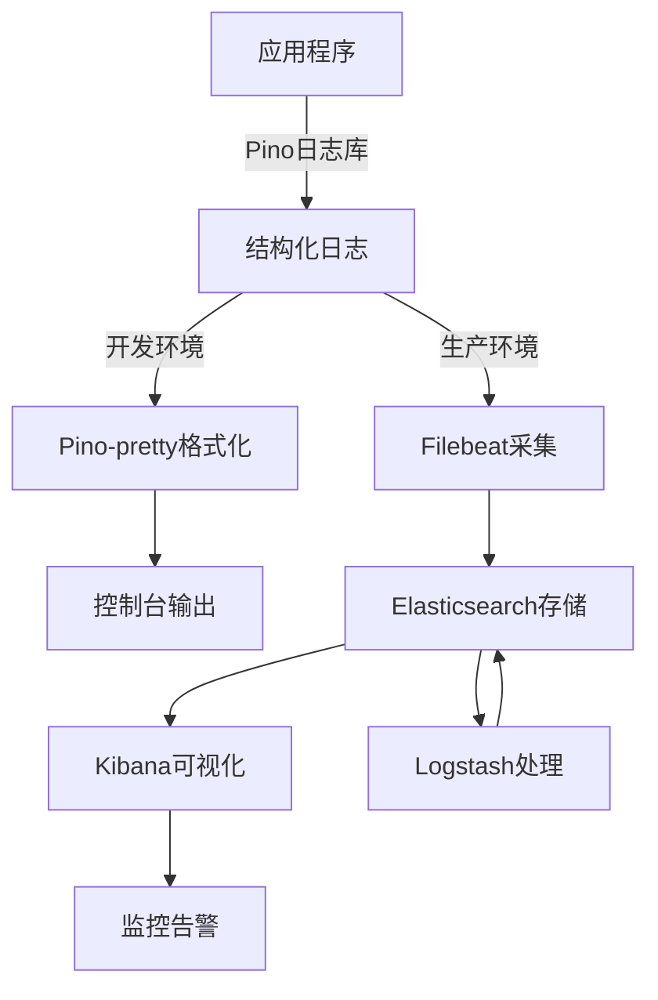

# 日志系统设计文档

索引标签：#日志系统 #可观测性 #ELK Stack #Pino #监控告警

## 相关文档

- [日志管理](logging-management.md)：详细描述日志管理的策略和实践
- [监控配置](monitoring-configuration.md)：详细描述系统监控的配置和实现
- [基础设施层设计](../layered-design/infrastructure-layer-design.md)：详细描述基础设施层的设计，包括日志系统的集成
- [部署指南](deployment-guide.md)：详细描述系统部署的步骤，包括日志系统的部署
- [性能优化指南](performance-optimization-guide.md)：详细描述系统性能优化的策略，包括日志系统的优化

## 1. 日志系统设计原则

### 1.1 核心设计理念
- **可观测性优先**：提供全面的系统运行状态可见性
- **结构化设计**：便于日志的查询、分析和可视化
- **高性能**：最小化对系统性能的影响
- **可扩展性**：支持未来日志需求的增长
- **分层设计**：与系统架构相匹配，支持不同层级的日志需求
- **标准化**：统一日志格式和规范

### 1.2 设计约束
- 日志必须包含足够的上下文信息，便于问题定位
- 日志级别划分清晰，便于过滤和查询
- 日志格式统一，支持机器可读
- 支持不同环境的日志配置（开发、测试、生产）
- 符合数据隐私和安全要求，不泄露敏感信息

## 2. 日志技术栈

| 组件类型 | 技术选型 | 用途 | 特点 |
|----------|----------|------|------|
| **日志库** | Pino | 应用程序日志记录 | 高性能、结构化、JSON格式 |
| **日志传输** | Pino-pretty（开发）/ Winston-transport（生产） | 日志格式化和传输 | 开发环境友好、生产环境可靠 |
| **日志存储** | 文件系统（开发）/ Elasticsearch（生产） | 日志持久化存储 | 开发环境简单、生产环境可扩展 |
| **日志分析** | Kibana | 日志查询和可视化 | 强大的搜索和可视化能力 |
| **日志采集** | Filebeat | 日志采集和转发 | 轻量级、高性能 |

## 3. 日志级别设计

| 级别 | 描述 | 使用场景 | 示例 |
|------|------|----------|------|
| **trace** | 最详细的日志，包含系统执行的每个步骤 | 调试复杂问题，通常只在开发环境使用 | 函数调用参数、返回值 |
| **debug** | 调试信息，包含系统内部状态 | 开发和测试环境，调试特定功能 | 变量值、流程分支 |
| **info** | 常规信息，记录系统正常运行状态 | 所有环境，记录重要事件 | 用户登录、请求处理完成 |
| **warn** | 警告信息，表示潜在问题 | 所有环境，记录需要关注的情况 | 资源使用接近阈值、配置不推荐 |
| **error** | 错误信息，表示系统出现故障 | 所有环境，记录错误事件 | 数据库连接失败、API调用错误 |
| **fatal** | 致命错误，表示系统无法继续运行 | 所有环境，记录严重故障 | 内存耗尽、核心服务崩溃 |

## 4. 日志结构设计

### 4.1 基础日志结构

所有日志都应包含以下基础字段：

| 字段名 | 类型 | 描述 | 示例 |
|--------|------|------|------|
| `timestamp` | ISO8601 | 日志生成时间 | 2023-10-01T12:00:00.000Z |
| `level` | string | 日志级别 | info, error |
| `message` | string | 日志消息 | "User logged in successfully" |
| `service` | string | 服务名称 | "cognitive-api" |
| `environment` | string | 运行环境 | "development", "production" |
| `version` | string | 服务版本 | "1.0.0" |
| `requestId` | string | 请求唯一标识 | "uuid-1234-5678" |
| `userId` | string | 用户唯一标识 | "user-123" |

### 4.2 扩展日志结构

根据不同的日志类型，可以添加以下扩展字段：

#### 4.2.1 HTTP请求日志

| 字段名 | 类型 | 描述 | 示例 |
|--------|------|------|------|
| `req.method` | string | HTTP请求方法 | "GET", "POST" |
| `req.url` | string | 请求URL | "/api/users/123" |
| `req.headers` | object | 请求头 | `{"user-agent": "Mozilla/5.0"}` |
| `req.body` | object | 请求体（不包含敏感信息） | `{"username": "test"}` |
| `res.statusCode` | number | 响应状态码 | 200, 404, 500 |
| `res.headers` | object | 响应头 | `{"content-type": "application/json"}` |
| `responseTime` | number | 响应时间（毫秒） | 150 |

#### 4.2.2 错误日志

| 字段名 | 类型 | 描述 | 示例 |
|--------|------|------|------|
| `error.name` | string | 错误名称 | "TypeError" |
| `error.message` | string | 错误消息 | "Cannot read property 'id' of undefined" |
| `error.stack` | string | 错误堆栈 | 完整的堆栈跟踪信息 |
| `error.code` | string | 错误代码 | "DATABASE_CONNECTION_FAILED" |

#### 4.2.3 数据库操作日志

| 字段名 | 类型 | 描述 | 示例 |
|--------|------|------|------|
| `db.operation` | string | 数据库操作类型 | "SELECT", "INSERT", "UPDATE" |
| `db.table` | string | 操作的表名 | "users" |
| `db.query` | string | 执行的查询语句（脱敏） | "SELECT * FROM users WHERE id = ?" |
| `db.params` | array | 查询参数（脱敏） | ["user-123"] |
| `db.duration` | number | 查询执行时间（毫秒） | 50 |

#### 4.2.4 AI服务调用日志

| 字段名 | 类型 | 描述 | 示例 |
|--------|------|------|------|
| `ai.service` | string | AI服务名称 | "openai", "anthropic" |
| `ai.model` | string | 使用的模型 | "gpt-4", "claude-3" |
| `ai.operation` | string | AI操作类型 | "completion", "embedding" |
| `ai.promptTokens` | number | 提示词Token数 | 100 |
| `ai.completionTokens` | number | 完成Token数 | 200 |
| `ai.totalTokens` | number | 总Token数 | 300 |
| `ai.duration` | number | AI调用耗时（毫秒） | 1200 |

## 5. 日志系统架构



## 6. 日志系统实现

### 6.1 日志配置

```typescript
// src/infrastructure/logging/logger.config.ts

import { LoggerOptions } from 'pino';

export const getLoggerConfig = (environment: string): LoggerOptions => {
  const baseConfig: LoggerOptions = {
    level: environment === 'production' ? 'info' : 'debug',
    formatters: {
      level: (label) => ({ level: label }),
      bindings: (bindings) => ({
        service: 'cognitive-api',
        version: process.env.VERSION || '1.0.0',
        ...bindings
      })
    },
    timestamp: () => `,"timestamp":"${new Date().toISOString()}"`,
    redact: {
      paths: ['req.headers.authorization', 'req.body.password', 'req.body.creditCard'],
      censor: '[REDACTED]'
    }
  };

  if (environment === 'development') {
    return {
      ...baseConfig,
      transport: {
        target: 'pino-pretty',
        options: {
          colorize: true,
          translateTime: 'SYS:yyyy-mm-dd HH:MM:ss.l o',
          ignore: 'pid,hostname,service,version'
        }
      }
    };
  }

  return baseConfig;
};
```

### 6.2 日志初始化

```typescript
// src/infrastructure/logging/logger.ts

import pino from 'pino';
import { getLoggerConfig } from './logger.config';

const environment = process.env.NODE_ENV || 'development';
const loggerConfig = getLoggerConfig(environment);

export const logger = pino(loggerConfig);

export const createChildLogger = (bindings: Record<string, any>) => {
  return logger.child(bindings);
};
```

### 6.3 日志中间件

```typescript
// src/infrastructure/middleware/logger.middleware.ts

import { Request, Response, NextFunction } from 'express';
import { logger } from '../logging/logger';
import { v4 as uuidv4 } from 'uuid';

export const loggerMiddleware = (req: Request, res: Response, next: NextFunction) => {
  const requestId = uuidv4();
  const startTime = Date.now();

  // 将requestId添加到响应头
  res.setHeader('X-Request-Id', requestId);

  // 创建请求日志
  const reqLogger = logger.child({
    requestId,
    userId: req.headers['x-user-id'] || 'anonymous'
  });

  // 记录请求开始
  reqLogger.info({
    req: {
      method: req.method,
      url: req.url,
      headers: req.headers,
      body: req.body
    }
  }, 'Request started');

  // 监听响应完成
  res.on('finish', () => {
    const responseTime = Date.now() - startTime;
    
    // 记录请求完成
    reqLogger.info({
      res: {
        statusCode: res.statusCode,
        headers: res.getHeaders()
      },
      responseTime
    }, 'Request completed');
  });

  // 将logger添加到请求对象
  (req as any).logger = reqLogger;
  
  next();
};
```

### 6.4 错误日志处理

```typescript
// src/infrastructure/middleware/error.middleware.ts

import { Request, Response, NextFunction } from 'express';
import { logger } from '../logging/logger';

export const errorMiddleware = (err: any, req: Request, res: Response, next: NextFunction) => {
  const reqLogger = (req as any).logger || logger;
  
  // 记录错误日志
  reqLogger.error({
    error: {
      name: err.name,
      message: err.message,
      stack: err.stack,
      code: err.code
    },
    req: {
      method: req.method,
      url: req.url
    }
  }, 'Request failed');

  // 发送错误响应
  const statusCode = err.statusCode || 500;
  const message = statusCode === 500 ? 'Internal Server Error' : err.message;
  
  res.status(statusCode).json({
    error: message,
    requestId: res.getHeader('X-Request-Id')
  });
};
```

### 6.5 日志使用示例

```typescript
// src/application/services/CognitiveModelService.ts

import { inject, injectable } from 'tsyringe';
import { logger } from '../../infrastructure/logging/logger';
import { UserCognitiveModelRepository } from '../../domain/repositories/UserCognitiveModelRepository';

@injectable()
export class CognitiveModelService {
  constructor(
    @inject('UserCognitiveModelRepository')
    private readonly cognitiveModelRepository: UserCognitiveModelRepository
  ) {}

  async createModel(userId: string, modelName: string) {
    const serviceLogger = logger.child({ userId, operation: 'createModel' });
    
    try {
      serviceLogger.info({ modelName }, 'Creating cognitive model');
      
      // 业务逻辑...
      
      serviceLogger.info({ modelId: createdModel.id }, 'Cognitive model created successfully');
      return createdModel;
    } catch (error) {
      serviceLogger.error({ error }, 'Failed to create cognitive model');
      throw error;
    }
  }
}
```

## 7. 日志存储与管理

### 7.1 开发环境
- **存储方式**：本地文件系统
- **文件轮转**：每天生成一个新文件
- **保留策略**：保留最近7天的日志
- **文件位置**：`logs/cognitive-api-{date}.log`

### 7.2 生产环境
- **存储方式**：Elasticsearch集群
- **索引策略**：按天创建索引（`cognitive-api-{YYYY.MM.DD}`）
- **保留策略**：
  - 热数据（最近30天）：完整存储在高速存储
  - 温数据（30-90天）：压缩存储
  - 冷数据（90天以上）：归档存储
- **备份策略**：定期备份到对象存储（如S3）

## 8. 日志采集与分析

### 8.1 日志采集
- **工具**：Filebeat
- **配置**：监控日志文件，实时采集新生成的日志
- **传输**：通过Logstash或直接发送到Elasticsearch
- **过滤**：在Logstash中进行日志过滤和处理

### 8.2 日志分析
- **工具**：Kibana
- **功能**：
  - 实时日志查询和搜索
  - 日志可视化仪表盘
  - 日志告警和通知
  - 日志模式识别和异常检测

### 8.3 常用查询示例

1. **查询特定请求ID的日志**：
   ```
   requestId: "uuid-1234-5678"
   ```

2. **查询特定用户的所有日志**：
   ```
   userId: "user-123"
   ```

3. **查询所有错误日志**：
   ```
   level: "error" OR level: "fatal"
   ```

4. **查询响应时间超过500ms的请求**：
   ```
   responseTime > 500
   ```

5. **查询特定API端点的日志**：
   ```
   req.url: "/api/models/*"
   ```

## 9. 日志监控与告警

### 9.1 监控指标
- **错误率**：HTTP 5xx响应比例
- **请求延迟**：P95、P99响应时间
- **日志量**：每分钟日志条数
- **异常模式**：特定错误类型的出现频率

### 9.2 告警规则

| 告警类型 | 触发条件 | 告警级别 | 通知方式 |
|----------|----------|----------|----------|
| **高错误率** | 5xx错误率 > 5% 持续5分钟 | 严重 | 邮件、Slack、电话 |
| **请求超时** | P99响应时间 > 2s 持续5分钟 | 警告 | 邮件、Slack |
| **日志量突增** | 日志量比基线增加100% 持续5分钟 | 警告 | 邮件 |
| **数据库连接失败** | 数据库连接错误 > 10次/分钟 | 严重 | 邮件、Slack、电话 |
| **AI服务调用失败** | AI服务调用错误率 > 10% 持续5分钟 | 警告 | 邮件、Slack |

### 9.3 告警通知
- **开发团队**：实时Slack通知
- **运维团队**：邮件和电话告警
- **管理层**：每日告警汇总邮件

## 10. 日志安全与隐私

### 10.1 数据脱敏
- **敏感字段**：密码、令牌、信用卡号、个人身份信息等
- **脱敏方式**：
  - 使用Pino的redact功能自动脱敏
  - 自定义脱敏函数处理复杂场景
  - 确保日志中不包含原始敏感数据

### 10.2 访问控制
- **日志系统访问**：基于角色的访问控制（RBAC）
- **开发人员**：只能访问开发和测试环境日志
- **运维人员**：可以访问所有环境日志
- **审计日志**：记录对日志系统的所有访问操作

### 10.3 合规性
- **GDPR**：确保日志处理符合数据保护法规
- **PCI DSS**：如果处理支付数据，确保日志符合PCI DSS要求
- **SOX**：如果需要，确保日志可审计和不可篡改

## 11. 日志系统优化

### 11.1 性能优化
- **异步日志**：使用异步方式写入日志，减少对主业务线程的影响
- **批量写入**：批量发送日志到存储系统，减少网络开销
- **采样率**：在高流量场景下，对某些日志类型进行采样
- **日志级别调整**：生产环境只记录必要的日志级别

### 11.2 存储优化
- **压缩**：对日志数据进行压缩，减少存储空间
- **索引优化**：合理设计Elasticsearch索引，提高查询性能
- **冷热分离**：将不同时间范围的日志存储在不同性能的存储设备上

### 11.3 查询优化
- **合理设计索引**：为常用查询字段创建索引
- **使用合适的查询语法**：避免复杂的正则表达式查询
- **限制查询时间范围**：每次查询只查询必要的时间范围

## 12. 总结

本文档详细描述了 AI 认知辅助系统的日志系统设计方案，包括：

1. **设计原则**：可观测性优先、结构化设计、高性能、可扩展性、分层设计、标准化
2. **技术栈**：Pino 日志库、Elasticsearch 存储、Kibana 分析、Filebeat 采集
3. **日志级别**：trace、debug、info、warn、error、fatal
4. **日志结构**：基础字段和扩展字段，支持不同类型的日志
5. **系统架构**：从日志生成到存储分析的完整流程
6. **实现示例**：日志配置、初始化、中间件和使用示例
7. **存储与管理**：不同环境的存储策略和保留政策
8. **采集与分析**：使用 Filebeat 采集日志，Kibana 进行分析
9. **监控与告警**：关键指标监控和告警规则
10. **安全与隐私**：数据脱敏、访问控制和合规性
11. **优化策略**：性能、存储和查询优化

通过实施这个日志系统设计方案，可以为 AI 认知辅助系统提供全面的可观测性，帮助开发和运维团队快速定位和解决问题，确保系统的稳定运行。同时，结构化的日志设计也为后续的数据分析和机器学习提供了基础。