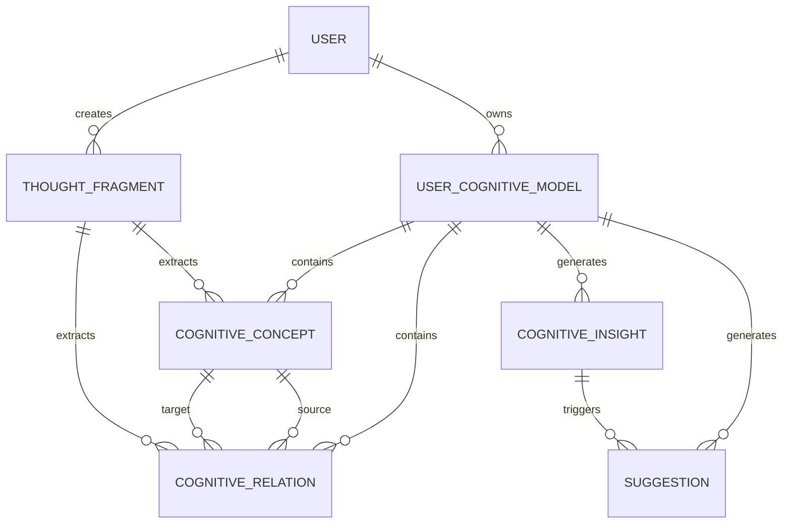
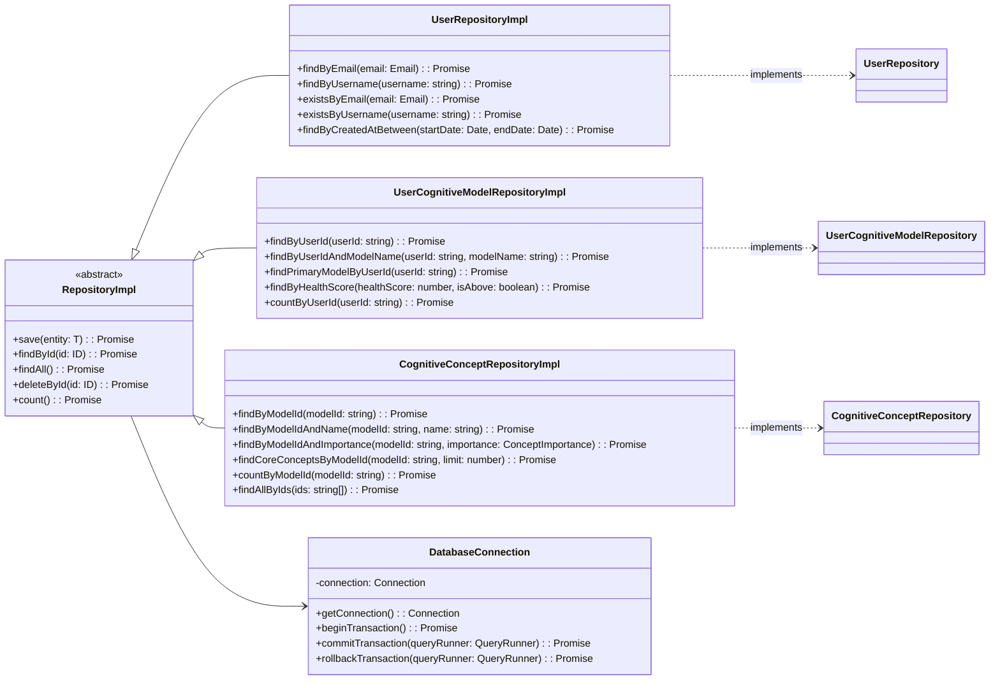

# 数据库设计与实现文档

索引标签：#数据库设计 #数据模型 #PostgreSQL #Qdrant #SQLite #ORM #TypeORM

## 相关文档

- [数据模型定义](../core-features/data-model-definition.md)：详细描述系统的数据模型
- [领域模型设计](../layered-design/domain-model-design.md)：详细描述领域模型的设计
- [仓库接口定义](../layered-design/repository-interface-definition.md)：详细描述数据访问层的接口定义
- [基础设施层设计](../layered-design/infrastructure-layer-design.md)：详细描述基础设施层的设计，包括数据库连接
- [数据迁移指南](../deployment-ops/data-migration-guide.md)：详细描述数据迁移的策略和实现

## 1. 数据库选型与演进策略

### 1.1 选型原则
- **成熟稳定**：选择经过验证的数据库技术
- **高性能**：支持系统的核心业务场景
- **易维护**：降低运维成本和学习曲线
- **可扩展性**：支持系统未来的业务增长
- **与架构匹配**：符合 Clean Architecture 和 DDD 原则

### 1.2 数据库技术栈

| 阶段 | 数据库类型 | 技术选型 | 用途 | 特点 |
|------|------------|----------|------|------|
| **早期阶段** | 关系型数据库 | SQLite | 存储结构化数据、开发测试 | 轻量级、零配置、文件型数据库 |
| **中期阶段** | 向量数据库 | Qdrant | 存储和检索向量数据、语义搜索 | 专为向量数据优化、支持相似性搜索 |
| **后期阶段** | 关系型数据库 | PostgreSQL | 存储结构化数据、生产环境 | 功能强大、扩展性好、生态成熟 |

### 1.3 演进路线

1. **开发与测试阶段**：使用 SQLite 进行快速开发和测试
2. **向量功能引入**：集成 Qdrant 处理向量数据和语义搜索
3. **生产环境部署**：切换到 PostgreSQL 处理结构化数据，Qdrant 处理向量数据
4. **性能优化**：根据实际负载进行数据库优化和扩展

## 2. 数据库表结构设计

### 2.1 实体关系图 (ERD)



### 2.2 核心表结构

#### 2.2.1 用户表 (users)

| 字段名 | 数据类型 | 约束 | 描述 |
|--------|----------|------|------|
| id | VARCHAR(36) | PRIMARY KEY | 用户唯一标识 (UUID) |
| username | VARCHAR(50) | UNIQUE NOT NULL | 用户名 |
| email | VARCHAR(100) | UNIQUE NOT NULL | 邮箱地址 |
| password_hash | VARCHAR(255) | NOT NULL | 密码哈希 |
| created_at | TIMESTAMP | NOT NULL DEFAULT CURRENT_TIMESTAMP | 创建时间 |
| updated_at | TIMESTAMP | NOT NULL DEFAULT CURRENT_TIMESTAMP | 更新时间 |
| last_login_at | TIMESTAMP | NULL | 最后登录时间 |
| status | VARCHAR(20) | NOT NULL DEFAULT 'active' | 用户状态 (active/inactive/suspended) |

#### 2.2.2 用户认知模型表 (user_cognitive_models)

| 字段名 | 数据类型 | 约束 | 描述 |
|--------|----------|------|------|
| id | VARCHAR(36) | PRIMARY KEY | 认知模型唯一标识 (UUID) |
| user_id | VARCHAR(36) | NOT NULL REFERENCES users(id) | 所属用户ID |
| model_name | VARCHAR(100) | NOT NULL | 模型名称 |
| is_primary | BOOLEAN | NOT NULL DEFAULT FALSE | 是否为主模型 |
| health_score | FLOAT | NOT NULL DEFAULT 0.0 | 模型健康分数 (0-100) |
| concept_count | INTEGER | NOT NULL DEFAULT 0 | 概念数量 |
| relation_count | INTEGER | NOT NULL DEFAULT 0 | 关系数量 |
| created_at | TIMESTAMP | NOT NULL DEFAULT CURRENT_TIMESTAMP | 创建时间 |
| updated_at | TIMESTAMP | NOT NULL DEFAULT CURRENT_TIMESTAMP | 更新时间 |
| last_analyzed_at | TIMESTAMP | NULL | 最后分析时间 |

#### 2.2.3 认知概念表 (cognitive_concepts)

| 字段名 | 数据类型 | 约束 | 描述 |
|--------|----------|------|------|
| id | VARCHAR(36) | PRIMARY KEY | 概念唯一标识 (UUID) |
| model_id | VARCHAR(36) | NOT NULL REFERENCES user_cognitive_models(id) | 所属模型ID |
| name | VARCHAR(100) | NOT NULL | 概念名称 |
| description | TEXT | NULL | 概念描述 |
| importance | VARCHAR(20) | NOT NULL DEFAULT 'medium' | 重要性 (low/medium/high) |
| occurrence_count | INTEGER | NOT NULL DEFAULT 1 | 出现次数 |
| created_at | TIMESTAMP | NOT NULL DEFAULT CURRENT_TIMESTAMP | 创建时间 |
| updated_at | TIMESTAMP | NOT NULL DEFAULT CURRENT_TIMESTAMP | 更新时间 |
| vector_id | VARCHAR(36) | NULL | 关联的向量ID (Qdrant) |

#### 2.2.4 认知关系表 (cognitive_relations)

| 字段名 | 数据类型 | 约束 | 描述 |
|--------|----------|------|------|
| id | VARCHAR(36) | PRIMARY KEY | 关系唯一标识 (UUID) |
| model_id | VARCHAR(36) | NOT NULL REFERENCES user_cognitive_models(id) | 所属模型ID |
| source_concept_id | VARCHAR(36) | NOT NULL REFERENCES cognitive_concepts(id) | 源概念ID |
| target_concept_id | VARCHAR(36) | NOT NULL REFERENCES cognitive_concepts(id) | 目标概念ID |
| relation_type | VARCHAR(50) | NOT NULL | 关系类型 (e.g., "is-a", "part-of", "related-to") |
| strength | VARCHAR(20) | NOT NULL DEFAULT 'medium' | 强度 (weak/medium/strong) |
| occurrence_count | INTEGER | NOT NULL DEFAULT 1 | 出现次数 |
| created_at | TIMESTAMP | NOT NULL DEFAULT CURRENT_TIMESTAMP | 创建时间 |
| updated_at | TIMESTAMP | NOT NULL DEFAULT CURRENT_TIMESTAMP | 更新时间 |

#### 2.2.5 思想片段表 (thought_fragments)

| 字段名 | 数据类型 | 约束 | 描述 |
|--------|----------|------|------|
| id | VARCHAR(36) | PRIMARY KEY | 思想片段唯一标识 (UUID) |
| user_id | VARCHAR(36) | NOT NULL REFERENCES users(id) | 所属用户ID |
| model_id | VARCHAR(36) | NULL REFERENCES user_cognitive_models(id) | 关联模型ID |
| content | TEXT | NOT NULL | 思想内容 |
| thought_type | VARCHAR(20) | NOT NULL DEFAULT 'text' | 思想类型 (text/audio/video/image) |
| source | VARCHAR(100) | NULL | 来源 (e.g., "manual-input", "imported") |
| is_analyzed | BOOLEAN | NOT NULL DEFAULT FALSE | 是否已分析 |
| created_at | TIMESTAMP | NOT NULL DEFAULT CURRENT_TIMESTAMP | 创建时间 |
| updated_at | TIMESTAMP | NOT NULL DEFAULT CURRENT_TIMESTAMP | 更新时间 |
| vector_id | VARCHAR(36) | NULL | 关联的向量ID (Qdrant) |

#### 2.2.6 认知洞察表 (cognitive_insights)

| 字段名 | 数据类型 | 约束 | 描述 |
|--------|----------|------|------|
| id | VARCHAR(36) | PRIMARY KEY | 洞察唯一标识 (UUID) |
| model_id | VARCHAR(36) | NOT NULL REFERENCES user_cognitive_models(id) | 所属模型ID |
| insight_type | VARCHAR(50) | NOT NULL | 洞察类型 (e.g., "concept-gap", "relation-weakness") |
| title | VARCHAR(200) | NOT NULL | 洞察标题 |
| description | TEXT | NOT NULL | 洞察描述 |
| severity | VARCHAR(20) | NOT NULL DEFAULT 'medium' | 严重程度 (low/medium/high) |
| is_resolved | BOOLEAN | NOT NULL DEFAULT FALSE | 是否已解决 |
| resolved_at | TIMESTAMP | NULL | 解决时间 |
| created_at | TIMESTAMP | NOT NULL DEFAULT CURRENT_TIMESTAMP | 创建时间 |
| updated_at | TIMESTAMP | NOT NULL DEFAULT CURRENT_TIMESTAMP | 更新时间 |

#### 2.2.7 建议表 (suggestions)

| 字段名 | 数据类型 | 约束 | 描述 |
|--------|----------|------|------|
| id | VARCHAR(36) | PRIMARY KEY | 建议唯一标识 (UUID) |
| model_id | VARCHAR(36) | NOT NULL REFERENCES user_cognitive_models(id) | 所属模型ID |
| insight_id | VARCHAR(36) | NULL REFERENCES cognitive_insights(id) | 关联洞察ID |
| title | VARCHAR(200) | NOT NULL | 建议标题 |
| description | TEXT | NOT NULL | 建议描述 |
| priority | VARCHAR(20) | NOT NULL DEFAULT 'medium' | 优先级 (low/medium/high) |
| is_treated | BOOLEAN | NOT NULL DEFAULT FALSE | 是否已处理 |
| treated_at | TIMESTAMP | NULL | 处理时间 |
| created_at | TIMESTAMP | NOT NULL DEFAULT CURRENT_TIMESTAMP | 创建时间 |
| updated_at | TIMESTAMP | NOT NULL DEFAULT CURRENT_TIMESTAMP | 更新时间 |

## 3. 索引设计

### 3.1 索引策略
- **常用查询字段**：为频繁用于查询条件的字段创建索引
- **外键字段**：为外键字段创建索引，提高关联查询性能
- **排序字段**：为频繁用于排序的字段创建索引
- **复合索引**：根据查询模式创建复合索引，优化多条件查询
- **避免过度索引**：索引会增加写操作开销，需权衡

### 3.2 具体索引设计

| 表名 | 索引字段 | 索引类型 | 用途 |
|------|----------|----------|------|
| users | email | UNIQUE | 快速根据邮箱查找用户 |
| users | username | UNIQUE | 快速根据用户名查找用户 |
| users | created_at | BTREE | 按创建时间范围查询用户 |
| user_cognitive_models | user_id | BTREE | 快速查找用户的所有认知模型 |
| user_cognitive_models | user_id, is_primary | BTREE | 快速查找用户的主认知模型 |
| cognitive_concepts | model_id | BTREE | 快速查找模型的所有概念 |
| cognitive_concepts | model_id, name | UNIQUE | 确保模型内概念名称唯一 |
| cognitive_concepts | model_id, importance | BTREE | 按重要性查询概念 |
| cognitive_relations | model_id | BTREE | 快速查找模型的所有关系 |
| cognitive_relations | source_concept_id | BTREE | 快速查找源概念的所有关系 |
| cognitive_relations | target_concept_id | BTREE | 快速查找目标概念的所有关系 |
| cognitive_relations | source_concept_id, target_concept_id | UNIQUE | 确保概念间关系唯一 |
| thought_fragments | user_id | BTREE | 快速查找用户的所有思想片段 |
| thought_fragments | user_id, created_at | BTREE | 按时间范围查询用户思想片段 |
| thought_fragments | model_id | BTREE | 快速查找模型关联的思想片段 |
| cognitive_insights | model_id | BTREE | 快速查找模型的所有洞察 |
| cognitive_insights | model_id, is_resolved | BTREE | 快速查找模型的未解决洞察 |
| cognitive_insights | model_id, severity | BTREE | 按严重程度查询洞察 |
| suggestions | model_id | BTREE | 快速查找模型的所有建议 |
| suggestions | model_id, is_treated | BTREE | 快速查找模型的未处理建议 |
| suggestions | model_id, priority | BTREE | 按优先级查询建议 |

## 4. 数据迁移策略

### 4.1 迁移工具
- **开发阶段**：使用 TypeORM 迁移工具进行数据库迁移
- **生产阶段**：结合 TypeORM 迁移和数据库特定工具进行迁移

### 4.2 迁移流程

1. **创建迁移文件**：使用 TypeORM CLI 生成迁移文件
2. **编写迁移逻辑**：定义表结构变更、数据转换等逻辑
3. **测试迁移**：在开发环境测试迁移脚本
4. **执行迁移**：在生产环境执行迁移
5. **验证迁移**：验证迁移结果和数据完整性
6. **回滚机制**：准备迁移回滚脚本，应对迁移失败情况

### 4.3 示例迁移文件

```typescript
// src/infrastructure/database/migrations/1620000000000-CreateUsersTable.ts

import { MigrationInterface, QueryRunner } from 'typeorm';

export class CreateUsersTable1620000000000 implements MigrationInterface {
  public async up(queryRunner: QueryRunner): Promise<void> {
    await queryRunner.query(`
      CREATE TABLE users (
        id VARCHAR(36) PRIMARY KEY,
        username VARCHAR(50) UNIQUE NOT NULL,
        email VARCHAR(100) UNIQUE NOT NULL,
        password_hash VARCHAR(255) NOT NULL,
        created_at TIMESTAMP NOT NULL DEFAULT CURRENT_TIMESTAMP,
        updated_at TIMESTAMP NOT NULL DEFAULT CURRENT_TIMESTAMP,
        last_login_at TIMESTAMP NULL,
        status VARCHAR(20) NOT NULL DEFAULT 'active'
      );
      
      CREATE INDEX idx_users_email ON users(email);
      CREATE INDEX idx_users_username ON users(username);
      CREATE INDEX idx_users_created_at ON users(created_at);
    `);
  }

  public async down(queryRunner: QueryRunner): Promise<void> {
    await queryRunner.query(`
      DROP INDEX IF EXISTS idx_users_created_at;
      DROP INDEX IF EXISTS idx_users_username;
      DROP INDEX IF EXISTS idx_users_email;
      DROP TABLE IF EXISTS users;
    `);
  }
}
```

## 5. 数据访问层设计

### 5.1 设计原则
- **抽象封装**：隐藏底层数据库细节，提供统一的数据访问接口
- **领域驱动**：数据访问层应与领域模型紧密结合
- **事务支持**：提供事务管理机制
- **错误处理**：统一处理数据库异常，转换为领域异常
- **性能优化**：实现查询优化、缓存等机制

### 5.2 数据访问层架构



### 5.3 数据访问层实现示例

```typescript
// src/infrastructure/repositories/UserRepositoryImpl.ts

import { inject, injectable } from 'tsyringe';
import { Repository } from 'typeorm';
import { User } from '../../domain/entities/User';
import { UserRepository } from '../../domain/repositories/UserRepository';
import { Email } from '../../domain/value-objects/Email';
import { DatabaseConnection } from '../database/DatabaseConnection';

@injectable()
export class UserRepositoryImpl implements UserRepository {
  private readonly repository: Repository<User>;

  constructor(
    @inject('DatabaseConnection')
    private readonly databaseConnection: DatabaseConnection
  ) {
    this.repository = this.databaseConnection.getConnection().getRepository(User);
  }

  async findById(id: string): Promise<User | null> {
    return this.repository.findOne({ where: { id } });
  }

  async findAll(): Promise<User[]> {
    return this.repository.find();
  }

  async save(entity: User): Promise<User> {
    return this.repository.save(entity);
  }

  async saveAll(entities: User[]): Promise<User[]> {
    return this.repository.save(entities);
  }

  async deleteById(id: string): Promise<boolean> {
    const result = await this.repository.delete(id);
    return result.affected !== 0;
  }

  async delete(entity: User): Promise<boolean> {
    const result = await this.repository.delete(entity.id);
    return result.affected !== 0;
  }

  async deleteAll(entities: User[]): Promise<number> {
    const ids = entities.map(entity => entity.id);
    const result = await this.repository.delete(ids);
    return result.affected || 0;
  }

  async count(): Promise<number> {
    return this.repository.count();
  }

  async existsById(id: string): Promise<boolean> {
    return this.repository.exists({ where: { id } });
  }

  async findByEmail(email: Email): Promise<User | null> {
    return this.repository.findOne({ where: { email: email.value } });
  }

  async findByUsername(username: string): Promise<User | null> {
    return this.repository.findOne({ where: { username } });
  }

  async existsByEmail(email: Email): Promise<boolean> {
    return this.repository.exists({ where: { email: email.value } });
  }

  async existsByUsername(username: string): Promise<boolean> {
    return this.repository.exists({ where: { username } });
  }

  async findByCreatedAtBetween(startDate: Date, endDate: Date): Promise<User[]> {
    return this.repository.find({
      where: {
        createdAt: {
          between: [startDate, endDate]
        }
      },
      order: {
        createdAt: 'ASC'
      }
    });
  }
}
```

## 6. 事务管理

### 6.1 事务边界
- **应用层控制**：事务边界应在应用层定义，确保业务逻辑的原子性
- **仓库层支持**：仓库层应支持在事务上下文中执行操作

### 6.2 事务实现示例

```typescript
// src/application/services/CognitiveModelApplicationService.ts

import { inject, injectable } from 'tsyringe';
import { UserCognitiveModelRepository } from '../../domain/repositories/UserCognitiveModelRepository';
import { CognitiveConceptRepository } from '../../domain/repositories/CognitiveConceptRepository';
import { CognitiveRelationRepository } from '../../domain/repositories/CognitiveRelationRepository';
import { DatabaseConnection } from '../../infrastructure/database/DatabaseConnection';

@injectable()
export class CognitiveModelApplicationService {
  constructor(
    @inject('UserCognitiveModelRepository')
    private readonly cognitiveModelRepository: UserCognitiveModelRepository,
    
    @inject('CognitiveConceptRepository')
    private readonly conceptRepository: CognitiveConceptRepository,
    
    @inject('CognitiveRelationRepository')
    private readonly relationRepository: CognitiveRelationRepository,
    
    @inject('DatabaseConnection')
    private readonly databaseConnection: DatabaseConnection
  ) {}

  async createModelWithConcepts(
    userId: string,
    modelName: string,
    initialConcepts: Array<{ name: string; description: string }>
  ) {
    // 开始事务
    const queryRunner = await this.databaseConnection.beginTransaction();

    try {
      // 创建认知模型
      const model = UserCognitiveModel.create(userId, modelName);
      const savedModel = await this.cognitiveModelRepository.save(model);

      // 创建初始概念
      for (const conceptData of initialConcepts) {
        const concept = CognitiveConcept.create(
          savedModel.id,
          conceptData.name,
          conceptData.description
        );
        await this.conceptRepository.save(concept);
      }

      // 提交事务
      await this.databaseConnection.commitTransaction(queryRunner);
      
      return savedModel;
    } catch (error) {
      // 回滚事务
      await this.databaseConnection.rollbackTransaction(queryRunner);
      throw error;
    }
  }
}
```

## 7. 性能优化

### 7.1 查询优化
- **使用索引**：为常用查询字段创建适当的索引
- **避免全表扫描**：优化查询条件，确保使用索引
- **分页查询**：实现高效的分页机制，避免加载大量数据
- **批量操作**：使用批量插入、更新和删除操作，减少数据库交互次数
- **延迟加载**：根据需要加载关联数据，避免不必要的数据加载

### 7.2 缓存策略
- **应用层缓存**：使用 Redis 缓存频繁访问的数据
- **查询结果缓存**：缓存常用查询的结果
- **实体缓存**：缓存热点实体数据
- **缓存失效策略**：实现合理的缓存失效机制，确保数据一致性

### 7.3 数据库连接管理
- **连接池**：使用数据库连接池管理连接资源
- **连接复用**：复用数据库连接，减少连接建立开销
- **连接超时**：设置合理的连接超时时间
- **最大连接数**：根据服务器资源设置合理的最大连接数

## 8. 数据安全

### 8.1 数据加密
- **敏感数据加密**：对密码等敏感数据进行加密存储
- **传输加密**：使用 SSL/TLS 加密数据库连接
- **静态数据加密**：根据需要对静态数据进行加密

### 8.2 访问控制
- **最小权限原则**：为数据库用户分配最小必要权限
- **角色分离**：分离不同角色的数据库访问权限
- **访问日志**：记录数据库访问日志，便于审计和监控

### 8.3 数据备份与恢复
- **定期备份**：制定合理的备份策略，定期备份数据库
- **备份验证**：定期验证备份的完整性和可恢复性
- **灾难恢复计划**：制定详细的灾难恢复计划
- **备份存储**：将备份存储在安全的位置，防止数据丢失

## 9. 监控与维护

### 9.1 数据库监控
- **性能监控**：监控数据库性能指标，如查询响应时间、连接数等
- **资源监控**：监控数据库服务器的 CPU、内存、磁盘等资源使用情况
- **错误监控**：监控数据库错误和异常
- **慢查询监控**：识别和优化慢查询

### 9.2 数据库维护
- **定期优化**：定期进行数据库优化，如索引重建、表分析等
- **空间管理**：监控和管理数据库存储空间
- **版本升级**：及时升级数据库版本，获取新功能和安全补丁
- **安全审计**：定期进行数据库安全审计

## 10. 总结

本文档详细描述了 AI 认知辅助系统的数据库设计与实现方案，包括：

1. **数据库选型与演进策略**：从 SQLite 到 Qdrant 再到 PostgreSQL 的演进路线
2. **数据库表结构设计**：完整的表结构定义和实体关系图
3. **索引设计**：针对各表的索引策略，优化查询性能
4. **数据迁移策略**：使用 TypeORM 进行数据库迁移的流程和示例
5. **数据访问层设计**：基于 Repository 模式的数据访问层实现
6. **事务管理**：应用层控制的事务管理机制
7. **性能优化**：查询优化、缓存策略和连接管理
8. **数据安全**：数据加密、访问控制和备份恢复
9. **监控与维护**：数据库监控和维护策略

该设计方案遵循了 Clean Architecture 和 DDD 原则，实现了领域模型与持久化机制的解耦，支持系统的演进和扩展。通过合理的数据库设计和优化，可以确保系统在不同阶段都能提供良好的性能和可靠性。