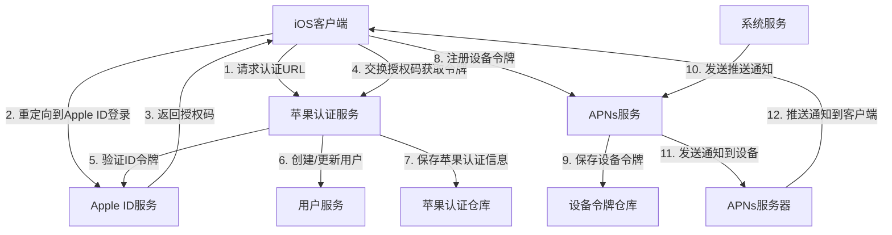

# 苹果后端端到端集成流程文档
#集成指南 #苹果集成 #认证 #推送通知 #iOS客户端

## 1. 文档概述

本文档详细描述了iOS客户端与AI认知辅助系统苹果后端模块的端到端集成流程，包括苹果认证（Sign in with Apple）、设备令牌注册和推送通知发送的完整流程。通过本文档，开发人员可以了解如何将iOS应用与后端系统无缝集成，实现完整的苹果生态支持。

### 1.1 相关文档

- [苹果后端集成架构设计](../architecture-design/apple-backend-integration.md) - 苹果后端集成架构设计
- [苹果认证设计](../core-features/apple-authentication.md) - Sign in with Apple设计
- [苹果推送通知设计](../core-features/apple-push-notification.md) - APNs集成设计
- [API设计](../core-features/api-design.md) - API设计规范和实现
- [iOS客户端集成](ios-client-integration.md) - iOS客户端集成指南
- [苹果后端开发指南](../development-guides/apple-backend-development.md) - 苹果后端开发指导
- [苹果后端测试策略](../testing/apple-backend-testing-strategy.md) - 苹果后端测试策略

## 2. 系统架构

### 2.1 整体架构



### 2.2 核心组件

- **iOS客户端**：用户使用的iOS应用，集成了Sign in with Apple和APNs SDK
- **苹果认证服务**：处理与Apple ID服务的通信，验证用户身份
- **Apple ID服务**：苹果官方提供的身份认证服务
- **用户服务**：管理系统用户，处理用户创建和更新
- **苹果认证仓库**：存储用户的苹果认证信息
- **APNs服务**：处理与APNs服务器的通信，发送推送通知
- **设备令牌仓库**：存储用户设备的APNs令牌
- **系统服务**：系统内部服务，生成需要推送给用户的通知
- **APNs服务器**：苹果官方提供的推送通知服务

## 3. 集成流程

### 3.1 苹果认证流程

#### 3.1.1 客户端流程

```swift
// 1. 配置Sign in with Apple
let appleIDProvider = ASAuthorizationAppleIDProvider()
let request = appleIDProvider.createRequest()
request.requestedScopes = [.fullName, .email]

// 2. 发起认证请求
let authorizationController = ASAuthorizationController(authorizationRequests: [request])
authorizationController.delegate = self
authorizationController.presentationContextProvider = self
authorizationController.performRequests()

// 3. 处理认证结果
extension YourViewController: ASAuthorizationControllerDelegate {
    func authorizationController(controller: ASAuthorizationController, didCompleteWithAuthorization authorization: ASAuthorization) {
        if let appleIDCredential = authorization.credential as? ASAuthorizationAppleIDCredential {
            // 4. 获取授权码或ID令牌
            let authorizationCode = String(data: appleIDCredential.authorizationCode!, encoding: .utf8)
            let idToken = String(data: appleIDCredential.identityToken!, encoding: .utf8)
            
            // 5. 调用后端API进行认证
            if let code = authorizationCode {
                // 使用授权码流程
                authenticateWithCode(code: code)
            } else if let token = idToken {
                // 使用ID令牌流程
                authenticateWithIdToken(token: token)
            }
        }
    }
}
```

#### 3.1.2 后端流程

```typescript
// 1. 生成认证URL
async generateAuthUrl(state: string): Promise<{ authorizationUrl: string; state: string }> {
  // 构建认证URL，返回给客户端
}

// 2. 处理授权码回调
async handleCallback(code: string): Promise<AuthResult> {
  // 交换授权码获取ID令牌
  const tokenResponse = await this.exchangeCodeForToken(code);
  
  // 验证ID令牌
  const idTokenPayload = await this.verifyIdToken(tokenResponse.id_token);
  
  // 创建或更新用户
  const user = await this.userService.findOrCreateUser(idTokenPayload);
  
  // 保存苹果认证信息
  await this.appleAuthRepository.save({
    userId: user.id,
    appleUserId: idTokenPayload.sub,
    email: idTokenPayload.email,
    // ...其他信息
  });
  
  // 生成系统JWT令牌
  const jwtToken = this.jwtService.generateToken(user);
  
  return { token: jwtToken, user };
}
```

### 3.2 设备令牌注册流程

#### 3.2.1 客户端流程

```swift
// 1. 请求推送通知权限
UNUserNotificationCenter.current().requestAuthorization(options: [.alert, .badge, .sound]) { granted, error in
    if granted {
        // 2. 注册远程通知
        DispatchQueue.main.async {
            UIApplication.shared.registerForRemoteNotifications()
        }
    }
}

// 3. 获取设备令牌
func application(_ application: UIApplication, didRegisterForRemoteNotificationsWithDeviceToken deviceToken: Data) {
    // 转换设备令牌格式
    let tokenParts = deviceToken.map { data in String(format: "%02.2hhx", data) }
    let deviceTokenString = tokenParts.joined()
    
    // 4. 发送设备令牌到后端
    registerDeviceToken(token: deviceTokenString)
}
```

#### 3.2.2 后端流程

```typescript
// 保存设备令牌
async save(token: DeviceToken): Promise<DeviceToken> {
  // 检查设备令牌是否已存在
  const existingToken = await this.findByUserIdAndDeviceToken(token.userId, token.deviceToken);
  
  if (existingToken) {
    // 更新现有令牌
    return this.updateToken(existingToken.id, token);
  } else {
    // 创建新令牌
    return this.createToken(token);
  }
}
```

### 3.3 推送通知发送流程

#### 3.3.1 系统服务流程

```typescript
// 1. 生成推送通知内容
const payload: APNsPayload = {
  aps: {
    alert: {
      title: "新的认知洞察",
      body: "您有一个新的认知洞察需要查看",
    },
    badge: 1,
    sound: "default",
  },
  data: {
    type: "insight",
    insightId: insight.id,
  },
};

// 2. 调用APNs服务发送通知
const result = await this.apnsService.sendNotificationToUser(userId, payload);
```

#### 3.3.2 APNs服务流程

```typescript
// 1. 获取用户的活跃设备令牌
const deviceTokens = await this.deviceTokenRepository.findByUserId(userId);

// 2. 构建通知列表
const notifications = deviceTokens.map(token => ({
  deviceToken: token.deviceToken,
  payload,
  options,
}));

// 3. 批量发送通知
return this.sendBatchNotifications(notifications);

// 4. 发送单个通知
async sendNotification(deviceToken: string, payload: APNsPayload, options?: APNsOptions): Promise<APNsResponse> {
  // 构建APNs通知
  const note = new apn.Notification({
    alert: payload.aps.alert,
    badge: payload.aps.badge,
    sound: payload.aps.sound,
    // ...其他选项
  });
  
  // 发送通知到APNs服务器
  const result = await this.apnProvider.send(note, deviceToken);
  
  // 处理发送结果
  if (result.failed.length > 0) {
    // 处理失败的通知，如标记设备令牌为无效
  }
  
  return result;
}
```

#### 3.3.3 客户端接收流程

```swift
// 1. 接收远程通知
func userNotificationCenter(_ center: UNUserNotificationCenter, didReceive response: UNNotificationResponse, withCompletionHandler completionHandler: @escaping () -> Void) {
    let userInfo = response.notification.request.content.userInfo
    
    // 2. 处理通知内容
    if let type = userInfo["type"] as? String {
        switch type {
        case "insight":
            // 处理认知洞察通知
            if let insightId = userInfo["insightId"] as? String {
                navigateToInsight(insightId: insightId)
            }
        case "suggestion":
            // 处理建议通知
            if let suggestionId = userInfo["suggestionId"] as? String {
                navigateToSuggestion(suggestionId: suggestionId)
            }
        default:
            break
        }
    }
    
    completionHandler()
}
```

## 4. API接口汇总

| 接口路径 | 方法 | 描述 | 客户端调用时机 |
|----------|------|------|----------------|
| `/api/v1/auth/apple/url` | GET | 生成苹果认证URL | 用户点击"使用Apple ID登录" |
| `/api/v1/auth/apple/callback` | POST | 处理苹果授权码回调 | 收到Apple授权码后 |
| `/api/v1/auth/apple/login` | POST | 使用ID令牌直接登录 | 收到Apple ID令牌后 |
| `/api/v1/apns/tokens` | POST | 注册设备令牌 | 获取设备令牌后 |
| `/api/v1/apns/tokens/:id` | DELETE | 删除设备令牌 | 用户登出或卸载应用前 |

## 5. 错误处理与重试机制

### 5.1 客户端错误处理

```swift
// 处理认证错误
func authenticateWithCode(code: String) {
    // 调用后端API
    AF.request("/api/v1/auth/apple/callback", method: .post, parameters: ["code": code])
        .responseDecodable(of: AuthResponse.self) { response in
            switch response.result {
            case .success(let authResponse):
                // 处理成功
                saveToken(authResponse.token)
            case .failure(let error):
                // 处理错误
                if let statusCode = response.response?.statusCode {
                    switch statusCode {
                    case 400:
                        // 无效的授权码
                        showError("登录失败：无效的授权码")
                    case 401:
                        // 认证失败
                        showError("登录失败：认证失败")
                    case 500:
                        // 服务器错误
                        showError("登录失败：服务器错误")
                    default:
                        showError("登录失败：未知错误")
                    }
                }
            }
        }
}
```

### 5.2 后端错误处理

```typescript
// 处理APNs发送错误
async sendNotification(deviceToken: string, payload: APNsPayload, options?: APNsOptions): Promise<APNsResponse> {
  try {
    // 发送通知
    const result = await this.apnProvider.send(note, deviceToken);
    
    if (result.failed.length > 0) {
      const error = result.failed[0].response?.reason || 'Unknown error';
      this.logger.logError('APNs notification failed', { deviceToken, error });
      
      // 处理失效的设备令牌
      if (['BadDeviceToken', 'Unregistered'].includes(error)) {
        await this.deviceTokenRepository.markAsInvalid(deviceToken);
      }
      
      return {
        success: false,
        error: error
      };
    }
    
    return {
      success: true,
      messageId: result.sent[0]?.messageId
    };
  } catch (error) {
    this.logger.logError('APNs notification exception', { deviceToken, error: (error as Error).message });
    return {
      success: false,
      error: (error as Error).message
    };
  }
}
```

### 5.3 重试机制

- **认证流程**：客户端应实现最多3次重试机制，每次重试间隔递增（1秒、3秒、5秒）
- **设备令牌注册**：客户端应在应用启动时重新注册设备令牌，确保令牌始终有效
- **推送通知**：后端应实现失败通知的重试机制，特别是对于临时错误（如网络问题）

## 6. 安全最佳实践

1. **保护授权码和ID令牌**：
   - 始终使用HTTPS传输敏感数据
   - 授权码应在短时间内使用，避免泄露
   - ID令牌应使用安全的方式存储在客户端

2. **验证设备令牌**：
   - 后端应验证设备令牌的格式和有效性
   - 定期清理无效的设备令牌

3. **保护用户隐私**：
   - 只请求必要的权限（如仅请求email和name）
   - 遵循苹果的隐私政策
   - 定期清理不再使用的用户数据

4. **防止重放攻击**：
   - 使用nonce值验证ID令牌
   - 验证state值防止CSRF攻击

## 7. 测试与调试

### 7.1 客户端测试

- **使用苹果沙盒环境**：在开发和测试阶段使用苹果的沙盒环境进行测试
- **使用TestFlight进行beta测试**：在发布前使用TestFlight进行真实环境测试
- **使用APNs测试工具**：使用苹果提供的APNs测试工具验证推送通知

### 7.2 后端测试

- **使用Mock服务**：在单元测试中使用Mock服务模拟Apple ID服务和APNs服务
- **集成测试**：测试完整的认证和推送流程
- **性能测试**：测试批量推送的性能和吞吐量

## 8. 部署与运维

### 8.1 环境配置

| 环境变量 | 描述 | 开发环境 | 生产环境 |
|----------|------|----------|----------|
| `APPLE_CLIENT_ID` | 苹果客户端ID | 开发客户端ID | 生产客户端ID |
| `APPLE_ENV` | 苹果环境 | `development` | `production` |
| `APNs_ENV` | APNs环境 | `development` | `production` |

### 8.2 监控与告警

- **监控认证成功率**：设置告警阈值，当认证成功率低于95%时触发告警
- **监控推送成功率**：设置告警阈值，当推送成功率低于90%时触发告警
- **监控错误日志**：定期分析错误日志，识别常见问题

## 9. 总结

本文档详细描述了iOS客户端与AI认知辅助系统苹果后端模块的端到端集成流程，包括苹果认证、设备令牌注册和推送通知发送的完整流程。通过遵循本文档的指南，开发人员可以将iOS应用与后端系统无缝集成，实现完整的苹果生态支持。

同时，本文档也提供了错误处理、重试机制、安全最佳实践、测试与调试以及部署与运维的建议，确保系统在生产环境中的稳定运行。

通过实施这些建议，系统将能够为iOS用户提供安全、可靠、高效的服务，提升用户体验。