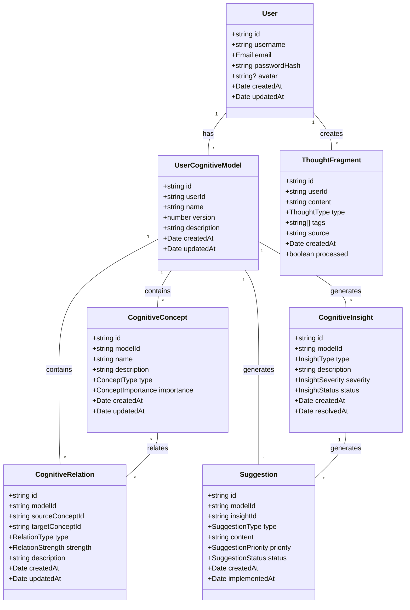

# 领域模型设计文档

索引标签：#领域模型 #DDD #实体设计 #值对象 #业务规则

## 相关文档

- [数据模型定义](../core-features/data-model-definition.md)：详细描述系统的数据模型
- [领域层设计](domain-layer-design.md)：详细描述领域层的设计
- [领域服务实现](domain-service-implementation.md)：详细描述领域服务的实现
- [仓库接口定义](repository-interface-definition.md)：详细描述仓库接口的定义
- [应用层设计](application-layer-design.md)：详细描述应用层的设计

## 1. 文档概述

本文档详细描述AI认知辅助系统的领域模型设计，包括核心实体、值对象、关系和业务规则。领域模型是系统的核心，定义了系统的业务概念和它们之间的关系，为后续的开发工作提供了基础。通过本文档，开发者可以深入理解系统的业务逻辑和数据结构，确保系统的实现符合业务需求。

## 2. 领域模型设计原则

### 2.1 设计原则

1. **领域驱动设计（DDD）**：以领域模型为核心，业务规则显式化
2. **单一职责原则**：每个实体和值对象职责单一
3. **不可变性原则**：值对象一旦创建，其状态不可改变
4. **聚合根原则**：聚合根负责管理聚合内的实体和值对象
5. **显式关系原则**：实体之间的关系通过显式属性定义
6. **业务规则封装**：业务规则封装在领域对象内部，确保数据一致性

### 2.2 核心概念

- **实体（Entity）**：具有唯一标识符的对象，其状态可以改变
- **值对象（Value Object）**：没有唯一标识符的对象，其状态不可改变
- **聚合根（Aggregate Root）**：聚合的根实体，负责维护聚合的完整性
- **领域服务（Domain Service）**：实现跨实体的业务逻辑
- **仓库（Repository）**：负责数据持久化和查询

## 3. 核心实体设计

### 3.1 User（用户）

**描述**：系统的用户，拥有认知模型和思想片段。

**属性**：

| 属性名 | 类型 | 描述 | 约束 |
|--------|------|------|------|
| id | string | 用户唯一标识符 | 必填，UUID格式 |
| username | string | 用户名 | 必填，3-20个字符 |
| email | Email | 电子邮件 | 必填，唯一 |
| passwordHash | string | 密码哈希 | 必填 |
| createdAt | Date | 创建时间 | 必填 |
| updatedAt | Date | 更新时间 | 必填 |

**关系**：
- 1:N 拥有多个UserCognitiveModel
- 1:N 拥有多个ThoughtFragment

**业务规则**：
- 用户名和电子邮件必须唯一
- 密码必须经过哈希处理，不能明文存储

### 3.2 UserCognitiveModel（用户认知模型）

**描述**：用户的认知模型，包含认知概念和概念关系。

**属性**：

| 属性名 | 类型 | 描述 | 约束 |
|--------|------|------|------|
| id | string | 认知模型唯一标识符 | 必填，UUID格式 |
| userId | string | 所属用户ID | 必填 |
| name | string | 模型名称 | 必填，1-50个字符 |
| version | number | 模型版本 | 必填，初始值为1 |
| description | string | 模型描述 | 可选，最大200个字符 |
| createdAt | Date | 创建时间 | 必填 |
| updatedAt | Date | 更新时间 | 必填 |

**关系**：
- N:1 属于一个User
- 1:N 包含多个CognitiveConcept
- 1:N 包含多个CognitiveRelation
- 1:N 生成多个CognitiveInsight
- 1:N 生成多个Suggestion

**业务规则**：
- 每个用户可以有多个认知模型
- 模型版本每次更新时自动递增

### 3.3 CognitiveConcept（认知概念）

**描述**：认知模型中的概念，是认知结构的基本单元。

**属性**：

| 属性名 | 类型 | 描述 | 约束 |
|--------|------|------|------|
| id | string | 概念唯一标识符 | 必填，UUID格式 |
| modelId | string | 所属认知模型ID | 必填 |
| name | string | 概念名称 | 必填，1-100个字符 |
| description | string | 概念描述 | 可选，最大500个字符 |
| type | ConceptType | 概念类型 | 必填 |
| importance | ConceptImportance | 概念重要性 | 必填，0-10 |
| createdAt | Date | 创建时间 | 必填 |
| updatedAt | Date | 更新时间 | 必填 |

**关系**：
- N:1 属于一个UserCognitiveModel
- N:N 与其他CognitiveConcept通过CognitiveRelation关联

**业务规则**：
- 同一认知模型中概念名称必须唯一
- 概念重要性范围为0-10

### 3.4 CognitiveRelation（概念关系）

**描述**：认知概念之间的关系，定义了概念之间的联系强度和类型。

**属性**：

| 属性名 | 类型 | 描述 | 约束 |
|--------|------|------|------|
| id | string | 关系唯一标识符 | 必填，UUID格式 |
| modelId | string | 所属认知模型ID | 必填 |
| sourceConceptId | string | 源概念ID | 必填 |
| targetConceptId | string | 目标概念ID | 必填 |
| type | RelationType | 关系类型 | 必填 |
| strength | RelationStrength | 关系强度 | 必填，0-10 |
| description | string | 关系描述 | 可选，最大200个字符 |
| createdAt | Date | 创建时间 | 必填 |
| updatedAt | Date | 更新时间 | 必填 |

**关系**：
- N:1 属于一个UserCognitiveModel
- N:1 关联一个源CognitiveConcept
- N:1 关联一个目标CognitiveConcept

**业务规则**：
- 关系必须是单向的，从源概念指向目标概念
- 关系强度范围为0-10
- 同一源概念和目标概念之间可以有多种关系类型

### 3.5 ThoughtFragment（思想片段）

**描述**：用户输入的思想片段，是构建认知模型的原材料。

**属性**：

| 属性名 | 类型 | 描述 | 约束 |
|--------|------|------|------|
| id | string | 思想片段唯一标识符 | 必填，UUID格式 |
| userId | string | 所属用户ID | 必填 |
| content | string | 思想内容 | 必填，1-10000个字符 |
| type | ThoughtType | 思想类型 | 必填 |
| tags | string[] | 标签 | 可选，最多10个标签 |
| source | string | 来源 | 可选，1-100个字符 |
| createdAt | Date | 创建时间 | 必填 |
| processed | boolean | 是否已处理 | 必填，默认false |

**关系**：
- N:1 属于一个User

**业务规则**：
- 思想内容不能为空
- 标签数量最多为10个

### 3.6 CognitiveInsight（认知洞察）

**描述**：系统生成的认知洞察，发现用户认知中的问题和机会。

**属性**：

| 属性名 | 类型 | 描述 | 约束 |
|--------|------|------|------|
| id | string | 洞察唯一标识符 | 必填，UUID格式 |
| modelId | string | 所属认知模型ID | 必填 |
| type | InsightType | 洞察类型 | 必填 |
| description | string | 洞察描述 | 必填，10-500个字符 |
| severity | InsightSeverity | 洞察严重性 | 必填 |
| status | InsightStatus | 洞察状态 | 必填，默认open |
| createdAt | Date | 创建时间 | 必填 |
| resolvedAt | Date | 解决时间 | 可选 |

**关系**：
- N:1 属于一个UserCognitiveModel
- 1:N 生成多个Suggestion

**业务规则**：
- 洞察状态只能是open或resolved
- 只有open状态的洞察才能生成建议

### 3.7 Suggestion（改进建议）

**描述**：基于认知洞察生成的改进建议，帮助用户优化认知结构。

**属性**：

| 属性名 | 类型 | 描述 | 约束 |
|--------|------|------|------|
| id | string | 建议唯一标识符 | 必填，UUID格式 |
| modelId | string | 所属认知模型ID | 必填 |
| insightId | string | 关联洞察ID | 必填 |
| type | SuggestionType | 建议类型 | 必填 |
| content | string | 建议内容 | 必填，10-1000个字符 |
| priority | SuggestionPriority | 建议优先级 | 必填 |
| status | SuggestionStatus | 建议状态 | 必填，默认pending |
| createdAt | Date | 创建时间 | 必填 |
| implementedAt | Date | 实施时间 | 可选 |

**关系**：
- N:1 属于一个UserCognitiveModel
- N:1 关联一个CognitiveInsight

**业务规则**：
- 建议状态只能是pending、implemented或dismissed
- 建议优先级决定了建议的显示顺序

## 4. 值对象设计

### 4.1 Email（电子邮件）

**描述**：表示用户的电子邮件地址。

**属性**：
- value: string

**业务规则**：
- 必须符合电子邮件格式
- 不能为空

**实现示例**：

```typescript
export class Email {
  private constructor(public readonly value: string) {
    if (!Email.isValid(value)) {
      throw new Error(`Invalid email: ${value}`);
    }
  }
  
  public static isValid(email: string): boolean {
    const emailRegex = /^[^\s@]+@[^\s@]+\.[^\s@]+$/;
    return emailRegex.test(email);
  }
  
  public static create(email: string): Email {
    return new Email(email);
  }
  
  public equals(other: Email): boolean {
    return this.value === other.value;
  }
  
  public toString(): string {
    return this.value;
  }
}
```

### 4.2 ConceptImportance（概念重要性）

**描述**：表示认知概念的重要程度。

**属性**：
- value: number

**业务规则**：
- 取值范围为0-10
- 0表示不重要，10表示非常重要

### 4.3 RelationStrength（关系强度）

**描述**：表示概念关系的强度。

**属性**：
- value: number

**业务规则**：
- 取值范围为0-10
- 0表示弱关系，10表示强关系

### 4.4 InsightSeverity（洞察严重性）

**描述**：表示认知洞察的严重程度。

**属性**：
- value: 'low' | 'medium' | 'high'

**业务规则**：
- 只能取low、medium或high三个值
- 严重性决定了洞察的优先级

### 4.5 SuggestionPriority（建议优先级）

**描述**：表示改进建议的优先级。

**属性**：
- value: 'low' | 'medium' | 'high'

**业务规则**：
- 只能取low、medium或high三个值
- 优先级决定了建议的显示顺序

### 4.6 ThoughtType（思想类型）

**描述**：表示思想片段的类型。

**属性**：
- value: 'text' | 'file' | 'audio'

**业务规则**：
- 只能取text、file或audio三个值

## 5. 领域关系图

### 5.1 UML类图



### 5.2 聚合关系

| 聚合根 | 包含实体/值对象 | 边界 |
|--------|----------------|------|
| User | UserCognitiveModel, ThoughtFragment | 用户相关的所有数据 |
| UserCognitiveModel | CognitiveConcept, CognitiveRelation, CognitiveInsight, Suggestion | 认知模型相关的所有数据 |

## 6. 业务规则

### 6.1 用户管理

1. 用户名和电子邮件必须唯一
2. 密码必须经过哈希处理，不能明文存储
3. 用户可以创建多个认知模型

### 6.2 认知模型管理

1. 每个认知模型必须属于一个用户
2. 认知模型版本每次更新时自动递增
3. 认知模型可以包含多个概念和关系

### 6.3 概念和关系管理

1. 同一认知模型中概念名称必须唯一
2. 概念重要性范围为0-10
3. 关系强度范围为0-10
4. 关系必须是单向的，从源概念指向目标概念

### 6.4 思想片段管理

1. 思想内容不能为空
2. 标签数量最多为10个
3. 思想片段可以是文本、文件或音频类型

### 6.5 认知洞察和建议管理

1. 只有open状态的洞察才能生成建议
2. 建议状态只能是pending、implemented或dismissed
3. 建议优先级决定了建议的显示顺序

## 7. 领域模型验证

### 7.1 验证方法

1. **单元测试**：测试每个实体和值对象的构造函数和业务规则
2. **集成测试**：测试实体之间的关系和交互
3. **业务规则验证**：验证所有业务规则都得到了正确实现
4. **领域专家评审**：邀请领域专家评审领域模型的准确性和完整性

### 7.2 验证标准

1. 所有实体和值对象都有明确的职责和边界
2. 所有业务规则都得到了显式的实现和验证
3. 实体之间的关系清晰，没有循环依赖
4. 值对象是不可变的，实体有唯一标识符
5. 领域模型能够准确反映业务需求

## 8. 文档更新记录

| 更新日期 | 更新内容 | 更新人 |
|----------|----------|--------|
| 2026-01-09 | 初始创建 | 系统架构师 |
