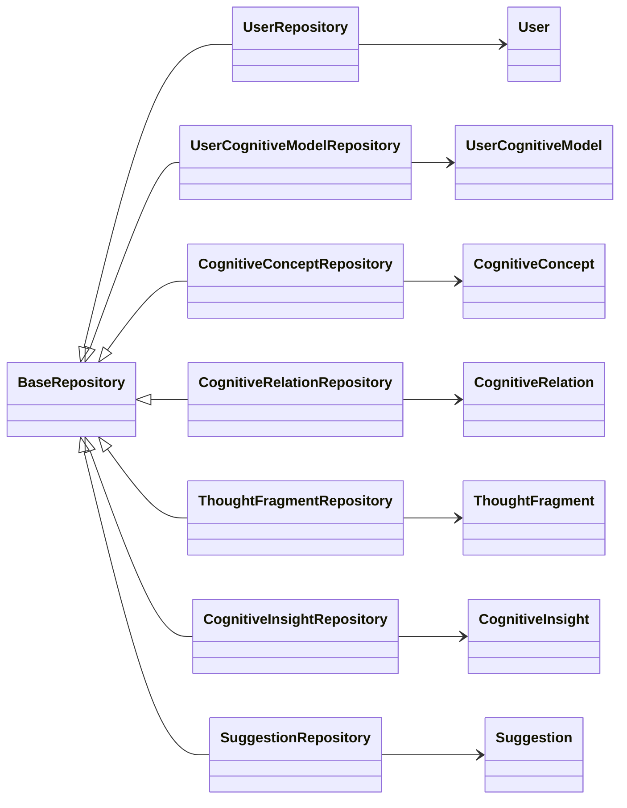

# 仓库接口定义文档
#仓库接口 #DDD #持久化 #数据访问 #依赖注入

## 相关文档

- [领域模型设计](domain-model-design.md)：详细描述系统的领域模型
- [领域层设计](domain-layer-design.md)：详细描述领域层的设计
- [领域服务实现](domain-service-implementation.md)：详细描述领域服务的实现
- [应用层设计](application-layer-design.md)：详细描述应用层的设计
- [数据模型定义](../core-features/data-model-definition.md)：详细描述系统的数据模型

## 1. 文档概述

本文档定义了AI认知辅助系统的仓库接口设计，遵循了领域驱动设计和Clean Architecture原则。仓库接口作为领域层和基础设施层之间的桥梁，隐藏了底层持久化实现细节，使领域层能够专注于业务逻辑。

## 2. 仓库设计原则

### 2.1 核心设计理念
- **基于领域驱动设计**：每个聚合根对应一个仓库接口
- **接口抽象**：隐藏底层持久化实现细节，支持多种实现（内存、数据库等）
- **单一职责**：每个仓库只负责一个聚合根的持久化操作
- **领域语言**：仓库方法名应使用领域术语，反映业务意图
- **事务边界**：仓库接口不处理事务，事务由应用层控制

### 2.2 设计约束
- 仓库接口仅依赖领域模型，不依赖任何基础设施层组件
- 方法返回值应使用领域对象，而非原始数据类型
- 支持批量操作和分页查询
- 提供乐观锁机制支持
- 遵循 SOLID 原则，特别是依赖倒置原则

## 3. 核心仓库接口定义

### 3.1 基础仓库接口

```typescript
// src/domain/repositories/BaseRepository.ts

export interface BaseRepository<T, ID> {
  /**
   * 根据ID查找实体
   * @param id 实体ID
   * @returns 找到的实体或null
   */
  findById(id: ID): Promise<T | null>;

  /**
   * 查找所有实体
   * @returns 实体列表
   */
  findAll(): Promise<T[]>;

  /**
   * 保存实体（新增或更新）
   * @param entity 要保存的实体
   * @returns 保存后的实体
   */
  save(entity: T): Promise<T>;

  /**
   * 批量保存实体
   * @param entities 要保存的实体列表
   * @returns 保存后的实体列表
   */
  saveAll(entities: T[]): Promise<T[]>;

  /**
   * 根据ID删除实体
   * @param id 实体ID
   * @returns 是否删除成功
   */
  deleteById(id: ID): Promise<boolean>;

  /**
   * 删除实体
   * @param entity 要删除的实体
   * @returns 是否删除成功
   */
  delete(entity: T): Promise<boolean>;

  /**
   * 批量删除实体
   * @param entities 要删除的实体列表
   * @returns 删除的数量
   */
  deleteAll(entities: T[]): Promise<number>;

  /**
   * 统计实体数量
   * @returns 实体数量
   */
  count(): Promise<number>;

  /**
   * 检查实体是否存在
   * @param id 实体ID
   * @returns 是否存在
   */
  existsById(id: ID): Promise<boolean>;
}
```

### 3.2 用户仓库接口

```typescript
// src/domain/repositories/UserRepository.ts

import { User } from '../entities/User';
import { BaseRepository } from './BaseRepository';
import { Email } from '../value-objects/Email';

export interface UserRepository extends BaseRepository<User, string> {
  /**
   * 根据邮箱查找用户
   * @param email 用户邮箱
   * @returns 找到的用户或null
   */
  findByEmail(email: Email): Promise<User | null>;

  /**
   * 根据用户名查找用户
   * @param username 用户名
   * @returns 找到的用户或null
   */
  findByUsername(username: string): Promise<User | null>;

  /**
   * 检查邮箱是否已存在
   * @param email 用户邮箱
   * @returns 是否存在
   */
  existsByEmail(email: Email): Promise<boolean>;

  /**
   * 检查用户名是否已存在
   * @param username 用户名
   * @returns 是否存在
   */
  existsByUsername(username: string): Promise<boolean>;

  /**
   * 根据创建时间范围查找用户
   * @param startDate 开始时间
   * @param endDate 结束时间
   * @returns 用户列表
   */
  findByCreatedAtBetween(startDate: Date, endDate: Date): Promise<User[]>;
}
```

### 3.3 用户认知模型仓库接口

```typescript
// src/domain/repositories/UserCognitiveModelRepository.ts

import { UserCognitiveModel } from '../entities/UserCognitiveModel';
import { BaseRepository } from './BaseRepository';

export interface UserCognitiveModelRepository extends BaseRepository<UserCognitiveModel, string> {
  /**
   * 根据用户ID查找认知模型
   * @param userId 用户ID
   * @returns 认知模型列表
   */
  findByUserId(userId: string): Promise<UserCognitiveModel[]>;

  /**
   * 根据用户ID和模型名称查找认知模型
   * @param userId 用户ID
   * @param modelName 模型名称
   * @returns 找到的认知模型或null
   */
  findByUserIdAndModelName(userId: string, modelName: string): Promise<UserCognitiveModel | null>;

  /**
   * 查找用户的主认知模型
   * @param userId 用户ID
   * @returns 主认知模型或null
   */
  findPrimaryModelByUserId(userId: string): Promise<UserCognitiveModel | null>;

  /**
   * 根据模型健康状态查找认知模型
   * @param healthScore 健康分数阈值
   * @param isAbove 是否大于等于阈值
   * @returns 认知模型列表
   */
  findByHealthScore(healthScore: number, isAbove: boolean): Promise<UserCognitiveModel[]>;

  /**
   * 统计用户的认知模型数量
   * @param userId 用户ID
   * @returns 模型数量
   */
  countByUserId(userId: string): Promise<number>;
}
```

### 3.4 认知概念仓库接口

```typescript
// src/domain/repositories/CognitiveConceptRepository.ts

import { CognitiveConcept } from '../entities/CognitiveConcept';
import { BaseRepository } from './BaseRepository';
import { ConceptImportance } from '../value-objects/ConceptImportance';

export interface CognitiveConceptRepository extends BaseRepository<CognitiveConcept, string> {
  /**
   * 根据认知模型ID查找概念
   * @param modelId 认知模型ID
   * @returns 概念列表
   */
  findByModelId(modelId: string): Promise<CognitiveConcept[]>;

  /**
   * 根据认知模型ID和概念名称查找概念
   * @param modelId 认知模型ID
   * @param name 概念名称
   * @returns 找到的概念或null
   */
  findByModelIdAndName(modelId: string, name: string): Promise<CognitiveConcept | null>;

  /**
   * 根据重要性查找概念
   * @param modelId 认知模型ID
   * @param importance 重要性
   * @returns 概念列表
   */
  findByModelIdAndImportance(modelId: string, importance: ConceptImportance): Promise<CognitiveConcept[]>;

  /**
   * 查找认知模型中的核心概念（重要性高的概念）
   * @param modelId 认知模型ID
   * @param limit 限制数量
   * @returns 核心概念列表
   */
  findCoreConceptsByModelId(modelId: string, limit: number): Promise<CognitiveConcept[]>;

  /**
   * 统计认知模型中的概念数量
   * @param modelId 认知模型ID
   * @returns 概念数量
   */
  countByModelId(modelId: string): Promise<number>;

  /**
   * 批量根据ID查找概念
   * @param ids 概念ID列表
   * @returns 概念列表
   */
  findAllByIds(ids: string[]): Promise<CognitiveConcept[]>;
}
```

### 3.5 认知关系仓库接口

```typescript
// src/domain/repositories/CognitiveRelationRepository.ts

import { CognitiveRelation } from '../entities/CognitiveRelation';
import { BaseRepository } from './BaseRepository';
import { RelationStrength } from '../value-objects/RelationStrength';

export interface CognitiveRelationRepository extends BaseRepository<CognitiveRelation, string> {
  /**
   * 根据认知模型ID查找关系
   * @param modelId 认知模型ID
   * @returns 关系列表
   */
  findByModelId(modelId: string): Promise<CognitiveRelation[]>;

  /**
   * 根据源概念ID查找关系
   * @param sourceConceptId 源概念ID
   * @returns 关系列表
   */
  findBySourceConceptId(sourceConceptId: string): Promise<CognitiveRelation[]>;

  /**
   * 根据目标概念ID查找关系
   * @param targetConceptId 目标概念ID
   * @returns 关系列表
   */
  findByTargetConceptId(targetConceptId: string): Promise<CognitiveRelation[]>;

  /**
   * 查找两个概念之间的关系
   * @param sourceConceptId 源概念ID
   * @param targetConceptId 目标概念ID
   * @returns 找到的关系或null
   */
  findBySourceAndTarget(sourceConceptId: string, targetConceptId: string): Promise<CognitiveRelation | null>;

  /**
   * 根据强度查找关系
   * @param modelId 认知模型ID
   * @param strength 强度
   * @returns 关系列表
   */
  findByModelIdAndStrength(modelId: string, strength: RelationStrength): Promise<CognitiveRelation[]>;

  /**
   * 统计认知模型中的关系数量
   * @param modelId 认知模型ID
   * @returns 关系数量
   */
  countByModelId(modelId: string): Promise<number>;

  /**
   * 删除概念相关的所有关系
   * @param conceptId 概念ID
   * @returns 删除的关系数量
   */
  deleteByConceptId(conceptId: string): Promise<number>;
}
```

### 3.6 思想片段仓库接口

```typescript
// src/domain/repositories/ThoughtFragmentRepository.ts

import { ThoughtFragment } from '../entities/ThoughtFragment';
import { BaseRepository } from './BaseRepository';
import { ThoughtType } from '../value-objects/ThoughtType';

export interface ThoughtFragmentRepository extends BaseRepository<ThoughtFragment, string> {
  /**
   * 根据用户ID查找思想片段
   * @param userId 用户ID
   * @returns 思想片段列表
   */
  findByUserId(userId: string): Promise<ThoughtFragment[]>;

  /**
   * 根据认知模型ID查找思想片段
   * @param modelId 认知模型ID
   * @returns 思想片段列表
   */
  findByModelId(modelId: string): Promise<ThoughtFragment[]>;

  /**
   * 根据类型查找思想片段
   * @param userId 用户ID
   * @param type 思想类型
   * @returns 思想片段列表
   */
  findByUserIdAndType(userId: string, type: ThoughtType): Promise<ThoughtFragment[]>;

  /**
   * 根据创建时间范围查找思想片段
   * @param userId 用户ID
   * @param startDate 开始时间
   * @param endDate 结束时间
   * @returns 思想片段列表
   */
  findByUserIdAndCreatedAtBetween(
    userId: string,
    startDate: Date,
    endDate: Date
  ): Promise<ThoughtFragment[]>;

  /**
   * 分页查找用户的思想片段
   * @param userId 用户ID
   * @param page 页码
   * @param limit 每页数量
   * @returns 思想片段列表和总数量
   */
  findByUserIdPaginated(userId: string, page: number, limit: number): Promise<{
    items: ThoughtFragment[];
    total: number;
  }>;

  /**
   * 统计用户的思想片段数量
   * @param userId 用户ID
   * @returns 思想片段数量
   */
  countByUserId(userId: string): Promise<number>;
}
```

### 3.7 认知洞察仓库接口

```typescript
// src/domain/repositories/CognitiveInsightRepository.ts

import { CognitiveInsight } from '../entities/CognitiveInsight';
import { BaseRepository } from './BaseRepository';
import { InsightSeverity } from '../value-objects/InsightSeverity';

export interface CognitiveInsightRepository extends BaseRepository<CognitiveInsight, string> {
  /**
   * 根据认知模型ID查找洞察
   * @param modelId 认知模型ID
   * @returns 洞察列表
   */
  findByModelId(modelId: string): Promise<CognitiveInsight[]>;

  /**
   * 根据严重程度查找洞察
   * @param modelId 认知模型ID
   * @param severity 严重程度
   * @returns 洞察列表
   */
  findByModelIdAndSeverity(modelId: string, severity: InsightSeverity): Promise<CognitiveInsight[]>;

  /**
   * 查找未解决的洞察
   * @param modelId 认知模型ID
   * @returns 未解决的洞察列表
   */
  findUnresolvedByModelId(modelId: string): Promise<CognitiveInsight[]>;

  /**
   * 查找已解决的洞察
   * @param modelId 认知模型ID
   * @returns 已解决的洞察列表
   */
  findResolvedByModelId(modelId: string): Promise<CognitiveInsight[]>;

  /**
   * 分页查找认知模型的洞察
   * @param modelId 认知模型ID
   * @param page 页码
   * @param limit 每页数量
   * @returns 洞察列表和总数量
   */
  findByModelIdPaginated(modelId: string, page: number, limit: number): Promise<{
    items: CognitiveInsight[];
    total: number;
  }>;

  /**
   * 统计认知模型中的洞察数量
   * @param modelId 认知模型ID
   * @returns 洞察数量
   */
  countByModelId(modelId: string): Promise<number>;
}
```

### 3.8 建议仓库接口

```typescript
// src/domain/repositories/SuggestionRepository.ts

import { Suggestion } from '../entities/Suggestion';
import { BaseRepository } from './BaseRepository';
import { SuggestionPriority } from '../value-objects/SuggestionPriority';

export interface SuggestionRepository extends BaseRepository<Suggestion, string> {
  /**
   * 根据认知模型ID查找建议
   * @param modelId 认知模型ID
   * @returns 建议列表
   */
  findByModelId(modelId: string): Promise<Suggestion[]>;

  /**
   * 根据优先级查找建议
   * @param modelId 认知模型ID
   * @param priority 优先级
   * @returns 建议列表
   */
  findByModelIdAndPriority(modelId: string, priority: SuggestionPriority): Promise<Suggestion[]>;

  /**
   * 查找未处理的建议
   * @param modelId 认知模型ID
   * @returns 未处理的建议列表
   */
  findUntreatedByModelId(modelId: string): Promise<Suggestion[]>;

  /**
   * 查找已处理的建议
   * @param modelId 认知模型ID
   * @returns 已处理的建议列表
   */
  findTreatedByModelId(modelId: string): Promise<Suggestion[]>;

  /**
   * 分页查找认知模型的建议
   * @param modelId 认知模型ID
   * @param page 页码
   * @param limit 每页数量
   * @returns 建议列表和总数量
   */
  findByModelIdPaginated(modelId: string, page: number, limit: number): Promise<{
    items: Suggestion[];
    total: number;
  }>;

  /**
   * 统计认知模型中的建议数量
   * @param modelId 认知模型ID
   * @returns 建议数量
   */
  countByModelId(modelId: string): Promise<number>;
}
```

## 4. 仓库接口实现注意事项

### 4.1 实现类型

#### 4.1.1 内存实现
- 用于测试和开发环境
- 数据存储在内存中，应用重启后数据丢失
- 实现简单，无需外部依赖
- 适合快速原型开发和单元测试

#### 4.1.2 数据库实现
- 用于生产环境
- 数据持久化到数据库（SQLite → Qdrant）
- 需要处理数据库连接、事务和查询优化
- 应使用 ORM 或查询构建器简化开发

### 4.2 实现约束

1. **依赖限制**：
   - 数据库实现可依赖 ORM 框架（如 TypeORM）
   - 可依赖数据库连接池和查询优化工具
   - 不可依赖其他基础设施组件（如 Redis、消息队列等）

2. **性能考虑**：
   - 实现批量操作以提高性能
   - 为常用查询添加索引
   - 实现缓存机制减少数据库访问
   - 支持分页查询避免大量数据加载

3. **事务处理**：
   - 仓库方法应支持事务上下文
   - 实现乐观锁机制处理并发更新
   - 确保数据一致性和完整性

4. **错误处理**：
   - 捕获并转换底层数据库异常为领域异常
   - 提供详细的错误信息
   - 确保错误信息不泄露敏感数据

## 5. 仓库接口依赖关系



## 6. 仓库接口使用示例

### 6.1 在应用服务中使用仓库

```typescript
// src/application/services/CognitiveModelApplicationService.ts

import { inject, injectable } from 'tsyringe';
import { UserCognitiveModelRepository } from '../../domain/repositories/UserCognitiveModelRepository';
import { CognitiveModelService } from '../../domain/services/CognitiveModelService';
import { UserCognitiveModel } from '../../domain/entities/UserCognitiveModel';

@injectable()
export class CognitiveModelApplicationService {
  constructor(
    @inject('UserCognitiveModelRepository')
    private readonly cognitiveModelRepository: UserCognitiveModelRepository,
    
    private readonly cognitiveModelService: CognitiveModelService
  ) {}

  async createModel(userId: string, modelName: string): Promise<UserCognitiveModel> {
    // 创建认知模型
    const model = UserCognitiveModel.create(userId, modelName);
    
    // 使用领域服务验证模型
    this.cognitiveModelService.validateModel(model);
    
    // 使用仓库保存模型
    return this.cognitiveModelRepository.save(model);
  }

  async getModelById(modelId: string): Promise<UserCognitiveModel | null> {
    return this.cognitiveModelRepository.findById(modelId);
  }

  // 其他方法...
}
```

### 6.2 仓库依赖注入配置

```typescript
// src/infrastructure/dependency-injection.ts

import { container } from 'tsyringe';
import { UserRepository } from '../domain/repositories/UserRepository';
import { UserCognitiveModelRepository } from '../domain/repositories/UserCognitiveModelRepository';
import { CognitiveConceptRepository } from '../domain/repositories/CognitiveConceptRepository';
// 其他仓库导入...

import { UserRepositoryImpl } from './repositories/UserRepositoryImpl';
import { UserCognitiveModelRepositoryImpl } from './repositories/UserCognitiveModelRepositoryImpl';
import { CognitiveConceptRepositoryImpl } from './repositories/CognitiveConceptRepositoryImpl';
// 其他仓库实现导入...

// 注册仓库实现
container.register<UserRepository>('UserRepository', { useClass: UserRepositoryImpl });
container.register<UserCognitiveModelRepository>('UserCognitiveModelRepository', { useClass: UserCognitiveModelRepositoryImpl });
container.register<CognitiveConceptRepository>('CognitiveConceptRepository', { useClass: CognitiveConceptRepositoryImpl });
// 其他仓库注册...
```

## 7. 仓库接口演进策略

### 7.1 版本控制
- 仓库接口变更应遵循语义化版本控制
- 新增方法时保持向后兼容
- 不推荐修改现有方法签名，如需修改应创建新方法

### 7.2 扩展机制
- 使用接口继承扩展现有仓库接口
- 支持通过装饰器添加横切关注点（如日志、缓存）
- 提供适配器模式支持不同数据库实现

### 7.3 测试策略
- 为每个仓库接口编写单元测试
- 使用内存实现进行快速测试
- 使用数据库实现进行集成测试
- 测试覆盖所有核心方法和边界情况

## 8. 总结

本文档定义了 AI 认知辅助系统的仓库接口设计，遵循了领域驱动设计和 Clean Architecture 原则。仓库接口作为领域层和基础设施层之间的桥梁，隐藏了底层持久化实现细节，使领域层能够专注于业务逻辑。

通过清晰的仓库接口设计，可以实现：
- 领域模型与持久化机制的解耦
- 支持多种持久化实现的切换
- 便于单元测试和集成测试
- 提高系统的可维护性和可扩展性
- 促进团队协作和代码复用

仓库接口设计是系统架构的重要组成部分，对系统的长期演进和维护具有重要影响。在实现过程中，应严格遵循设计原则和约束，确保接口的质量和一致性。