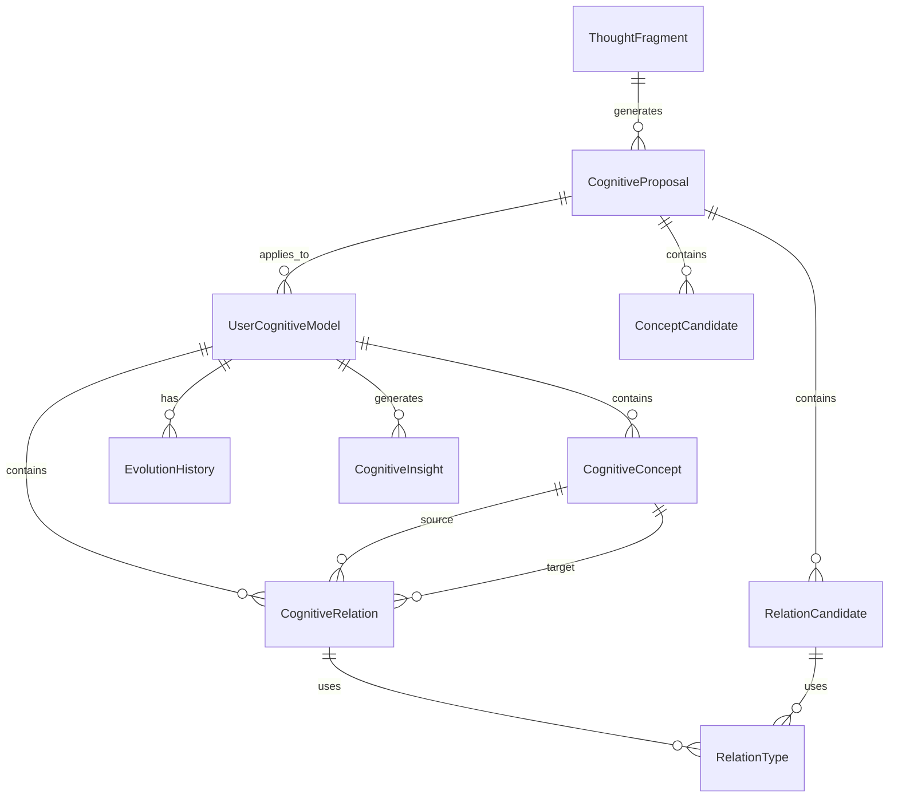

# Day 04: 对象关系图设计 - 代码实现文档

## 1. 核心对象关系概述

### 1.1 关系类型定义

**关系类型枚举**：
```typescript
// src/domain/value-objects/RelationType.ts
export enum RelationType {
  /**
   * 依赖关系：A依赖于B
   */
  DEPENDS_ON = 'depends_on',
  
  /**
   * 泛化关系：A是B的泛化（A包含B）
   */
  GENERALIZES = 'generalizes',
  
  /**
   * 矛盾关系：A与B矛盾
   */
  CONTRADICTS = 'contradicts',
  
  /**
   * 是一种关系：A是B的一种
   */
  IS_A = 'is_a',
  
  /**
   * 相关关系：A与B相关
   */
  RELATED_TO = 'related_to'
}
```

### 1.2 关系基数定义

| 关系类型 | 基数表示 | 含义 |
|---------|---------|------|
| 一对一 | 1:1 | 一个实体实例对应另一个实体实例 |
| 一对多 | 1:N | 一个实体实例对应多个实体实例 |
| 多对多 | M:N | 多个实体实例对应多个实体实例 |

## 2. 对象关系图设计

### 2.1 完整关系图



### 2.2 关系说明

| 关系 | 类型 | 基数 | 描述 |
|-----|------|------|------|
| UserCognitiveModel - CognitiveConcept | 组合 | 1:N | 一个认知模型包含多个概念，概念不能独立于模型存在 |
| UserCognitiveModel - CognitiveRelation | 组合 | 1:N | 一个认知模型包含多个关系，关系不能独立于模型存在 |
| UserCognitiveModel - EvolutionHistory | 聚合 | 1:N | 一个认知模型有多个演化历史记录，历史记录不能独立于模型存在 |
| UserCognitiveModel - CognitiveInsight | 生成 | 1:N | 一个认知模型生成多个认知洞察，洞察可以独立于模型存在 |
| ThoughtFragment - CognitiveProposal | 生成 | 1:N | 一个思维片段生成多个认知建议，建议可以独立于思维片段存在 |
| CognitiveProposal - ConceptCandidate | 组合 | 1:N | 一个认知建议包含多个概念候选，候选不能独立于建议存在 |
| CognitiveProposal - RelationCandidate | 组合 | 1:N | 一个认知建议包含多个关系候选，候选不能独立于建议存在 |
| CognitiveConcept - CognitiveRelation | 关联 | N:M | 一个概念可以是多个关系的源或目标，一个关系有一个源概念和一个目标概念 |
| CognitiveRelation - RelationType | 使用 | N:1 | 多个关系可以使用同一个关系类型 |
| RelationCandidate - RelationType | 使用 | N:1 | 多个关系候选可以使用同一个关系类型 |
| CognitiveProposal - UserCognitiveModel | 应用 | N:1 | 多个认知建议可以应用到同一个认知模型 |

## 3. 关系实现代码示例

### 3.1 组合关系实现

**组合关系特点**：子实体不能独立于父实体存在，父实体删除时子实体也被删除。

**UserCognitiveModel 与 CognitiveConcept 组合关系实现**：
```typescript
// src/domain/entities/UserCognitiveModelImpl.ts
import { UserCognitiveModel } from './UserCognitiveModel';
import { CognitiveConcept } from './CognitiveConcept';
import { CognitiveRelation } from './CognitiveRelation';
import { EvolutionHistory } from '../value-objects/EvolutionHistory';
import { CognitiveProposal } from './CognitiveProposal';

export class UserCognitiveModelImpl implements UserCognitiveModel {
  constructor(
    public readonly id: string,
    public readonly userId: string,
    private _concepts: CognitiveConcept[] = [],
    private _relations: CognitiveRelation[] = [],
    private _evolutionHistory: EvolutionHistory[] = [],
    public readonly createdAt: Date = new Date(),
    public readonly updatedAt: Date = new Date()
  ) {}
  
  /**
   * 获取概念列表（只读，外部无法直接修改）
   */
  get concepts(): CognitiveConcept[] {
    // 返回概念列表的副本，防止外部直接修改
    return [...this._concepts];
  }
  
  /**
   * 获取关系列表（只读，外部无法直接修改）
   */
  get relations(): CognitiveRelation[] {
    // 返回关系列表的副本，防止外部直接修改
    return [...this._relations];
  }
  
  /**
   * 获取演化历史（只读，外部无法直接修改）
   */
  get evolutionHistory(): EvolutionHistory[] {
    // 返回演化历史的副本，防止外部直接修改
    return [...this._evolutionHistory];
  }
  
  /**
   * 添加概念（组合关系：概念不能独立存在）
   */
  addConcept(concept: CognitiveConcept): void {
    // 验证概念不存在
    const existingConcept = this._concepts.find(c => c.id === concept.id);
    if (existingConcept) {
      throw new Error(`Concept with id ${concept.id} already exists`);
    }
    
    // 添加概念到内部列表
    this._concepts.push(concept);
    
    // 更新时间戳
    this._updateTimestamp();
  }
  
  /**
   * 移除概念（组合关系：同时移除相关关系）
   */
  removeConcept(conceptId: string): void {
    // 移除概念
    const conceptIndex = this._concepts.findIndex(c => c.id === conceptId);
    if (conceptIndex === -1) {
      throw new Error(`Concept with id ${conceptId} not found`);
    }
    this._concepts.splice(conceptIndex, 1);
    
    // 移除与该概念相关的所有关系
    this._relations = this._relations.filter(
      r => r.sourceConceptId !== conceptId && r.targetConceptId !== conceptId
    );
    
    // 更新时间戳
    this._updateTimestamp();
  }
  
  /**
   * 私有方法：更新时间戳
   */
  private _updateTimestamp(): void {
    // 注意：在不可变设计中，应返回新实例，这里为了简化演示使用了可变设计
    (this as any).updatedAt = new Date();
  }
  
  // 其他方法实现...
}
```

### 3.2 关联关系实现

**关联关系特点**：实体之间通过属性关联，可以独立存在。

**CognitiveRelation 与 CognitiveConcept 关联关系实现**：
```typescript
// src/domain/entities/CognitiveRelationImpl.ts
import { CognitiveRelation } from './CognitiveRelation';
import { RelationType } from '../value-objects/RelationType';

export class CognitiveRelationImpl implements CognitiveRelation {
  constructor(
    public readonly id: string,
    public readonly sourceConceptId: string,
    public readonly targetConceptId: string,
    public readonly relationType: RelationType,
    public readonly confidenceScore: number,
    public readonly createdAt: Date = new Date(),
    public readonly updatedAt: Date = new Date()
  ) {
    // 验证源概念和目标概念不能相同
    if (sourceConceptId === targetConceptId) {
      throw new Error('Source and target concept IDs cannot be the same');
    }
    
    // 验证置信度范围
    if (confidenceScore < 0 || confidenceScore > 1) {
      throw new Error('Confidence score must be between 0 and 1');
    }
  }
  
  // 其他方法实现...
}
```

### 3.3 生成关系实现

**生成关系特点**：一个实体生成另一个实体，生成的实体可以独立存在。

**ThoughtFragment 与 CognitiveProposal 生成关系实现**：
```typescript
// src/domain/entities/CognitiveProposalImpl.ts
import { CognitiveProposal } from './CognitiveProposal';
import { ConceptCandidate } from '../value-objects/ConceptCandidate';
import { RelationCandidate } from '../value-objects/RelationCandidate';

export class CognitiveProposalImpl implements CognitiveProposal {
  constructor(
    public readonly id: string,
    public readonly thoughtId: string, // 关联的思维片段ID
    public readonly concepts: ConceptCandidate[],
    public readonly relations: RelationCandidate[],
    public readonly confidence: number,
    public readonly reasoningTrace: string[],
    public readonly createdAt: Date = new Date()
  ) {
    // 验证思维片段ID不能为空
    if (!thoughtId) {
      throw new Error('Thought ID cannot be empty');
    }
    
    // 验证置信度范围
    if (confidence < 0 || confidence > 1) {
      throw new Error('Confidence must be between 0 and 1');
    }
  }
  
  // 其他方法实现...
}
```

## 4. 关系约束验证

### 4.1 关系一致性验证

```typescript
// src/domain/services/CognitiveModelServiceImpl.ts
import { CognitiveModelService } from './CognitiveModelService';
import { UserCognitiveModel } from '../entities/UserCognitiveModel';
import { CognitiveProposal } from '../entities/CognitiveProposal';
import { CognitiveInsight } from '../entities/CognitiveInsight';
import { CognitiveRelation } from '../entities/CognitiveRelation';
import { RelationType } from '../value-objects/RelationType';

export class CognitiveModelServiceImpl implements CognitiveModelService {
  validateProposal(proposal: CognitiveProposal): boolean {
    // 1. 验证建议的置信度
    if (proposal.confidence < 0.5) {
      return false;
    }
    
    // 2. 验证建议包含至少一个概念或关系
    if (proposal.concepts.length === 0 && proposal.relations.length === 0) {
      return false;
    }
    
    // 3. 验证关系候选的源和目标概念不同
    for (const relation of proposal.relations) {
      if (relation.sourceSemanticIdentity === relation.targetSemanticIdentity) {
        return false;
      }
    }
    
    return true;
  }
  
  maintainConsistency(model: UserCognitiveModel): void {
    // 1. 检测并移除冲突关系
    const conflicts = this._detectConflicts(model.relations);
    conflicts.forEach(conflict => {
      model.removeRelation(conflict.id);
    });
    
    // 2. 确保关系指向存在的概念
    this._validateRelationConcepts(model);
    
    // 3. 确保概念层次结构的正确性
    this._validateConceptHierarchy(model);
  }
  
  /**
   * 私有方法：检测冲突关系
   */
  private _detectConflicts(relations: CognitiveRelation[]): CognitiveRelation[] {
    const conflicts: CognitiveRelation[] = [];
    const relationMap = new Map<string, CognitiveRelation[]>();
    
    // 按源和目标概念分组
    for (const relation of relations) {
      const key = `${relation.sourceConceptId}-${relation.targetConceptId}`;
      if (!relationMap.has(key)) {
        relationMap.set(key, []);
      }
      relationMap.get(key)!.push(relation);
    }
    
    // 检测冲突关系
    for (const [key, rels] of relationMap.entries()) {
      if (rels.length > 1) {
        // 存在多个关系，检测冲突类型
        const hasContradicts = rels.some(r => r.relationType === RelationType.CONTRADICTS);
        const hasOtherTypes = rels.some(r => r.relationType !== RelationType.CONTRADICTS);
        
        if (hasContradicts && hasOtherTypes) {
          // 存在矛盾关系和其他关系，移除置信度较低的关系
          const sortedRels = rels.sort((a, b) => b.confidenceScore - a.confidenceScore);
          // 保留置信度最高的关系，其余标记为冲突
          conflicts.push(...sortedRels.slice(1));
        }
      }
    }
    
    return conflicts;
  }
  
  /**
   * 私有方法：验证关系指向存在的概念
   */
  private _validateRelationConcepts(model: UserCognitiveModel): void {
    const conceptIds = new Set(model.concepts.map(c => c.id));
    
    // 检查所有关系的源和目标概念是否存在
    for (const relation of model.relations) {
      if (!conceptIds.has(relation.sourceConceptId) || !conceptIds.has(relation.targetConceptId)) {
        // 关系指向不存在的概念，移除该关系
        model.removeRelation(relation.id);
      }
    }
  }
  
  /**
   * 私有方法：验证概念层次结构
   */
  private _validateConceptHierarchy(model: UserCognitiveModel): void {
    // 实现概念层次结构验证逻辑
    // 例如：确保泛化关系不形成循环
  }
  
  generateInsight(model: UserCognitiveModel): CognitiveInsight {
    // 实现生成认知洞察的逻辑
    // ...
  }
}
```

## 5. 关系查询示例

### 5.1 查询概念的相关关系

```typescript
// src/domain/entities/UserCognitiveModelImpl.ts
// 添加查询方法
export class UserCognitiveModelImpl implements UserCognitiveModel {
  // 其他方法...
  
  /**
   * 查询与指定概念相关的所有关系
   * @param conceptId 概念ID
   * @returns 相关关系列表
   */
  getRelationsForConcept(conceptId: string): CognitiveRelation[] {
    return this._relations.filter(
      r => r.sourceConceptId === conceptId || r.targetConceptId === conceptId
    );
  }
  
  /**
   * 查询概念的父概念（通过IS_A或GENERALIZES关系）
   * @param conceptId 概念ID
   * @returns 父概念列表
   */
  getParentConcepts(conceptId: string): CognitiveConcept[] {
    const parentIds = new Set<string>();
    
    // 查找以该概念为目标的IS_A或GENERALIZES关系
    for (const relation of this._relations) {
      if (relation.targetConceptId === conceptId && 
          (relation.relationType === RelationType.IS_A || 
           relation.relationType === RelationType.GENERALIZES)) {
        parentIds.add(relation.sourceConceptId);
      }
    }
    
    // 返回对应的概念
    return this._concepts.filter(c => parentIds.has(c.id));
  }
  
  /**
   * 查询概念的子概念（通过IS_A或GENERALIZES关系）
   * @param conceptId 概念ID
   * @returns 子概念列表
   */
  getChildConcepts(conceptId: string): CognitiveConcept[] {
    const childIds = new Set<string>();
    
    // 查找以该概念为源的IS_A或GENERALIZES关系
    for (const relation of this._relations) {
      if (relation.sourceConceptId === conceptId && 
          (relation.relationType === RelationType.IS_A || 
           relation.relationType === RelationType.GENERALIZES)) {
        childIds.add(relation.targetConceptId);
      }
    }
    
    // 返回对应的概念
    return this._concepts.filter(c => childIds.has(c.id));
  }
}
```

## 6. 关系设计最佳实践

### 6.1 关系设计原则

1. **最小化关系数量**：只设计必要的关系，避免冗余
2. **明确关系类型**：使用清晰的关系类型定义，便于理解和维护
3. **确保关系一致性**：定期验证关系的一致性，避免无效关系
4. **使用适当的关系基数**：根据业务逻辑选择合适的基数
5. **考虑关系的方向性**：明确关系的方向，便于查询和理解

### 6.2 关系实现建议

1. **使用不可变设计**：关系修改时返回新的实体实例，便于跟踪变化
2. **实现关系验证**：在添加或修改关系时验证其合法性
3. **提供关系查询方法**：为实体添加便捷的关系查询方法
4. **使用枚举定义关系类型**：避免使用字符串常量，提高类型安全性
5. **记录关系变化历史**：在演化历史中记录关系的添加、修改和删除

### 6.3 可视化工具推荐

1. **Draw.io**：免费的在线UML绘图工具，支持导出多种格式
2. **Mermaid**：文本驱动的图表工具，便于版本控制
3. **PlantUML**：基于文本的UML绘图工具，支持多种图表类型
4. **Lucidchart**：在线协作绘图工具，适合团队使用

## 7. 总结

Day 04的核心任务是设计对象关系图，明确核心实体之间的关系。通过今天的实现，我们建立了清晰的实体关系模型，包括：

1. **完整的对象关系图**：展示了所有核心实体之间的关系
2. **关系类型定义**：使用枚举定义了5种关系类型
3. **关系实现示例**：包括组合关系、关联关系和生成关系的实现
4. **关系约束验证**：实现了关系一致性验证逻辑
5. **关系查询方法**：为实体添加了便捷的关系查询方法

这些设计确保了实体之间的关系清晰、一致，符合业务逻辑，为后续开发打下了坚实的基础。在后续的开发中，我们将基于这些关系设计实现具体的业务逻辑，包括Application层的用例和Infrastructure层的技术实现。