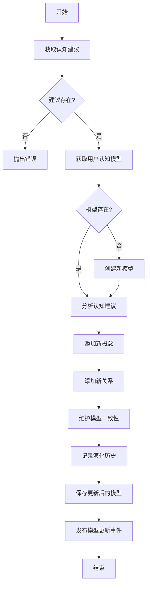

# Day 12: UpdateCognitiveModelUseCase实现 - 代码实现文档

## 1. UpdateCognitiveModelUseCase概述

### 1.1 功能描述

UpdateCognitiveModelUseCase是系统的核心用例之一，负责将AI生成的认知建议应用到用户的认知模型中。它的主要功能包括：

- 获取认知建议和用户的认知模型
- 分析认知建议中的概念和关系
- 将新概念和关系添加到认知模型中
- 维护认知模型的一致性
- 记录认知模型的演化历史
- 保存更新后的认知模型
- 触发事件通知其他模块

### 1.2 依赖关系

| 依赖项 | 类型 | 用途 |
|--------|------|------|
| `CognitiveProposalRepository` | 接口 | 负责获取认知建议 |
| `CognitiveModelRepository` | 接口 | 负责获取和保存认知模型 |
| `CognitiveModelService` | 接口 | 负责维护认知模型的一致性 |
| `EventBus` | 接口 | 负责事件的发布和订阅 |
| `InputValidator` | 服务 | 负责输入数据的验证 |
| `ErrorFactory` | 服务 | 负责创建标准化的错误对象 |

## 2. 认知模型更新逻辑

### 2.1 更新流程



### 2.2 核心算法

#### 2.2.1 概念匹配算法

```typescript
/**
 * 匹配概念，查找是否已存在相似概念
 * @param concept 新概念
 * @param existingConcepts 现有概念列表
 * @returns 匹配的概念或null
 */
function matchConcept(
  concept: ConceptCandidate,
  existingConcepts: CognitiveConcept[]
): CognitiveConcept | null {
  // 简单的语义标识匹配，可扩展为更复杂的相似度匹配
  return existingConcepts.find(
    existing => existing.semanticIdentity === concept.semanticIdentity
  ) || null;
}
```

#### 2.2.2 关系匹配算法

```typescript
/**
 * 匹配关系，查找是否已存在相同关系
 * @param relation 新关系
 * @param existingRelations 现有关系列表
 * @param concepts 现有概念列表
 * @returns 匹配的关系或null
 */
function matchRelation(
  relation: RelationCandidate,
  existingRelations: CognitiveRelation[],
  concepts: CognitiveConcept[]
): CognitiveRelation | null {
  // 查找源概念和目标概念
  const sourceConcept = concepts.find(
    concept => concept.semanticIdentity === relation.sourceSemanticIdentity
  );
  
  const targetConcept = concepts.find(
    concept => concept.semanticIdentity === relation.targetSemanticIdentity
  );
  
  if (!sourceConcept || !targetConcept) {
    return null;
  }
  
  // 查找相同的关系
  return existingRelations.find(
    existing => 
      existing.sourceConceptId === sourceConcept.id &&
      existing.targetConceptId === targetConcept.id &&
      existing.relationType === relation.relationType
  ) || null;
}
```

## 3. UpdateCognitiveModelUseCase实现

### 3.1 核心实现

```typescript
// src/application/usecases/UpdateCognitiveModelUseCaseImpl.ts
import { UpdateCognitiveModelUseCase } from './UpdateCognitiveModelUseCase';
import { CognitiveProposalRepository } from '../../domain/interfaces/CognitiveProposalRepository';
import { CognitiveModelRepository } from '../../domain/interfaces/CognitiveModelRepository';
import { CognitiveModelService } from '../../domain/interfaces/CognitiveModelService';
import { EventBus } from '../../domain/interfaces/EventBus';
import { InputValidator } from '../../shared/validators/InputValidator';
import { NotFoundError, ValidationError } from '../../shared/errors';
import { UserCognitiveModel } from '../../domain/entities/UserCognitiveModel';
import { CognitiveConcept } from '../../domain/entities/CognitiveConcept';
import { CognitiveRelation } from '../../domain/entities/CognitiveRelation';
import { EvolutionHistory } from '../../domain/value-objects/EvolutionHistory';
import { RelationType } from '../../domain/value-objects/RelationType';

/**
 * 更新认知模型用例的实现
 */
export class UpdateCognitiveModelUseCaseImpl implements UpdateCognitiveModelUseCase {
  /**
   * 构造函数，通过依赖注入获取所需的服务
   */
  constructor(
    private readonly cognitiveProposalRepository: CognitiveProposalRepository,
    private readonly cognitiveModelRepository: CognitiveModelRepository,
    private readonly cognitiveModelService: CognitiveModelService,
    private readonly eventBus: EventBus,
    private readonly inputValidator: InputValidator
  ) {}

  /**
   * 执行用例
   * @param proposalId 认知建议ID
   * @returns 更新后的认知模型
   * @throws ValidationError 如果输入数据无效
   * @throws NotFoundError 如果认知建议不存在
   * @throws Error 如果执行过程中发生其他错误
   */
  async execute(proposalId: string): Promise<UserCognitiveModel> {
    try {
      // 1. 验证输入数据
      if (!proposalId) {
        throw new ValidationError('INVALID_INPUT', 'proposalId is required');
      }

      // 2. 获取认知建议
      const proposal = await this.cognitiveProposalRepository.findById(proposalId);
      if (!proposal) {
        throw new NotFoundError(`Cognitive proposal with id ${proposalId} not found`);
      }

      // 3. 获取或创建用户认知模型
      let model = await this.cognitiveModelRepository.findByUserId('user-1'); // 假设当前用户ID为'user-1'
      let isNewModel = false;
      
      if (!model) {
        // 创建新的认知模型
        model = new UserCognitiveModel(
          crypto.randomUUID(),
          'user-1',
          [],
          [],
          []
        );
        isNewModel = true;
      }

      // 4. 分析认知建议，更新认知模型
      const evolutionHistory: EvolutionHistory[] = [];
      
      // 4.1 添加新概念
      for (const conceptCandidate of proposal.concepts) {
        // 检查概念是否已存在
        const existingConcept = model.concepts.find(
          c => c.semanticIdentity === conceptCandidate.semanticIdentity
        );
        
        if (!existingConcept) {
          // 创建新概念
          const newConcept = new CognitiveConcept(
            crypto.randomUUID(),
            conceptCandidate.semanticIdentity,
            conceptCandidate.abstractionLevel,
            conceptCandidate.confidenceScore,
            conceptCandidate.description
          );
          
          // 添加到模型
          model.addConcept(newConcept);
          
          // 记录演化历史
          evolutionHistory.push({
            timestamp: new Date(),
            changeType: 'add',
            conceptId: newConcept.id,
            description: `Added concept: ${newConcept.semanticIdentity}`
          });
        }
      }
      
      // 4.2 添加新关系
      for (const relationCandidate of proposal.relations) {
        // 查找源概念和目标概念
        const sourceConcept = model.concepts.find(
          c => c.semanticIdentity === relationCandidate.sourceSemanticIdentity
        );
        
        const targetConcept = model.concepts.find(
          c => c.semanticIdentity === relationCandidate.targetSemanticIdentity
        );
        
        if (sourceConcept && targetConcept) {
          // 检查关系是否已存在
          const existingRelation = model.relations.find(
            r => 
              r.sourceConceptId === sourceConcept.id &&
              r.targetConceptId === targetConcept.id &&
              r.relationType === relationCandidate.relationType
          );
          
          if (!existingRelation) {
            // 创建新关系
            const newRelation = new CognitiveRelation(
              crypto.randomUUID(),
              sourceConcept.id,
              targetConcept.id,
              relationCandidate.relationType,
              relationCandidate.confidenceScore
            );
            
            // 添加到模型
            model.addRelation(newRelation);
            
            // 记录演化历史
            evolutionHistory.push({
              timestamp: new Date(),
              changeType: 'add',
              relationId: newRelation.id,
              description: `Added relation: ${sourceConcept.semanticIdentity} ${relationCandidate.relationType} ${targetConcept.semanticIdentity}`
            });
          }
        }
      }

      // 5. 维护认知模型的一致性
      this.cognitiveModelService.maintainConsistency(model);

      // 6. 保存演化历史
      model.evolutionHistory.push(...evolutionHistory);

      // 7. 保存更新后的认知模型
      const savedModel = await this.cognitiveModelRepository.save(model);

      // 8. 发布模型更新事件
      this.eventBus.publish('CognitiveModelUpdated', {
        modelId: savedModel.id,
        userId: savedModel.userId,
        timestamp: new Date(),
        changes: evolutionHistory
      });

      // 9. 返回结果
      return savedModel;
    } catch (error) {
      // 处理错误
      if (error instanceof ValidationError || error instanceof NotFoundError) {
        throw error;
      }
      throw new Error(`Failed to update cognitive model: ${error.message}`);
    }
  }
}
```

### 3.2 UpdateCognitiveModelUseCase接口

```typescript
// src/application/usecases/UpdateCognitiveModelUseCase.ts
import { UserCognitiveModel } from '../../domain/entities/UserCognitiveModel';
import { UseCase } from './UseCase';

/**
 * 更新认知模型用例，用于将认知建议应用到用户认知模型中
 */
export interface UpdateCognitiveModelUseCase extends UseCase<string, UserCognitiveModel> {
  /**
   * 执行用例
   * @param proposalId 认知建议ID
   * @returns 更新后的认知模型
   */
  execute(proposalId: string): Promise<UserCognitiveModel>;
}
```

## 3. 认知模型服务实现

### 3.1 CognitiveModelService接口

```typescript
// src/domain/interfaces/CognitiveModelService.ts
import { UserCognitiveModel } from '../entities/UserCognitiveModel';
import { CognitiveProposal } from '../entities/CognitiveProposal';
import { CognitiveInsight } from '../entities/CognitiveInsight';

/**
 * 认知模型服务接口，负责认知模型的业务逻辑
 */
export interface CognitiveModelService {
  /**
   * 验证认知建议
   * @param proposal 认知建议
   * @returns 是否有效
   */
  validateProposal(proposal: CognitiveProposal): boolean;
  
  /**
   * 维护认知模型的一致性
   * @param model 认知模型
   */
  maintainConsistency(model: UserCognitiveModel): void;
  
  /**
   * 生成认知洞察
   * @param model 认知模型
   * @returns 认知洞察
   */
  generateInsight(model: UserCognitiveModel): CognitiveInsight;
}
```

### 3.2 CognitiveModelServiceImpl实现

```typescript
// src/domain/services/CognitiveModelServiceImpl.ts
import { CognitiveModelService } from '../interfaces/CognitiveModelService';
import { UserCognitiveModel } from '../entities/UserCognitiveModel';
import { CognitiveProposal } from '../entities/CognitiveProposal';
import { CognitiveInsight } from '../entities/CognitiveInsight';

/**
 * 认知模型服务实现
 */
export class CognitiveModelServiceImpl implements CognitiveModelService {
  /**
   * 验证认知建议
   */
  validateProposal(proposal: CognitiveProposal): boolean {
    // 简单的验证，检查概念和关系是否不为空
    return proposal.concepts.length > 0 || proposal.relations.length > 0;
  }
  
  /**
   * 维护认知模型的一致性
   */
  maintainConsistency(model: UserCognitiveModel): void {
    // 1. 检测并移除矛盾关系
    this.detectAndRemoveConflicts(model);
    
    // 2. 更新概念的置信度
    this.updateConceptConfidence(model);
    
    // 3. 确保关系的完整性
    this.ensureRelationIntegrity(model);
  }
  
  /**
   * 生成认知洞察
   */
  generateInsight(model: UserCognitiveModel): CognitiveInsight {
    // 简单的洞察生成，可扩展为更复杂的分析
    const coreThemes = this.extractCoreThemes(model);
    const blindSpots = this.identifyBlindSpots(model);
    const conceptGaps = this.findConceptGaps(model);
    
    return new CognitiveInsight(
      crypto.randomUUID(),
      model.id,
      coreThemes,
      blindSpots,
      conceptGaps,
      this.generateStructureSummary(model)
    );
  }
  
  /**
   * 检测并移除矛盾关系
   */
  private detectAndRemoveConflicts(model: UserCognitiveModel): void {
    // 查找矛盾关系
    const conflicts: string[] = [];
    
    // 简单的冲突检测，检查是否存在同一对概念的矛盾关系
    for (let i = 0; i < model.relations.length; i++) {
      const relation1 = model.relations[i];
      
      for (let j = i + 1; j < model.relations.length; j++) {
        const relation2 = model.relations[j];
        
        // 检查是否是同一对概念的相反关系
        const isSamePair = 
          (relation1.sourceConceptId === relation2.sourceConceptId && 
           relation1.targetConceptId === relation2.targetConceptId) ||
          (relation1.sourceConceptId === relation2.targetConceptId && 
           relation1.targetConceptId === relation2.sourceConceptId);
        
        // 检查是否是矛盾关系类型
        const isContradiction = 
          (relation1.relationType === 'depends_on' && relation2.relationType === 'contradicts') ||
          (relation1.relationType === 'contradicts' && relation2.relationType === 'depends_on');
        
        if (isSamePair && isContradiction) {
          // 保留置信度较高的关系
          if (relation1.confidenceScore >= relation2.confidenceScore) {
            conflicts.push(relation2.id);
          } else {
            conflicts.push(relation1.id);
          }
        }
      }
    }
    
    // 移除矛盾关系
    model.relations = model.relations.filter(r => !conflicts.includes(r.id));
  }
  
  /**
   * 更新概念的置信度
   */
  private updateConceptConfidence(model: UserCognitiveModel): void {
    // 根据关系数量和置信度更新概念的置信度
    for (const concept of model.concepts) {
      // 查找与该概念相关的所有关系
      const relatedRelations = model.relations.filter(
        r => r.sourceConceptId === concept.id || r.targetConceptId === concept.id
      );
      
      if (relatedRelations.length > 0) {
        // 计算平均置信度
        const avgConfidence = relatedRelations.reduce(
          (sum, r) => sum + r.confidenceScore, 0
        ) / relatedRelations.length;
        
        // 更新概念的置信度，取当前置信度和平均置信度的最大值
        concept.updateConfidence(Math.max(concept.confidenceScore, avgConfidence));
      }
    }
  }
  
  /**
   * 确保关系的完整性
   */
  private ensureRelationIntegrity(model: UserCognitiveModel): void {
    // 移除指向不存在概念的关系
    const conceptIds = new Set(model.concepts.map(c => c.id));
    
    model.relations = model.relations.filter(
      r => conceptIds.has(r.sourceConceptId) && conceptIds.has(r.targetConceptId)
    );
  }
  
  /**
   * 提取核心主题
   */
  private extractCoreThemes(model: UserCognitiveModel): string[] {
    // 简单的主题提取，返回置信度最高的5个概念
    return model.concepts
      .sort((a, b) => b.confidenceScore - a.confidenceScore)
      .slice(0, 5)
      .map(c => c.semanticIdentity);
  }
  
  /**
   * 识别思维盲点
   */
  private identifyBlindSpots(model: UserCognitiveModel): string[] {
    // 简单的盲点识别，返回关系较少的概念
    return model.concepts
      .filter(c => {
        const relationCount = model.relations.filter(
          r => r.sourceConceptId === c.id || r.targetConceptId === c.id
        ).length;
        return relationCount < 2;
      })
      .map(c => c.semanticIdentity)
      .slice(0, 3);
  }
  
  /**
   * 查找概念空洞
   */
  private findConceptGaps(model: UserCognitiveModel): string[] {
    // 简单的概念空洞查找，返回抽象级别较高但关系较少的概念
    return model.concepts
      .filter(c => c.abstractionLevel >= 4) // 高级概念
      .filter(c => {
        const relationCount = model.relations.filter(
          r => r.sourceConceptId === c.id || r.targetConceptId === c.id
        ).length;
        return relationCount < 3;
      })
      .map(c => c.semanticIdentity)
      .slice(0, 2);
  }
  
  /**
   * 生成结构摘要
   */
  private generateStructureSummary(model: UserCognitiveModel): string {
    // 生成简单的结构摘要
    const conceptCount = model.concepts.length;
    const relationCount = model.relations.length;
    const avgConfidence = model.concepts.reduce(
      (sum, c) => sum + c.confidenceScore, 0
    ) / conceptCount || 0;
    
    return `认知模型包含 ${conceptCount} 个概念和 ${relationCount} 个关系，平均置信度为 ${avgConfidence.toFixed(2)}。`;
  }
}
```

## 4. 数据持久化实现

### 4.1 CognitiveModelRepository实现

```typescript
// src/infrastructure/persistence/repositories/SQLiteCognitiveModelRepository.ts
import { BaseRepositoryImpl } from './BaseRepositoryImpl';
import { CognitiveModelRepository } from '../../../domain/interfaces/CognitiveModelRepository';
import { UserCognitiveModel } from '../../../domain/entities/UserCognitiveModel';
import { SQLiteConnection } from '../SQLiteConnection';
import { CognitiveConcept } from '../../../domain/entities/CognitiveConcept';
import { CognitiveRelation } from '../../../domain/entities/CognitiveRelation';
import { EvolutionHistory } from '../../../domain/value-objects/EvolutionHistory';

/**
 * SQLite认知模型仓库实现，继承自基础仓库实现
 */
export class SQLiteCognitiveModelRepository extends BaseRepositoryImpl<UserCognitiveModel, string> implements CognitiveModelRepository {
  /**
   * 构造函数
   * @param connection SQLite连接
   */
  constructor(connection: SQLiteConnection) {
    super(connection, 'cognitive_models');
  }

  /**
   * 根据用户ID查找认知模型
   */
  async findByUserId(userId: string): Promise<UserCognitiveModel | null> {
    const sql = `SELECT * FROM ${this.tableName} WHERE user_id = ?`;
    const rows = await this.connection.query(sql, [userId]);
    
    if (rows.length === 0) {
      return null;
    }
    
    return this.mapRowToEntity(rows[0]);
  }

  /**
   * 根据用户ID查找最新的认知模型
   */
  async findLatestByUserId(userId: string): Promise<UserCognitiveModel | null> {
    const sql = `SELECT * FROM ${this.tableName} WHERE user_id = ? ORDER BY created_at DESC LIMIT 1`;
    const rows = await this.connection.query(sql, [userId]);
    
    if (rows.length === 0) {
      return null;
    }
    
    return this.mapRowToEntity(rows[0]);
  }

  /**
   * 创建认知模型
   */
  protected async create(entity: UserCognitiveModel): Promise<UserCognitiveModel> {
    const sql = `
      INSERT INTO ${this.tableName} (id, user_id, concepts, relations, evolution_history, created_at, updated_at)
      VALUES (?, ?, ?, ?, ?, ?, ?)
    `;
    
    await this.connection.execute(sql, [
      entity.id,
      entity.userId,
      JSON.stringify(entity.concepts),
      JSON.stringify(entity.relations),
      JSON.stringify(entity.evolutionHistory),
      entity.createdAt.toISOString(),
      entity.updatedAt.toISOString()
    ]);
    
    return entity;
  }

  /**
   * 更新认知模型
   */
  protected async update(entity: UserCognitiveModel): Promise<UserCognitiveModel> {
    const sql = `
      UPDATE ${this.tableName} 
      SET concepts = ?, relations = ?, evolution_history = ?, updated_at = ? 
      WHERE id = ?
    `;
    
    await this.connection.execute(sql, [
      JSON.stringify(entity.concepts),
      JSON.stringify(entity.relations),
      JSON.stringify(entity.evolutionHistory),
      new Date().toISOString(),
      entity.id
    ]);
    
    return entity;
  }

  /**
   * 将数据库行映射为认知模型实体
   */
  protected mapRowToEntity(row: any): UserCognitiveModel {
    // 解析概念
    const concepts: CognitiveConcept[] = JSON.parse(row.concepts).map((c: any) => new CognitiveConcept(
      c.id,
      c.semanticIdentity,
      c.abstractionLevel,
      c.confidenceScore,
      c.description,
      new Date(c.createdAt),
      new Date(c.updatedAt)
    ));
    
    // 解析关系
    const relations: CognitiveRelation[] = JSON.parse(row.relations).map((r: any) => new CognitiveRelation(
      r.id,
      r.sourceConceptId,
      r.targetConceptId,
      r.relationType,
      r.confidenceScore,
      new Date(r.createdAt),
      new Date(r.updatedAt)
    ));
    
    // 解析演化历史
    const evolutionHistory: EvolutionHistory[] = JSON.parse(row.evolution_history);
    
    // 创建认知模型
    const model = new UserCognitiveModel(
      row.id,
      row.user_id,
      concepts,
      relations,
      evolutionHistory,
      new Date(row.created_at),
      new Date(row.updated_at)
    );
    
    return model;
  }
}
```

## 5. 事件触发机制

### 5.1 事件监听器实现

```typescript
// src/infrastructure/event-listeners/CognitiveModelUpdatedListener.ts
import { EventBus } from '../../domain/interfaces/EventBus';
import { GenerateInsightUseCase } from '../../application/usecases/GenerateInsightUseCase';

/**
 * 认知模型更新事件监听器，用于在认知模型更新后生成认知洞察
 */
export class CognitiveModelUpdatedListener {
  /**
   * 构造函数
   * @param eventBus 事件总线
   * @param generateInsightUseCase 生成认知洞察用例
   */
  constructor(
    eventBus: EventBus,
    private readonly generateInsightUseCase: GenerateInsightUseCase
  ) {
    // 订阅CognitiveModelUpdated事件
    eventBus.subscribe('CognitiveModelUpdated', this.handle.bind(this));
  }

  /**
   * 处理CognitiveModelUpdated事件
   * @param event 事件数据
   */
  private async handle(event: { modelId: string }): Promise<void> {
    try {
      // 调用生成认知洞察用例
      await this.generateInsightUseCase.execute(event.modelId);
    } catch (error) {
      console.error(`Error generating insight for model ${event.modelId}:`, error);
    }
  }
}
```

## 6. 单元测试设计

### 6.1 UpdateCognitiveModelUseCase测试

```typescript
// src/application/usecases/__tests__/UpdateCognitiveModelUseCaseImpl.test.ts
import { UpdateCognitiveModelUseCaseImpl } from '../UpdateCognitiveModelUseCaseImpl';
import { CognitiveModelService } from '../../../domain/interfaces/CognitiveModelService';
import { NotFoundError, ValidationError } from '../../../shared/errors';

// 模拟依赖
const mockCognitiveProposalRepository = {
  save: jest.fn(),
  findById: jest.fn(),
  findByThoughtId: jest.fn()
};

const mockCognitiveModelRepository = {
  save: jest.fn(),
  findById: jest.fn(),
  findByUserId: jest.fn(),
  findLatestByUserId: jest.fn()
};

const mockCognitiveModelService: jest.Mocked<CognitiveModelService> = {
  validateProposal: jest.fn(() => true),
  maintainConsistency: jest.fn(),
  generateInsight: jest.fn()
};

const mockEventBus = {
  subscribe: jest.fn(),
  publish: jest.fn()
};

const mockInputValidator = {
  validateThoughtInput: jest.fn(input => input)
};

describe('UpdateCognitiveModelUseCaseImpl', () => {
  let useCase: UpdateCognitiveModelUseCaseImpl;

  beforeEach(() => {
    // 重置模拟
    jest.clearAllMocks();
    // 创建Use Case实例
    useCase = new UpdateCognitiveModelUseCaseImpl(
      mockCognitiveProposalRepository,
      mockCognitiveModelRepository,
      mockCognitiveModelService,
      mockEventBus,
      mockInputValidator as any
    );
  });

  it('should update cognitive model correctly', async () => {
    // 准备测试数据
    const proposalId = 'proposal-1';
    const mockProposal = {
      id: proposalId,
      thoughtId: 'thought-1',
      concepts: [
        {
          semanticIdentity: 'test-concept',
          abstractionLevel: 3,
          confidenceScore: 0.8,
          description: 'Test concept'
        }
      ],
      relations: [],
      confidence: 0.9,
      reasoningTrace: ['reasoning'],
      createdAt: new Date()
    };

    const mockModel = {
      id: 'model-1',
      userId: 'user-1',
      concepts: [],
      relations: [],
      evolutionHistory: [],
      addConcept: jest.fn(),
      addRelation: jest.fn(),
      updateConcept: jest.fn(),
      updateRelation: jest.fn(),
      removeConcept: jest.fn(),
      removeRelation: jest.fn()
    };

    // 设置模拟返回值
    mockCognitiveProposalRepository.findById.mockResolvedValue(mockProposal as any);
    mockCognitiveModelRepository.findByUserId.mockResolvedValue(mockModel as any);
    mockCognitiveModelRepository.save.mockResolvedValue(mockModel as any);

    // 执行Use Case
    const result = await useCase.execute(proposalId);

    // 验证结果
    expect(result).toBeDefined();
    expect(mockCognitiveProposalRepository.findById).toHaveBeenCalledWith(proposalId);
    expect(mockCognitiveModelRepository.findByUserId).toHaveBeenCalled();
    expect(mockModel.addConcept).toHaveBeenCalled();
    expect(mockCognitiveModelService.maintainConsistency).toHaveBeenCalledWith(mockModel);
    expect(mockCognitiveModelRepository.save).toHaveBeenCalled();
    expect(mockEventBus.publish).toHaveBeenCalledWith('CognitiveModelUpdated', expect.any(Object));
  });

  it('should throw ValidationError for empty proposalId', async () => {
    // 执行Use Case并验证是否抛出错误
    await expect(useCase.execute('')).rejects.toThrow(ValidationError);
  });

  it('should throw NotFoundError for non-existent proposal', async () => {
    // 设置模拟返回null
    mockCognitiveProposalRepository.findById.mockResolvedValue(null);

    // 执行Use Case并验证是否抛出错误
    await expect(useCase.execute('non-existent-id')).rejects.toThrow(NotFoundError);
  });

  it('should create new model if not exists', async () => {
    // 准备测试数据
    const proposalId = 'proposal-1';
    const mockProposal = {
      id: proposalId,
      thoughtId: 'thought-1',
      concepts: [],
      relations: [],
      confidence: 0.9,
      reasoningTrace: ['reasoning'],
      createdAt: new Date()
    };

    // 设置模拟返回值
    mockCognitiveProposalRepository.findById.mockResolvedValue(mockProposal as any);
    mockCognitiveModelRepository.findByUserId.mockResolvedValue(null);
    mockCognitiveModelRepository.save.mockResolvedValue({} as any);

    // 执行Use Case
    await useCase.execute(proposalId);

    // 验证结果
    expect(mockCognitiveModelRepository.save).toHaveBeenCalled();
  });
});
```

## 7. API接口实现

### 7.1 控制器实现

```typescript
// src/presentation/controllers/CognitiveModelController.ts
import { FastifyRequest, FastifyReply } from 'fastify';
import { UpdateCognitiveModelUseCase } from '../../application/usecases/UpdateCognitiveModelUseCase';

/**
 * 认知模型控制器，处理与认知模型相关的HTTP请求
 */
export class CognitiveModelController {
  /**
   * 构造函数
   * @param updateCognitiveModelUseCase 更新认知模型用例
   */
  constructor(private readonly updateCognitiveModelUseCase: UpdateCognitiveModelUseCase) {} 

  /**
   * 处理POST /api/v1/models/update请求，用于更新认知模型
   * @param request Fastify请求对象
   * @param reply Fastify响应对象
   */
  async updateModel(request: FastifyRequest, reply: FastifyReply): Promise<void> {
    try {
      // 获取认知建议ID
      const { proposalId } = request.body as { proposalId: string };
      // 调用更新认知模型用例
      const result = await this.updateCognitiveModelUseCase.execute(proposalId);
      // 返回200 OK响应
      reply.status(200).send(result);
    } catch (error) {
      // 错误会被全局错误处理中间件捕获
      throw error;
    }
  }
}
```

### 7.2 路由配置

```typescript
// src/presentation/routes/cognitiveModelRoutes.ts
import { FastifyInstance } from 'fastify';
import { CognitiveModelController } from '../controllers/CognitiveModelController';

/**
 * 认知模型路由配置
 * @param app Fastify实例
 * @param cognitiveModelController 认知模型控制器
 */
export const cognitiveModelRoutes = (
  app: FastifyInstance,
  cognitiveModelController: CognitiveModelController
): void => {
  // 更新认知模型
  app.post('/api/v1/models/update', (request, reply) => 
    cognitiveModelController.updateModel(request, reply)
  );
};
```

### 7.3 应用初始化

```typescript
// src/presentation/app.ts
// 扩展createApp函数，添加认知模型相关的依赖和路由

export async function createApp(): Promise<ReturnType<typeof fastify>> {
  // ... 现有代码 ...

  // 创建认知模型服务
  const cognitiveModelService = new CognitiveModelServiceImpl();

  // 创建认知模型仓库
  const cognitiveModelRepository = new SQLiteCognitiveModelRepository(sqliteConnection);

  // 创建Use Case实例
  const updateCognitiveModelUseCase = new UpdateCognitiveModelUseCaseImpl(
    cognitiveProposalRepository,
    cognitiveModelRepository,
    cognitiveModelService,
    eventBus,
    inputValidator
  );

  // 创建控制器实例
  const cognitiveModelController = new CognitiveModelController(updateCognitiveModelUseCase);

  // 注册路由
  thoughtRoutes(app, thoughtController);
  cognitiveProposalRoutes(app, cognitiveProposalController);
  cognitiveModelRoutes(app, cognitiveModelController);

  return app;
}
```

## 8. 总结

Day 12的核心任务是实现UpdateCognitiveModelUseCase，这是系统中将AI生成的认知建议应用到用户认知模型的关键用例。通过今天的开发，我们完成了以下工作：

1. 设计了UpdateCognitiveModelUseCase的核心逻辑
2. 实现了认知模型更新流程，包括概念和关系的添加
3. 实现了认知模型服务，用于维护模型的一致性
4. 实现了认知模型的持久化
5. 添加了事件触发机制，在模型更新后通知其他模块
6. 编写了单元测试，验证Use Case的正确性
7. 实现了API接口

今天的实现遵循了Clean Architecture和DDD原则，确保了代码的可维护性、可扩展性和可测试性。我们使用了依赖注入模式，将Use Case与具体的实现细节解耦，使得系统更容易测试和扩展。

在后续的开发中，我们将继续实现GenerateInsightUseCase，用于从认知模型生成认知洞察，以及其他剩余的Use Case。