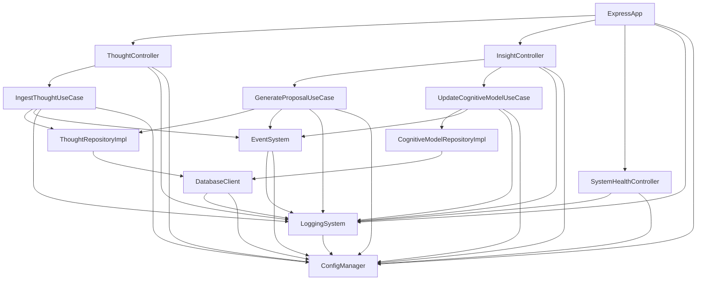
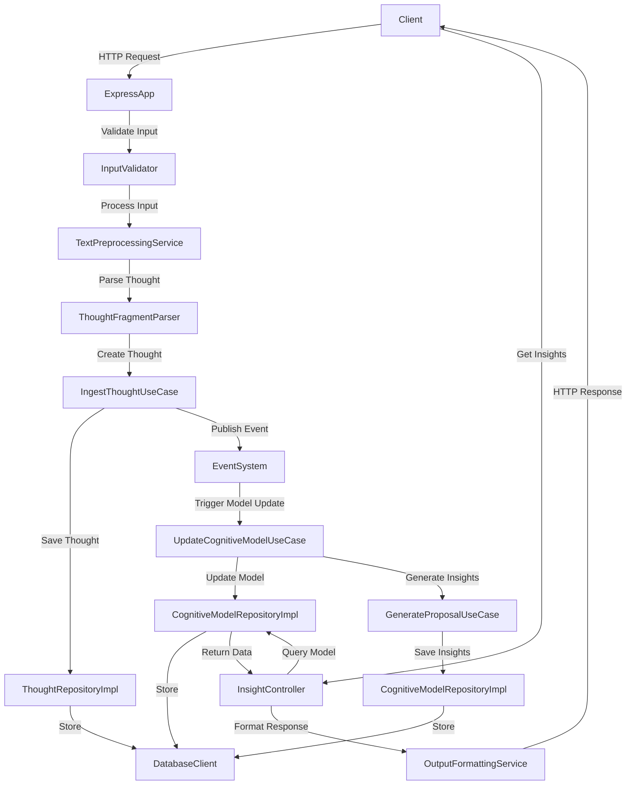

# Day 28: 第一阶段 - 系统地基期 - Week 4 - 第28天 代码实现

## 系统架构文档

```typescript
// src/documentation/SystemArchitecture.md

# 系统架构文档

## 1. 架构概述

本系统采用 Clean Architecture 设计原则，将系统分为四个主要层次：

- **Presentation Layer**：处理用户交互与展示
- **Application Layer**：实现业务逻辑与用例
- **Domain Layer**：定义核心业务模型与规则
- **Infrastructure Layer**：提供外部系统访问与技术实现

## 2. 分层结构

### 2.1 表示层（Presentation Layer）

**职责**：
- 处理 HTTP 请求与响应
- 实现 API 路由
- 输入验证与输出格式化
- 请求/响应日志记录

**核心组件**：
- `ExpressApp`：Express 应用配置与启动
- 各种控制器（`ThoughtController`、`InsightController`、`SystemHealthController`）
- 中间件（请求日志、错误处理、CORS）

### 2.2 应用层（Application Layer）

**职责**：
- 实现业务用例
- 协调领域对象与基础设施
- 管理事务与工作流
- 实现业务规则

**核心组件**：
- 用例（`IngestThoughtUseCase`、`GenerateProposalUseCase`、`UpdateCognitiveModelUseCase`）
- 服务（`ModelSummaryGenerator`、`CognitiveStructureVisualizationService`、`OutputFormattingService`）

### 2.3 领域层（Domain Layer）

**职责**：
- 定义核心业务对象
- 实现业务规则与约束
- 管理对象之间的关系
- 保持业务逻辑的完整性

**核心组件**：
- 实体（`UserCognitiveModel`、`CognitiveConcept`、`CognitiveRelation`、`ThoughtFragment`、`CognitiveInsight`）
- 领域服务（`CognitiveModelUpdateService`、`ConceptRelationProcessor`、`ModelConsistencyChecker`）
- 存储库接口（`ThoughtRepository`、`CognitiveModelRepository`）

### 2.4 基础设施层（Infrastructure Layer）

**职责**：
- 实现存储库接口
- 提供数据库访问
- 实现事件系统
- 提供日志记录
- 实现配置管理
- 提供系统监控

**核心组件**：
- 数据库客户端（`DatabaseClient`）
- 事件系统（`EventSystem`）
- 日志系统（`LoggingSystem`）
- 配置管理器（`ConfigManager`）
- 依赖注入容器（`SimpleDependencyContainer`）
- 系统启动器（`SystemBootstrapper`、`SystemIntegrator`）

## 3. 组件关系图



## 4. 数据流图



## 5. 技术栈

| 层次 | 技术 | 组件 |
|------|------|------|
| 表示层 | Express.js | ExpressApp、控制器、中间件 |
| 应用层 | TypeScript | 用例、服务 |
| 领域层 | TypeScript | 实体、领域服务、存储库接口 |
| 基础设施层 | SQLite | DatabaseClient |
| 基础设施层 | Node.js Events | EventSystem |
| 基础设施层 | Winston | LoggingSystem |
| 基础设施层 | 自定义实现 | ConfigManager、依赖注入容器 |
```