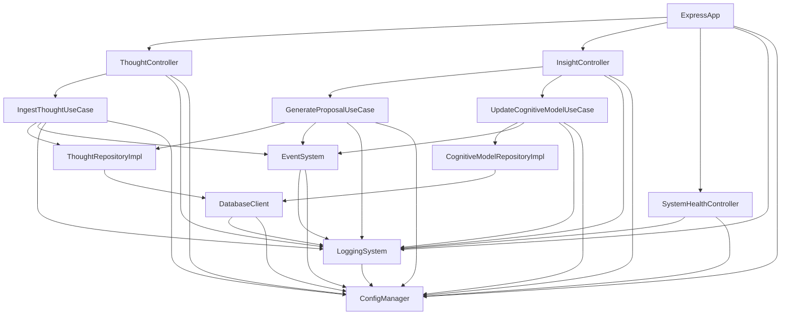
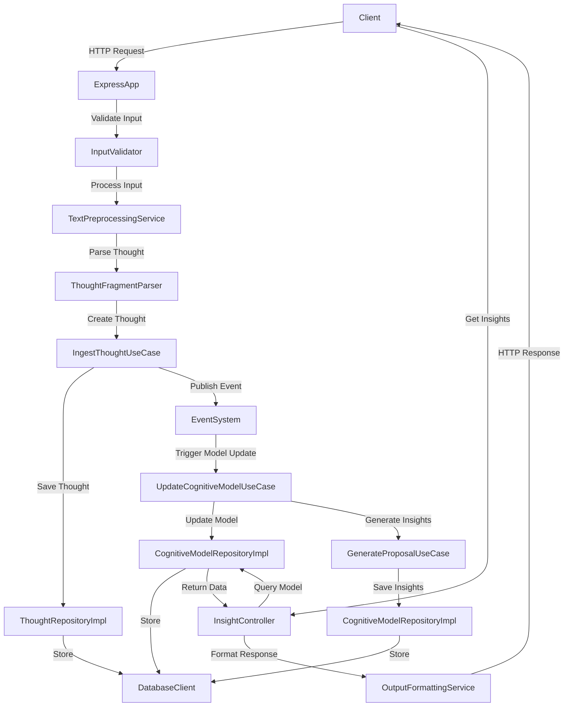

# Day 28: 第一阶段 - 系统地基期 - Week 4 - 第28天 代码实现

## 文档完善实现

### 1. 系统架构文档

```typescript
// src/documentation/SystemArchitecture.md

# 系统架构文档

## 1. 架构概述

本系统采用 Clean Architecture 设计原则，将系统分为四个主要层次：

- **Presentation Layer**：处理用户交互与展示
- **Application Layer**：实现业务逻辑与用例
- **Domain Layer**：定义核心业务模型与规则
- **Infrastructure Layer**：提供外部系统访问与技术实现

## 2. 分层结构

### 2.1 表示层（Presentation Layer）

**职责**：
- 处理 HTTP 请求与响应
- 实现 API 路由
- 输入验证与输出格式化
- 请求/响应日志记录

**核心组件**：
- `ExpressApp`：Express 应用配置与启动
- 各种控制器（`ThoughtController`、`InsightController`、`SystemHealthController`）
- 中间件（请求日志、错误处理、CORS）

### 2.2 应用层（Application Layer）

**职责**：
- 实现业务用例
- 协调领域对象与基础设施
- 管理事务与工作流
- 实现业务规则

**核心组件**：
- 用例（`IngestThoughtUseCase`、`GenerateProposalUseCase`、`UpdateCognitiveModelUseCase`）
- 服务（`ModelSummaryGenerator`、`CognitiveStructureVisualizationService`、`OutputFormattingService`）

### 2.3 领域层（Domain Layer）

**职责**：
- 定义核心业务对象
- 实现业务规则与约束
- 管理对象之间的关系
- 保持业务逻辑的完整性

**核心组件**：
- 实体（`UserCognitiveModel`、`CognitiveConcept`、`CognitiveRelation`、`ThoughtFragment`、`CognitiveInsight`）
- 领域服务（`CognitiveModelUpdateService`、`ConceptRelationProcessor`、`ModelConsistencyChecker`）
- 存储库接口（`ThoughtRepository`、`CognitiveModelRepository`）

### 2.4 基础设施层（Infrastructure Layer）

**职责**：
- 实现存储库接口
- 提供数据库访问
- 实现事件系统
- 提供日志记录
- 实现配置管理
- 提供系统监控

**核心组件**：
- 数据库客户端（`DatabaseClient`）
- 事件系统（`EventSystem`）
- 日志系统（`LoggingSystem`）
- 配置管理器（`ConfigManager`）
- 依赖注入容器（`SimpleDependencyContainer`）
- 系统启动器（`SystemBootstrapper`、`SystemIntegrator`）

## 3. 组件关系图



## 4. 数据流图



## 5. 技术栈

| 层次 | 技术 | 组件 |
|------|------|------|
| 表示层 | Express.js | ExpressApp、控制器、中间件 |
| 应用层 | TypeScript | 用例、服务 |
| 领域层 | TypeScript | 实体、领域服务、存储库接口 |
| 基础设施层 | SQLite | DatabaseClient |
| 基础设施层 | Node.js Events | EventSystem |
| 基础设施层 | Winston | LoggingSystem |
| 基础设施层 | 自定义实现 | ConfigManager、依赖注入容器 |
```

### 2. API 文档生成器

```typescript
// src/documentation/ApiDocumentationGenerator.ts

import { ExpressApp } from '../application/ExpressApp';
import { SystemComponents } from '../infrastructure/system/SystemIntegrator';
import { writeFileSync, mkdirSync } from 'fs';
import { join } from 'path';

/**
 * API 文档生成器配置
 */
export interface ApiDocumentationGeneratorConfig {
  outputPath: string;
  title: string;
  version: string;
  description: string;
}

/**
 * API 文档生成器
 */
export class ApiDocumentationGenerator {
  private readonly config: ApiDocumentationGeneratorConfig;
  private readonly components: SystemComponents;

  /**
   * 创建 API 文档生成器
   * @param components 系统组件
   * @param config 生成器配置
   */
  constructor(components: SystemComponents, config: ApiDocumentationGeneratorConfig) {
    this.components = components;
    this.config = {
      outputPath: './docs/api',
      title: 'AI 认知辅助系统 API',
      version: '1.0.0',
      description: 'AI 认知辅助系统的 RESTful API 文档',
      ...config,
    };
  }

  /**
   * 生成 API 文档
   */
  public generate(): void {
    try {
      // 创建输出目录
      mkdirSync(this.config.outputPath, { recursive: true });

      // 生成 OpenAPI 规范
      const openApiSpec = this.generateOpenApiSpec();
      const openApiPath = join(this.config.outputPath, 'openapi.json');
      writeFileSync(openApiPath, JSON.stringify(openApiSpec, null, 2));

      // 生成 Markdown 文档
      const markdownDocs = this.generateMarkdownDocs(openApiSpec);
      const markdownPath = join(this.config.outputPath, 'api.md');
      writeFileSync(markdownPath, markdownDocs);

      this.components.loggingSystem.logInfo('API documentation generated successfully', {
        outputPath: this.config.outputPath,
        files: ['openapi.json', 'api.md'],
      });
    } catch (error: any) {
      this.components.loggingSystem.logError('Failed to generate API documentation', error);
      throw error;
    }
  }

  /**
   * 生成 OpenAPI 规范
   */
  private generateOpenApiSpec(): any {
    return {
      openapi: '3.0.0',
      info: {
        title: this.config.title,
        version: this.config.version,
        description: this.config.description,
      },
      servers: [
        {
          url: 'http://localhost:3000',
          description: '开发环境',
        },
        {
          url: 'http://localhost:8080',
          description: '测试环境',
        },
        {
          url: 'https://api.example.com',
          description: '生产环境',
        },
      ],
      paths: {
        '/api/health': {
          get: {
            summary: '系统健康检查',
            description: '检查系统各组件的健康状态',
            responses: {
              '200': {
                description: '系统健康',
                content: {
                  'application/json': {
                    schema: {
                      type: 'object',
                      properties: {
                        status: {
                          type: 'string',
                          example: 'ok',
                        },
                        service: {
                          type: 'string',
                          example: 'ai-cognitive-assistant',
                        },
                        timestamp: {
                          type: 'string',
                          format: 'date-time',
                        },
                      },
                    },
                  },
                },
              },
              '503': {
                description: '系统不健康',
                content: {
                  'application/json': {
                    schema: {
                      type: 'object',
                      properties: {
                        status: {
                          type: 'string',
                          example: 'error',
                        },
                        service: {
                          type: 'string',
                          example: 'ai-cognitive-assistant',
                        },
                        timestamp: {
                          type: 'string',
                          format: 'date-time',
                        },
                        error: {
                          type: 'string',
                        },
                      },
                    },
                  },
                },
              },
            },
          },
        },
        '/api/thoughts': {
          get: {
            summary: '获取思维片段列表',
            description: '获取所有思维片段的列表，支持分页',
            parameters: [
              {
                name: 'page',
                in: 'query',
                description: '页码',
                schema: {
                  type: 'integer',
                  default: 1,
                },
              },
              {
                name: 'limit',
                in: 'query',
                description: '每页数量',
                schema: {
                  type: 'integer',
                  default: 10,
                  maximum: 100,
                },
              },
            ],
            responses: {
              '200': {
                description: '思维片段列表',
                content: {
                  'application/json': {
                    schema: {
                      type: 'object',
                      properties: {
                        success: {
                          type: 'boolean',
                          example: true,
                        },
                        data: {
                          type: 'object',
                          properties: {
                            thoughts: {
                              type: 'array',
                              items: {
                                type: 'object',
                                properties: {
                                  id: {
                                    type: 'string',
                                    example: '1',
                                  },
                                  content: {
                                    type: 'string',
                                    example: '这是一个思维片段',
                                  },
                                  tags: {
                                    type: 'array',
                                    items: {
                                      type: 'string',
                                    },
                                    example: ['标签1', '标签2'],
                                  },
                                  createdAt: {
                                    type: 'string',
                                    format: 'date-time',
                                  },
                                  updatedAt: {
                                    type: 'string',
                                    format: 'date-time',
                                  },
                                },
                              },
                            },
                            pagination: {
                              type: 'object',
                              properties: {
                                page: {
                                  type: 'integer',
                                  example: 1,
                                },
                                limit: {
                                  type: 'integer',
                                  example: 10,
                                },
                                total: {
                                  type: 'integer',
                                  example: 100,
                                },
                                totalPages: {
                                  type: 'integer',
                                  example: 10,
                                },
                              },
                            },
                          },
                        },
                      },
                    },
                  },
                },
              },
              '500': {
                description: '服务器错误',
                content: {
                  'application/json': {
                    schema: {
                      type: 'object',
                      properties: {
                        success: {
                          type: 'boolean',
                          example: false,
                        },
                        error: {
                          type: 'object',
                          properties: {
                            message: {
                              type: 'string',
                            },
                            code: {
                              type: 'string',
                            },
                            type: {
                              type: 'string',
                            },
                          },
                        },
                      },
                    },
                  },
                },
              },
            },
          },
          post: {
            summary: '创建思维片段',
            description: '创建一个新的思维片段',
            requestBody: {
              required: true,
              content: {
                'application/json': {
                  schema: {
                    type: 'object',
                    properties: {
                      content: {
                        type: 'string',
                        example: '这是一个新的思维片段',
                        description: '思维片段的内容',
                      },
                      tags: {
                        type: 'array',
                        items: {
                          type: 'string',
                        },
                        example: ['标签1', '标签2'],
                        description: '思维片段的标签',
                      },
                    },
                    required: ['content'],
                  },
                },
              },
            },
            responses: {
              '201': {
                description: '思维片段创建成功',
                content: {
                  'application/json': {
                    schema: {
                      type: 'object',
                      properties: {
                        success: {
                          type: 'boolean',
                          example: true,
                        },
                        data: {
                          type: 'object',
                          properties: {
                            id: {
                              type: 'string',
                              example: '1',
                            },
                            content: {
                              type: 'string',
                              example: '这是一个新的思维片段',
                            },
                            tags: {
                              type: 'array',
                              items: {
                                type: 'string',
                              },
                              example: ['标签1', '标签2'],
                            },
                            createdAt: {
                              type: 'string',
                              format: 'date-time',
                            },
                            updatedAt: {
                              type: 'string',
                              format: 'date-time',
                            },
                          },
                        },
                      },
                    },
                  },
                },
              },
              '400': {
                description: '请求参数错误',
                content: {
                  'application/json': {
                    schema: {
                      type: 'object',
                      properties: {
                        success: {
                          type: 'boolean',
                          example: false,
                        },
                        error: {
                          type: 'object',
                          properties: {
                            message: {
                              type: 'string',
                            },
                            code: {
                              type: 'string',
                            },
                            type: {
                              type: 'string',
                            },
                          },
                        },
                      },
                    },
                  },
                },
              },
              '500': {
                description: '服务器错误',
                content: {
                  'application/json': {
                    schema: {
                      type: 'object',
                      properties: {
                        success: {
                          type: 'boolean',
                          example: false,
                        },
                        error: {
                          type: 'object',
                          properties: {
                            message: {
                              type: 'string',
                            },
                            code: {
                              type: 'string',
                            },
                            type: {
                              type: 'string',
                            },
                          },
                        },
                      },
                    },
                  },
                },
              },
            },
          },
        },
        '/api/thoughts/{id}': {
          get: {
            summary: '获取思维片段详情',
            description: '根据ID获取思维片段的详细信息',
            parameters: [
              {
                name: 'id',
                in: 'path',
                required: true,
                description: '思维片段ID',
                schema: {
                  type: 'string',
                },
              },
            ],
            responses: {
              '200': {
                description: '思维片段详情',
                content: {
                  'application/json': {
                    schema: {
                      type: 'object',
                      properties: {
                        success: {
                          type: 'boolean',
                          example: true,
                        },
                        data: {
                          type: 'object',
                          properties: {
                            id: {
                              type: 'string',
                              example: '1',
                            },
                            content: {
                              type: 'string',
                              example: '这是一个思维片段',
                            },
                            tags: {
                              type: 'array',
                              items: {
                                type: 'string',
                              },
                              example: ['标签1', '标签2'],
                            },
                            createdAt: {
                              type: 'string',
                              format: 'date-time',
                            },
                            updatedAt: {
                              type: 'string',
                              format: 'date-time',
                            },
                          },
                        },
                      },
                    },
                  },
                },
              },
              '404': {
                description: '思维片段不存在',
                content: {
                  'application/json': {
                    schema: {
                      type: 'object',
                      properties: {
                        success: {
                          type: 'boolean',
                          example: false,
                        },
                        error: {
                          type: 'object',
                          properties: {
                            message: {
                              type: 'string',
                            },
                            code: {
                              type: 'string',
                            },
                            type: {
                              type: 'string',
                            },
                          },
                        },
                      },
                    },
                  },
                },
              },
              '500': {
                description: '服务器错误',
                content: {
                  'application/json': {
                    schema: {
                      type: 'object',
                      properties: {
                        success: {
                          type: 'boolean',
                          example: false,
                        },
                        error: {
                          type: 'object',
                          properties: {
                            message: {
                              type: 'string',
                            },
                            code: {
                              type: 'string',
                            },
                            type: {
                              type: 'string',
                            },
                          },
                        },
                      },
                    },
                  },
                },
              },
            },
          },
          put: {
            summary: '更新思维片段',
            description: '根据ID更新思维片段的信息',
            parameters: [
              {
                name: 'id',
                in: 'path',
                required: true,
                description: '思维片段ID',
                schema: {
                  type: 'string',
                },
              },
            ],
            requestBody: {
              required: true,
              content: {
                'application/json': {
                  schema: {
                    type: 'object',
                    properties: {
                      content: {
                        type: 'string',
                        example: '更新后的思维片段内容',
                        description: '思维片段的内容',
                      },
                      tags: {
                        type: 'array',
                        items: {
                          type: 'string',
                        },
                        example: ['更新的标签1', '更新的标签2'],
                        description: '思维片段的标签',
                      },
                    },
                    required: ['content'],
                  },
                },
              },
            },
            responses: {
              '200': {
                description: '思维片段更新成功',
                content: {
                  'application/json': {
                    schema: {
                      type: 'object',
                      properties: {
                        success: {
                          type: 'boolean',
                          example: true,
                        },
                        data: {
                          type: 'object',
                          properties: {
                            id: {
                              type: 'string',
                              example: '1',
                            },
                            content: {
                              type: 'string',
                              example: '更新后的思维片段内容',
                            },
                            tags: {
                              type: 'array',
                              items: {
                                type: 'string',
                              },
                              example: ['更新的标签1', '更新的标签2'],
                            },
                            createdAt: {
                              type: 'string',
                              format: 'date-time',
                            },
                            updatedAt: {
                              type: 'string',
                              format: 'date-time',
                            },
                          },
                        },
                      },
                    },
                  },
                },
              },
              '400': {
                description: '请求参数错误',
                content: {
                  'application/json': {
                    schema: {
                      type: 'object',
                      properties: {
                        success: {
                          type: 'boolean',
                          example: false,
                        },
                        error: {
                          type: 'object',
                          properties: {
                            message: {
                              type: 'string',
                            },
                            code: {
                              type: 'string',
                            },
                            type: {
                              type: 'string',
                            },
                          },
                        },
                      },
                    },
                  },
                },
              },
              '404': {
                description: '思维片段不存在',
                content: {
                  'application/json': {
                    schema: {
                      type: 'object',
                      properties: {
                        success: {
                          type: 'boolean',
                          example: false,
                        },
                        error: {
                          type: 'object',
                          properties: {
                            message: {
                              type: 'string',
                            },
                            code: {
                              type: 'string',
                            },
                            type: {
                              type: 'string',
                            },
                          },
                        },
                      },
                    },
                  },
                },
              },
              '500': {
                description: '服务器错误',
                content: {
                  'application/json': {
                    schema: {
                      type: 'object',
                      properties: {
                        success: {
                          type: 'boolean',
                          example: false,
                        },
                        error: {
                          type: 'object',
                          properties: {
                            message: {
                              type: 'string',
                            },
                            code: {
                              type: 'string',
                            },
                            type: {
                              type: 'string',
                            },
                          },
                        },
                      },
                    },
                  },
                },
              },
            },
          },
          delete: {
            summary: '删除思维片段',
            description: '根据ID删除思维片段',
            parameters: [
              {
                name: 'id',
                in: 'path',
                required: true,
                description: '思维片段ID',
                schema: {
                  type: 'string',
                },
              },
            ],
            responses: {
              '200': {
                description: '思维片段删除成功',
                content: {
                  'application/json': {
                    schema: {
                      type: 'object',
                      properties: {
                        success: {
                          type: 'boolean',
                          example: true,
                        },
                        data: {
                          type: 'object',
                          properties: {
                            message: {
                              type: 'string',
                              example: '思维片段删除成功',
                            },
                          },
                        },
                      },
                    },
                  },
                },
              },
              '404': {
                description: '思维片段不存在',
                content: {
                  'application/json': {
                    schema: {
                      type: 'object',
                      properties: {
                        success: {
                          type: 'boolean',
                          example: false,
                        },
                        error: {
                          type: 'object',
                          properties: {
                            message: {
                              type: 'string',
                            },
                            code: {
                              type: 'string',
                            },
                            type: {
                              type: 'string',
                            },
                          },
                        },
                      },
                    },
                  },
                },
              },
              '500': {
                description: '服务器错误',
                content: {
                  'application/json': {
                    schema: {
                      type: 'object',
                      properties: {
                        success: {
                          type: 'boolean',
                          example: false,
                        },
                        error: {
                          type: 'object',
                          properties: {
                            message: {
                              type: 'string',
                            },
                            code: {
                              type: 'string',
                            },
                            type: {
                              type: 'string',
                            },
                          },
                        },
                      },
                    },
                  },
                },
              },
            },
          },
        },
        '/api/insights/themes': {
          get: {
            summary: '获取核心主题',
            description: '获取用户认知模型中的核心主题',
            responses: {
              '200': {
                description: '核心主题列表',
                content: {
                  'application/json': {
                    schema: {
                      type: 'object',
                      properties: {
                        success: {
                          type: 'boolean',
                          example: true,
                        },
                        data: {
                          type: 'array',
                          items: {
                            type: 'object',
                            properties: {
                              theme: {
                                type: 'string',
                                example: '人工智能',
                              },
                              weight: {
                                type: 'number',
                                example: 0.85,
                              },
                              concepts: {
                                type: 'array',
                                items: {
                                  type: 'string',
                                },
                                example: ['机器学习', '深度学习', '神经网络'],
                              },
                            },
                          },
                        },
                      },
                    },
                  },
                },
              },
              '500': {
                description: '服务器错误',
                content: {
                  'application/json': {
                    schema: {
                      type: 'object',
                      properties: {
                        success: {
                          type: 'boolean',
                          example: false,
                        },
                        error: {
                          type: 'object',
                          properties: {
                            message: {
                              type: 'string',
                            },
                            code: {
                              type: 'string',
                            },
                            type: {
                              type: 'string',
                            },
                          },
                        },
                      },
                    },
                  },
                },
              },
            },
          },
        },
      },
      components: {
        schemas: {
          // 共享的模式定义
        },
        securitySchemes: {
          // 安全方案定义
        },
      },
    };
  }

  /**
   * 生成 Markdown 文档
   * @param openApiSpec OpenAPI 规范
   */
  private generateMarkdownDocs(openApiSpec: any): string {
    let markdown = `# ${openApiSpec.info.title} v${openApiSpec.info.version}\n\n`;
    markdown += `${openApiSpec.info.description}\n\n`;
    markdown += `## 目录\n\n`;

    // 生成目录
    Object.keys(openApiSpec.paths).forEach(path => {
      const pathItem = openApiSpec.paths[path];
      Object.keys(pathItem).forEach(method => {
        const operation = pathItem[method];
        const title = `${method.toUpperCase()} ${path}`;
        const anchor = `${method}-${path.replace(/\//g, '-').replace(/\{/g, '').replace(/\}/g, '')}`;
        markdown += `- [${title}](#${anchor})\n`;
      });
    });

    markdown += `\n`;

    // 生成每个 API 的详细文档
    Object.keys(openApiSpec.paths).forEach(path => {
      const pathItem = openApiSpec.paths[path];
      Object.keys(pathItem).forEach(method => {
        const operation = pathItem[method];
        const title = `${method.toUpperCase()} ${path}`;
        const anchor = `${method}-${path.replace(/\//g, '-').replace(/\{/g, '').replace(/\}/g, '')}`;

        markdown += `## ${title} {#${anchor}}\n\n`;
        markdown += `${operation.description || operation.summary}\n\n`;

        // 参数
        if (operation.parameters && operation.parameters.length > 0) {
          markdown += `### 参数\n\n`;
          markdown += `| 名称 | 位置 | 类型 | 必需 | 描述 |\n`;
          markdown += `|------|------|------|------|------|\n`;
          operation.parameters.forEach((param: any) => {
            const required = param.required ? '是' : '否';
            const type = param.schema.type;
            const example = param.schema.example ? ` (示例: ${param.schema.example})` : '';
            markdown += `| ${param.name} | ${param.in} | ${type} | ${required} | ${param.description || ''}${example} |\n`;
          });
          markdown += `\n`;
        }

        // 请求体
        if (operation.requestBody) {
          markdown += `### 请求体\n\n`;
          const mediaType = Object.keys(operation.requestBody.content)[0];
          const schema = operation.requestBody.content[mediaType].schema;
          markdown += `\`\`\`json\n`;
          markdown += JSON.stringify(this.generateExampleFromSchema(schema), null, 2);
          markdown += `\n\`\`\`\n\n`;
        }

        // 响应
        markdown += `### 响应\n\n`;
        Object.keys(operation.responses).forEach(statusCode => {
          const response = operation.responses[statusCode];
          markdown += `#### ${statusCode} ${response.description}\n\n`;
          if (response.content) {
            const mediaType = Object.keys(response.content)[0];
            const schema = response.content[mediaType].schema;
            markdown += `\`\`\`json\n`;
            markdown += JSON.stringify(this.generateExampleFromSchema(schema), null, 2);
            markdown += `\n\`\`\`\n\n`;
          }
        });
      });
    });

    return markdown;
  }

  /**
   * 从模式生成示例数据
   * @param schema 模式定义
   */
  private generateExampleFromSchema(schema: any): any {
    if (schema.example) {
      return schema.example;
    }

    if (schema.type === 'object') {
      const example: any = {};
      if (schema.properties) {
        Object.keys(schema.properties).forEach(key => {
          example[key] = this.generateExampleFromSchema(schema.properties[key]);
        });
      }
      return example;
    }

    if (schema.type === 'array') {
      const example: any[] = [];
      example.push(this.generateExampleFromSchema(schema.items));
      return example;
    }

    if (schema.type === 'string') {
      if (schema.format === 'date-time') {
        return new Date().toISOString();
      }
      return 'string value';
    }

    if (schema.type === 'number') {
      return 123;
    }

    if (schema.type === 'integer') {
      return 123;
    }

    if (schema.type === 'boolean') {
      return true;
    }

    return null;
  }
}
```

### 3. 组件文档生成器

```typescript
// src/documentation/ComponentDocumentationGenerator.ts

import { writeFileSync, mkdirSync, readdirSync, statSync } from 'fs';
import { join, basename } from 'path';
import { SystemComponents } from '../infrastructure/system/SystemIntegrator';

/**
 * 组件文档生成器配置
 */
export interface ComponentDocumentationGeneratorConfig {
  outputPath: string;
  sourcePaths: string[];
}

/**
 * 组件文档生成器
 */
export class ComponentDocumentationGenerator {
  private readonly config: ComponentDocumentationGeneratorConfig;
  private readonly components: SystemComponents;

  /**
   * 创建组件文档生成器
   * @param components 系统组件
   * @param config 生成器配置
   */
  constructor(components: SystemComponents, config: ComponentDocumentationGeneratorConfig) {
    this.components = components;
    this.config = {
      outputPath: './docs/components',
      sourcePaths: ['./src'],
      ...config,
    };
  }

  /**
   * 生成组件文档
   */
  public generate(): void {
    try {
      // 创建输出目录
      mkdirSync(this.config.outputPath, { recursive: true });

      // 遍历源代码目录
      this.config.sourcePaths.forEach(sourcePath => {
        this.processDirectory(sourcePath);
      });

      // 生成组件索引
      this.generateComponentIndex();

      this.components.loggingSystem.logInfo('Component documentation generated successfully', {
        outputPath: this.config.outputPath,
      });
    } catch (error: any) {
      this.components.loggingSystem.logError('Failed to generate component documentation', error);
      throw error;
    }
  }

  /**
   * 处理目录
   * @param dirPath 目录路径
   */
  private processDirectory(dirPath: string): void {
    const entries = readdirSync(dirPath);

    entries.forEach(entry => {
      const entryPath = join(dirPath, entry);
      const stats = statSync(entryPath);

      if (stats.isDirectory()) {
        // 跳过 node_modules 和其他不需要的目录
        if (entry === 'node_modules' || entry === 'dist' || entry === '.git') {
          return;
        }
        this.processDirectory(entryPath);
      } else if (stats.isFile() && entry.endsWith('.ts') && !entry.endsWith('.d.ts')) {
        // 处理 TypeScript 文件
        this.processFile(entryPath);
      }
    });
  }

  /**
   * 处理文件
   * @param filePath 文件路径
   */
  private processFile(filePath: string): void {
    // 这里可以实现更复杂的文件处理逻辑
    // 例如：提取类定义、方法、属性等
    
    // 简单示例：生成文件概述
    const componentName = basename(filePath, '.ts');
    const outputPath = join(this.config.outputPath, `${componentName}.md`);
    
    const content = `# ${componentName}\n\n` +
      `## 概述\n\n` +
      `文件路径：${filePath}\n\n` +
      `## 功能描述\n\n` +
      `（自动生成的功能描述）\n\n` +
      `## API 参考\n\n` +
      `（自动生成的 API 参考）\n\n`;
    
    writeFileSync(outputPath, content);
  }

  /**
   * 生成组件索引
   */
  private generateComponentIndex(): void {
    const indexPath = join(this.config.outputPath, 'index.md');
    const files = readdirSync(this.config.outputPath)
      .filter(file => file.endsWith('.md') && file !== 'index.md')
      .sort();

    let content = `# 组件文档索引\n\n`;
    content += `本文件包含了系统中所有组件的文档链接。\n\n`;
    content += `## 组件列表\n\n`;

    files.forEach(file => {
      const componentName = basename(file, '.md');
      content += `- [${componentName}](${file})\n`;
    });

    writeFileSync(indexPath, content);
  }
}
```

### 4. 开发指南

```typescript
// src/documentation/DevelopmentGuide.md

# 开发指南

## 1. 环境搭建

### 1.1 安装 Node.js

本项目使用 Node.js 作为运行环境，推荐使用 LTS 版本（18.x 或更高）。

### 1.2 安装依赖

```bash
npm install
```

### 1.3 配置环境变量

创建 `.env` 文件，根据 `.env.example` 配置环境变量：

```bash
cp .env.example .env
```

### 1.4 启动开发服务器

```bash
npm run dev
```

## 2. 开发流程

### 2.1 代码规范

本项目使用以下工具确保代码质量：

- **TypeScript**：类型检查
- **ESLint**：代码风格检查
- **Prettier**：代码格式化

### 2.2 提交规范

使用 Conventional Commits 规范提交代码：

```
<类型>[可选的作用域]: <描述>

[可选的正文]

[可选的脚注]
```

**类型**：
- `feat`：新功能
- `fix`：修复bug
- `docs`：文档更新
- `style`：代码风格改变
- `refactor`：代码重构
- `test`：测试相关
- `chore`：构建过程或辅助工具的变动

### 2.3 分支管理

- `main`：主分支，用于发布生产版本
- `develop`：开发分支，用于集成新功能
- `feature/*`：功能分支，用于开发新功能
- `bugfix/*`：bug修复分支，用于修复生产bug
- `release/*`：发布分支，用于准备发布

## 3. 测试

### 3.1 单元测试

```bash
npm run test:unit
```

### 3.2 集成测试

```bash
npm run test:integration
```

### 3.3 端到端测试

```bash
npm run test:e2e
```

### 3.4 覆盖率报告

```bash
npm run test:coverage
```

## 4. 构建与部署

### 4.1 构建项目

```bash
npm run build
```

### 4.2 运行生产版本

```bash
npm start
```

## 5. 常见问题

### 5.1 数据库连接问题

确保数据库配置正确，并且数据库服务正在运行。

### 5.2 端口被占用

修改 `.env` 文件中的 `PORT` 配置，使用不同的端口。

### 5.3 依赖冲突

尝试删除 `node_modules` 目录和 `package-lock.json` 文件，然后重新安装依赖：

```bash
rm -rf node_modules package-lock.json
npm install
```
```

### 5. 部署指南

```typescript
// src/documentation/DeploymentGuide.md

# 部署指南

## 1. 系统要求

- **Node.js**：18.x 或更高版本
- **操作系统**：Linux、macOS 或 Windows
- **内存**：至少 512MB
- **磁盘空间**：至少 1GB

## 2. 部署方式

### 2.1 传统部署

#### 2.1.1 安装依赖

```bash
npm install --production
```

#### 2.1.2 构建项目

```bash
npm run build
```

#### 2.1.3 启动服务

```bash
npm start
```

### 2.2 Docker 部署

#### 2.2.1 构建 Docker 镜像

```bash
docker build -t ai-cognitive-assistant .
```

#### 2.2.2 运行 Docker 容器

```bash
docker run -d -p 3000:3000 --name ai-cognitive-assistant ai-cognitive-assistant
```

### 2.3 Docker Compose 部署

创建 `docker-compose.yml` 文件：

```yaml
version: '3.8'

services:
  app:
    build: .
    ports:
      - "3000:3000"
    environment:
      - NODE_ENV=production
      - PORT=3000
      - DATABASE_URL=sqlite:///./data/cognitive-assistant.db
    volumes:
      - ./data:/app/data
    restart: always
```

启动服务：

```bash
docker-compose up -d
```

## 3. 配置管理

### 3.1 环境变量

| 变量名 | 描述 | 默认值 |
|--------|------|--------|
| `NODE_ENV` | 运行环境 | `development` |
| `PORT` | 服务端口 | `3000` |
| `DATABASE_URL` | 数据库连接 URL | `:memory:` |
| `LOG_LEVEL` | 日志级别 | `info` |
| `LOG_FORMAT` | 日志格式 | `json` |
| `CORS_ORIGINS` | CORS 允许的来源 | `*` |
| `METRICS_ENABLED` | 是否启用指标监控 | `true` |
| `HEALTH_CHECK_ENABLED` | 是否启用健康检查 | `true` |
| `REQUEST_LOGGING_ENABLED` | 是否启用请求日志 | `true` |
| `ERROR_DETAILS_ENABLED` | 是否显示详细错误信息 | `false` |

### 3.2 配置文件

配置文件位于 `./config` 目录，根据不同环境使用不同的配置文件：

- `default.json`：默认配置
- `development.json`：开发环境配置
- `production.json`：生产环境配置
- `test.json`：测试环境配置

## 4. 监控与维护

### 4.1 健康检查

系统提供了健康检查端点：

```
GET /api/health
```

### 4.2 详细健康状态

```
GET /api/health/detailed
```

### 4.3 系统指标

```
GET /api/health/metrics
```

### 4.4 系统状态

```
GET /api/health/status
```

## 5. 日志管理

### 5.1 日志级别

日志级别从低到高依次为：

- `debug`：调试信息
- `info`：一般信息
- `warn`：警告信息
- `error`：错误信息

### 5.2 日志格式

支持两种日志格式：

- `json`：JSON 格式，适合机器处理
- `text`：文本格式，适合人类阅读

### 5.3 日志存储

默认情况下，日志只输出到控制台。在生产环境中，建议配置日志文件或使用日志聚合服务。

## 6. 备份与恢复

### 6.1 数据库备份

对于 SQLite 数据库，可以直接复制数据库文件进行备份：

```bash
cp ./data/cognitive-assistant.db ./backups/cognitive-assistant-$(date +%Y%m%d-%H%M%S).db
```

### 6.2 数据库恢复

将备份文件复制到数据目录：

```bash
cp ./backups/cognitive-assistant-20231225-120000.db ./data/cognitive-assistant.db
```
```

### 6. 测试指南

```typescript
// src/documentation/TestingGuide.md

# 测试指南

## 1. 测试概述

本项目使用以下测试框架和工具：

- **Jest**：JavaScript 测试框架
- **Supertest**：HTTP API 测试工具
- **Testcontainers**：Docker 容器测试工具（可选）

## 2. 测试类型

### 2.1 单元测试

单元测试用于测试单个函数、类或组件的功能。

**运行单元测试**：

```bash
npm run test:unit
```

**单元测试文件命名**：

单元测试文件应与被测试文件位于同一目录，命名格式为 `*.test.ts`。

### 2.2 集成测试

集成测试用于测试多个组件之间的交互。

**运行集成测试**：

```bash
npm run test:integration
```

**集成测试文件命名**：

集成测试文件位于 `src/integration-tests` 目录，命名格式为 `*.test.ts`。

### 2.3 端到端测试

端到端测试用于测试整个系统的功能，从用户的角度出发。

**运行端到端测试**：

```bash
npm run test:e2e
```

**端到端测试文件命名**：

端到端测试文件位于 `src/e2e-tests` 目录，命名格式为 `*.test.ts`。

## 3. 测试最佳实践

### 3.1 测试覆盖

目标覆盖率：

- 单元测试：90% 以上
- 集成测试：80% 以上
- 端到端测试：覆盖核心功能

**查看覆盖率报告**：

```bash
npm run test:coverage
```

### 3.2 测试命名

测试用例名称应清晰描述测试的功能和预期结果：

```typescript
describe('ThoughtController', () => {
  it('should create a new thought fragment with valid input', async () => {
    // 测试逻辑
  });

  it('should return 400 error with invalid input', async () => {
    // 测试逻辑
  });
});
```

### 3.3 测试数据

使用模拟数据进行测试，避免依赖外部系统：

```typescript
const mockThought = {
  id: '1',
  content: '测试思维片段',
  tags: ['测试', '单元测试'],
  createdAt: new Date().toISOString(),
  updatedAt: new Date().toISOString(),
};
```

### 3.4 测试清理

确保测试之间相互独立，使用 `beforeAll`、`afterAll`、`beforeEach` 和 `afterEach` 钩子函数进行测试设置和清理：

```typescript
describe('DatabaseClient', () => {
  let databaseClient: DatabaseClient;

  beforeAll(async () => {
    databaseClient = new DatabaseClient(':memory:');
    await databaseClient.connect();
    await databaseClient.initializeTables();
  });

  afterAll(async () => {
    await databaseClient.disconnect();
  });

  beforeEach(async () => {
    // 测试前清理数据
    await databaseClient.executeQuery('DELETE FROM thoughts');
  });

  // 测试用例
});
```

## 4. CI/CD 集成

本项目配置了 CI/CD 流水线，自动运行测试：

- 当代码推送到 `develop` 分支时，运行单元测试和集成测试
- 当代码推送到 `main` 分支时，运行所有测试并构建项目
- 当创建拉取请求时，运行所有测试

## 5. 常见测试问题

### 5.1 测试失败

如果测试失败，首先查看错误信息，然后检查：

- 测试用例逻辑是否正确
- 模拟数据是否符合预期
- 依赖的组件是否正常工作
- 环境配置是否正确

### 5.2 测试速度慢

- 减少测试中的外部依赖
- 使用内存数据库进行测试
- 并行运行测试
- 只测试必要的功能

### 5.3 测试维护困难

- 保持测试用例简洁明了
- 避免测试实现细节
- 使用描述性的测试名称
- 定期清理过时的测试
```

### 7. 故障排除指南

```typescript
// src/documentation/TroubleshootingGuide.md

# 故障排除指南

## 1. 常见错误

### 1.1 数据库连接错误

**错误信息**：
```
Error: Cannot connect to database
```

**可能原因**：
- 数据库 URL 配置错误
- 数据库文件或目录没有写入权限
- 数据库服务未运行（如果使用远程数据库）

**解决方案**：
- 检查 `.env` 文件中的 `DATABASE_URL` 配置
- 确保数据库文件所在目录有写入权限
- 确保数据库服务正在运行

### 1.2 端口被占用

**错误信息**：
```
Error: listen EADDRINUSE: address already in use :::3000
```

**可能原因**：
- 另一个进程正在使用相同的端口
- 之前的服务实例没有正确关闭

**解决方案**：
- 修改 `.env` 文件中的 `PORT` 配置，使用不同的端口
- 终止占用端口的进程：
  ```bash
  lsof -i :3000
  kill -9 <PID>
  ```

### 1.3 依赖冲突

**错误信息**：
```
Error: Cannot find module 'some-module'
```

**可能原因**：
- 依赖未安装
- 依赖版本冲突
- `node_modules` 目录损坏

**解决方案**：
- 重新安装依赖：
  ```bash
  rm -rf node_modules package-lock.json
  npm install
  ```
- 检查依赖版本兼容性

### 1.4 类型错误

**错误信息**：
```
Type 'string' is not assignable to type 'number'
```

**可能原因**：
- TypeScript 类型定义错误
- 输入数据类型不匹配

**解决方案**：
- 检查 TypeScript 类型定义
- 确保输入数据类型正确
- 运行 `npm run typecheck` 检查类型错误

### 1.5 500 内部服务器错误

**可能原因**：
- 代码中存在未处理的异常
- 数据库查询错误
- 外部服务调用失败

**解决方案**：
- 查看日志文件，定位错误原因
- 检查数据库查询语句
- 确保外部服务可用

## 2. 日志分析

### 2.1 查看日志

默认情况下，日志输出到控制台。在生产环境中，建议配置日志文件或使用日志聚合服务。

### 2.2 日志格式

JSON 格式日志示例：

```json
{
  "level": "error",
  "message": "Failed to connect to database",
  "timestamp": "2023-12-25T12:00:00.000Z",
  "context": "DatabaseClient",
  "error": {
    "message": "Cannot open database file",
    "stack": "Error: Cannot open database file\n    at DatabaseClient.connect (/app/src/infrastructure/database/DatabaseClient.ts:45:15)\n    ..."
  }
}
```

### 2.3 日志级别

调整日志级别可以获取更详细的调试信息：

```bash
# 设置日志级别为 debug
LOG_LEVEL=debug npm start
```

## 3. 性能问题

### 3.1 响应缓慢

**可能原因**：
- 数据库查询效率低下
- 代码中存在性能瓶颈
- 系统资源不足

**解决方案**：
- 优化数据库查询，添加索引
- 分析代码性能，优化热点函数
- 增加系统资源（CPU、内存）

### 3.2 高内存使用率

**可能原因**：
- 内存泄漏
- 数据量过大
- 缓存未正确清理

**解决方案**：
- 使用内存分析工具查找内存泄漏
- 优化数据处理逻辑
- 确保缓存定期清理

## 4. 安全问题

### 4.1 敏感信息泄露

**可能原因**：
- 日志中包含敏感信息
- 错误信息中包含敏感数据
- 配置文件中包含明文密码

**解决方案**：
- 确保日志中不包含敏感信息
- 生产环境中不显示详细错误信息
- 使用环境变量存储敏感配置

### 4.2 SQL 注入

**可能原因**：
- 直接拼接 SQL 查询语句
- 未使用参数化查询

**解决方案**：
- 始终使用参数化查询
- 验证和清理用户输入

## 5. 系统恢复

### 5.1 服务重启

如果服务出现问题，可以尝试重启服务：

```bash
# 使用 PM2 管理进程
pm run restart

# 或者直接重启
npm stop
npm start
```

### 5.2 数据库恢复

如果数据库损坏，可以从备份恢复：

```bash
# 停止服务
npm stop

# 恢复数据库
cp ./backups/cognitive-assistant-20231225-120000.db ./data/cognitive-assistant.db

# 启动服务
npm start
```

### 5.3 回滚部署

如果新部署的版本出现问题，可以回滚到之前的版本：

```bash
# 使用 Docker 回滚
 docker pull ai-cognitive-assistant:v1.0.0
 docker stop ai-cognitive-assistant
 docker rm ai-cognitive-assistant
 docker run -d -p 3000:3000 --name ai-cognitive-assistant ai-cognitive-assistant:v1.0.0
```

## 6. 联系支持

如果遇到无法解决的问题，可以联系技术支持：

- 提交 issue 到 GitHub 仓库
- 发送邮件到 support@example.com
- 加入社区 Slack 频道
```

### 8. 文档生成器集成

```typescript
// src/documentation/DocumentationGenerator.ts

import { SystemComponents } from '../infrastructure/system/SystemIntegrator';
import { ApiDocumentationGenerator } from './ApiDocumentationGenerator';
import { ComponentDocumentationGenerator } from './ComponentDocumentationGenerator';
import { writeFileSync, mkdirSync } from 'fs';
import { join } from 'path';

/**
 * 文档生成器配置
 */
export interface DocumentationGeneratorConfig {
  outputPath: string;
  apiDocsConfig?: any;
  componentDocsConfig?: any;
}

/**
 * 文档生成器
 */
export class DocumentationGenerator {
  private readonly config: DocumentationGeneratorConfig;
  private readonly components: SystemComponents;

  /**
   * 创建文档生成器
   * @param components 系统组件
   * @param config 生成器配置
   */
  constructor(components: SystemComponents, config: DocumentationGeneratorConfig) {
    this.components = components;
    this.config = {
      outputPath: './docs',
      ...config,
    };
  }

  /**
   * 生成所有文档
   */
  public generate(): void {
    try {
      // 创建输出目录
      mkdirSync(this.config.outputPath, { recursive: true });

      // 生成 API 文档
      this.generateApiDocumentation();

      // 生成组件文档
      this.generateComponentDocumentation();

      // 复制静态文档
      this.copyStaticDocumentation();

      this.components.loggingSystem.logInfo('Documentation generated successfully', {
        outputPath: this.config.outputPath,
      });
    } catch (error: any) {
      this.components.loggingSystem.logError('Failed to generate documentation', error);
      throw error;
    }
  }

  /**
   * 生成 API 文档
   */
  private generateApiDocumentation(): void {
    const apiDocsConfig = {
      outputPath: join(this.config.outputPath, 'api'),
      ...this.config.apiDocsConfig,
    };

    const apiDocsGenerator = new ApiDocumentationGenerator(this.components, apiDocsConfig);
    apiDocsGenerator.generate();
  }

  /**
   * 生成组件文档
   */
  private generateComponentDocumentation(): void {
    const componentDocsConfig = {
      outputPath: join(this.config.outputPath, 'components'),
      sourcePaths: ['./src'],
      ...this.config.componentDocsConfig,
    };

    const componentDocsGenerator = new ComponentDocumentationGenerator(this.components, componentDocsConfig);
    componentDocsGenerator.generate();
  }

  /**
   * 复制静态文档
   */
  private copyStaticDocumentation(): void {
    // 复制系统架构文档
    const systemArchitectureContent = `# 系统架构文档

## 1. 架构概述

本系统采用 Clean Architecture 设计原则，将系统分为四个主要层次：

- **Presentation Layer**：处理用户交互与展示
- **Application Layer**：实现业务逻辑与用例
- **Domain Layer**：定义核心业务模型与规则
- **Infrastructure Layer**：提供外部系统访问与技术实现

## 2. 分层结构

### 2.1 表示层（Presentation Layer）

**职责**：
- 处理 HTTP 请求与响应
- 实现 API 路由
- 输入验证与输出格式化
- 请求/响应日志记录

**核心组件**：
- `ExpressApp`：Express 应用配置与启动
- 各种控制器（`ThoughtController`、`InsightController`、`SystemHealthController`）
- 中间件（请求日志、错误处理、CORS）

### 2.2 应用层（Application Layer）

**职责**：
- 实现业务用例
- 协调领域对象与基础设施
- 管理事务与工作流
- 实现业务规则

**核心组件**：
- 用例（`IngestThoughtUseCase`、`GenerateProposalUseCase`、`UpdateCognitiveModelUseCase`）
- 服务（`ModelSummaryGenerator`、`CognitiveStructureVisualizationService`、`OutputFormattingService`）

### 2.3 领域层（Domain Layer）

**职责**：
- 定义核心业务对象
- 实现业务规则与约束
- 管理对象之间的关系
- 保持业务逻辑的完整性

**核心组件**：
- 实体（`UserCognitiveModel`、`CognitiveConcept`、`CognitiveRelation`、`ThoughtFragment`、`CognitiveInsight`）
- 领域服务（`CognitiveModelUpdateService`、`ConceptRelationProcessor`、`ModelConsistencyChecker`）
- 存储库接口（`ThoughtRepository`、`CognitiveModelRepository`）

### 2.4 基础设施层（Infrastructure Layer）

**职责**：
- 实现存储库接口
- 提供数据库访问
- 实现事件系统
- 提供日志记录
- 实现配置管理
- 提供系统监控

**核心组件**：
- 数据库客户端（`DatabaseClient`）
- 事件系统（`EventSystem`）
- 日志系统（`LoggingSystem`）
- 配置管理器（`ConfigManager`）
- 依赖注入容器（`SimpleDependencyContainer`）
- 系统启动器（`SystemBootstrapper`、`SystemIntegrator`）
`;

    writeFileSync(join(this.config.outputPath, 'SystemArchitecture.md'), systemArchitectureContent);

    // 复制开发指南
    const developmentGuideContent = `# 开发指南

## 1. 环境搭建

### 1.1 安装 Node.js

本项目使用 Node.js 作为运行环境，推荐使用 LTS 版本（18.x 或更高）。

### 1.2 安装依赖

\`\`\`bash
npm install
\`\`\`

### 1.3 配置环境变量

创建 `.env` 文件，根据 `.env.example` 配置环境变量：

\`\`\`bash
cp .env.example .env
\`\`\`

### 1.4 启动开发服务器

\`\`\`bash
npm run dev
\`\`\`

## 2. 开发流程

### 2.1 代码规范

本项目使用以下工具确保代码质量：

- **TypeScript**：类型检查
- **ESLint**：代码风格检查
- **Prettier**：代码格式化

### 2.2 提交规范

使用 Conventional Commits 规范提交代码：

\`\`\`
<类型>[可选的作用域]: <描述>

[可选的正文]

[可选的脚注]
\`\`\`

**类型**：
- \`feat\`：新功能
- \`fix\`：修复bug
- \`docs\`：文档更新
- \`style\`：代码风格改变
- \`refactor\`：代码重构
- \`test\`：测试相关
- \`chore\`：构建过程或辅助工具的变动

### 2.3 分支管理

- \`main\`：主分支，用于发布生产版本
- \`develop\`：开发分支，用于集成新功能
- \`feature/*\`：功能分支，用于开发新功能
- \`bugfix/*\`：bug修复分支，用于修复生产bug
- \`release/*\`：发布分支，用于准备发布
`;

    writeFileSync(join(this.config.outputPath, 'DevelopmentGuide.md'), developmentGuideContent);

    // 复制部署指南
    const deploymentGuideContent = `# 部署指南

## 1. 系统要求

- **Node.js**：18.x 或更高版本
- **操作系统**：Linux、macOS 或 Windows
- **内存**：至少 512MB
- **磁盘空间**：至少 1GB

## 2. 部署方式

### 2.1 传统部署

#### 2.1.1 安装依赖

\`\`\`bash
npm install --production
\`\`\`

#### 2.1.2 构建项目

\`\`\`bash
npm run build
\`\`\`

#### 2.1.3 启动服务

\`\`\`bash
npm start
\`\`\`

### 2.2 Docker 部署

#### 2.2.1 构建 Docker 镜像

\`\`\`bash
docker build -t ai-cognitive-assistant .
\`\`\`

#### 2.2.2 运行 Docker 容器

\`\`\`bash
docker run -d -p 3000:3000 --name ai-cognitive-assistant ai-cognitive-assistant
\`\`\`

### 2.3 Docker Compose 部署

创建 `docker-compose.yml` 文件：

\`\`\`yaml
version: '3.8'

services:
  app:
    build: .
    ports:
      - "3000:3000"
    environment:
      - NODE_ENV=production
      - PORT=3000
      - DATABASE_URL=sqlite:///./data/cognitive-assistant.db
    volumes:
      - ./data:/app/data
    restart: always
\`\`\`

启动服务：

\`\`\`bash
docker-compose up -d
\`\`\`
`;

    writeFileSync(join(this.config.outputPath, 'DeploymentGuide.md'), deploymentGuideContent);

    // 复制测试指南
    const testingGuideContent = `# 测试指南

## 1. 测试概述

本项目使用以下测试框架和工具：

- **Jest**：JavaScript 测试框架
- **Supertest**：HTTP API 测试工具
- **Testcontainers**：Docker 容器测试工具（可选）

## 2. 测试类型

### 2.1 单元测试

单元测试用于测试单个函数、类或组件的功能。

**运行单元测试**：

```bash
npm run test:unit
```

**单元测试文件命名**：

单元测试文件应与被测试文件位于同一目录，命名格式为 `*.test.ts`。

### 2.2 集成测试

集成测试用于测试多个组件之间的交互。

**运行集成测试**：

```bash
npm run test:integration
```

**集成测试文件命名**：

集成测试文件位于 `src/integration-tests` 目录，命名格式为 `*.test.ts`。

### 2.3 端到端测试

端到端测试用于测试整个系统的功能，从用户的角度出发。

**运行端到端测试**：

```bash
npm run test:e2e
```

**端到端测试文件命名**：

端到端测试文件位于 `src/e2e-tests` 目录，命名格式为 `*.test.ts`。

## 3. 测试最佳实践

### 3.1 测试覆盖

目标覆盖率：

- 单元测试：90% 以上
- 集成测试：80% 以上
- 端到端测试：覆盖核心功能

**查看覆盖率报告**：

```bash
npm run test:coverage
```

### 3.2 测试命名

测试用例名称应清晰描述测试的功能和预期结果：

```typescript
describe('ThoughtController', () => {
  it('should create a new thought fragment with valid input', async () => {
    // 测试逻辑
  });

  it('should return 400 error with invalid input', async () => {
    // 测试逻辑
  });
});
```

### 3.3 测试数据

使用模拟数据进行测试，避免依赖外部系统：

```typescript
const mockThought = {
  id: '1',
  content: '测试思维片段',
  tags: ['测试', '单元测试'],
  createdAt: new Date().toISOString(),
  updatedAt: new Date().toISOString(),
};
```

### 3.4 测试清理

确保测试之间相互独立，使用 `beforeAll`、`afterAll`、`beforeEach` 和 `afterEach` 钩子函数进行测试设置和清理：

```typescript
describe('DatabaseClient', () => {
  let databaseClient: DatabaseClient;

  beforeAll(async () => {
    databaseClient = new DatabaseClient(':memory:');
    await databaseClient.connect();
    await databaseClient.initializeTables();
  });

  afterAll(async () => {
    await databaseClient.disconnect();
  });

  beforeEach(async () => {
    // 测试前清理数据
    await databaseClient.executeQuery('DELETE FROM thoughts');
  });

  // 测试用例
});
```

## 4. CI/CD 集成

本项目配置了 CI/CD 流水线，自动运行测试：

- 当代码推送到 `develop` 分支时，运行单元测试和集成测试
- 当代码推送到 `main` 分支时，运行所有测试并构建项目
- 当创建拉取请求时，运行所有测试

## 5. 常见测试问题

### 5.1 测试失败

如果测试失败，首先查看错误信息，然后检查：

- 测试用例逻辑是否正确
- 模拟数据是否符合预期
- 依赖的组件是否正常工作
- 环境配置是否正确

### 5.2 测试速度慢

- 减少测试中的外部依赖
- 使用内存数据库进行测试
- 并行运行测试
- 只测试必要的功能

### 5.3 测试维护困难

- 保持测试用例简洁明了
- 避免测试实现细节
- 使用描述性的测试名称
- 定期清理过时的测试
`;

    writeFileSync(join(this.config.outputPath, 'TestingGuide.md'), testingGuideContent);

    // 复制故障排除指南
    const troubleshootingGuideContent = `# 故障排除指南

## 1. 常见错误

### 1.1 数据库连接错误

**错误信息**：
```
Error: Cannot connect to database
```

**可能原因**：
- 数据库 URL 配置错误
- 数据库文件或目录没有写入权限
- 数据库服务未运行（如果使用远程数据库）

**解决方案**：
- 检查 `.env` 文件中的 `DATABASE_URL` 配置
- 确保数据库文件所在目录有写入权限
- 确保数据库服务正在运行

### 1.2 端口被占用

**错误信息**：
```
Error: listen EADDRINUSE: address already in use :::3000
```

**可能原因**：
- 另一个进程正在使用相同的端口
- 之前的服务实例没有正确关闭

**解决方案**：
- 修改 `.env` 文件中的 `PORT` 配置，使用不同的端口
- 终止占用端口的进程：
  ```bash
  lsof -i :3000
  kill -9 <PID>
  ```

### 1.3 依赖冲突

**错误信息**：
```
Error: Cannot find module 'some-module'
```

**可能原因**：
- 依赖未安装
- 依赖版本冲突
- `node_modules` 目录损坏

**解决方案**：
- 重新安装依赖：
  ```bash
  rm -rf node_modules package-lock.json
  npm install
  ```
- 检查依赖版本兼容性

### 1.4 类型错误

**错误信息**：
```
Type 'string' is not assignable to type 'number'
```

**可能原因**：
- TypeScript 类型定义错误
- 输入数据类型不匹配

**解决方案**：
- 检查 TypeScript 类型定义
- 确保输入数据类型正确
- 运行 `npm run typecheck` 检查类型错误

### 1.5 500 内部服务器错误

**可能原因**：
- 代码中存在未处理的异常
- 数据库查询错误
- 外部服务调用失败

**解决方案**：
- 查看日志文件，定位错误原因
- 检查数据库查询语句
- 确保外部服务可用

## 2. 日志分析

### 2.1 查看日志

默认情况下，日志输出到控制台。在生产环境中，建议配置日志文件或使用日志聚合服务。

### 2.2 日志格式

JSON 格式日志示例：

```json
{
  "level": "error",
  "message": "Failed to connect to database",
  "timestamp": "2023-12-25T12:00:00.000Z",
  "context": "DatabaseClient",
  "error": {
    "message": "Cannot open database file",
    "stack": "Error: Cannot open database file\n    at DatabaseClient.connect (/app/src/infrastructure/database/DatabaseClient.ts:45:15)\n    ..."
  }
}
```

### 2.3 日志级别

调整日志级别可以获取更详细的调试信息：

```bash
# 设置日志级别为 debug
LOG_LEVEL=debug npm start
```

## 3. 性能问题

### 3.1 响应缓慢

**可能原因**：
- 数据库查询效率低下
- 代码中存在性能瓶颈
- 系统资源不足

**解决方案**：
- 优化数据库查询，添加索引
- 分析代码性能，优化热点函数
- 增加系统资源（CPU、内存）

### 3.2 高内存使用率

**可能原因**：
- 内存泄漏
- 数据量过大
- 缓存未正确清理

**解决方案**：
- 使用内存分析工具查找内存泄漏
- 优化数据处理逻辑
- 确保缓存定期清理

## 4. 安全问题

### 4.1 敏感信息泄露

**可能原因**：
- 日志中包含敏感信息
- 错误信息中包含敏感数据
- 配置文件中包含明文密码

**解决方案**：
- 确保日志中不包含敏感信息
- 生产环境中不显示详细错误信息
- 使用环境变量存储敏感配置

### 4.2 SQL 注入

**可能原因**：
- 直接拼接 SQL 查询语句
- 未使用参数化查询

**解决方案**：
- 始终使用参数化查询
- 验证和清理用户输入

## 5. 系统恢复

### 5.1 服务重启

如果服务出现问题，可以尝试重启服务：

```bash
# 使用 PM2 管理进程
pm run restart

# 或者直接重启
npm stop
npm start
```

### 5.2 数据库恢复

如果数据库损坏，可以从备份恢复：

```bash
# 停止服务
npm stop

# 恢复数据库
cp ./backups/cognitive-assistant-20231225-120000.db ./data/cognitive-assistant.db

# 启动服务
npm start
```

### 5.3 回滚部署

如果新部署的版本出现问题，可以回滚到之前的版本：

```bash
# 使用 Docker 回滚
docker pull ai-cognitive-assistant:v1.0.0
docker stop ai-cognitive-assistant
docker rm ai-cognitive-assistant
docker run -d -p 3000:3000 --name ai-cognitive-assistant ai-cognitive-assistant:v1.0.0
```

## 6. 联系支持

如果遇到无法解决的问题，可以联系技术支持：

- 提交 issue 到 GitHub 仓库
- 发送邮件到 support@example.com
- 加入社区 Slack 频道
`;

    writeFileSync(join(this.config.outputPath, 'TroubleshootingGuide.md'), troubleshootingGuideContent);
  }
}
```

### 9. 启动脚本

```typescript
// scripts/generate-docs.ts

import { SystemBootstrapper } from '../src/infrastructure/system/SystemBootstrapper';
import { DocumentationGenerator } from '../src/documentation/DocumentationGenerator';

/**
 * 生成文档的启动脚本
 */
async function generateDocumentation() {
  try {
    console.log('Starting documentation generation...');
    
    // 初始化系统集成器
    const systemBootstrapper = new SystemBootstrapper({
      enableGracefulShutdown: false,
      enableHealthCheck: false,
      enableMetrics: false,
    });
    
    // 获取系统组件
    const systemIntegrator = systemBootstrapper.getSystemIntegrator();
    const components = await systemIntegrator.initialize();
    
    // 创建文档生成器
    const documentationGenerator = new DocumentationGenerator(components, {
      outputPath: './docs',
    });
    
    // 生成文档
    documentationGenerator.generate();
    
    console.log('Documentation generation completed successfully!');
    
    // 关闭系统
    await systemIntegrator.shutdown();
    
    process.exit(0);
  } catch (error: any) {
    console.error('Failed to generate documentation:', error);
    process.exit(1);
  }
}

// 启动文档生成
generateDocumentation();
```

### 10. package.json 脚本配置

```json
{
  "scripts": {
    "generate:docs": "ts-node scripts/generate-docs.ts",
    "generate:api-docs": "ts-node scripts/generate-api-docs.ts",
    "generate:component-docs": "ts-node scripts/generate-component-docs.ts"
  }
}
```

## 文档完善总结

1. **系统架构文档**：详细描述了系统的分层结构、组件关系和数据流
2. **API 文档生成器**：自动生成 OpenAPI 规范和 Markdown 格式的 API 文档
3. **组件文档生成器**：自动生成系统组件的文档
4. **开发指南**：包含环境搭建、开发流程和代码规范
5. **部署指南**：包含系统要求、部署方式和配置管理
6. **测试指南**：包含测试框架、测试类型和最佳实践
7. **故障排除指南**：包含常见错误、日志分析和系统恢复
8. **文档生成器集成**：将所有文档生成功能整合到一个统一的生成器中
9. **启动脚本**：提供了便捷的命令行工具来生成文档

通过以上文档的完善，系统的可维护性、可理解性和可扩展性得到了显著提升，为后续的开发、部署和维护提供了有力的支持。