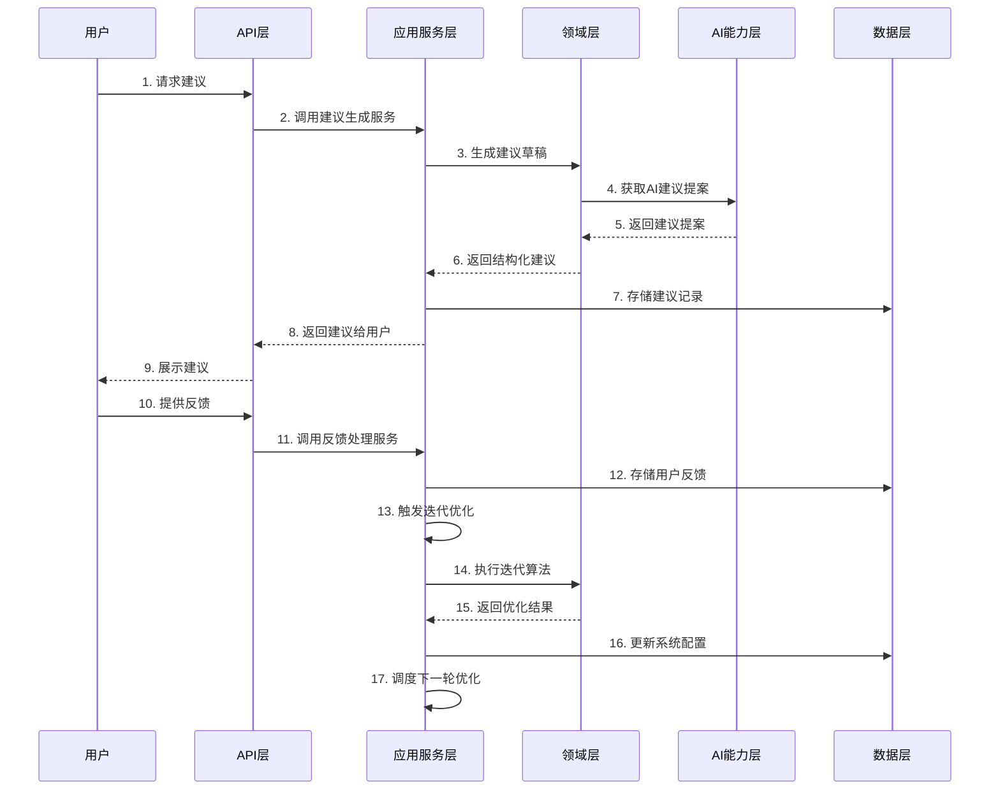

# 66-迭代技术实现文档

## 1. 文档概述

### 1.1 功能定位
迭代模块是认知辅助系统的核心组成部分，负责持续优化建议生成流程，根据用户反馈和系统评估结果不断改进建议质量、个性化程度、排序准确性和依据清晰度。该模块实现了一个闭环迭代系统，确保认知辅助系统能够随着时间推移不断提升性能。

### 1.2 设计原则
- **Clean Architecture 分层设计**：严格遵循 Presentation/Application/Domain/Infrastructure/AI Capability 分层
- **迭代闭环设计**：实现从建议生成到用户反馈再到优化改进的完整闭环
- **可配置性**：支持通过配置调整迭代策略和参数
- **可扩展性**：支持添加新的迭代算法和优化策略
- **数据驱动**：基于实际数据和评估结果进行迭代改进

### 1.3 技术栈
- Node.js LTS (≥18)
- TypeScript (严格模式)
- Express.js
- SQLite
- Jest (测试框架)

## 2. 架构设计

### 2.1 分层结构
```
┌────────────────────┐     ┌────────────────────┐     ┌────────────────────┐
│  Presentation      │────▶│  Application       │────▶│  Domain            │
│  (API 接口层)       │     │  (应用服务层)       │     │  (领域模型层)       │
└────────────────────┘     └────────────────────┘     └────────────────────┘
                                      │                          ▲
                                      ▼                          │
┌────────────────────┐     ┌────────────────────┐     ┌────────────────────┐
│  AI Capability     │◀────│  Infrastructure    │◀────│  Cognitive Model   │
│  (AI能力层)         │     │  (基础设施层)       │     │  (认知模型)         │
└────────────────────┘     └────────────────────┘     └────────────────────┘
```

### 2.2 核心流程图



## 3. 核心组件设计

### 3.1 领域模型 (Domain)

#### 3.1.1 IterationCycle
```typescript
// src/domain/iteration/IterationCycle.ts

export interface IterationCycle {
  id: string;
  startDate: Date;
  endDate?: Date;
  status: IterationStatus;
  metrics: IterationMetrics;
  improvements: Improvement[];
}

export enum IterationStatus {
  PENDING = 'PENDING',
  IN_PROGRESS = 'IN_PROGRESS',
  COMPLETED = 'COMPLETED',
  FAILED = 'FAILED'
}

export interface IterationMetrics {
  suggestionQuality: number;
  personalizationAccuracy: number;
  rankingRelevance: number;
  justificationClarity: number;
  userSatisfaction: number;
  feedbackVolume: number;
}

export interface Improvement {
  id: string;
  type: ImprovementType;
  description: string;
  priority: ImprovementPriority;
  implemented: boolean;
  impact: ImprovementImpact;
}

export enum ImprovementType {
  QUALITY = 'QUALITY',
  PERSONALIZATION = 'PERSONALIZATION',
  RANKING = 'RANKING',
  JUSTIFICATION = 'JUSTIFICATION',
  PERFORMANCE = 'PERFORMANCE'
}

export enum ImprovementPriority {
  HIGH = 'HIGH',
  MEDIUM = 'MEDIUM',
  LOW = 'LOW'
}

export enum ImprovementImpact {
  HIGH = 'HIGH',
  MEDIUM = 'MEDIUM',
  LOW = 'LOW'
}
```

#### 3.1.2 IterationStrategy (迭代策略接口)
```typescript
// src/domain/iteration/IterationStrategy.ts

export interface IterationStrategy {
  name: string;
  execute(cycle: IterationCycle, data: IterationData): Promise<Improvement[]>;
  evaluateImpact(improvement: Improvement): Promise<ImprovementImpact>;
}

export interface IterationData {
  suggestions: Suggestion[];
  feedbacks: UserFeedback[];
  evaluations: Evaluation[];
  userProfiles: UserProfile[];
}
```

### 3.2 应用服务层 (Application)

#### 3.2.1 IterationService
```typescript
// src/application/iteration/IterationService.ts

export interface IterationService {
  /**
   * 启动新的迭代周期
   */
  startIterationCycle(): Promise<IterationCycle>;
  
  /**
   * 执行迭代优化
   */
  executeIteration(cycleId: string): Promise<IterationCycle>;
  
  /**
   * 完成迭代周期
   */
  completeIterationCycle(cycleId: string): Promise<IterationCycle>;
  
  /**
   * 获取迭代周期历史
   */
  getIterationHistory(limit?: number): Promise<IterationCycle[]>;
  
  /**
   * 获取当前迭代周期
   */
  getCurrentIterationCycle(): Promise<IterationCycle | null>;
  
  /**
   * 应用改进措施
   */
  applyImprovement(improvementId: string): Promise<Improvement>;
  
  /**
   * 获取改进措施列表
   */
  getImprovements(filter?: ImprovementFilter): Promise<Improvement[]>;
}

export interface ImprovementFilter {
  type?: ImprovementType;
  priority?: ImprovementPriority;
  implemented?: boolean;
  impact?: ImprovementImpact;
}
```

### 3.3 基础设施层 (Infrastructure)

#### 3.3.1 IterationRepository
```typescript
// src/infrastructure/repositories/IterationRepository.ts

export interface IterationRepository {
  createCycle(cycle: IterationCycle): Promise<IterationCycle>;
  updateCycle(cycle: IterationCycle): Promise<IterationCycle>;
  getCycleById(id: string): Promise<IterationCycle | null>;
  getCurrentCycle(): Promise<IterationCycle | null>;
  getAllCycles(limit?: number): Promise<IterationCycle[]>;
  createImprovement(improvement: Improvement): Promise<Improvement>;
  updateImprovement(improvement: Improvement): Promise<Improvement>;
  getImprovementById(id: string): Promise<Improvement | null>;
  getImprovements(filter?: ImprovementFilter): Promise<Improvement[]>;
}
```

#### 3.3.2 IterationScheduler
```typescript
// src/infrastructure/scheduling/IterationScheduler.ts

export interface IterationScheduler {
  /**
   * 调度定期迭代
   */
  scheduleRegularIterations(interval: number): void;
  
  /**
   * 立即触发迭代
   */
  triggerIteration(): Promise<void>;
  
  /**
   * 取消所有调度的迭代
   */
  cancelAllIterations(): void;
}
```

### 3.4 AI能力层 (AI Capability)

#### 3.4.1 IterationAIService
```typescript
// src/ai/IterationAIService.ts

export interface IterationAIService {
  /**
   * 分析迭代数据，生成改进建议
   */
  analyzeIterationData(data: IterationData): Promise<AIImprovementProposal[]>;
  
  /**
   * 评估改进建议的潜在影响
   */
  evaluateImprovementImpact(improvement: Improvement): Promise<ImprovementImpact>;
  
  /**
   * 预测改进建议的效果
   */
  predictImprovementEffect(improvement: Improvement): Promise<number>;
}

export interface AIImprovementProposal {
  type: ImprovementType;
  description: string;
  rationale: string;
  confidence: number;
  estimatedImpact: ImprovementImpact;
}
```

## 4. 数据模型

### 4.1 数据库表设计

#### 4.1.1 iteration_cycles 表
| 字段名 | 数据类型 | 约束 | 描述 |
|--------|----------|------|------|
| id | TEXT | PRIMARY KEY | 迭代周期ID |
| start_date | INTEGER | NOT NULL | 开始时间戳 |
| end_date | INTEGER | | 结束时间戳 |
| status | TEXT | NOT NULL | 迭代状态 |
| suggestion_quality | REAL | NOT NULL | 建议质量评分 |
| personalization_accuracy | REAL | NOT NULL | 个性化准确性评分 |
| ranking_relevance | REAL | NOT NULL | 排序相关性评分 |
| justification_clarity | REAL | NOT NULL | 依据清晰度评分 |
| user_satisfaction | REAL | NOT NULL | 用户满意度评分 |
| feedback_volume | INTEGER | NOT NULL | 反馈数量 |
| created_at | INTEGER | NOT NULL | 创建时间 |
| updated_at | INTEGER | NOT NULL | 更新时间 |

#### 4.1.2 improvements 表
| 字段名 | 数据类型 | 约束 | 描述 |
|--------|----------|------|------|
| id | TEXT | PRIMARY KEY | 改进措施ID |
| iteration_cycle_id | TEXT | FOREIGN KEY | 关联的迭代周期ID |
| type | TEXT | NOT NULL | 改进类型 |
| description | TEXT | NOT NULL | 改进描述 |
| priority | TEXT | NOT NULL | 优先级 |
| implemented | INTEGER | NOT NULL | 是否已实现 |
| impact | TEXT | NOT NULL | 影响程度 |
| rationale | TEXT | | 改进理由 |
| created_at | INTEGER | NOT NULL | 创建时间 |
| updated_at | INTEGER | NOT NULL | 更新时间 |

### 4.2 数据访问对象 (DAO)

```typescript
// src/infrastructure/repositories/dao/IterationCycleDao.ts

export class IterationCycleDao {
  id: string;
  start_date: number;
  end_date?: number;
  status: string;
  suggestion_quality: number;
  personalization_accuracy: number;
  ranking_relevance: number;
  justification_clarity: number;
  user_satisfaction: number;
  feedback_volume: number;
  created_at: number;
  updated_at: number;
}

// src/infrastructure/repositories/dao/ImprovementDao.ts

export class ImprovementDao {
  id: string;
  iteration_cycle_id: string;
  type: string;
  description: string;
  priority: string;
  implemented: number;
  impact: string;
  rationale?: string;
  created_at: number;
  updated_at: number;
}
```

## 5. API 设计

### 5.1 RESTful API 接口

#### 5.1.1 迭代周期管理

| API路径 | 方法 | 功能描述 | 请求体 | 响应体 | 权限 |
|---------|------|----------|--------|--------|------|
| /api/iteration/cycles | POST | 启动新迭代周期 | - | IterationCycle | 管理员 |
| /api/iteration/cycles | GET | 获取迭代周期列表 | - | IterationCycle[] | 管理员 |
| /api/iteration/cycles/current | GET | 获取当前迭代周期 | - | IterationCycle | 管理员 |
| /api/iteration/cycles/:id | GET | 获取特定迭代周期 | - | IterationCycle | 管理员 |
| /api/iteration/cycles/:id/execute | POST | 执行迭代 | - | IterationCycle | 管理员 |
| /api/iteration/cycles/:id/complete | POST | 完成迭代周期 | - | IterationCycle | 管理员 |

#### 5.1.2 改进措施管理

| API路径 | 方法 | 功能描述 | 请求体 | 响应体 | 权限 |
|---------|------|----------|--------|--------|------|
| /api/iteration/improvements | GET | 获取改进措施列表 | - | Improvement[] | 管理员 |
| /api/iteration/improvements/:id | GET | 获取特定改进措施 | - | Improvement | 管理员 |
| /api/iteration/improvements/:id/apply | POST | 应用改进措施 | - | Improvement | 管理员 |
| /api/iteration/improvements | POST | 手动添加改进措施 | ImprovementCreateDto | Improvement | 管理员 |

#### 5.1.3 迭代统计

| API路径 | 方法 | 功能描述 | 请求体 | 响应体 | 权限 |
|---------|------|----------|--------|--------|------|
| /api/iteration/statistics | GET | 获取迭代统计数据 | - | IterationStatistics | 管理员 |

### 5.2 请求/响应 DTOs

```typescript
// src/presentation/dtos/iteration/ImprovementCreateDto.ts

export interface ImprovementCreateDto {
  type: ImprovementType;
  description: string;
  priority: ImprovementPriority;
  rationale?: string;
}

// src/presentation/dtos/iteration/IterationStatistics.ts

export interface IterationStatistics {
  totalCycles: number;
  averageCycleDuration: number;
  improvementsImplemented: number;
  averageQualityImprovement: number;
  averagePersonalizationImprovement: number;
  averageRankingImprovement: number;
  averageJustificationImprovement: number;
  improvementTypeDistribution: Record<ImprovementType, number>;
}
```

## 6. 实现细节

### 6.1 迭代策略实现

#### 6.1.1 基于反馈的迭代策略
```typescript
// src/domain/iteration/strategies/FeedbackBasedIterationStrategy.ts

export class FeedbackBasedIterationStrategy implements IterationStrategy {
  name = 'feedback-based';
  
  async execute(cycle: IterationCycle, data: IterationData): Promise<Improvement[]> {
    const improvements: Improvement[] = [];
    
    // 分析用户反馈数据
    const feedbackAnalysis = this.analyzeFeedback(data.feedbacks);
    
    // 基于反馈生成改进建议
    if (feedbackAnalysis.lowQualitySuggestions > 0.2) {
      improvements.push({
        id: uuidv4(),
        type: ImprovementType.QUALITY,
        description: '优化建议生成算法，提高建议质量',
        priority: ImprovementPriority.HIGH,
        implemented: false,
        impact: ImprovementImpact.HIGH
      });
    }
    
    if (feedbackAnalysis.poorPersonalization > 0.25) {
      improvements.push({
        id: uuidv4(),
        type: ImprovementType.PERSONALIZATION,
        description: '改进用户画像模型，提高个性化准确性',
        priority: ImprovementPriority.HIGH,
        implemented: false,
        impact: ImprovementImpact.HIGH
      });
    }
    
    // 更多基于反馈的改进建议...
    
    return improvements;
  }
  
  private analyzeFeedback(feedbacks: UserFeedback[]): FeedbackAnalysis {
    // 实现反馈分析逻辑
    // ...
  }
  
  async evaluateImpact(improvement: Improvement): Promise<ImprovementImpact> {
    // 评估改进措施的影响
    // ...
    return ImprovementImpact.MEDIUM;
  }
}
```

#### 6.1.2 基于评估的迭代策略
```typescript
// src/domain/iteration/strategies/EvaluationBasedIterationStrategy.ts

export class EvaluationBasedIterationStrategy implements IterationStrategy {
  name = 'evaluation-based';
  
  async execute(cycle: IterationCycle, data: IterationData): Promise<Improvement[]> {
    const improvements: Improvement[] = [];
    
    // 分析评估数据
    const evaluationAnalysis = this.analyzeEvaluations(data.evaluations);
    
    // 基于评估结果生成改进建议
    if (evaluationAnalysis.lowRankingRelevance > 0.3) {
      improvements.push({
        id: uuidv4(),
        type: ImprovementType.RANKING,
        description: '调整排序算法权重，提高排序相关性',
        priority: ImprovementPriority.MEDIUM,
        implemented: false,
        impact: ImprovementImpact.MEDIUM
      });
    }
    
    if (evaluationAnalysis.unclearJustifications > 0.25) {
      improvements.push({
        id: uuidv4(),
        type: ImprovementType.JUSTIFICATION,
        description: '优化依据生成逻辑，提高依据清晰度',
        priority: ImprovementPriority.MEDIUM,
        implemented: false,
        impact: ImprovementImpact.MEDIUM
      });
    }
    
    // 更多基于评估的改进建议...
    
    return improvements;
  }
  
  private analyzeEvaluations(evaluations: Evaluation[]): EvaluationAnalysis {
    // 实现评估分析逻辑
    // ...
  }
  
  async evaluateImpact(improvement: Improvement): Promise<ImprovementImpact> {
    // 评估改进措施的影响
    // ...
    return ImprovementImpact.MEDIUM;
  }
}
```

### 6.2 迭代服务实现

```typescript
// src/application/iteration/IterationServiceImpl.ts

export class IterationServiceImpl implements IterationService {
  constructor(
    private readonly iterationRepository: IterationRepository,
    private readonly suggestionService: SuggestionService,
    private readonly feedbackService: FeedbackService,
    private readonly evaluationService: EvaluationService,
    private readonly userProfileService: UserProfileService,
    private readonly iterationAIService: IterationAIService,
    private readonly iterationStrategies: IterationStrategy[]
  ) {}
  
  async startIterationCycle(): Promise<IterationCycle> {
    const currentCycle = await this.iterationRepository.getCurrentCycle();
    if (currentCycle && currentCycle.status === IterationStatus.IN_PROGRESS) {
      throw new Error('已有一个正在进行的迭代周期');
    }
    
    const newCycle: IterationCycle = {
      id: uuidv4(),
      startDate: new Date(),
      status: IterationStatus.PENDING,
      metrics: {
        suggestionQuality: 0,
        personalizationAccuracy: 0,
        rankingRelevance: 0,
        justificationClarity: 0,
        userSatisfaction: 0,
        feedbackVolume: 0
      },
      improvements: []
    };
    
    return this.iterationRepository.createCycle(newCycle);
  }
  
  async executeIteration(cycleId: string): Promise<IterationCycle> {
    const cycle = await this.iterationRepository.getCycleById(cycleId);
    if (!cycle) {
      throw new Error('迭代周期不存在');
    }
    
    if (cycle.status !== IterationStatus.PENDING) {
      throw new Error('只能执行待处理状态的迭代周期');
    }
    
    // 更新迭代状态为进行中
    cycle.status = IterationStatus.IN_PROGRESS;
    await this.iterationRepository.updateCycle(cycle);
    
    try {
      // 收集迭代数据
      const iterationData: IterationData = {
        suggestions: await this.suggestionService.getRecentSuggestions(1000),
        feedbacks: await this.feedbackService.getRecentFeedbacks(1000),
        evaluations: await this.evaluationService.getRecentEvaluations(100),
        userProfiles: await this.userProfileService.getAllUserProfiles()
      };
      
      // 执行所有迭代策略
      const allImprovements: Improvement[] = [];
      for (const strategy of this.iterationStrategies) {
        const improvements = await strategy.execute(cycle, iterationData);
        allImprovements.push(...improvements);
      }
      
      // 获取AI生成的改进建议
      const aiProposals = await this.iterationAIService.analyzeIterationData(iterationData);
      const aiImprovements = aiProposals.map(proposal => ({
        id: uuidv4(),
        type: proposal.type,
        description: proposal.description,
        priority: ImprovementPriority.MEDIUM,
        implemented: false,
        impact: proposal.estimatedImpact
      }));
      allImprovements.push(...aiImprovements);
      
      // 去重并存储改进建议
      const uniqueImprovements = this.deduplicateImprovements(allImprovements);
      for (const improvement of uniqueImprovements) {
        await this.iterationRepository.createImprovement(improvement);
      }
      
      // 更新迭代周期的改进措施
      cycle.improvements = uniqueImprovements;
      cycle.metrics = this.calculateMetrics(iterationData);
      
      return this.iterationRepository.updateCycle(cycle);
    } catch (error) {
      cycle.status = IterationStatus.FAILED;
      await this.iterationRepository.updateCycle(cycle);
      throw error;
    }
  }
  
  // 其他方法实现...
  
  private deduplicateImprovements(improvements: Improvement[]): Improvement[] {
    // 实现改进措施去重逻辑
    // ...
    return uniqueImprovements;
  }
  
  private calculateMetrics(data: IterationData): IterationMetrics {
    // 实现指标计算逻辑
    // ...
    return metrics;
  }
}
```

## 7. 测试策略

### 7.1 单元测试

```typescript
// src/domain/iteration/strategies/FeedbackBasedIterationStrategy.test.ts

describe('FeedbackBasedIterationStrategy', () => {
  let strategy: FeedbackBasedIterationStrategy;
  
  beforeEach(() => {
    strategy = new FeedbackBasedIterationStrategy();
  });
  
  describe('execute', () => {
    it('should generate improvements based on feedback analysis', async () => {
      // Arrange
      const cycle: IterationCycle = {
        id: 'test-cycle',
        startDate: new Date(),
        status: IterationStatus.IN_PROGRESS,
        metrics: {
          suggestionQuality: 0,
          personalizationAccuracy: 0,
          rankingRelevance: 0,
          justificationClarity: 0,
          userSatisfaction: 0,
          feedbackVolume: 0
        },
        improvements: []
      };
      
      const data: IterationData = {
        suggestions: [],
        feedbacks: [
          // 生成包含低质量建议反馈的数据
          // ...
        ],
        evaluations: [],
        userProfiles: []
      };
      
      // Act
      const improvements = await strategy.execute(cycle, data);
      
      // Assert
      expect(improvements).toBeInstanceOf(Array);
      expect(improvements.length).toBeGreaterThan(0);
      expect(improvements[0].type).toBe(ImprovementType.QUALITY);
    });
  });
  
  // 其他测试用例...
});
```

### 7.2 集成测试

```typescript
// src/application/iteration/IterationServiceImpl.test.ts

describe('IterationServiceImpl', () => {
  let iterationService: IterationServiceImpl;
  let mockIterationRepository: jest.Mocked<IterationRepository>;
  let mockSuggestionService: jest.Mocked<SuggestionService>;
  // 其他 mock 服务...
  
  beforeEach(() => {
    // 初始化 mock 服务
    mockIterationRepository = {
      createCycle: jest.fn(),
      updateCycle: jest.fn(),
      getCycleById: jest.fn(),
      getCurrentCycle: jest.fn(),
      getAllCycles: jest.fn(),
      createImprovement: jest.fn(),
      updateImprovement: jest.fn(),
      getImprovementById: jest.fn(),
      getImprovements: jest.fn()
    };
    
    // 其他 mock 服务初始化...
    
    iterationService = new IterationServiceImpl(
      mockIterationRepository,
      mockSuggestionService,
      mockFeedbackService,
      mockEvaluationService,
      mockUserProfileService,
      mockIterationAIService,
      [new FeedbackBasedIterationStrategy()]
    );
  });
  
  describe('startIterationCycle', () => {
    it('should start a new iteration cycle when no current cycle exists', async () => {
      // Arrange
      mockIterationRepository.getCurrentCycle.mockResolvedValue(null);
      const newCycle: IterationCycle = {
        id: 'test-cycle',
        startDate: new Date(),
        status: IterationStatus.PENDING,
        metrics: {
          suggestionQuality: 0,
          personalizationAccuracy: 0,
          rankingRelevance: 0,
          justificationClarity: 0,
          userSatisfaction: 0,
          feedbackVolume: 0
        },
        improvements: []
      };
      mockIterationRepository.createCycle.mockResolvedValue(newCycle);
      
      // Act
      const result = await iterationService.startIterationCycle();
      
      // Assert
      expect(mockIterationRepository.getCurrentCycle).toHaveBeenCalled();
      expect(mockIterationRepository.createCycle).toHaveBeenCalled();
      expect(result).toEqual(newCycle);
    });
    
    it('should throw an error when there is an ongoing iteration cycle', async () => {
      // Arrange
      const ongoingCycle: IterationCycle = {
        id: 'ongoing-cycle',
        startDate: new Date(),
        status: IterationStatus.IN_PROGRESS,
        metrics: {
          suggestionQuality: 0,
          personalizationAccuracy: 0,
          rankingRelevance: 0,
          justificationClarity: 0,
          userSatisfaction: 0,
          feedbackVolume: 0
        },
        improvements: []
      };
      mockIterationRepository.getCurrentCycle.mockResolvedValue(ongoingCycle);
      
      // Act & Assert
      await expect(iterationService.startIterationCycle()).rejects.toThrow('已有一个正在进行的迭代周期');
    });
  });
  
  // 其他测试用例...
});
```

### 7.3 端到端测试

```typescript
// test/e2e/iteration.test.ts

describe('Iteration API E2E Tests', () => {
  let app: Express;
  let server: http.Server;
  let agent: supertest.SuperAgentTest;
  
  beforeAll(async () => {
    // 初始化 Express 应用
    app = await setupApp();
    server = app.listen(0);
    agent = supertest.agent(app);
    
    // 初始化测试数据
    await initializeTestData();
  });
  
  afterAll(async () => {
    // 清理测试数据
    await cleanupTestData();
    server.close();
  });
  
  describe('POST /api/iteration/cycles', () => {
    it('should start a new iteration cycle', async () => {
      // Act
      const response = await agent.post('/api/iteration/cycles').send();
      
      // Assert
      expect(response.status).toBe(201);
      expect(response.body).toHaveProperty('id');
      expect(response.body.status).toBe(IterationStatus.PENDING);
    });
  });
  
  describe('GET /api/iteration/cycles/current', () => {
    it('should return the current iteration cycle', async () => {
      // Arrange
      await agent.post('/api/iteration/cycles').send();
      
      // Act
      const response = await agent.get('/api/iteration/cycles/current');
      
      // Assert
      expect(response.status).toBe(200);
      expect(response.body).toHaveProperty('id');
    });
  });
  
  // 其他测试用例...
});
```

## 8. 部署与运维

### 8.1 部署架构

```
┌─────────────────────────────────────────────────────────────────┐
│                      负载均衡器 (Nginx)                          │
└───────────┬─────────────────────────────────────────────────────┘
            │
┌───────────┴─────────────────────────────────────────────────────┐
│                      应用服务器集群                              │
│  ┌─────────────────┐  ┌─────────────────┐  ┌─────────────────┐  │
│  │  Iteration API  │  │  Iteration API  │  │  Iteration API  │  │
│  └─────────────────┘  └─────────────────┘  └─────────────────┘  │
└───────────┬─────────────────────────────────────────────────────┘
            │
┌───────────┴─────────────────────────────────────────────────────┐
│                      数据库集群 (SQLite)                        │
└───────────┬─────────────────────────────────────────────────────┘
            │
┌───────────┴─────────────────────────────────────────────────────┐
│                      AI 服务 (OpenAI API)                        │
└─────────────────────────────────────────────────────────────────┘
```

### 8.2 环境配置

| 环境变量 | 描述 | 默认值 |
|----------|------|--------|
| NODE_ENV | 运行环境 | development |
| PORT | 服务端口 | 3000 |
| DATABASE_URL | 数据库连接URL | ./data/cognitive-assistant.db |
| OPENAI_API_KEY | OpenAI API 密钥 | - |
| ITERATION_INTERVAL | 迭代间隔（分钟） | 1440（24小时） |
| MAX_ITERATION_HISTORY | 最大迭代历史记录数 | 100 |
| IMPROVEMENT_PRIORITY_THRESHOLD | 改进优先级阈值 | 0.7 |

### 8.3 数据迁移

```typescript
// src/infrastructure/database/migrations/005-iteration-tables.ts

export const up = async (db: Database): Promise<void> => {
  await db.exec(`
    CREATE TABLE IF NOT EXISTS iteration_cycles (
      id TEXT PRIMARY KEY,
      start_date INTEGER NOT NULL,
      end_date INTEGER,
      status TEXT NOT NULL,
      suggestion_quality REAL NOT NULL,
      personalization_accuracy REAL NOT NULL,
      ranking_relevance REAL NOT NULL,
      justification_clarity REAL NOT NULL,
      user_satisfaction REAL NOT NULL,
      feedback_volume INTEGER NOT NULL,
      created_at INTEGER NOT NULL,
      updated_at INTEGER NOT NULL
    );
    
    CREATE TABLE IF NOT EXISTS improvements (
      id TEXT PRIMARY KEY,
      iteration_cycle_id TEXT NOT NULL,
      type TEXT NOT NULL,
      description TEXT NOT NULL,
      priority TEXT NOT NULL,
      implemented INTEGER NOT NULL,
      impact TEXT NOT NULL,
      rationale TEXT,
      created_at INTEGER NOT NULL,
      updated_at INTEGER NOT NULL,
      FOREIGN KEY (iteration_cycle_id) REFERENCES iteration_cycles (id) ON DELETE CASCADE
    );
    
    CREATE INDEX IF NOT EXISTS idx_iteration_cycles_status ON iteration_cycles (status);
    CREATE INDEX IF NOT EXISTS idx_improvements_iteration_cycle_id ON improvements (iteration_cycle_id);
    CREATE INDEX IF NOT EXISTS idx_improvements_implemented ON improvements (implemented);
  `);
};

export const down = async (db: Database): Promise<void> => {
  await db.exec(`
    DROP TABLE IF EXISTS improvements;
    DROP TABLE IF EXISTS iteration_cycles;
  `);
};
```

## 9. 性能优化

### 9.1 缓存策略

```typescript
// src/infrastructure/cache/IterationCache.ts

export class IterationCache {
  private readonly cache = new Map<string, any>();
  private readonly ttl = 3600000; // 1小时
  
  get<T>(key: string): T | null {
    const item = this.cache.get(key);
    if (!item) {
      return null;
    }
    
    if (Date.now() > item.expiry) {
      this.cache.delete(key);
      return null;
    }
    
    return item.value as T;
  }
  
  set<T>(key: string, value: T): void {
    this.cache.set(key, {
      value,
      expiry: Date.now() + this.ttl
    });
  }
  
  delete(key: string): void {
    this.cache.delete(key);
  }
  
  clear(): void {
    this.cache.clear();
  }
}
```

### 9.2 并行处理

```typescript
// src/application/iteration/IterationServiceImpl.ts

export class IterationServiceImpl implements IterationService {
  // ...
  
  private async collectIterationData(): Promise<IterationData> {
    // 并行收集数据，提高性能
    const [suggestions, feedbacks, evaluations, userProfiles] = await Promise.all([
      this.suggestionService.getRecentSuggestions(1000),
      this.feedbackService.getRecentFeedbacks(1000),
      this.evaluationService.getRecentEvaluations(100),
      this.userProfileService.getAllUserProfiles()
    ]);
    
    return {
      suggestions,
      feedbacks,
      evaluations,
      userProfiles
    };
  }
  
  // ...
}
```

### 9.3 数据库优化

```typescript
// src/infrastructure/repositories/SqliteIterationRepository.ts

export class SqliteIterationRepository implements IterationRepository {
  // ...
  
  async getRecentSuggestions(limit: number): Promise<Suggestion[]> {
    const stmt = await this.db.prepare(
      `SELECT * FROM suggestions 
       ORDER BY created_at DESC 
       LIMIT ?`
    );
    
    const rows = await stmt.all(limit);
    await stmt.finalize();
    
    return rows.map(row => this.mapRowToSuggestion(row));
  }
  
  // ...
}
```

## 10. 监控与日志

### 10.1 日志记录

```typescript
// src/infrastructure/logger/IterationLogger.ts

export class IterationLogger {
  private readonly logger = createLogger('iteration');
  
  logIterationStart(cycleId: string): void {
    this.logger.info(`开始迭代周期: ${cycleId}`);
  }
  
  logIterationComplete(cycleId: string, duration: number, improvementCount: number): void {
    this.logger.info(`迭代周期完成: ${cycleId}, 耗时: ${duration}ms, 生成改进措施: ${improvementCount}`);
  }
  
  logIterationFailed(cycleId: string, error: Error): void {
    this.logger.error(`迭代周期失败: ${cycleId}, 错误: ${error.message}`, {
      error: error.stack
    });
  }
  
  logImprovementApplied(improvementId: string, type: ImprovementType): void {
    this.logger.info(`应用改进措施: ${improvementId}, 类型: ${type}`);
  }
}
```

### 10.2 监控指标

| 指标名称 | 类型 | 描述 |
|----------|------|------|
| iteration_cycles_total | Counter | 迭代周期总数 |
| iteration_cycles_failed_total | Counter | 失败的迭代周期数 |
| iteration_cycle_duration_seconds | Histogram | 迭代周期持续时间 |
| improvements_generated_total | Counter | 生成的改进措施总数 |
| improvements_implemented_total | Counter | 已实现的改进措施总数 |
| suggestion_quality_improvement | Gauge | 建议质量改进幅度 |
| personalization_accuracy_improvement | Gauge | 个性化准确性改进幅度 |
| ranking_relevance_improvement | Gauge | 排序相关性改进幅度 |
| justification_clarity_improvement | Gauge | 依据清晰度改进幅度 |

## 11. 总结与展望

### 11.1 实现总结
迭代模块实现了一个完整的闭环迭代系统，能够根据用户反馈和系统评估结果自动生成改进建议，并支持手动或自动应用这些改进措施。该模块采用了 Clean Architecture 设计，具有良好的可扩展性和可维护性，支持添加新的迭代策略和优化算法。

### 11.2 未来改进方向
1. **更智能的迭代策略**：引入机器学习模型，根据历史数据预测最有效的改进措施
2. **实时迭代**：支持基于实时反馈的快速迭代，而不仅仅是定期迭代
3. **多维度评估**：引入更多评估指标，如性能、可靠性、可用性等
4. **自动化应用改进**：实现自动应用低风险改进措施的能力
5. **迭代效果可视化**：提供直观的可视化界面，展示迭代带来的改进效果

### 11.3 关键成功因素
1. **数据驱动**：基于真实数据和反馈进行迭代，确保改进措施的有效性
2. **闭环设计**：实现从建议生成到用户反馈再到优化改进的完整闭环
3. **可配置性**：支持通过配置调整迭代策略和参数，适应不同的业务需求
4. **可监控性**：提供全面的监控指标和日志记录，便于跟踪迭代效果
5. **可扩展性**：支持添加新的迭代策略和优化算法，适应不断变化的业务需求

通过实现迭代模块，认知辅助系统将能够持续优化自身性能，随着时间推移不断提升建议质量、个性化程度、排序准确性和依据清晰度，为用户提供更好的认知辅助服务。