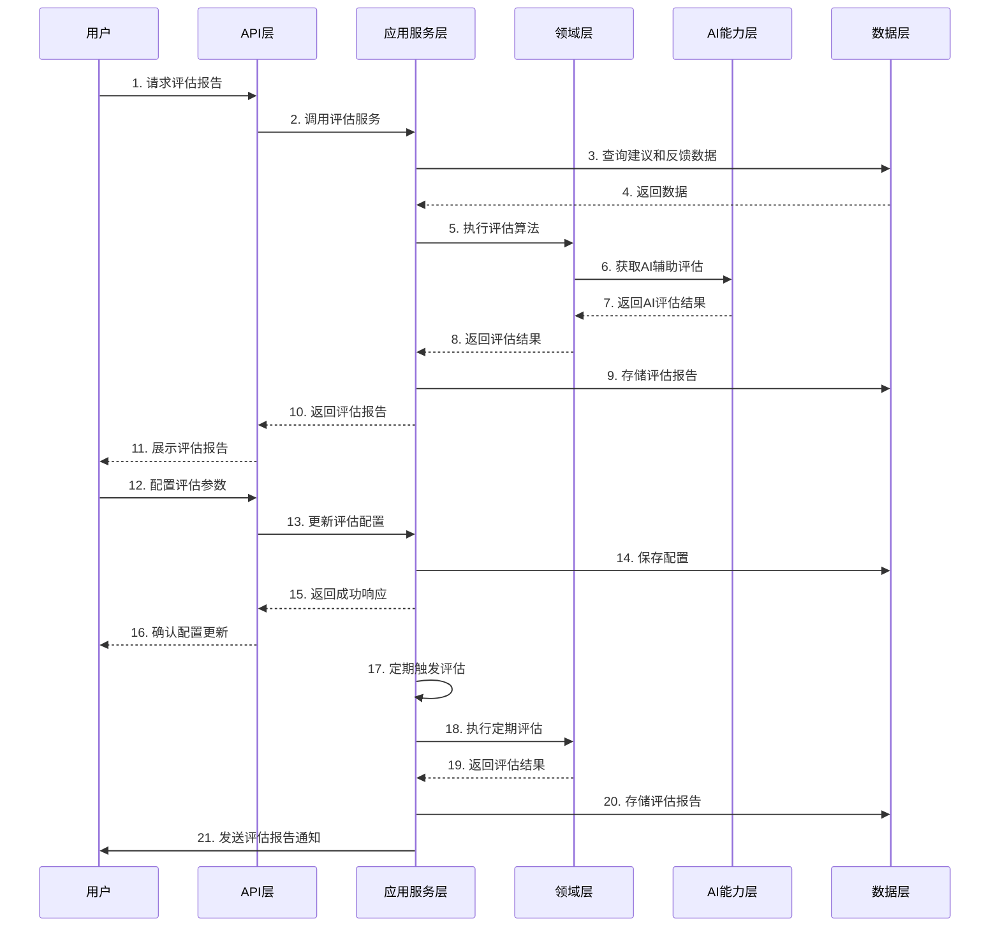

# 67-评估技术实现文档

## 1. 文档概述

### 1.1 功能定位
评估模块是认知辅助系统的关键组成部分，负责全面评估建议生成系统的性能和质量。该模块通过多维度的评估指标，对建议的质量、个性化程度、排序准确性和依据清晰度进行客观评价，为系统迭代提供数据支持。评估模块实现了自动化评估流程，能够实时或定期生成评估报告，帮助系统开发者和管理员了解系统当前状态和改进方向。

### 1.2 设计原则
- **Clean Architecture 分层设计**：严格遵循 Presentation/Application/Domain/Infrastructure/AI Capability 分层
- **多维度评估**：从多个角度全面评估系统性能
- **自动化评估**：减少人工干预，提高评估效率和准确性
- **可扩展性**：支持添加新的评估指标和评估方法
- **数据驱动**：基于实际数据进行客观评估
- **实时与定期评估结合**：支持实时评估和定期评估两种模式

### 1.3 技术栈
- Node.js LTS (≥18)
- TypeScript (严格模式)
- Express.js
- SQLite
- Jest (测试框架)

## 2. 架构设计

### 2.1 分层结构
```
┌────────────────────┐     ┌────────────────────┐     ┌────────────────────┐
│  Presentation      │────▶│  Application       │────▶│  Domain            │
│  (API 接口层)       │     │  (应用服务层)       │     │  (领域模型层)       │
└────────────────────┘     └────────────────────┘     └────────────────────┘
                                      │                          ▲
                                      ▼                          │
┌────────────────────┐     ┌────────────────────┐     ┌────────────────────┐
│  AI Capability     │◀────│  Infrastructure    │◀────│  Cognitive Model   │
│  (AI能力层)         │     │  (基础设施层)       │     │  (认知模型)         │
└────────────────────┘     └────────────────────┘     └────────────────────┘
```

### 2.2 核心流程图



## 3. 核心组件设计

### 3.1 领域模型 (Domain)

#### 3.1.1 Evaluation
```typescript
// src/domain/evaluation/Evaluation.ts

export interface Evaluation {
  id: string;
  evaluationDate: Date;
  type: EvaluationType;
  status: EvaluationStatus;
  metrics: EvaluationMetrics;
  report: EvaluationReport;
  config: EvaluationConfig;
}

export enum EvaluationType {
  REAL_TIME = 'REAL_TIME',
  SCHEDULED = 'SCHEDULED',
  MANUAL = 'MANUAL'
}

export enum EvaluationStatus {
  PENDING = 'PENDING',
  IN_PROGRESS = 'IN_PROGRESS',
  COMPLETED = 'COMPLETED',
  FAILED = 'FAILED'
}

export interface EvaluationMetrics {
  suggestionQuality: number;
  personalizationAccuracy: number;
  rankingRelevance: number;
  justificationClarity: number;
  userSatisfaction: number;
  coverage: number;
  diversity: number;
  novelty: number;
}

export interface EvaluationReport {
  summary: string;
  strengths: string[];
  weaknesses: string[];
  recommendations: string[];
  detailedAnalysis: Record<string, any>;
}

export interface EvaluationConfig {
  metrics: Array<{
    name: keyof EvaluationMetrics;
    weight: number;
    enabled: boolean;
  }>;
  sampleSize: number;
  evaluationPeriod: number;
  aiAssisted: boolean;
}
```

#### 3.1.2 EvaluationStrategy (评估策略接口)
```typescript
// src/domain/evaluation/EvaluationStrategy.ts

export interface EvaluationStrategy {
  name: string;
  evaluate(data: EvaluationData, config: EvaluationConfig): Promise<EvaluationMetrics>;
  generateReport(metrics: EvaluationMetrics, data: EvaluationData): Promise<EvaluationReport>;
}

export interface EvaluationData {
  suggestions: Suggestion[];
  feedbacks: UserFeedback[];
  userProfiles: UserProfile[];
  iterationHistory: IterationCycle[];
}
```

### 3.2 应用服务层 (Application)

#### 3.2.1 EvaluationService
```typescript
// src/application/evaluation/EvaluationService.ts

export interface EvaluationService {
  /**
   * 执行实时评估
   */
  executeRealTimeEvaluation(config?: Partial<EvaluationConfig>): Promise<Evaluation>;
  
  /**
   * 执行定期评估
   */
  executeScheduledEvaluation(): Promise<Evaluation>;
  
  /**
   * 执行手动评估
   */
  executeManualEvaluation(config: EvaluationConfig): Promise<Evaluation>;
  
  /**
   * 获取评估报告
   */
  getEvaluationReport(evaluationId: string): Promise<Evaluation>;
  
  /**
   * 获取评估报告历史
   */
  getEvaluationHistory(filter?: EvaluationFilter): Promise<Evaluation[]>;
  
  /**
   * 获取评估统计数据
   */
  getEvaluationStatistics(period?: number): Promise<EvaluationStatistics>;
  
  /**
   * 更新评估配置
   */
  updateEvaluationConfig(config: EvaluationConfig): Promise<EvaluationConfig>;
  
  /**
   * 获取当前评估配置
   */
  getCurrentEvaluationConfig(): Promise<EvaluationConfig>;
}

export interface EvaluationFilter {
  type?: EvaluationType;
  status?: EvaluationStatus;
  startDate?: Date;
  endDate?: Date;
}

export interface EvaluationStatistics {
  averageMetrics: EvaluationMetrics;
  metricTrends: Record<keyof EvaluationMetrics, number[]>;
  evaluationCount: number;
  averageEvaluationDuration: number;
  typeDistribution: Record<EvaluationType, number>;
}
```

### 3.3 基础设施层 (Infrastructure)

#### 3.3.1 EvaluationRepository
```typescript
// src/infrastructure/repositories/EvaluationRepository.ts

export interface EvaluationRepository {
  createEvaluation(evaluation: Evaluation): Promise<Evaluation>;
  updateEvaluation(evaluation: Evaluation): Promise<Evaluation>;
  getEvaluationById(id: string): Promise<Evaluation | null>;
  getEvaluations(filter?: EvaluationFilter): Promise<Evaluation[]>;
  getRecentEvaluations(limit?: number): Promise<Evaluation[]>;
  saveEvaluationConfig(config: EvaluationConfig): Promise<void>;
  getEvaluationConfig(): Promise<EvaluationConfig | null>;
  deleteEvaluation(evaluationId: string): Promise<void>;
}
```

#### 3.3.2 EvaluationScheduler
```typescript
// src/infrastructure/scheduling/EvaluationScheduler.ts

export interface EvaluationScheduler {
  /**
   * 调度定期评估
   */
  scheduleRegularEvaluations(interval: number): void;
  
  /**
   * 立即触发评估
   */
  triggerEvaluation(): Promise<void>;
  
  /**
   * 取消所有调度的评估
   */
  cancelAllEvaluations(): void;
}
```

### 3.4 AI能力层 (AI Capability)

#### 3.4.1 EvaluationAIService
```typescript
// src/ai/EvaluationAIService.ts

export interface EvaluationAIService {
  /**
   * 辅助评估建议质量
   */
  evaluateSuggestionQuality(suggestions: Suggestion[]): Promise<number>;
  
  /**
   * 辅助评估个性化准确性
   */
  evaluatePersonalizationAccuracy(suggestions: Suggestion[], userProfiles: UserProfile[]): Promise<number>;
  
  /**
   * 辅助评估依据清晰度
   */
  evaluateJustificationClarity(suggestions: Suggestion[]): Promise<number>;
  
  /**
   * 生成评估报告摘要
   */
  generateReportSummary(metrics: EvaluationMetrics, data: EvaluationData): Promise<string>;
  
  /**
   * 生成改进建议
   */
  generateRecommendations(metrics: EvaluationMetrics, data: EvaluationData): Promise<string[]>;
}
```

## 4. 数据模型

### 4.1 数据库表设计

#### 4.1.1 evaluations 表
| 字段名 | 数据类型 | 约束 | 描述 |
|--------|----------|------|------|
| id | TEXT | PRIMARY KEY | 评估ID |
| evaluation_date | INTEGER | NOT NULL | 评估时间戳 |
| type | TEXT | NOT NULL | 评估类型 |
| status | TEXT | NOT NULL | 评估状态 |
| suggestion_quality | REAL | NOT NULL | 建议质量评分 |
| personalization_accuracy | REAL | NOT NULL | 个性化准确性评分 |
| ranking_relevance | REAL | NOT NULL | 排序相关性评分 |
| justification_clarity | REAL | NOT NULL | 依据清晰度评分 |
| user_satisfaction | REAL | NOT NULL | 用户满意度评分 |
| coverage | REAL | NOT NULL | 覆盖率评分 |
| diversity | REAL | NOT NULL | 多样性评分 |
| novelty | REAL | NOT NULL | 新颖性评分 |
| report | TEXT | NOT NULL | 评估报告（JSON格式） |
| config | TEXT | NOT NULL | 评估配置（JSON格式） |
| created_at | INTEGER | NOT NULL | 创建时间 |
| updated_at | INTEGER | NOT NULL | 更新时间 |

#### 4.1.2 evaluation_config 表
| 字段名 | 数据类型 | 约束 | 描述 |
|--------|----------|------|------|
| id | TEXT | PRIMARY KEY | 配置ID |
| metrics | TEXT | NOT NULL | 评估指标配置（JSON格式） |
| sample_size | INTEGER | NOT NULL | 样本大小 |
| evaluation_period | INTEGER | NOT NULL | 评估周期（分钟） |
| ai_assisted | INTEGER | NOT NULL | 是否启用AI辅助评估 |
| updated_at | INTEGER | NOT NULL | 更新时间 |

### 4.2 数据访问对象 (DAO)

```typescript
// src/infrastructure/repositories/dao/EvaluationDao.ts

export class EvaluationDao {
  id: string;
  evaluation_date: number;
  type: string;
  status: string;
  suggestion_quality: number;
  personalization_accuracy: number;
  ranking_relevance: number;
  justification_clarity: number;
  user_satisfaction: number;
  coverage: number;
  diversity: number;
  novelty: number;
  report: string;
  config: string;
  created_at: number;
  updated_at: number;
}

// src/infrastructure/repositories/dao/EvaluationConfigDao.ts

export class EvaluationConfigDao {
  id: string;
  metrics: string;
  sample_size: number;
  evaluation_period: number;
  ai_assisted: number;
  updated_at: number;
}
```

## 5. API 设计

### 5.1 RESTful API 接口

#### 5.1.1 评估执行

| API路径 | 方法 | 功能描述 | 请求体 | 响应体 | 权限 |
|---------|------|----------|--------|--------|------|
| /api/evaluation/real-time | POST | 执行实时评估 | EvaluationConfig (可选) | Evaluation | 管理员 |
| /api/evaluation/scheduled | POST | 执行定期评估 | - | Evaluation | 管理员 |
| /api/evaluation/manual | POST | 执行手动评估 | EvaluationConfig | Evaluation | 管理员 |

#### 5.1.2 评估报告管理

| API路径 | 方法 | 功能描述 | 请求体 | 响应体 | 权限 |
|---------|------|----------|--------|--------|------|
| /api/evaluation/reports | GET | 获取评估报告列表 | - | Evaluation[] | 管理员 |
| /api/evaluation/reports/:id | GET | 获取特定评估报告 | - | Evaluation | 管理员 |
| /api/evaluation/reports/:id | DELETE | 删除评估报告 | - | - | 管理员 |
| /api/evaluation/reports/latest | GET | 获取最新评估报告 | - | Evaluation | 管理员 |

#### 5.1.3 评估配置

| API路径 | 方法 | 功能描述 | 请求体 | 响应体 | 权限 |
|---------|------|----------|--------|--------|------|
| /api/evaluation/config | GET | 获取评估配置 | - | EvaluationConfig | 管理员 |
| /api/evaluation/config | PUT | 更新评估配置 | EvaluationConfig | EvaluationConfig | 管理员 |

#### 5.1.4 评估统计

| API路径 | 方法 | 功能描述 | 请求体 | 响应体 | 权限 |
|---------|------|----------|--------|--------|------|
| /api/evaluation/statistics | GET | 获取评估统计数据 | - | EvaluationStatistics | 管理员 |
| /api/evaluation/statistics/trends | GET | 获取评估趋势数据 | period (查询参数) | EvaluationTrendData | 管理员 |

### 5.2 请求/响应 DTOs

```typescript
// src/presentation/dtos/evaluation/EvaluationTrendData.ts

export interface EvaluationTrendData {
  dates: string[];
  metrics: {
    suggestionQuality: number[];
    personalizationAccuracy: number[];
    rankingRelevance: number[];
    justificationClarity: number[];
    userSatisfaction: number[];
    coverage: number[];
    diversity: number[];
    novelty: number[];
  };
}
```

## 6. 实现细节

### 6.1 评估策略实现

#### 6.1.1 基于反馈的评估策略
```typescript
// src/domain/evaluation/strategies/FeedbackBasedEvaluationStrategy.ts

export class FeedbackBasedEvaluationStrategy implements EvaluationStrategy {
  name = 'feedback-based';
  
  async evaluate(data: EvaluationData, config: EvaluationConfig): Promise<EvaluationMetrics> {
    const metrics: EvaluationMetrics = {
      suggestionQuality: 0,
      personalizationAccuracy: 0,
      rankingRelevance: 0,
      justificationClarity: 0,
      userSatisfaction: 0,
      coverage: 0,
      diversity: 0,
      novelty: 0
    };
    
    // 基于用户反馈计算各项指标
    if (data.feedbacks.length > 0) {
      // 计算建议质量
      metrics.suggestionQuality = this.calculateSuggestionQuality(data.feedbacks);
      
      // 计算个性化准确性
      metrics.personalizationAccuracy = this.calculatePersonalizationAccuracy(data.feedbacks);
      
      // 计算排序相关性
      metrics.rankingRelevance = this.calculateRankingRelevance(data.suggestions, data.feedbacks);
      
      // 计算依据清晰度
      metrics.justificationClarity = this.calculateJustificationClarity(data.feedbacks);
      
      // 计算用户满意度
      metrics.userSatisfaction = this.calculateUserSatisfaction(data.feedbacks);
    }
    
    // 计算覆盖率、多样性和新颖性
    metrics.coverage = this.calculateCoverage(data.suggestions, data.userProfiles);
    metrics.diversity = this.calculateDiversity(data.suggestions);
    metrics.novelty = this.calculateNovelty(data.suggestions);
    
    return metrics;
  }
  
  async generateReport(metrics: EvaluationMetrics, data: EvaluationData): Promise<EvaluationReport> {
    // 生成评估报告
    const strengths: string[] = [];
    const weaknesses: string[] = [];
    const recommendations: string[] = [];
    
    // 分析优势
    if (metrics.suggestionQuality > 0.8) {
      strengths.push('建议质量较高');
    }
    if (metrics.personalizationAccuracy > 0.8) {
      strengths.push('个性化准确性较高');
    }
    // 更多优势分析...
    
    // 分析劣势
    if (metrics.suggestionQuality < 0.6) {
      weaknesses.push('建议质量有待提高');
      recommendations.push('优化建议生成算法，提高建议的相关性和实用性');
    }
    if (metrics.personalizationAccuracy < 0.6) {
      weaknesses.push('个性化准确性有待提高');
      recommendations.push('改进用户画像模型，提高个性化推荐的准确性');
    }
    // 更多劣势和建议分析...
    
    return {
      summary: `本次评估覆盖了${data.suggestions.length}条建议和${data.feedbacks.length}条用户反馈，系统整体表现${this.getOverallPerformance(metrics)}。`,
      strengths,
      weaknesses,
      recommendations,
      detailedAnalysis: {
        totalSuggestions: data.suggestions.length,
        totalFeedbacks: data.feedbacks.length,
        metrics
      }
    };
  }
  
  // 各项指标计算方法
  private calculateSuggestionQuality(feedbacks: UserFeedback[]): number {
    // 实现建议质量计算逻辑
    // ...
  }
  
  private calculatePersonalizationAccuracy(feedbacks: UserFeedback[]): number {
    // 实现个性化准确性计算逻辑
    // ...
  }
  
  private calculateRankingRelevance(suggestions: Suggestion[], feedbacks: UserFeedback[]): number {
    // 实现排序相关性计算逻辑
    // ...
  }
  
  private calculateJustificationClarity(feedbacks: UserFeedback[]): number {
    // 实现依据清晰度计算逻辑
    // ...
  }
  
  private calculateUserSatisfaction(feedbacks: UserFeedback[]): number {
    // 实现用户满意度计算逻辑
    // ...
  }
  
  private calculateCoverage(suggestions: Suggestion[], userProfiles: UserProfile[]): number {
    // 实现覆盖率计算逻辑
    // ...
  }
  
  private calculateDiversity(suggestions: Suggestion[]): number {
    // 实现多样性计算逻辑
    // ...
  }
  
  private calculateNovelty(suggestions: Suggestion[]): number {
    // 实现新颖性计算逻辑
    // ...
  }
  
  private getOverallPerformance(metrics: EvaluationMetrics): string {
    // 计算整体表现
    // ...
  }
}
```

#### 6.1.2 AI辅助评估策略
```typescript
// src/domain/evaluation/strategies/AIAssistedEvaluationStrategy.ts

export class AIAssistedEvaluationStrategy implements EvaluationStrategy {
  name = 'ai-assisted';
  
  constructor(private readonly evaluationAIService: EvaluationAIService) {}
  
  async evaluate(data: EvaluationData, config: EvaluationConfig): Promise<EvaluationMetrics> {
    const baseMetrics: EvaluationMetrics = {
      suggestionQuality: 0,
      personalizationAccuracy: 0,
      rankingRelevance: 0,
      justificationClarity: 0,
      userSatisfaction: 0,
      coverage: 0,
      diversity: 0,
      novelty: 0
    };
    
    // 基于反馈计算基础指标
    if (data.feedbacks.length > 0) {
      baseMetrics.userSatisfaction = this.calculateUserSatisfaction(data.feedbacks);
      baseMetrics.rankingRelevance = this.calculateRankingRelevance(data.suggestions, data.feedbacks);
    }
    
    // 使用AI辅助评估其他指标
    if (config.aiAssisted) {
      baseMetrics.suggestionQuality = await this.evaluationAIService.evaluateSuggestionQuality(data.suggestions);
      baseMetrics.personalizationAccuracy = await this.evaluationAIService.evaluatePersonalizationAccuracy(data.suggestions, data.userProfiles);
      baseMetrics.justificationClarity = await this.evaluationAIService.evaluateJustificationClarity(data.suggestions);
    }
    
    // 计算覆盖率、多样性和新颖性
    baseMetrics.coverage = this.calculateCoverage(data.suggestions, data.userProfiles);
    baseMetrics.diversity = this.calculateDiversity(data.suggestions);
    baseMetrics.novelty = this.calculateNovelty(data.suggestions);
    
    return baseMetrics;
  }
  
  async generateReport(metrics: EvaluationMetrics, data: EvaluationData): Promise<EvaluationReport> {
    // 生成基础报告
    const baseReport: EvaluationReport = {
      summary: '',
      strengths: [],
      weaknesses: [],
      recommendations: [],
      detailedAnalysis: {
        totalSuggestions: data.suggestions.length,
        totalFeedbacks: data.feedbacks.length,
        metrics
      }
    };
    
    // 使用AI生成报告摘要和建议
    const summary = await this.evaluationAIService.generateReportSummary(metrics, data);
    const recommendations = await this.evaluationAIService.generateRecommendations(metrics, data);
    
    // 结合AI结果和基础分析生成最终报告
    // ...
    
    return {
      summary,
      strengths: baseReport.strengths,
      weaknesses: baseReport.weaknesses,
      recommendations,
      detailedAnalysis: baseReport.detailedAnalysis
    };
  }
  
  // 基础指标计算方法
  private calculateUserSatisfaction(feedbacks: UserFeedback[]): number {
    // 实现用户满意度计算逻辑
    // ...
  }
  
  private calculateRankingRelevance(suggestions: Suggestion[], feedbacks: UserFeedback[]): number {
    // 实现排序相关性计算逻辑
    // ...
  }
  
  private calculateCoverage(suggestions: Suggestion[], userProfiles: UserProfile[]): number {
    // 实现覆盖率计算逻辑
    // ...
  }
  
  private calculateDiversity(suggestions: Suggestion[]): number {
    // 实现多样性计算逻辑
    // ...
  }
  
  private calculateNovelty(suggestions: Suggestion[]): number {
    // 实现新颖性计算逻辑
    // ...
  }
}
```

### 6.2 评估服务实现

```typescript
// src/application/evaluation/EvaluationServiceImpl.ts

export class EvaluationServiceImpl implements EvaluationService {
  constructor(
    private readonly evaluationRepository: EvaluationRepository,
    private readonly suggestionService: SuggestionService,
    private readonly feedbackService: FeedbackService,
    private readonly userProfileService: UserProfileService,
    private readonly iterationService: IterationService,
    private readonly evaluationAIService: EvaluationAIService,
    private readonly evaluationStrategies: EvaluationStrategy[],
    private readonly evaluationLogger: EvaluationLogger
  ) {}
  
  async executeRealTimeEvaluation(config?: Partial<EvaluationConfig>): Promise<Evaluation> {
    const currentConfig = await this.getCurrentEvaluationConfig();
    const evaluationConfig = { ...currentConfig, ...config };
    
    return this.executeEvaluation(EvaluationType.REAL_TIME, evaluationConfig);
  }
  
  async executeScheduledEvaluation(): Promise<Evaluation> {
    const currentConfig = await this.getCurrentEvaluationConfig();
    return this.executeEvaluation(EvaluationType.SCHEDULED, currentConfig);
  }
  
  async executeManualEvaluation(config: EvaluationConfig): Promise<Evaluation> {
    return this.executeEvaluation(EvaluationType.MANUAL, config);
  }
  
  private async executeEvaluation(type: EvaluationType, config: EvaluationConfig): Promise<Evaluation> {
    const evaluationId = uuidv4();
    const evaluation: Evaluation = {
      id: evaluationId,
      evaluationDate: new Date(),
      type,
      status: EvaluationStatus.IN_PROGRESS,
      metrics: {
        suggestionQuality: 0,
        personalizationAccuracy: 0,
        rankingRelevance: 0,
        justificationClarity: 0,
        userSatisfaction: 0,
        coverage: 0,
        diversity: 0,
        novelty: 0
      },
      report: {
        summary: '',
        strengths: [],
        weaknesses: [],
        recommendations: [],
        detailedAnalysis: {}
      },
      config
    };
    
    // 保存评估记录
    await this.evaluationRepository.createEvaluation(evaluation);
    this.evaluationLogger.logEvaluationStart(evaluationId, type);
    
    try {
      // 收集评估数据
      const evaluationData: EvaluationData = {
        suggestions: await this.suggestionService.getRecentSuggestions(config.sampleSize),
        feedbacks: await this.feedbackService.getRecentFeedbacks(config.sampleSize),
        userProfiles: await this.userProfileService.getAllUserProfiles(),
        iterationHistory: await this.iterationService.getIterationHistory(10)
      };
      
      // 执行评估策略
      const strategy = this.evaluationStrategies.find(s => s.name === 'ai-assisted') || 
                     this.evaluationStrategies[0];
      
      // 计算评估指标
      const metrics = await strategy.evaluate(evaluationData, config);
      evaluation.metrics = metrics;
      
      // 生成评估报告
      const report = await strategy.generateReport(metrics, evaluationData);
      evaluation.report = report;
      
      // 更新评估状态
      evaluation.status = EvaluationStatus.COMPLETED;
      await this.evaluationRepository.updateEvaluation(evaluation);
      
      this.evaluationLogger.logEvaluationComplete(evaluationId, type);
      return evaluation;
    } catch (error) {
      // 更新评估状态为失败
      evaluation.status = EvaluationStatus.FAILED;
      await this.evaluationRepository.updateEvaluation(evaluation);
      
      this.evaluationLogger.logEvaluationFailed(evaluationId, type, error as Error);
      throw error;
    }
  }
  
  // 其他方法实现...
}
```

## 7. 测试策略

### 7.1 单元测试

```typescript
// src/domain/evaluation/strategies/FeedbackBasedEvaluationStrategy.test.ts

describe('FeedbackBasedEvaluationStrategy', () => {
  let strategy: FeedbackBasedEvaluationStrategy;
  
  beforeEach(() => {
    strategy = new FeedbackBasedEvaluationStrategy();
  });
  
  describe('evaluate', () => {
    it('should calculate metrics based on feedback data', async () => {
      // Arrange
      const data: EvaluationData = {
        suggestions: [
          // 生成测试建议数据
          // ...
        ],
        feedbacks: [
          // 生成测试反馈数据
          // ...
        ],
        userProfiles: [
          // 生成测试用户画像数据
          // ...
        ],
        iterationHistory: []
      };
      
      const config: EvaluationConfig = {
        metrics: [
          { name: 'suggestionQuality', weight: 0.2, enabled: true },
          { name: 'personalizationAccuracy', weight: 0.2, enabled: true },
          { name: 'rankingRelevance', weight: 0.2, enabled: true },
          { name: 'justificationClarity', weight: 0.2, enabled: true },
          { name: 'userSatisfaction', weight: 0.2, enabled: true }
        ],
        sampleSize: 100,
        evaluationPeriod: 1440,
        aiAssisted: false
      };
      
      // Act
      const metrics = await strategy.evaluate(data, config);
      
      // Assert
      expect(metrics).toHaveProperty('suggestionQuality');
      expect(metrics).toHaveProperty('personalizationAccuracy');
      expect(metrics).toHaveProperty('rankingRelevance');
      expect(metrics).toHaveProperty('justificationClarity');
      expect(metrics).toHaveProperty('userSatisfaction');
      expect(metrics).toHaveProperty('coverage');
      expect(metrics).toHaveProperty('diversity');
      expect(metrics).toHaveProperty('novelty');
      
      // 验证指标值在合理范围内
      expect(metrics.suggestionQuality).toBeGreaterThanOrEqual(0);
      expect(metrics.suggestionQuality).toBeLessThanOrEqual(1);
      // 更多断言...
    });
  });
  
  describe('generateReport', () => {
    it('should generate a comprehensive evaluation report', async () => {
      // Arrange
      const metrics: EvaluationMetrics = {
        suggestionQuality: 0.85,
        personalizationAccuracy: 0.75,
        rankingRelevance: 0.80,
        justificationClarity: 0.90,
        userSatisfaction: 0.82,
        coverage: 0.78,
        diversity: 0.70,
        novelty: 0.65
      };
      
      const data: EvaluationData = {
        suggestions: Array(100).fill(null).map((_, i) => ({
          id: `suggestion-${i}`,
          // 其他建议属性...
        })),
        feedbacks: Array(50).fill(null).map((_, i) => ({
          id: `feedback-${i}`,
          // 其他反馈属性...
        })),
        userProfiles: [],
        iterationHistory: []
      };
      
      // Act
      const report = await strategy.generateReport(metrics, data);
      
      // Assert
      expect(report).toHaveProperty('summary');
      expect(report).toHaveProperty('strengths');
      expect(report).toHaveProperty('weaknesses');
      expect(report).toHaveProperty('recommendations');
      expect(report).toHaveProperty('detailedAnalysis');
      
      expect(report.strengths).toBeInstanceOf(Array);
      expect(report.weaknesses).toBeInstanceOf(Array);
      expect(report.recommendations).toBeInstanceOf(Array);
      
      // 验证报告包含预期内容
      expect(report.summary).toContain('100条建议');
      expect(report.summary).toContain('50条用户反馈');
    });
  });
});
```

### 7.2 集成测试

```typescript
// src/application/evaluation/EvaluationServiceImpl.test.ts

describe('EvaluationServiceImpl', () => {
  let evaluationService: EvaluationServiceImpl;
  let mockEvaluationRepository: jest.Mocked<EvaluationRepository>;
  let mockSuggestionService: jest.Mocked<SuggestionService>;
  let mockFeedbackService: jest.Mocked<FeedbackService>;
  let mockUserProfileService: jest.Mocked<UserProfileService>;
  let mockIterationService: jest.Mocked<IterationService>;
  let mockEvaluationAIService: jest.Mocked<EvaluationAIService>;
  let mockEvaluationLogger: jest.Mocked<EvaluationLogger>;
  
  beforeEach(() => {
    // 初始化 mock 服务
    mockEvaluationRepository = {
      createEvaluation: jest.fn(),
      updateEvaluation: jest.fn(),
      getEvaluationById: jest.fn(),
      getEvaluations: jest.fn(),
      getRecentEvaluations: jest.fn(),
      saveEvaluationConfig: jest.fn(),
      getEvaluationConfig: jest.fn(),
      deleteEvaluation: jest.fn()
    };
    
    // 其他 mock 服务初始化...
    
    evaluationService = new EvaluationServiceImpl(
      mockEvaluationRepository,
      mockSuggestionService,
      mockFeedbackService,
      mockUserProfileService,
      mockIterationService,
      mockEvaluationAIService,
      [new FeedbackBasedEvaluationStrategy()],
      mockEvaluationLogger
    );
  });
  
  describe('executeRealTimeEvaluation', () => {
    it('should execute a real-time evaluation successfully', async () => {
      // Arrange
      const mockConfig: EvaluationConfig = {
        metrics: [
          { name: 'suggestionQuality', weight: 0.2, enabled: true },
          // 其他指标配置...
        ],
        sampleSize: 100,
        evaluationPeriod: 1440,
        aiAssisted: false
      };
      
      mockEvaluationRepository.getEvaluationConfig.mockResolvedValue(mockConfig);
      mockSuggestionService.getRecentSuggestions.mockResolvedValue([]);
      mockFeedbackService.getRecentFeedbacks.mockResolvedValue([]);
      mockUserProfileService.getAllUserProfiles.mockResolvedValue([]);
      mockIterationService.getIterationHistory.mockResolvedValue([]);
      
      // Act
      const result = await evaluationService.executeRealTimeEvaluation();
      
      // Assert
      expect(result).toHaveProperty('id');
      expect(result.type).toBe(EvaluationType.REAL_TIME);
      expect(result.status).toBe(EvaluationStatus.COMPLETED);
      expect(mockEvaluationRepository.createEvaluation).toHaveBeenCalled();
      expect(mockEvaluationRepository.updateEvaluation).toHaveBeenCalled();
    });
  });
  
  // 其他测试用例...
});
```

### 7.3 端到端测试

```typescript
// test/e2e/evaluation.test.ts

describe('Evaluation API E2E Tests', () => {
  let app: Express;
  let server: http.Server;
  let agent: supertest.SuperAgentTest;
  
  beforeAll(async () => {
    // 初始化 Express 应用
    app = await setupApp();
    server = app.listen(0);
    agent = supertest.agent(app);
    
    // 初始化测试数据
    await initializeTestData();
  });
  
  afterAll(async () => {
    // 清理测试数据
    await cleanupTestData();
    server.close();
  });
  
  describe('POST /api/evaluation/real-time', () => {
    it('should execute a real-time evaluation', async () => {
      // Act
      const response = await agent.post('/api/evaluation/real-time').send();
      
      // Assert
      expect(response.status).toBe(201);
      expect(response.body).toHaveProperty('id');
      expect(response.body.type).toBe(EvaluationType.REAL_TIME);
      expect(response.body.status).toBe(EvaluationStatus.COMPLETED);
    });
  });
  
  describe('GET /api/evaluation/reports/latest', () => {
    it('should return the latest evaluation report', async () => {
      // Arrange
      await agent.post('/api/evaluation/real-time').send();
      
      // Act
      const response = await agent.get('/api/evaluation/reports/latest');
      
      // Assert
      expect(response.status).toBe(200);
      expect(response.body).toHaveProperty('id');
      expect(response.body).toHaveProperty('report');
    });
  });
  
  describe('GET /api/evaluation/config', () => {
    it('should return the current evaluation config', async () => {
      // Act
      const response = await agent.get('/api/evaluation/config');
      
      // Assert
      expect(response.status).toBe(200);
      expect(response.body).toHaveProperty('metrics');
      expect(response.body).toHaveProperty('sampleSize');
      expect(response.body).toHaveProperty('evaluationPeriod');
      expect(response.body).toHaveProperty('aiAssisted');
    });
  });
  
  // 其他测试用例...
});
```

## 8. 部署与运维

### 8.1 部署架构

```
┌─────────────────────────────────────────────────────────────────┐
│                      负载均衡器 (Nginx)                          │
└───────────┬─────────────────────────────────────────────────────┘
            │
┌───────────┴─────────────────────────────────────────────────────┐
│                      应用服务器集群                              │
│  ┌─────────────────┐  ┌─────────────────┐  ┌─────────────────┐  │
│  │  Evaluation API │  │  Evaluation API │  │  Evaluation API │  │
│  └─────────────────┘  └─────────────────┘  └─────────────────┘  │
└───────────┬─────────────────────────────────────────────────────┘
            │
┌───────────┴─────────────────────────────────────────────────────┐
│                      数据库集群 (SQLite)                        │
└───────────┬─────────────────────────────────────────────────────┘
            │
┌───────────┴─────────────────────────────────────────────────────┐
│                      AI 服务 (OpenAI API)                        │
└─────────────────────────────────────────────────────────────────┘
```

### 8.2 环境配置

| 环境变量 | 描述 | 默认值 |
|----------|------|--------|
| NODE_ENV | 运行环境 | development |
| PORT | 服务端口 | 3000 |
| DATABASE_URL | 数据库连接URL | ./data/cognitive-assistant.db |
| OPENAI_API_KEY | OpenAI API 密钥 | - |
| EVALUATION_INTERVAL | 定期评估间隔（分钟） | 1440（24小时） |
| EVALUATION_SAMPLE_SIZE | 评估样本大小 | 1000 |
| AI_ASSISTED_EVALUATION | 是否启用AI辅助评估 | true |
| MAX_EVALUATION_HISTORY | 最大评估历史记录数 | 100 |

### 8.3 数据迁移

```typescript
// src/infrastructure/database/migrations/006-evaluation-tables.ts

export const up = async (db: Database): Promise<void> => {
  await db.exec(`
    CREATE TABLE IF NOT EXISTS evaluations (
      id TEXT PRIMARY KEY,
      evaluation_date INTEGER NOT NULL,
      type TEXT NOT NULL,
      status TEXT NOT NULL,
      suggestion_quality REAL NOT NULL,
      personalization_accuracy REAL NOT NULL,
      ranking_relevance REAL NOT NULL,
      justification_clarity REAL NOT NULL,
      user_satisfaction REAL NOT NULL,
      coverage REAL NOT NULL,
      diversity REAL NOT NULL,
      novelty REAL NOT NULL,
      report TEXT NOT NULL,
      config TEXT NOT NULL,
      created_at INTEGER NOT NULL,
      updated_at INTEGER NOT NULL
    );
    
    CREATE TABLE IF NOT EXISTS evaluation_config (
      id TEXT PRIMARY KEY,
      metrics TEXT NOT NULL,
      sample_size INTEGER NOT NULL,
      evaluation_period INTEGER NOT NULL,
      ai_assisted INTEGER NOT NULL,
      updated_at INTEGER NOT NULL
    );
    
    -- 初始化默认配置
    INSERT INTO evaluation_config (
      id, metrics, sample_size, evaluation_period, ai_assisted, updated_at
    ) VALUES (
      'default',
      '[{"name":"suggestionQuality","weight":0.2,"enabled":true},{"name":"personalizationAccuracy","weight":0.2,"enabled":true},{"name":"rankingRelevance","weight":0.2,"enabled":true},{"name":"justificationClarity","weight":0.2,"enabled":true},{"name":"userSatisfaction","weight":0.2,"enabled":true}]',
      1000,
      1440,
      1,
      ${Date.now()}
    );
    
    CREATE INDEX IF NOT EXISTS idx_evaluations_type ON evaluations (type);
    CREATE INDEX IF NOT EXISTS idx_evaluations_status ON evaluations (status);
    CREATE INDEX IF NOT EXISTS idx_evaluations_date ON evaluations (evaluation_date);
  `);
};

export const down = async (db: Database): Promise<void> => {
  await db.exec(`
    DROP TABLE IF EXISTS evaluation_config;
    DROP TABLE IF EXISTS evaluations;
  `);
};
```

## 9. 性能优化

### 9.1 缓存策略

```typescript
// src/infrastructure/cache/EvaluationCache.ts

export class EvaluationCache {
  private readonly cache = new Map<string, any>();
  private readonly ttl = 3600000; // 1小时
  
  get<T>(key: string): T | null {
    const item = this.cache.get(key);
    if (!item) {
      return null;
    }
    
    if (Date.now() > item.expiry) {
      this.cache.delete(key);
      return null;
    }
    
    return item.value as T;
  }
  
  set<T>(key: string, value: T): void {
    this.cache.set(key, { 
      value, 
      expiry: Date.now() + this.ttl 
    });
  }
  
  delete(key: string): void {
    this.cache.delete(key);
  }
  
  clear(): void {
    this.cache.clear();
  }
}
```

### 9.2 并行数据收集

```typescript
// src/application/evaluation/EvaluationServiceImpl.ts

export class EvaluationServiceImpl implements EvaluationService {
  // ...
  
  private async collectEvaluationData(config: EvaluationConfig): Promise<EvaluationData> {
    // 并行收集数据，提高性能
    const [suggestions, feedbacks, userProfiles, iterationHistory] = await Promise.all([
      this.suggestionService.getRecentSuggestions(config.sampleSize),
      this.feedbackService.getRecentFeedbacks(config.sampleSize),
      this.userProfileService.getAllUserProfiles(),
      this.iterationService.getIterationHistory(10)
    ]);
    
    return {
      suggestions,
      feedbacks,
      userProfiles,
      iterationHistory
    };
  }
  
  // ...
}
```

### 9.3 数据库优化

```typescript
// src/infrastructure/repositories/SqliteEvaluationRepository.ts

export class SqliteEvaluationRepository implements EvaluationRepository {
  // ...
  
  async getRecentEvaluations(limit: number): Promise<Evaluation[]> {
    const stmt = await this.db.prepare(
      `SELECT * FROM evaluations 
       ORDER BY evaluation_date DESC 
       LIMIT ?`
    );
    
    const rows = await stmt.all(limit);
    await stmt.finalize();
    
    return rows.map(row => this.mapRowToEvaluation(row));
  }
  
  // ...
}
```

## 10. 监控与日志

### 10.1 日志记录

```typescript
// src/infrastructure/logger/EvaluationLogger.ts

export class EvaluationLogger {
  private readonly logger = createLogger('evaluation');
  
  logEvaluationStart(evaluationId: string, type: EvaluationType): void {
    this.logger.info(`开始${this.getTypeLabel(type)}评估: ${evaluationId}`);
  }
  
  logEvaluationComplete(evaluationId: string, type: EvaluationType): void {
    this.logger.info(`完成${this.getTypeLabel(type)}评估: ${evaluationId}`);
  }
  
  logEvaluationFailed(evaluationId: string, type: EvaluationType, error: Error): void {
    this.logger.error(`${this.getTypeLabel(type)}评估失败: ${evaluationId}, 错误: ${error.message}`, {
      error: error.stack
    });
  }
  
  logEvaluationConfigUpdate(config: EvaluationConfig): void {
    this.logger.info('评估配置已更新', {
      aiAssisted: config.aiAssisted,
      sampleSize: config.sampleSize,
      evaluationPeriod: config.evaluationPeriod
    });
  }
  
  private getTypeLabel(type: EvaluationType): string {
    switch (type) {
      case EvaluationType.REAL_TIME:
        return '实时';
      case EvaluationType.SCHEDULED:
        return '定期';
      case EvaluationType.MANUAL:
        return '手动';
      default:
        return '未知';
    }
  }
}
```

### 10.2 监控指标

| 指标名称 | 类型 | 描述 |
|----------|------|------|
| evaluation_requests_total | Counter | 评估请求总数 |
| evaluation_duration_seconds | Histogram | 评估持续时间 |
| evaluation_success_total | Counter | 成功评估数 |
| evaluation_failure_total | Counter | 失败评估数 |
| evaluation_type_total | Counter | 各类型评估数量 |
| average_suggestion_quality | Gauge | 平均建议质量评分 |
| average_personalization_accuracy | Gauge | 平均个性化准确性评分 |
| average_ranking_relevance | Gauge | 平均排序相关性评分 |
| average_justification_clarity | Gauge | 平均依据清晰度评分 |
| average_user_satisfaction | Gauge | 平均用户满意度评分 |
| evaluation_config_updates_total | Counter | 评估配置更新次数 |

## 11. 总结与展望

### 11.1 实现总结
评估模块实现了一个全面、自动化的评估系统，能够从多个维度评估认知辅助系统的性能和质量。该模块支持实时评估、定期评估和手动评估三种模式，使用基于反馈的评估策略和AI辅助评估策略，能够生成详细的评估报告，为系统迭代提供数据支持。评估模块采用了 Clean Architecture 设计，具有良好的可扩展性和可维护性，支持添加新的评估指标和评估方法。

### 11.2 未来改进方向
1. **更智能的评估策略**：引入机器学习模型，根据历史数据预测评估结果，优化评估参数
2. **实时监控仪表板**：提供直观的可视化仪表板，实时展示系统性能指标
3. **多模型对比评估**：支持对不同版本的系统或不同的建议生成模型进行对比评估
4. **自动报警机制**：当评估指标低于阈值时，自动发送报警通知
5. **评估结果解释**：提供更详细的评估结果解释，帮助开发者理解评估结果的含义和改进方向
6. **用户参与评估**：允许用户参与系统评估，收集用户对系统的主观评价

### 11.3 关键成功因素
1. **多维度评估**：从多个角度全面评估系统性能，确保评估结果的客观性和全面性
2. **自动化评估**：减少人工干预，提高评估效率和准确性
3. **数据驱动**：基于实际数据进行评估，确保评估结果的真实性和可靠性
4. **可扩展性**：支持添加新的评估指标和评估方法，适应系统的不断发展
5. **实时与定期评估结合**：支持实时评估和定期评估两种模式，满足不同场景的需求
6. **AI辅助评估**：利用AI技术提高评估的准确性和效率

通过实现评估模块，认知辅助系统将能够持续监控自身性能，及时发现问题和改进方向，为系统迭代提供数据支持，确保系统能够随着时间推移不断提升性能，为用户提供更好的认知辅助服务。