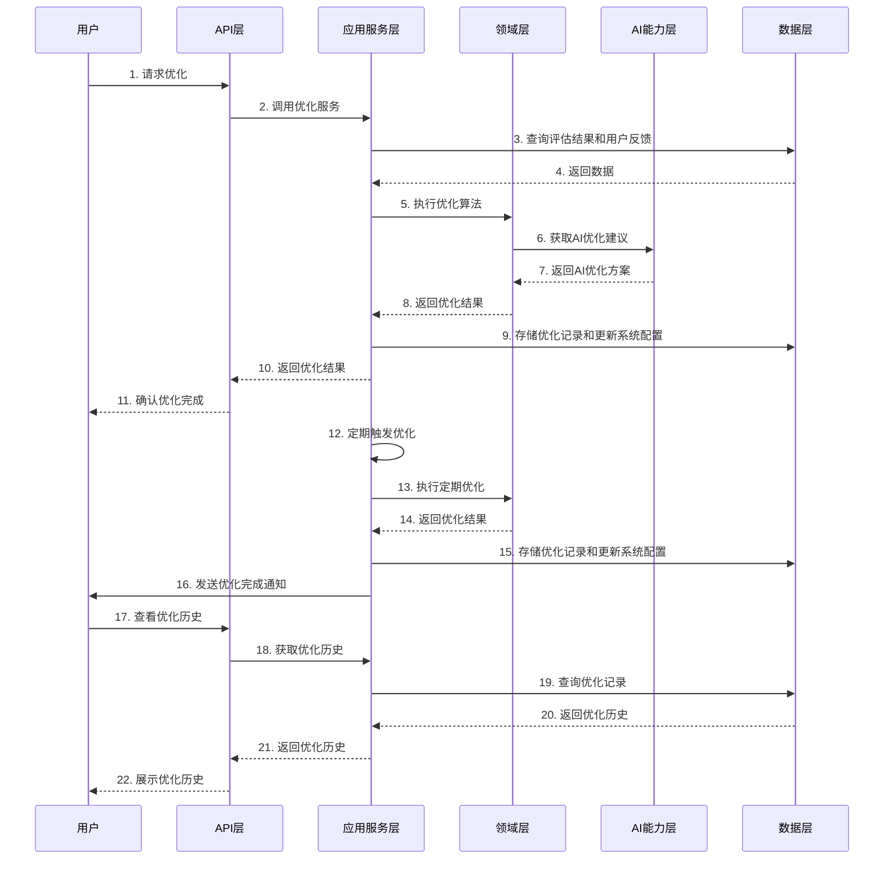

# 68-优化技术实现文档

## 1. 文档概述

### 1.1 功能定位
优化模块是认知辅助系统的核心组成部分，负责根据评估结果和用户反馈，对生成的建议进行持续优化和改进。该模块通过多种优化策略，提高建议的质量、个性化程度、排序准确性和依据清晰度，确保系统能够随着时间推移不断提升性能。优化模块实现了自动化优化流程，能够实时或定期对建议生成系统进行优化，为用户提供更好的认知辅助服务。

### 1.2 设计原则
- **Clean Architecture 分层设计**：严格遵循 Presentation/Application/Domain/Infrastructure/AI Capability 分层
- **多策略优化**：采用多种优化策略，从不同角度优化系统性能
- **自动化优化**：减少人工干预，提高优化效率和准确性
- **可扩展性**：支持添加新的优化策略和优化方法
- **数据驱动**：基于评估结果和用户反馈进行优化
- **实时与定期优化结合**：支持实时优化和定期优化两种模式

### 1.3 技术栈
- Node.js LTS (≥18)
- TypeScript (严格模式)
- Express.js
- SQLite
- Jest (测试框架)

## 2. 架构设计

### 2.1 分层结构
```
┌────────────────────┐     ┌────────────────────┐     ┌────────────────────┐
│  Presentation      │────▶│  Application       │────▶│  Domain            │
│  (API 接口层)       │     │  (应用服务层)       │     │  (领域模型层)       │
└────────────────────┘     └────────────────────┘     └────────────────────┘
                                      │                          ▲
                                      ▼                          │
┌────────────────────┐     ┌────────────────────┐     ┌────────────────────┐
│  AI Capability     │◀────│  Infrastructure    │◀────│  Cognitive Model   │
│  (AI能力层)         │     │  (基础设施层)       │     │  (认知模型)         │
└────────────────────┘     └────────────────────┘     └────────────────────┘
```

### 2.2 核心流程图



## 3. 核心组件设计

### 3.1 领域模型 (Domain)

#### 3.1.1 Refinement
```typescript
// src/domain/refinement/Refinement.ts

export interface Refinement {
  id: string;
  refinementDate: Date;
  type: RefinementType;
  status: RefinementStatus;
  target: RefinementTarget;
  strategy: string;
  parameters: Record<string, any>;
  results: RefinementResults;
  impact: RefinementImpact;
  evaluationBefore: EvaluationMetrics;
  evaluationAfter: EvaluationMetrics;
}

export enum RefinementType {
  REAL_TIME = 'REAL_TIME',
  SCHEDULED = 'SCHEDULED',
  MANUAL = 'MANUAL'
}

export enum RefinementStatus {
  PENDING = 'PENDING',
  IN_PROGRESS = 'IN_PROGRESS',
  COMPLETED = 'COMPLETED',
  FAILED = 'FAILED',
  ROLLBACKED = 'ROLLBACKED'
}

export enum RefinementTarget {
  SUGGESTION_QUALITY = 'SUGGESTION_QUALITY',
  PERSONALIZATION = 'PERSONALIZATION',
  RANKING = 'RANKING',
  JUSTIFICATION = 'JUSTIFICATION',
  OVERALL = 'OVERALL'
}

export interface RefinementResults {
  changesMade: string[];
  configurationUpdates: Record<string, any>;
  performanceImprovement: Record<string, number>;
  success: boolean;
  error?: string;
}

export enum RefinementImpact {
  HIGH = 'HIGH',
  MEDIUM = 'MEDIUM',
  LOW = 'LOW',
  NONE = 'NONE'
}
```

#### 3.1.2 RefinementStrategy (优化策略接口)
```typescript
// src/domain/refinement/RefinementStrategy.ts

export interface RefinementStrategy {
  name: string;
  canOptimize(target: RefinementTarget): boolean;
  optimize(data: RefinementData, parameters: Record<string, any>): Promise<RefinementPlan>;
  applyOptimization(plan: RefinementPlan): Promise<RefinementResults>;
  evaluateImpact(before: EvaluationMetrics, after: EvaluationMetrics): RefinementImpact;
}

export interface RefinementData {
  evaluations: Evaluation[];
  feedbacks: UserFeedback[];
  suggestions: Suggestion[];
  userProfiles: UserProfile[];
  currentConfiguration: Record<string, any>;
}

export interface RefinementPlan {
  target: RefinementTarget;
  strategy: string;
  configurationChanges: Record<string, any>;
  expectedImpact: RefinementImpact;
  estimatedImprovement: Record<string, number>;
  rollbackPlan: Record<string, any>;
}
```

### 3.2 应用服务层 (Application)

#### 3.2.1 RefinementService
```typescript
// src/application/refinement/RefinementService.ts

export interface RefinementService {
  /**
   * 执行实时优化
   */
  executeRealTimeRefinement(target: RefinementTarget, parameters?: Record<string, any>): Promise<Refinement>;
  
  /**
   * 执行定期优化
   */
  executeScheduledRefinement(): Promise<Refinement>;
  
  /**
   * 执行手动优化
   */
  executeManualRefinement(target: RefinementTarget, parameters: Record<string, any>): Promise<Refinement>;
  
  /**
   * 回滚优化
   */
  rollbackRefinement(refinementId: string): Promise<Refinement>;
  
  /**
   * 获取优化历史
   */
  getRefinementHistory(filter?: RefinementFilter): Promise<Refinement[]>;
  
  /**
   * 获取特定优化记录
   */
  getRefinementById(id: string): Promise<Refinement | null>;
  
  /**
   * 生成优化建议
   */
  generateRefinementSuggestions(): Promise<RefinementSuggestion[]>;
  
  /**
   * 获取当前配置
   */
  getCurrentConfiguration(): Promise<Record<string, any>>;
  
  /**
   * 更新配置
   */
  updateConfiguration(config: Record<string, any>): Promise<Record<string, any>>;
}

export interface RefinementFilter {
  type?: RefinementType;
  status?: RefinementStatus;
  target?: RefinementTarget;
  startDate?: Date;
  endDate?: Date;
}

export interface RefinementSuggestion {
  target: RefinementTarget;
  strategy: string;
  recommendedParameters: Record<string, any>;
  expectedImpact: RefinementImpact;
  priority: number;
  rationale: string;
}
```

### 3.3 基础设施层 (Infrastructure)

#### 3.3.1 RefinementRepository
```typescript
// src/infrastructure/repositories/RefinementRepository.ts

export interface RefinementRepository {
  createRefinement(refinement: Refinement): Promise<Refinement>;
  updateRefinement(refinement: Refinement): Promise<Refinement>;
  getRefinementById(id: string): Promise<Refinement | null>;
  getRefinements(filter?: RefinementFilter): Promise<Refinement[]>;
  getRecentRefinements(limit?: number): Promise<Refinement[]>;
  saveConfiguration(config: Record<string, any>): Promise<void>;
  getConfiguration(): Promise<Record<string, any>>;
  deleteRefinement(refinementId: string): Promise<void>;
}
```

#### 3.3.2 RefinementScheduler
```typescript
// src/infrastructure/scheduling/RefinementScheduler.ts

export interface RefinementScheduler {
  /**
   * 调度定期优化
   */
  scheduleRegularRefinements(interval: number): void;
  
  /**
   * 立即触发优化
   */
  triggerRefinement(): Promise<void>;
  
  /**
   * 取消所有调度的优化
   */
  cancelAllRefinements(): void;
}
```

### 3.4 AI能力层 (AI Capability)

#### 3.4.1 RefinementAIService
```typescript
// src/ai/RefinementAIService.ts

export interface RefinementAIService {
  /**
   * 分析数据并生成优化建议
   */
  generateRefinementSuggestions(data: RefinementData): Promise<AIRefinementSuggestion[]>;
  
  /**
   * 制定优化计划
   */
  createRefinementPlan(data: RefinementData, target: RefinementTarget): Promise<RefinementPlan>;
  
  /**
   * 评估优化方案的预期效果
   */
  evaluateRefinementPlan(plan: RefinementPlan, data: RefinementData): Promise<{ expectedImpact: RefinementImpact; estimatedImprovement: Record<string, number>; }>;
  
  /**
   * 生成配置优化建议
   */
  optimizeConfiguration(currentConfig: Record<string, any>, data: RefinementData): Promise<Record<string, any>>;
}

export interface AIRefinementSuggestion {
  target: RefinementTarget;
  strategy: string;
  parameters: Record<string, any>;
  expectedImpact: RefinementImpact;
  rationale: string;
  confidence: number;
}
```

## 4. 数据模型

### 4.1 数据库表设计

#### 4.1.1 refinements 表
| 字段名 | 数据类型 | 约束 | 描述 |
|--------|----------|------|------|
| id | TEXT | PRIMARY KEY | 优化ID |
| refinement_date | INTEGER | NOT NULL | 优化时间戳 |
| type | TEXT | NOT NULL | 优化类型 |
| status | TEXT | NOT NULL | 优化状态 |
| target | TEXT | NOT NULL | 优化目标 |
| strategy | TEXT | NOT NULL | 优化策略 |
| parameters | TEXT | NOT NULL | 优化参数（JSON格式） |
| results | TEXT | NOT NULL | 优化结果（JSON格式） |
| impact | TEXT | NOT NULL | 优化影响 |
| evaluation_before | TEXT | NOT NULL | 优化前评估指标（JSON格式） |
| evaluation_after | TEXT | NOT NULL | 优化后评估指标（JSON格式） |
| created_at | INTEGER | NOT NULL | 创建时间 |
| updated_at | INTEGER | NOT NULL | 更新时间 |

#### 4.1.2 configuration 表
| 字段名 | 数据类型 | 约束 | 描述 |
|--------|----------|------|------|
| id | TEXT | PRIMARY KEY | 配置ID |
| key | TEXT | NOT NULL | 配置键 |
| value | TEXT | NOT NULL | 配置值（JSON格式） |
| description | TEXT | | 配置描述 |
| updated_at | INTEGER | NOT NULL | 更新时间 |
| updated_by | TEXT | | 更新人 |

### 4.2 数据访问对象 (DAO)

```typescript
// src/infrastructure/repositories/dao/RefinementDao.ts

export class RefinementDao {
  id: string;
  refinement_date: number;
  type: string;
  status: string;
  target: string;
  strategy: string;
  parameters: string;
  results: string;
  impact: string;
  evaluation_before: string;
  evaluation_after: string;
  created_at: number;
  updated_at: number;
}

// src/infrastructure/repositories/dao/ConfigurationDao.ts

export class ConfigurationDao {
  id: string;
  key: string;
  value: string;
  description?: string;
  updated_at: number;
  updated_by?: string;
}
```

## 5. API 设计

### 5.1 RESTful API 接口

#### 5.1.1 优化执行

| API路径 | 方法 | 功能描述 | 请求体 | 响应体 | 权限 |
|---------|------|----------|--------|--------|------|
| /api/refinement/real-time | POST | 执行实时优化 | RealTimeRefinementDto | Refinement | 管理员 |
| /api/refinement/scheduled | POST | 执行定期优化 | - | Refinement | 管理员 |
| /api/refinement/manual | POST | 执行手动优化 | ManualRefinementDto | Refinement | 管理员 |
| /api/refinement/:id/rollback | POST | 回滚优化 | - | Refinement | 管理员 |

#### 5.1.2 优化历史管理

| API路径 | 方法 | 功能描述 | 请求体 | 响应体 | 权限 |
|---------|------|----------|--------|--------|------|
| /api/refinement/history | GET | 获取优化历史 | - | Refinement[] | 管理员 |
| /api/refinement/:id | GET | 获取特定优化记录 | - | Refinement | 管理员 |
| /api/refinement/:id | DELETE | 删除优化记录 | - | - | 管理员 |

#### 5.1.3 优化建议

| API路径 | 方法 | 功能描述 | 请求体 | 响应体 | 权限 |
|---------|------|----------|--------|--------|------|
| /api/refinement/suggestions | GET | 获取优化建议 | - | RefinementSuggestion[] | 管理员 |

#### 5.1.4 配置管理

| API路径 | 方法 | 功能描述 | 请求体 | 响应体 | 权限 |
|---------|------|----------|--------|--------|------|
| /api/refinement/configuration | GET | 获取当前配置 | - | Record<string, any> | 管理员 |
| /api/refinement/configuration | PUT | 更新配置 | Record<string, any> | Record<string, any> | 管理员 |
| /api/refinement/configuration/:key | GET | 获取特定配置项 | - | any | 管理员 |
| /api/refinement/configuration/:key | PUT | 更新特定配置项 | any | any | 管理员 |

### 5.2 请求/响应 DTOs

```typescript
// src/presentation/dtos/refinement/RealTimeRefinementDto.ts

export interface RealTimeRefinementDto {
  target: RefinementTarget;
  parameters?: Record<string, any>;
}

// src/presentation/dtos/refinement/ManualRefinementDto.ts

export interface ManualRefinementDto {
  target: RefinementTarget;
  parameters: Record<string, any>;
}
```

## 6. 实现细节

### 6.1 优化策略实现

#### 6.1.1 基于评估的优化策略
```typescript
// src/domain/refinement/strategies/EvaluationBasedRefinementStrategy.ts

export class EvaluationBasedRefinementStrategy implements RefinementStrategy {
  name = 'evaluation-based';
  
  canOptimize(target: RefinementTarget): boolean {
    return true; // 支持所有优化目标
  }
  
  async optimize(data: RefinementData, parameters: Record<string, any>): Promise<RefinementPlan> {
    // 分析评估数据，识别需要优化的领域
    const optimizationAreas = this.identifyOptimizationAreas(data.evaluations);
    
    // 根据优化目标确定具体的优化方向
    const targetAreas = this.filterByTarget(optimizationAreas, parameters.target as RefinementTarget);
    
    // 制定优化计划
    const configurationChanges = this.generateConfigurationChanges(targetAreas, data.currentConfiguration);
    
    // 创建回滚计划
    const rollbackPlan = this.createRollbackPlan(configurationChanges, data.currentConfiguration);
    
    return {
      target: parameters.target as RefinementTarget,
      strategy: this.name,
      configurationChanges,
      expectedImpact: RefinementImpact.MEDIUM,
      estimatedImprovement: this.estimateImprovement(targetAreas),
      rollbackPlan
    };
  }
  
  async applyOptimization(plan: RefinementPlan): Promise<RefinementResults> {
    try {
      // 应用配置更改
      await this.updateConfiguration(plan.configurationChanges);
      
      return {
        changesMade: Object.keys(plan.configurationChanges),
        configurationUpdates: plan.configurationChanges,
        performanceImprovement: plan.estimatedImprovement,
        success: true
      };
    } catch (error) {
      return {
        changesMade: [],
        configurationUpdates: {},
        performanceImprovement: {},
        success: false,
        error: (error as Error).message
      };
    }
  }
  
  evaluateImpact(before: EvaluationMetrics, after: EvaluationMetrics): RefinementImpact {
    // 计算各项指标的改进幅度
    const improvement = {
      suggestionQuality: after.suggestionQuality - before.suggestionQuality,
      personalizationAccuracy: after.personalizationAccuracy - before.personalizationAccuracy,
      rankingRelevance: after.rankingRelevance - before.rankingRelevance,
      justificationClarity: after.justificationClarity - before.justificationClarity,
      userSatisfaction: after.userSatisfaction - before.userSatisfaction
    };
    
    // 根据改进幅度确定影响级别
    const avgImprovement = Object.values(improvement).reduce((sum, val) => sum + val, 0) / Object.keys(improvement).length;
    
    if (avgImprovement > 0.15) return RefinementImpact.HIGH;
    if (avgImprovement > 0.05) return RefinementImpact.MEDIUM;
    if (avgImprovement > 0) return RefinementImpact.LOW;
    return RefinementImpact.NONE;
  }
  
  private identifyOptimizationAreas(evaluations: Evaluation[]): OptimizationArea[] {
    // 分析评估数据，识别需要优化的领域
    // ...
  }
  
  private filterByTarget(areas: OptimizationArea[], target: RefinementTarget): OptimizationArea[] {
    // 根据优化目标过滤优化领域
    // ...
  }
  
  private generateConfigurationChanges(areas: OptimizationArea[], currentConfig: Record<string, any>): Record<string, any> {
    // 根据优化领域生成配置更改
    // ...
  }
  
  private createRollbackPlan(changes: Record<string, any>, currentConfig: Record<string, any>): Record<string, any> {
    // 创建回滚计划，保存当前配置
    // ...
  }
  
  private estimateImprovement(areas: OptimizationArea[]): Record<string, number> {
    // 估计优化改进幅度
    // ...
  }
  
  private async updateConfiguration(changes: Record<string, any>): Promise<void> {
    // 更新系统配置
    // ...
  }
}

interface OptimizationArea {
  metric: keyof EvaluationMetrics;
  currentValue: number;
  targetValue: number;
  priority: number;
  suggestedChanges: Record<string, any>;
}
```

#### 6.1.2 AI辅助优化策略
```typescript
// src/domain/refinement/strategies/AIAssistedRefinementStrategy.ts

export class AIAssistedRefinementStrategy implements RefinementStrategy {
  name = 'ai-assisted';
  
  constructor(private readonly refinementAIService: RefinementAIService) {}
  
  canOptimize(target: RefinementTarget): boolean {
    return true; // 支持所有优化目标
  }
  
  async optimize(data: RefinementData, parameters: Record<string, any>): Promise<RefinementPlan> {
    // 使用AI生成优化建议
    const aiSuggestions = await this.refinementAIService.generateRefinementSuggestions(data);
    
    // 根据优化目标过滤AI建议
    const relevantSuggestions = aiSuggestions.filter(suggestion => 
      suggestion.target === parameters.target || parameters.target === RefinementTarget.OVERALL
    );
    
    // 制定优化计划
    const plan = await this.refinementAIService.createRefinementPlan(data, parameters.target as RefinementTarget);
    
    // 评估优化计划
    const evaluation = await this.refinementAIService.evaluateRefinementPlan(plan, data);
    
    return {
      ...plan,
      expectedImpact: evaluation.expectedImpact,
      estimatedImprovement: evaluation.estimatedImprovement
    };
  }
  
  async applyOptimization(plan: RefinementPlan): Promise<RefinementResults> {
    try {
      // 应用AI生成的配置更改
      await this.updateConfiguration(plan.configurationChanges);
      
      return {
        changesMade: Object.keys(plan.configurationChanges),
        configurationUpdates: plan.configurationChanges,
        performanceImprovement: plan.estimatedImprovement,
        success: true
      };
    } catch (error) {
      return {
        changesMade: [],
        configurationUpdates: {},
        performanceImprovement: {},
        success: false,
        error: (error as Error).message
      };
    }
  }
  
  evaluateImpact(before: EvaluationMetrics, after: EvaluationMetrics): RefinementImpact {
    // 与基于评估的优化策略相同
    const improvement = {
      suggestionQuality: after.suggestionQuality - before.suggestionQuality,
      personalizationAccuracy: after.personalizationAccuracy - before.personalizationAccuracy,
      rankingRelevance: after.rankingRelevance - before.rankingRelevance,
      justificationClarity: after.justificationClarity - before.justificationClarity,
      userSatisfaction: after.userSatisfaction - before.userSatisfaction
    };
    
    const avgImprovement = Object.values(improvement).reduce((sum, val) => sum + val, 0) / Object.keys(improvement).length;
    
    if (avgImprovement > 0.15) return RefinementImpact.HIGH;
    if (avgImprovement > 0.05) return RefinementImpact.MEDIUM;
    if (avgImprovement > 0) return RefinementImpact.LOW;
    return RefinementImpact.NONE;
  }
  
  private async updateConfiguration(changes: Record<string, any>): Promise<void> {
    // 更新系统配置
    // ...
  }
}
```

### 6.2 优化服务实现

```typescript
// src/application/refinement/RefinementServiceImpl.ts

export class RefinementServiceImpl implements RefinementService {
  constructor(
    private readonly refinementRepository: RefinementRepository,
    private readonly evaluationService: EvaluationService,
    private readonly feedbackService: FeedbackService,
    private readonly suggestionService: SuggestionService,
    private readonly userProfileService: UserProfileService,
    private readonly refinementAIService: RefinementAIService,
    private readonly refinementStrategies: RefinementStrategy[],
    private readonly refinementLogger: RefinementLogger
  ) {}
  
  async executeRealTimeRefinement(target: RefinementTarget, parameters?: Record<string, any>): Promise<Refinement> {
    return this.executeRefinement(RefinementType.REAL_TIME, target, parameters || {});
  }
  
  async executeScheduledRefinement(): Promise<Refinement> {
    return this.executeRefinement(RefinementType.SCHEDULED, RefinementTarget.OVERALL, {});
  }
  
  async executeManualRefinement(target: RefinementTarget, parameters: Record<string, any>): Promise<Refinement> {
    return this.executeRefinement(RefinementType.MANUAL, target, parameters);
  }
  
  private async executeRefinement(type: RefinementType, target: RefinementTarget, parameters: Record<string, any>): Promise<Refinement> {
    const refinementId = uuidv4();
    
    // 获取当前配置
    const currentConfiguration = await this.getCurrentConfiguration();
    
    // 收集优化数据
    const refinementData: RefinementData = {
      evaluations: await this.evaluationService.getRecentEvaluations(10),
      feedbacks: await this.feedbackService.getRecentFeedbacks(100),
      suggestions: await this.suggestionService.getRecentSuggestions(100),
      userProfiles: await this.userProfileService.getAllUserProfiles(),
      currentConfiguration
    };
    
    // 执行优化前评估
    const evaluationBefore = await this.evaluationService.executeRealTimeEvaluation();
    
    // 创建优化记录
    const refinement: Refinement = {
      id: refinementId,
      refinementDate: new Date(),
      type,
      status: RefinementStatus.IN_PROGRESS,
      target,
      strategy: parameters.strategy || 'ai-assisted',
      parameters: { ...parameters, target },
      results: {
        changesMade: [],
        configurationUpdates: {},
        performanceImprovement: {},
        success: false
      },
      impact: RefinementImpact.NONE,
      evaluationBefore: evaluationBefore.metrics,
      evaluationAfter: evaluationBefore.metrics
    };
    
    // 保存优化记录
    await this.refinementRepository.createRefinement(refinement);
    this.refinementLogger.logRefinementStart(refinementId, type, target);
    
    try {
      // 选择优化策略
      const strategy = this.refinementStrategies.find(s => s.name === refinement.strategy) || 
                     this.refinementStrategies.find(s => s.name === 'ai-assisted')!;
      
      // 制定优化计划
      const plan = await strategy.optimize(refinementData, refinement.parameters);
      
      // 应用优化
      const results = await strategy.applyOptimization(plan);
      
      // 更新配置
      await this.updateConfiguration(plan.configurationChanges);
      
      // 执行优化后评估
      const evaluationAfter = await this.evaluationService.executeRealTimeEvaluation();
      
      // 评估优化影响
      const impact = strategy.evaluateImpact(evaluationBefore.metrics, evaluationAfter.metrics);
      
      // 更新优化记录
      refinement.status = RefinementStatus.COMPLETED;
      refinement.results = results;
      refinement.impact = impact;
      refinement.evaluationAfter = evaluationAfter.metrics;
      
      await this.refinementRepository.updateRefinement(refinement);
      
      this.refinementLogger.logRefinementComplete(refinementId, type, target, impact);
      return refinement;
    } catch (error) {
      // 更新优化记录为失败状态
      refinement.status = RefinementStatus.FAILED;
      refinement.results = {
        changesMade: [],
        configurationUpdates: {},
        performanceImprovement: {},
        success: false,
        error: (error as Error).message
      };
      
      await this.refinementRepository.updateRefinement(refinement);
      
      this.refinementLogger.logRefinementFailed(refinementId, type, target, error as Error);
      throw error;
    }
  }
  
  async rollbackRefinement(refinementId: string): Promise<Refinement> {
    // 实现回滚优化逻辑
    // ...
  }
  
  // 其他方法实现...
}
```

## 7. 测试策略

### 7.1 单元测试

```typescript
// src/domain/refinement/strategies/EvaluationBasedRefinementStrategy.test.ts

describe('EvaluationBasedRefinementStrategy', () => {
  let strategy: EvaluationBasedRefinementStrategy;
  
  beforeEach(() => {
    strategy = new EvaluationBasedRefinementStrategy();
  });
  
  describe('canOptimize', () => {
    it('should return true for all refinement targets', () => {
      // Arrange & Act
      const result1 = strategy.canOptimize(RefinementTarget.SUGGESTION_QUALITY);
      const result2 = strategy.canOptimize(RefinementTarget.PERSONALIZATION);
      const result3 = strategy.canOptimize(RefinementTarget.RANKING);
      const result4 = strategy.canOptimize(RefinementTarget.JUSTIFICATION);
      const result5 = strategy.canOptimize(RefinementTarget.OVERALL);
      
      // Assert
      expect(result1).toBe(true);
      expect(result2).toBe(true);
      expect(result3).toBe(true);
      expect(result4).toBe(true);
      expect(result5).toBe(true);
    });
  });
  
  describe('evaluateImpact', () => {
    it('should return HIGH impact for significant improvement', () => {
      // Arrange
      const before: EvaluationMetrics = {
        suggestionQuality: 0.5,
        personalizationAccuracy: 0.5,
        rankingRelevance: 0.5,
        justificationClarity: 0.5,
        userSatisfaction: 0.5,
        coverage: 0.5,
        diversity: 0.5,
        novelty: 0.5
      };
      
      const after: EvaluationMetrics = {
        suggestionQuality: 0.8,
        personalizationAccuracy: 0.8,
        rankingRelevance: 0.8,
        justificationClarity: 0.8,
        userSatisfaction: 0.8,
        coverage: 0.8,
        diversity: 0.8,
        novelty: 0.8
      };
      
      // Act
      const result = strategy.evaluateImpact(before, after);
      
      // Assert
      expect(result).toBe(RefinementImpact.HIGH);
    });
    
    it('should return NONE impact for no improvement', () => {
      // Arrange
      const before: EvaluationMetrics = {
        suggestionQuality: 0.5,
        personalizationAccuracy: 0.5,
        rankingRelevance: 0.5,
        justificationClarity: 0.5,
        userSatisfaction: 0.5,
        coverage: 0.5,
        diversity: 0.5,
        novelty: 0.5
      };
      
      const after: EvaluationMetrics = {
        suggestionQuality: 0.5,
        personalizationAccuracy: 0.5,
        rankingRelevance: 0.5,
        justificationClarity: 0.5,
        userSatisfaction: 0.5,
        coverage: 0.5,
        diversity: 0.5,
        novelty: 0.5
      };
      
      // Act
      const result = strategy.evaluateImpact(before, after);
      
      // Assert
      expect(result).toBe(RefinementImpact.NONE);
    });
  });
  
  // 其他测试用例...
});
```

### 7.2 集成测试

```typescript
// src/application/refinement/RefinementServiceImpl.test.ts

describe('RefinementServiceImpl', () => {
  let refinementService: RefinementServiceImpl;
  let mockRefinementRepository: jest.Mocked<RefinementRepository>;
  let mockEvaluationService: jest.Mocked<EvaluationService>;
  let mockFeedbackService: jest.Mocked<FeedbackService>;
  let mockSuggestionService: jest.Mocked<SuggestionService>;
  let mockUserProfileService: jest.Mocked<UserProfileService>;
  let mockRefinementAIService: jest.Mocked<RefinementAIService>;
  let mockRefinementLogger: jest.Mocked<RefinementLogger>;
  
  beforeEach(() => {
    // 初始化 mock 服务
    mockRefinementRepository = {
      createRefinement: jest.fn(),
      updateRefinement: jest.fn(),
      getRefinementById: jest.fn(),
      getRefinements: jest.fn(),
      getRecentRefinements: jest.fn(),
      saveConfiguration: jest.fn(),
      getConfiguration: jest.fn(),
      deleteRefinement: jest.fn()
    };
    
    // 其他 mock 服务初始化...
    
    refinementService = new RefinementServiceImpl(
      mockRefinementRepository,
      mockEvaluationService,
      mockFeedbackService,
      mockSuggestionService,
      mockUserProfileService,
      mockRefinementAIService,
      [new EvaluationBasedRefinementStrategy()],
      mockRefinementLogger
    );
  });
  
  describe('executeRealTimeRefinement', () => {
    it('should execute a real-time refinement successfully', async () => {
      // Arrange
      const mockEvaluation: Evaluation = {
        id: 'test-eval',
        evaluationDate: new Date(),
        type: EvaluationType.REAL_TIME,
        status: EvaluationStatus.COMPLETED,
        metrics: {
          suggestionQuality: 0.5,
          personalizationAccuracy: 0.5,
          rankingRelevance: 0.5,
          justificationClarity: 0.5,
          userSatisfaction: 0.5,
          coverage: 0.5,
          diversity: 0.5,
          novelty: 0.5
        },
        report: {
          summary: '',
          strengths: [],
          weaknesses: [],
          recommendations: [],
          detailedAnalysis: {}
        },
        config: {
          metrics: [],
          sampleSize: 100,
          evaluationPeriod: 1440,
          aiAssisted: false
        }
      };
      
      mockEvaluationService.executeRealTimeEvaluation.mockResolvedValue(mockEvaluation);
      mockRefinementRepository.getConfiguration.mockResolvedValue({});
      mockFeedbackService.getRecentFeedbacks.mockResolvedValue([]);
      mockSuggestionService.getRecentSuggestions.mockResolvedValue([]);
      mockUserProfileService.getAllUserProfiles.mockResolvedValue([]);
      mockEvaluationService.getRecentEvaluations.mockResolvedValue([]);
      
      // Act
      const result = await refinementService.executeRealTimeRefinement(RefinementTarget.SUGGESTION_QUALITY);
      
      // Assert
      expect(result).toHaveProperty('id');
      expect(result.type).toBe(RefinementType.REAL_TIME);
      expect(result.status).toBe(RefinementStatus.COMPLETED);
      expect(mockRefinementRepository.createRefinement).toHaveBeenCalled();
      expect(mockRefinementRepository.updateRefinement).toHaveBeenCalled();
    });
  });
  
  // 其他测试用例...
});
```

### 7.3 端到端测试

```typescript
// test/e2e/refinement.test.ts

describe('Refinement API E2E Tests', () => {
  let app: Express;
  let server: http.Server;
  let agent: supertest.SuperAgentTest;
  
  beforeAll(async () => {
    // 初始化 Express 应用
    app = await setupApp();
    server = app.listen(0);
    agent = supertest.agent(app);
    
    // 初始化测试数据
    await initializeTestData();
  });
  
  afterAll(async () => {
    // 清理测试数据
    await cleanupTestData();
    server.close();
  });
  
  describe('POST /api/refinement/real-time', () => {
    it('should execute a real-time refinement', async () => {
      // Act
      const response = await agent.post('/api/refinement/real-time').send({
        target: RefinementTarget.SUGGESTION_QUALITY
      });
      
      // Assert
      expect(response.status).toBe(201);
      expect(response.body).toHaveProperty('id');
      expect(response.body.type).toBe(RefinementType.REAL_TIME);
      expect(response.body.status).toBe(RefinementStatus.COMPLETED);
    });
  });
  
  describe('GET /api/refinement/configuration', () => {
    it('should return the current configuration', async () => {
      // Act
      const response = await agent.get('/api/refinement/configuration');
      
      // Assert
      expect(response.status).toBe(200);
      expect(typeof response.body).toBe('object');
    });
  });
  
  describe('PUT /api/refinement/configuration', () => {
    it('should update the configuration', async () => {
      // Act
      const response = await agent.put('/api/refinement/configuration').send({
        testKey: 'testValue'
      });
      
      // Assert
      expect(response.status).toBe(200);
      expect(response.body).toHaveProperty('testKey', 'testValue');
    });
  });
  
  // 其他测试用例...
});
```

## 8. 部署与运维

### 8.1 部署架构

```
┌─────────────────────────────────────────────────────────────────┐
│                      负载均衡器 (Nginx)                          │
└───────────┬─────────────────────────────────────────────────────┘
            │
┌───────────┴─────────────────────────────────────────────────────┐
│                      应用服务器集群                              │
│  ┌─────────────────┐  ┌─────────────────┐  ┌─────────────────┐  │
│  │ Refinement API  │  │ Refinement API  │  │ Refinement API  │  │
│  └─────────────────┘  └─────────────────┘  └─────────────────┘  │
└───────────┬─────────────────────────────────────────────────────┘
            │
┌───────────┴─────────────────────────────────────────────────────┐
│                      数据库集群 (SQLite)                        │
└───────────┬─────────────────────────────────────────────────────┘
            │
┌───────────┴─────────────────────────────────────────────────────┐
│                      AI 服务 (OpenAI API)                        │
└─────────────────────────────────────────────────────────────────┘
```

### 8.2 环境配置

| 环境变量 | 描述 | 默认值 |
|----------|------|--------|
| NODE_ENV | 运行环境 | development |
| PORT | 服务端口 | 3000 |
| DATABASE_URL | 数据库连接URL | ./data/cognitive-assistant.db |
| OPENAI_API_KEY | OpenAI API 密钥 | - |
| REFINEMENT_INTERVAL | 定期优化间隔（分钟） | 1440（24小时） |
| REFINEMENT_SAMPLE_SIZE | 优化样本大小 | 1000 |
| AI_ASSISTED_REFINEMENT | 是否启用AI辅助优化 | true |
| MAX_REFINEMENT_HISTORY | 最大优化历史记录数 | 100 |

### 8.3 数据迁移

```typescript
// src/infrastructure/database/migrations/007-refinement-tables.ts

export const up = async (db: Database): Promise<void> => {
  await db.exec(`
    CREATE TABLE IF NOT EXISTS refinements (
      id TEXT PRIMARY KEY,
      refinement_date INTEGER NOT NULL,
      type TEXT NOT NULL,
      status TEXT NOT NULL,
      target TEXT NOT NULL,
      strategy TEXT NOT NULL,
      parameters TEXT NOT NULL,
      results TEXT NOT NULL,
      impact TEXT NOT NULL,
      evaluation_before TEXT NOT NULL,
      evaluation_after TEXT NOT NULL,
      created_at INTEGER NOT NULL,
      updated_at INTEGER NOT NULL
    );
    
    CREATE TABLE IF NOT EXISTS configuration (
      id TEXT PRIMARY KEY,
      key TEXT NOT NULL UNIQUE,
      value TEXT NOT NULL,
      description TEXT,
      updated_at INTEGER NOT NULL,
      updated_by TEXT
    );
    
    -- 初始化默认配置
    INSERT INTO configuration (id, key, value, description, updated_at) VALUES
    ('1', 'suggestionQuality.weight', '0.2', '建议质量权重', ${Date.now()}),
    ('2', 'personalization.weight', '0.2', '个性化权重', ${Date.now()}),
    ('3', 'ranking.weight', '0.2', '排序权重', ${Date.now()}),
    ('4', 'justification.weight', '0.2', '依据权重', ${Date.now()}),
    ('5', 'userSatisfaction.weight', '0.2', '用户满意度权重', ${Date.now()}),
    ('6', 'aiAssistedRefinement', 'true', '是否启用AI辅助优化', ${Date.now()}),
    ('7', 'refinementInterval', '1440', '定期优化间隔（分钟）', ${Date.now()});
    
    CREATE INDEX IF NOT EXISTS idx_refinements_type ON refinements (type);
    CREATE INDEX IF NOT EXISTS idx_refinements_status ON refinements (status);
    CREATE INDEX IF NOT EXISTS idx_refinements_target ON refinements (target);
    CREATE INDEX IF NOT EXISTS idx_refinements_date ON refinements (refinement_date);
    CREATE INDEX IF NOT EXISTS idx_configuration_key ON configuration (key);
  `);
};

export const down = async (db: Database): Promise<void> => {
  await db.exec(`
    DROP TABLE IF EXISTS configuration;
    DROP TABLE IF EXISTS refinements;
  `);
};
```

## 9. 性能优化

### 9.1 缓存策略

```typescript
// src/infrastructure/cache/RefinementCache.ts

export class RefinementCache {
  private readonly cache = new Map<string, any>();
  private readonly ttl = 3600000; // 1小时
  
  get<T>(key: string): T | null {
    const item = this.cache.get(key);
    if (!item) {
      return null;
    }
    
    if (Date.now() > item.expiry) {
      this.cache.delete(key);
      return null;
    }
    
    return item.value as T;
  }
  
  set<T>(key: string, value: T): void {
    this.cache.set(key, { 
      value, 
      expiry: Date.now() + this.ttl 
    });
  }
  
  delete(key: string): void {
    this.cache.delete(key);
  }
  
  clear(): void {
    this.cache.clear();
  }
  
  // 缓存配置
  getConfiguration(): Record<string, any> | null {
    return this.get<Record<string, any>>('configuration');
  }
  
  setConfiguration(config: Record<string, any>): void {
    this.set('configuration', config);
  }
  
  // 缓存优化建议
  getRefinementSuggestions(): RefinementSuggestion[] | null {
    return this.get<RefinementSuggestion[]>('refinement-suggestions');
  }
  
  setRefinementSuggestions(suggestions: RefinementSuggestion[]): void {
    this.set('refinement-suggestions', suggestions);
  }
}
```

### 9.2 并行数据收集

```typescript
// src/application/refinement/RefinementServiceImpl.ts

export class RefinementServiceImpl implements RefinementService {
  // ...
  
  private async collectRefinementData(): Promise<RefinementData> {
    // 并行收集数据，提高性能
    const [evaluations, feedbacks, suggestions, userProfiles, currentConfiguration] = await Promise.all([
      this.evaluationService.getRecentEvaluations(10),
      this.feedbackService.getRecentFeedbacks(100),
      this.suggestionService.getRecentSuggestions(100),
      this.userProfileService.getAllUserProfiles(),
      this.getCurrentConfiguration()
    ]);
    
    return {
      evaluations,
      feedbacks,
      suggestions,
      userProfiles,
      currentConfiguration
    };
  }
  
  // ...
}
```

### 9.3 数据库优化

```typescript
// src/infrastructure/repositories/SqliteRefinementRepository.ts

export class SqliteRefinementRepository implements RefinementRepository {
  // ...
  
  async getRecentRefinements(limit: number): Promise<Refinement[]> {
    const stmt = await this.db.prepare(
      `SELECT * FROM refinements 
       ORDER BY refinement_date DESC 
       LIMIT ?`
    );
    
    const rows = await stmt.all(limit);
    await stmt.finalize();
    
    return rows.map(row => this.mapRowToRefinement(row));
  }
  
  async getConfiguration(): Promise<Record<string, any>> {
    const stmt = await this.db.prepare(
      `SELECT key, value FROM configuration`
    );
    
    const rows = await stmt.all();
    await stmt.finalize();
    
    const config: Record<string, any> = {};
    for (const row of rows) {
      try {
        config[row.key] = JSON.parse(row.value);
      } catch {
        config[row.key] = row.value;
      }
    }
    
    return config;
  }
  
  // ...
}
```

## 10. 监控与日志

### 10.1 日志记录

```typescript
// src/infrastructure/logger/RefinementLogger.ts

export class RefinementLogger {
  private readonly logger = createLogger('refinement');
  
  logRefinementStart(refinementId: string, type: RefinementType, target: RefinementTarget): void {
    this.logger.info(`开始${this.getTypeLabel(type)}优化: ${refinementId}, 目标: ${this.getTargetLabel(target)}`);
  }
  
  logRefinementComplete(refinementId: string, type: RefinementType, target: RefinementTarget, impact: RefinementImpact): void {
    this.logger.info(`完成${this.getTypeLabel(type)}优化: ${refinementId}, 目标: ${this.getTargetLabel(target)}, 影响: ${this.getImpactLabel(impact)}`);
  }
  
  logRefinementFailed(refinementId: string, type: RefinementType, target: RefinementTarget, error: Error): void {
    this.logger.error(`${this.getTypeLabel(type)}优化失败: ${refinementId}, 目标: ${this.getTargetLabel(target)}, 错误: ${error.message}`, {
      error: error.stack
    });
  }
  
  logRefinementRollback(refinementId: string, type: RefinementType, target: RefinementTarget): void {
    this.logger.info(`回滚${this.getTypeLabel(type)}优化: ${refinementId}, 目标: ${this.getTargetLabel(target)}`);
  }
  
  logConfigurationUpdate(changes: Record<string, any>): void {
    this.logger.info('配置已更新', {
      updatedKeys: Object.keys(changes)
    });
  }
  
  private getTypeLabel(type: RefinementType): string {
    switch (type) {
      case RefinementType.REAL_TIME:
        return '实时';
      case RefinementType.SCHEDULED:
        return '定期';
      case RefinementType.MANUAL:
        return '手动';
      default:
        return '未知';
    }
  }
  
  private getTargetLabel(target: RefinementTarget): string {
    switch (target) {
      case RefinementTarget.SUGGESTION_QUALITY:
        return '建议质量';
      case RefinementTarget.PERSONALIZATION:
        return '个性化';
      case RefinementTarget.RANKING:
        return '排序';
      case RefinementTarget.JUSTIFICATION:
        return '依据';
      case RefinementTarget.OVERALL:
        return '整体';
      default:
        return '未知';
    }
  }
  
  private getImpactLabel(impact: RefinementImpact): string {
    switch (impact) {
      case RefinementImpact.HIGH:
        return '高';
      case RefinementImpact.MEDIUM:
        return '中';
      case RefinementImpact.LOW:
        return '低';
      case RefinementImpact.NONE:
        return '无';
      default:
        return '未知';
    }
  }
}
```

### 10.2 监控指标

| 指标名称 | 类型 | 描述 |
|----------|------|------|
| refinement_requests_total | Counter | 优化请求总数 |
| refinement_duration_seconds | Histogram | 优化持续时间 |
| refinement_success_total | Counter | 成功优化数 |
| refinement_failure_total | Counter | 失败优化数 |
| refinement_rollback_total | Counter | 回滚优化数 |
| refinement_type_total | Counter | 各类型优化数量 |
| refinement_target_total | Counter | 各目标优化数量 |
| refinement_impact_total | Counter | 各影响级别优化数量 |
| configuration_updates_total | Counter | 配置更新次数 |
| average_refinement_improvement | Gauge | 平均优化改进幅度 |
| ai_assisted_refinement_total | Counter | AI辅助优化数量 |

## 11. 总结与展望

### 11.1 实现总结
优化模块实现了一个全面、自动化的优化系统，能够根据评估结果和用户反馈，对认知辅助系统进行持续优化和改进。该模块支持实时优化、定期优化和手动优化三种模式，使用基于评估的优化策略和AI辅助优化策略，能够优化建议质量、个性化程度、排序准确性和依据清晰度等多个方面。优化模块采用了 Clean Architecture 设计，具有良好的可扩展性和可维护性，支持添加新的优化策略和优化方法。

### 11.2 未来改进方向
1. **自适应优化策略**：引入机器学习模型，根据历史优化结果自动调整优化策略和参数
2. **多目标优化算法**：实现多目标优化算法，同时优化多个相互冲突的目标
3. **渐进式优化**：支持渐进式优化，逐步应用优化更改，降低风险
4. **A/B测试集成**：集成A/B测试功能，在实际环境中验证优化效果
5. **优化效果预测**：使用AI预测优化方案的预期效果，提高优化的准确性
6. **自动回滚机制**：当优化效果不佳时，自动回滚到之前的配置
7. **优化建议优先级排序**：根据潜在影响和实施成本，对优化建议进行优先级排序
8. **优化过程可视化**：提供优化过程的可视化展示，帮助管理员理解优化过程

### 11.3 关键成功因素
1. **数据驱动优化**：基于实际评估结果和用户反馈进行优化，确保优化的有效性
2. **多策略结合**：采用多种优化策略，从不同角度优化系统性能
3. **自动化流程**：减少人工干预，提高优化效率和准确性
4. **可扩展性**：支持添加新的优化策略和优化方法，适应系统的不断发展
5. **风险控制**：实现回滚机制，降低优化风险
6. **AI辅助**：利用AI技术提高优化的准确性和效率
7. **全面监控**：提供全面的监控和日志记录，便于跟踪优化效果
8. **灵活配置**：支持灵活的配置管理，便于调整优化参数和策略

通过实现优化模块，认知辅助系统将能够持续优化自身性能，随着时间推移不断提升建议质量、个性化程度、排序准确性和依据清晰度，为用户提供更好的认知辅助服务。优化模块的实现将确保系统能够适应不断变化的用户需求和环境，保持长期的竞争力和有效性。