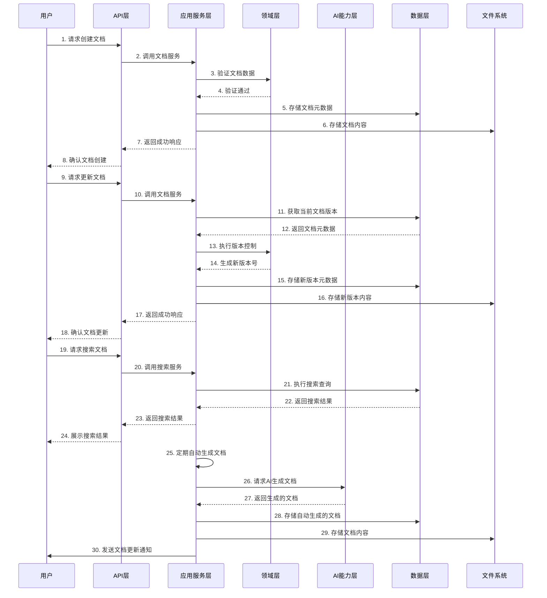

# 69-文档管理技术实现文档

## 1. 文档概述

### 1.1 功能定位
文档管理模块是认知辅助系统的重要组成部分，负责管理系统的各类文档，包括技术文档、用户文档、API文档、设计文档等。该模块提供了文档的创建、更新、查询、版本管理、搜索和导出等功能，确保系统文档的完整性、准确性和可访问性。文档管理模块还支持文档的自动生成和更新，提高文档维护的效率和质量。

### 1.2 设计原则
- **Clean Architecture 分层设计**：严格遵循 Presentation/Application/Domain/Infrastructure/AI Capability 分层
- **文档即代码**：将文档视为系统的重要组成部分，采用版本控制和自动化管理
- **自动化文档生成**：支持从代码和系统数据自动生成文档
- **多格式支持**：支持多种文档格式，如 Markdown、HTML、PDF 等
- **全文搜索**：提供强大的文档搜索功能
- **权限管理**：支持文档的权限控制和访问管理
- **版本控制**：实现文档的版本管理和历史记录

### 1.3 技术栈
- Node.js LTS (≥18)
- TypeScript (严格模式)
- Express.js
- SQLite
- Jest (测试框架)
- Markdown-it (Markdown 解析)
- PDFKit (PDF 生成)
- Elasticsearch (可选，用于全文搜索)

## 2. 架构设计

### 2.1 分层结构
```
┌────────────────────┐     ┌────────────────────┐     ┌────────────────────┐
│  Presentation      │────▶│  Application       │────▶│  Domain            │
│  (API 接口层)       │     │  (应用服务层)       │     │  (领域模型层)       │
└────────────────────┘     └────────────────────┘     └────────────────────┘
                                      │                          ▲
                                      ▼                          │
┌────────────────────┐     ┌────────────────────┐     ┌────────────────────┐
│  AI Capability     │◀────│  Infrastructure    │◀────│  Cognitive Model   │
│  (AI能力层)         │     │  (基础设施层)       │     │  (认知模型)         │
└────────────────────┘     └────────────────────┘     └────────────────────┘
```

### 2.2 核心流程图



## 3. 核心组件设计

### 3.1 领域模型 (Domain)

#### 3.1.1 Document
```typescript
// src/domain/document/Document.ts

export interface Document {
  id: string;
  title: string;
  type: DocumentType;
  category: string;
  author: string;
  createdAt: Date;
  updatedAt: Date;
  version: string;
  status: DocumentStatus;
  tags: string[];
  metadata: Record<string, any>;
  contentPath: string;
  contentHash: string;
  parentId?: string;
}

export enum DocumentType {
  TECHNICAL = 'TECHNICAL',
  USER = 'USER',
  API = 'API',
  DESIGN = 'DESIGN',
  TEST = 'TEST',
  REQUIREMENT = 'REQUIREMENT',
  OTHER = 'OTHER'
}

export enum DocumentStatus {
  DRAFT = 'DRAFT',
  REVIEW = 'REVIEW',
  APPROVED = 'APPROVED',
  PUBLISHED = 'PUBLISHED',
  ARCHIVED = 'ARCHIVED'
}

export interface DocumentVersion {
  id: string;
  documentId: string;
  version: string;
  createdAt: Date;
  author: string;
  changes: string;
  contentPath: string;
  contentHash: string;
}

export interface DocumentSearchCriteria {
  query: string;
  types?: DocumentType[];
  categories?: string[];
  tags?: string[];
  statuses?: DocumentStatus[];
  author?: string;
  startDate?: Date;
  endDate?: Date;
  sortBy?: 'createdAt' | 'updatedAt' | 'title';
  sortOrder?: 'asc' | 'desc';
}
```

#### 3.1.2 DocumentService (领域服务接口)
```typescript
// src/domain/document/DocumentService.ts

export interface DocumentService {
  createDocument(document: Omit<Document, 'id' | 'createdAt' | 'updatedAt' | 'version'>): Promise<Document>;
  updateDocument(id: string, updates: Partial<Document>): Promise<Document>;
  getDocumentById(id: string, version?: string): Promise<Document | null>;
  deleteDocument(id: string): Promise<void>;
  searchDocuments(criteria: DocumentSearchCriteria): Promise<Document[]>;
  getDocumentVersions(id: string): Promise<DocumentVersion[]>;
  restoreDocumentVersion(id: string, versionId: string): Promise<Document>;
  archiveDocument(id: string): Promise<Document>;
  publishDocument(id: string): Promise<Document>;
  generateDocumentFromCode(source: string, type: DocumentType): Promise<Omit<Document, 'id' | 'createdAt' | 'updatedAt' | 'version'>>;
}
```

### 3.2 应用服务层 (Application)

#### 3.2.1 DocumentationService
```typescript
// src/application/documentation/DocumentationService.ts

export interface DocumentationService {
  /**
   * 创建文档
   */
  createDocument(dto: DocumentCreateDto): Promise<DocumentDto>;
  
  /**
   * 更新文档
   */
  updateDocument(id: string, dto: DocumentUpdateDto): Promise<DocumentDto>;
  
  /**
   * 获取文档
   */
  getDocument(id: string, version?: string): Promise<DocumentDto>;
  
  /**
   * 获取文档内容
   */
  getDocumentContent(id: string, version?: string): Promise<string>;
  
  /**
   * 删除文档
   */
  deleteDocument(id: string): Promise<void>;
  
  /**
   * 搜索文档
   */
  searchDocuments(criteria: DocumentSearchDto): Promise<DocumentDto[]>;
  
  /**
   * 获取文档版本列表
   */
  getDocumentVersions(id: string): Promise<DocumentVersionDto[]>;
  
  /**
   * 恢复文档版本
   */
  restoreDocumentVersion(id: string, versionId: string): Promise<DocumentDto>;
  
  /**
   * 导出文档
   */
  exportDocument(id: string, format: ExportFormat): Promise<ExportResult>;
  
  /**
   * 批量导出文档
   */
  exportDocuments(ids: string[], format: ExportFormat): Promise<ExportResult>;
  
  /**
   * 自动生成文档
   */
  generateDocumentation(source: DocumentationSource, type: DocumentType): Promise<DocumentDto>;
  
  /**
   * 批量自动生成文档
   */
  generateBatchDocumentation(sources: DocumentationSource[], type: DocumentType): Promise<DocumentDto[]>;
  
  /**
   * 同步文档
   */
  syncDocumentation(): Promise<void>;
}

export interface DocumentationSource {
  type: 'code' | 'database' | 'api' | 'model';
  content: string;
  metadata?: Record<string, any>;
}

export enum ExportFormat {
  MARKDOWN = 'MARKDOWN',
  HTML = 'HTML',
  PDF = 'PDF',
  JSON = 'JSON'
}

export interface ExportResult {
  format: ExportFormat;
  content: string | Buffer;
  filename: string;
  contentType: string;
}
```

### 3.3 基础设施层 (Infrastructure)

#### 3.3.1 DocumentRepository
```typescript
// src/infrastructure/repositories/DocumentRepository.ts

export interface DocumentRepository {
  createDocument(document: Document): Promise<Document>;
  updateDocument(document: Document): Promise<Document>;
  getDocumentById(id: string): Promise<Document | null>;
  getDocumentByVersion(documentId: string, version: string): Promise<Document | null>;
  deleteDocument(id: string): Promise<void>;
  searchDocuments(criteria: DocumentSearchCriteria): Promise<Document[]>;
  createDocumentVersion(version: DocumentVersion): Promise<DocumentVersion>;
  getDocumentVersions(documentId: string): Promise<DocumentVersion[]>;
  getDocumentVersionById(versionId: string): Promise<DocumentVersion | null>;
  archiveDocument(id: string): Promise<Document>;
  publishDocument(id: string): Promise<Document>;
}
```

#### 3.3.2 DocumentStorage
```typescript
// src/infrastructure/storage/DocumentStorage.ts

export interface DocumentStorage {
  saveContent(documentId: string, content: string, version?: string): Promise<string>; // 返回文件路径
  getContent(filePath: string): Promise<string>;
  deleteContent(filePath: string): Promise<void>;
  getContentHash(content: string): string;
  listFiles(pattern?: string): Promise<string[]>;
}
```

#### 3.3.3 DocumentExporter
```typescript
// src/infrastructure/exporters/DocumentExporter.ts

export interface DocumentExporter {
  format: ExportFormat;
  export(document: Document, content: string): Promise<ExportResult>;
  exportBatch(documents: Document[], contents: string[]): Promise<ExportResult>;
}
```

### 3.4 AI能力层 (AI Capability)

#### 3.4.1 DocumentationAIService
```typescript
// src/ai/DocumentationAIService.ts

export interface DocumentationAIService {
  /**
   * 从代码生成文档
   */
  generateDocumentationFromCode(code: string, type: DocumentType): Promise<string>;
  
  /**
   * 从API定义生成文档
   */
  generateDocumentationFromApi(definition: string): Promise<string>;
  
  /**
   * 从数据库模式生成文档
   */
  generateDocumentationFromDatabase(schema: string): Promise<string>;
  
  /**
   * 从模型定义生成文档
   */
  generateDocumentationFromModel(model: string): Promise<string>;
  
  /**
   * 优化文档内容
   */
  optimizeDocumentation(content: string, type: DocumentType): Promise<string>;
  
  /**
   * 自动生成文档摘要
   */
  generateDocumentationSummary(content: string): Promise<string>;
  
  /**
   * 自动生成文档标签
   */
  generateDocumentationTags(content: string): Promise<string[]>;
}
```

## 4. 数据模型

### 4.1 数据库表设计

#### 4.1.1 documents 表
| 字段名 | 数据类型 | 约束 | 描述 |
|--------|----------|------|------|
| id | TEXT | PRIMARY KEY | 文档ID |
| title | TEXT | NOT NULL | 文档标题 |
| type | TEXT | NOT NULL | 文档类型 |
| category | TEXT | NOT NULL | 文档分类 |
| author | TEXT | NOT NULL | 文档作者 |
| created_at | INTEGER | NOT NULL | 创建时间戳 |
| updated_at | INTEGER | NOT NULL | 更新时间戳 |
| version | TEXT | NOT NULL | 文档版本 |
| status | TEXT | NOT NULL | 文档状态 |
| tags | TEXT | NOT NULL | 文档标签（JSON格式） |
| metadata | TEXT | NOT NULL | 文档元数据（JSON格式） |
| content_path | TEXT | NOT NULL | 文档内容存储路径 |
| content_hash | TEXT | NOT NULL | 文档内容哈希值 |
| parent_id | TEXT | | 父文档ID |

#### 4.1.2 document_versions 表
| 字段名 | 数据类型 | 约束 | 描述 |
|--------|----------|------|------|
| id | TEXT | PRIMARY KEY | 版本ID |
| document_id | TEXT | NOT NULL REFERENCES documents(id) ON DELETE CASCADE | 文档ID |
| version | TEXT | NOT NULL | 版本号 |
| created_at | INTEGER | NOT NULL | 创建时间戳 |
| author | TEXT | NOT NULL | 版本作者 |
| changes | TEXT | NOT NULL | 版本变更说明 |
| content_path | TEXT | NOT NULL | 版本内容存储路径 |
| content_hash | TEXT | NOT NULL | 版本内容哈希值 |

### 4.2 数据访问对象 (DAO)

```typescript
// src/infrastructure/repositories/dao/DocumentDao.ts

export class DocumentDao {
  id: string;
  title: string;
  type: string;
  category: string;
  author: string;
  created_at: number;
  updated_at: number;
  version: string;
  status: string;
  tags: string;
  metadata: string;
  content_path: string;
  content_hash: string;
  parent_id?: string;
}

// src/infrastructure/repositories/dao/DocumentVersionDao.ts

export class DocumentVersionDao {
  id: string;
  document_id: string;
  version: string;
  created_at: number;
  author: string;
  changes: string;
  content_path: string;
  content_hash: string;
}
```

## 5. API 设计

### 5.1 RESTful API 接口

#### 5.1.1 文档管理

| API路径 | 方法 | 功能描述 | 请求体 | 响应体 | 权限 |
|---------|------|----------|--------|--------|------|
| /api/documentation/documents | POST | 创建文档 | DocumentCreateDto | DocumentDto | 管理员 |
| /api/documentation/documents | GET | 获取文档列表 | - | DocumentDto[] | 所有用户 |
| /api/documentation/documents/:id | GET | 获取文档详情 | - | DocumentDto | 所有用户 |
| /api/documentation/documents/:id | PUT | 更新文档 | DocumentUpdateDto | DocumentDto | 管理员 |
| /api/documentation/documents/:id | DELETE | 删除文档 | - | - | 管理员 |
| /api/documentation/documents/:id/content | GET | 获取文档内容 | - | string | 所有用户 |
| /api/documentation/documents/:id/content | PUT | 更新文档内容 | string | DocumentDto | 管理员 |
| /api/documentation/documents/:id/archive | POST | 归档文档 | - | DocumentDto | 管理员 |
| /api/documentation/documents/:id/publish | POST | 发布文档 | - | DocumentDto | 管理员 |

#### 5.1.2 文档版本管理

| API路径 | 方法 | 功能描述 | 请求体 | 响应体 | 权限 |
|---------|------|----------|--------|--------|------|
| /api/documentation/documents/:id/versions | GET | 获取文档版本列表 | - | DocumentVersionDto[] | 所有用户 |
| /api/documentation/documents/:id/versions/:versionId | GET | 获取特定版本 | - | DocumentVersionDto | 所有用户 |
| /api/documentation/documents/:id/versions/:versionId/restore | POST | 恢复文档版本 | - | DocumentDto | 管理员 |

#### 5.1.3 文档搜索

| API路径 | 方法 | 功能描述 | 请求体 | 响应体 | 权限 |
|---------|------|----------|--------|--------|------|
| /api/documentation/search | GET | 搜索文档 | 查询参数 | DocumentDto[] | 所有用户 |

#### 5.1.4 文档导出

| API路径 | 方法 | 功能描述 | 请求体 | 响应体 | 权限 |
|---------|------|----------|--------|--------|------|
| /api/documentation/documents/:id/export | GET | 导出文档 | 查询参数(format) | 文件下载 | 所有用户 |
| /api/documentation/export | POST | 批量导出文档 | ExportRequestDto | 文件下载 | 所有用户 |

#### 5.1.5 文档生成

| API路径 | 方法 | 功能描述 | 请求体 | 响应体 | 权限 |
|---------|------|----------|--------|--------|------|
| /api/documentation/generate | POST | 生成文档 | GenerateDocumentationDto | DocumentDto | 管理员 |
| /api/documentation/generate/batch | POST | 批量生成文档 | BatchGenerateDocumentationDto | DocumentDto[] | 管理员 |
| /api/documentation/sync | POST | 同步文档 | - | - | 管理员 |

### 5.2 请求/响应 DTOs

```typescript
// src/presentation/dtos/documentation/DocumentCreateDto.ts

export interface DocumentCreateDto {
  title: string;
  type: DocumentType;
  category: string;
  author: string;
  content: string;
  tags?: string[];
  metadata?: Record<string, any>;
  parentId?: string;
}

// src/presentation/dtos/documentation/DocumentUpdateDto.ts

export interface DocumentUpdateDto {
  title?: string;
  type?: DocumentType;
  category?: string;
  content?: string;
  tags?: string[];
  metadata?: Record<string, any>;
  status?: DocumentStatus;
}

// src/presentation/dtos/documentation/DocumentDto.ts

export interface DocumentDto {
  id: string;
  title: string;
  type: DocumentType;
  category: string;
  author: string;
  createdAt: string;
  updatedAt: string;
  version: string;
  status: DocumentStatus;
  tags: string[];
  metadata: Record<string, any>;
  parentId?: string;
}

// src/presentation/dtos/documentation/DocumentVersionDto.ts

export interface DocumentVersionDto {
  id: string;
  documentId: string;
  version: string;
  createdAt: string;
  author: string;
  changes: string;
}

// src/presentation/dtos/documentation/DocumentSearchDto.ts

export interface DocumentSearchDto {
  query?: string;
  types?: DocumentType[];
  categories?: string[];
  tags?: string[];
  statuses?: DocumentStatus[];
  author?: string;
  startDate?: string;
  endDate?: string;
  sortBy?: 'createdAt' | 'updatedAt' | 'title';
  sortOrder?: 'asc' | 'desc';
  page?: number;
  limit?: number;
}

// src/presentation/dtos/documentation/ExportRequestDto.ts

export interface ExportRequestDto {
  ids: string[];
  format: ExportFormat;
}

// src/presentation/dtos/documentation/GenerateDocumentationDto.ts

export interface GenerateDocumentationDto {
  source: DocumentationSource;
  type: DocumentType;
  title?: string;
  category?: string;
  author?: string;
}

// src/presentation/dtos/documentation/BatchGenerateDocumentationDto.ts

export interface BatchGenerateDocumentationDto {
  sources: DocumentationSource[];
  type: DocumentType;
  author?: string;
}
```

## 6. 实现细节

### 6.1 文档存储实现

#### 6.1.1 文件系统存储
```typescript
// src/infrastructure/storage/FileSystemDocumentStorage.ts

export class FileSystemDocumentStorage implements DocumentStorage {
  constructor(private readonly basePath: string = './storage/documents') {
    // 确保基础目录存在
    if (!fs.existsSync(this.basePath)) {
      fs.mkdirSync(this.basePath, { recursive: true });
    }
  }
  
  async saveContent(documentId: string, content: string, version?: string): Promise<string> {
    // 创建文档目录
    const docDir = path.join(this.basePath, documentId);
    if (!fs.existsSync(docDir)) {
      fs.mkdirSync(docDir, { recursive: true });
    }
    
    // 生成文件名
    const filename = version ? `${version}.md` : 'current.md';
    const filePath = path.join(docDir, filename);
    
    // 写入文件
    await fs.promises.writeFile(filePath, content, 'utf-8');
    
    return filePath;
  }
  
  async getContent(filePath: string): Promise<string> {
    if (!fs.existsSync(filePath)) {
      throw new Error(`File not found: ${filePath}`);
    }
    
    return await fs.promises.readFile(filePath, 'utf-8');
  }
  
  async deleteContent(filePath: string): Promise<void> {
    if (fs.existsSync(filePath)) {
      await fs.promises.unlink(filePath);
    }
  }
  
  getContentHash(content: string): string {
    return crypto.createHash('sha256').update(content).digest('hex');
  }
  
  async listFiles(pattern?: string): Promise<string[]> {
    const files: string[] = [];
    
    const walkDir = async (dir: string) => {
      const entries = await fs.promises.readdir(dir, { withFileTypes: true });
      
      for (const entry of entries) {
        const fullPath = path.join(dir, entry.name);
        if (entry.isDirectory()) {
          await walkDir(fullPath);
        } else if (!pattern || fullPath.match(pattern)) {
          files.push(fullPath);
        }
      }
    };
    
    await walkDir(this.basePath);
    return files;
  }
}
```

#### 6.1.2 Markdown 导出器
```typescript
// src/infrastructure/exporters/MarkdownDocumentExporter.ts

export class MarkdownDocumentExporter implements DocumentExporter {
  format = ExportFormat.MARKDOWN;
  
  async export(document: Document, content: string): Promise<ExportResult> {
    return {
      format: this.format,
      content,
      filename: `${document.id}.md`,
      contentType: 'text/markdown'
    };
  }
  
  async exportBatch(documents: Document[], contents: string[]): Promise<ExportResult> {
    if (documents.length === 0 || contents.length === 0) {
      throw new Error('No documents to export');
    }
    
    // 生成合并的Markdown内容
    let mergedContent = '# 批量文档导出\n\n';
    
    for (let i = 0; i < documents.length; i++) {
      const doc = documents[i];
      const content = contents[i];
      
      mergedContent += `## ${doc.title}\n\n`;
      mergedContent += `**类型**: ${doc.type}\n`;
      mergedContent += `**作者**: ${doc.author}\n`;
      mergedContent += `**创建时间**: ${doc.createdAt.toISOString()}\n`;
      mergedContent += `**版本**: ${doc.version}\n\n`;
      mergedContent += content;
      mergedContent += '\n\n---\n\n';
    }
    
    return {
      format: this.format,
      content: mergedContent,
      filename: `batch-export-${new Date().toISOString().split('T')[0]}.md`,
      contentType: 'text/markdown'
    };
  }
}
```

#### 6.1.3 HTML 导出器
```typescript
// src/infrastructure/exporters/HtmlDocumentExporter.ts

export class HtmlDocumentExporter implements DocumentExporter {
  format = ExportFormat.HTML;
  private readonly markdownIt = new MarkdownIt({
    html: true,
    linkify: true,
    typographer: true
  });
  
  async export(document: Document, content: string): Promise<ExportResult> {
    const html = this.generateHtml(document, content);
    
    return {
      format: this.format,
      content: html,
      filename: `${document.id}.html`,
      contentType: 'text/html'
    };
  }
  
  async exportBatch(documents: Document[], contents: string[]): Promise<ExportResult> {
    if (documents.length === 0 || contents.length === 0) {
      throw new Error('No documents to export');
    }
    
    let mergedHtml = '<!DOCTYPE html>\n<html lang="zh-CN">\n<head>\n';
    mergedHtml += '<meta charset="UTF-8">\n';
    mergedHtml += '<meta name="viewport" content="width=device-width, initial-scale=1.0">\n';
    mergedHtml += '<title>批量文档导出</title>\n';
    mergedHtml += '<style>\n';
    mergedHtml += 'body { font-family: -apple-system, BlinkMacSystemFont, "Segoe UI", Roboto, sans-serif; margin: 0; padding: 20px; }\n';
    mergedHtml += 'h1 { color: #333; }\n';
    mergedHtml += 'h2 { color: #555; border-bottom: 1px solid #eee; padding-bottom: 10px; }\n';
    mergedHtml += '.document-meta { background: #f5f5f5; padding: 10px; border-radius: 5px; margin-bottom: 20px; }\n';
    mergedHtml += '.document-content { margin-bottom: 40px; padding-bottom: 20px; border-bottom: 2px solid #eee; }\n';
    mergedHtml += '</style>\n';
    mergedHtml += '</head>\n<body>\n';
    mergedHtml += '<h1>批量文档导出</h1>\n\n';
    
    for (let i = 0; i < documents.length; i++) {
      const doc = documents[i];
      const content = contents[i];
      
      mergedHtml += `<div class="document-content">\n`;
      mergedHtml += `<h2>${doc.title}</h2>\n`;
      mergedHtml += `<div class="document-meta">\n`;
      mergedHtml += `<strong>类型</strong>: ${doc.type}<br>\n`;
      mergedHtml += `<strong>作者</strong>: ${doc.author}<br>\n`;
      mergedHtml += `<strong>创建时间</strong>: ${doc.createdAt.toISOString()}<br>\n`;
      mergedHtml += `<strong>版本</strong>: ${doc.version}<br>\n`;
      mergedHtml += `</div>\n\n`;
      mergedHtml += this.markdownIt.render(content);
      mergedHtml += `</div>\n`;
    }
    
    mergedHtml += '</body>\n</html>';
    
    return {
      format: this.format,
      content: mergedHtml,
      filename: `batch-export-${new Date().toISOString().split('T')[0]}.html`,
      contentType: 'text/html'
    };
  }
  
  private generateHtml(document: Document, content: string): string {
    const html = this.markdownIt.render(content);
    
    return `<!DOCTYPE html>\n<html lang="zh-CN">\n<head>\n` +
      `<meta charset="UTF-8">\n` +
      `<meta name="viewport" content="width=device-width, initial-scale=1.0">\n` +
      `<title>${document.title}</title>\n` +
      `<style>\n` +
      `body { font-family: -apple-system, BlinkMacSystemFont, "Segoe UI", Roboto, sans-serif; margin: 0; padding: 20px; }\n` +
      `h1 { color: #333; }\n` +
      `h2 { color: #555; border-bottom: 1px solid #eee; padding-bottom: 10px; }\n` +
      `.document-meta { background: #f5f5f5; padding: 10px; border-radius: 5px; margin-bottom: 20px; }\n` +
      `</style>\n` +
      `</head>\n<body>\n` +
      `<h1>${document.title}</h1>\n` +
      `<div class="document-meta">\n` +
      `<strong>类型</strong>: ${document.type}<br>\n` +
      `<strong>作者</strong>: ${document.author}<br>\n` +
      `<strong>创建时间</strong>: ${document.createdAt.toISOString()}<br>\n` +
      `<strong>版本</strong>: ${document.version}<br>\n` +
      `</div>\n\n` +
      `${html}\n` +
      `</body>\n</html>`;
  }
}
```

### 6.2 文档服务实现

```typescript
// src/application/documentation/DocumentationServiceImpl.ts

export class DocumentationServiceImpl implements DocumentationService {
  constructor(
    private readonly documentRepository: DocumentRepository,
    private readonly documentStorage: DocumentStorage,
    private readonly documentationAIService: DocumentationAIService,
    private readonly documentExporters: DocumentExporter[],
    private readonly documentationLogger: DocumentationLogger
  ) {}
  
  async createDocument(dto: DocumentCreateDto): Promise<DocumentDto> {
    // 生成文档ID
    const documentId = uuidv4();
    
    // 保存文档内容
    const contentPath = await this.documentStorage.saveContent(documentId, dto.content);
    
    // 创建文档对象
    const document: Document = {
      id: documentId,
      title: dto.title,
      type: dto.type,
      category: dto.category,
      author: dto.author,
      createdAt: new Date(),
      updatedAt: new Date(),
      version: '1.0.0',
      status: DocumentStatus.DRAFT,
      tags: dto.tags || [],
      metadata: dto.metadata || {},
      contentPath,
      contentHash: this.documentStorage.getContentHash(dto.content),
      parentId: dto.parentId
    };
    
    // 保存文档元数据
    const savedDocument = await this.documentRepository.createDocument(document);
    
    this.documentationLogger.logDocumentCreated(documentId, dto.title);
    return this.mapToDto(savedDocument);
  }
  
  async updateDocument(id: string, dto: DocumentUpdateDto): Promise<DocumentDto> {
    // 获取当前文档
    const currentDocument = await this.documentRepository.getDocumentById(id);
    if (!currentDocument) {
      throw new Error(`Document not found: ${id}`);
    }
    
    // 创建文档版本
    const version: DocumentVersion = {
      id: uuidv4(),
      documentId: id,
      version: currentDocument.version,
      createdAt: new Date(),
      author: 'system', // 实际应用中应该从认证信息获取
      changes: 'Auto-saved version before update',
      contentPath: currentDocument.contentPath,
      contentHash: currentDocument.contentHash
    };
    
    // 保存旧版本
    await this.documentRepository.createDocumentVersion(version);
    
    // 更新文档内容（如果提供）
    let contentPath = currentDocument.contentPath;
    let contentHash = currentDocument.contentHash;
    
    if (dto.content) {
      contentPath = await this.documentStorage.saveContent(id, dto.content);
      contentHash = this.documentStorage.getContentHash(dto.content);
    }
    
    // 生成新版本号
    const newVersion = this.incrementVersion(currentDocument.version);
    
    // 更新文档
    const updatedDocument: Document = {
      ...currentDocument,
      title: dto.title || currentDocument.title,
      type: dto.type || currentDocument.type,
      category: dto.category || currentDocument.category,
      tags: dto.tags || currentDocument.tags,
      metadata: dto.metadata || currentDocument.metadata,
      status: dto.status || currentDocument.status,
      updatedAt: new Date(),
      version: newVersion,
      contentPath,
      contentHash
    };
    
    // 保存更新后的文档
    const savedDocument = await this.documentRepository.updateDocument(updatedDocument);
    
    this.documentationLogger.logDocumentUpdated(id, savedDocument.title, newVersion);
    return this.mapToDto(savedDocument);
  }
  
  async getDocument(id: string, version?: string): Promise<DocumentDto> {
    let document: Document | null;
    
    if (version) {
      document = await this.documentRepository.getDocumentByVersion(id, version);
    } else {
      document = await this.documentRepository.getDocumentById(id);
    }
    
    if (!document) {
      throw new Error(`Document not found: ${id}${version ? `, version: ${version}` : ''}`);
    }
    
    return this.mapToDto(document);
  }
  
  async getDocumentContent(id: string, version?: string): Promise<string> {
    let document: Document | null;
    
    if (version) {
      document = await this.documentRepository.getDocumentByVersion(id, version);
    } else {
      document = await this.documentRepository.getDocumentById(id);
    }
    
    if (!document) {
      throw new Error(`Document not found: ${id}${version ? `, version: ${version}` : ''}`);
    }
    
    return this.documentStorage.getContent(document.contentPath);
  }
  
  async deleteDocument(id: string): Promise<void> {
    // 获取文档
    const document = await this.documentRepository.getDocumentById(id);
    if (!document) {
      throw new Error(`Document not found: ${id}`);
    }
    
    // 删除文档内容
    await this.documentStorage.deleteContent(document.contentPath);
    
    // 删除文档版本内容
    const versions = await this.documentRepository.getDocumentVersions(id);
    for (const version of versions) {
      await this.documentStorage.deleteContent(version.contentPath);
    }
    
    // 删除文档
    await this.documentRepository.deleteDocument(id);
    
    this.documentationLogger.logDocumentDeleted(id, document.title);
  }
  
  async searchDocuments(criteria: DocumentSearchDto): Promise<DocumentDto[]> {
    const searchCriteria: DocumentSearchCriteria = {
      query: criteria.query || '',
      types: criteria.types,
      categories: criteria.categories,
      tags: criteria.tags,
      statuses: criteria.statuses,
      author: criteria.author,
      startDate: criteria.startDate ? new Date(criteria.startDate) : undefined,
      endDate: criteria.endDate ? new Date(criteria.endDate) : undefined,
      sortBy: criteria.sortBy || 'updatedAt',
      sortOrder: criteria.sortOrder || 'desc'
    };
    
    const documents = await this.documentRepository.searchDocuments(searchCriteria);
    return documents.map(doc => this.mapToDto(doc));
  }
  
  async getDocumentVersions(id: string): Promise<DocumentVersionDto[]> {
    const versions = await this.documentRepository.getDocumentVersions(id);
    return versions.map(v => ({
      id: v.id,
      documentId: v.documentId,
      version: v.version,
      createdAt: v.createdAt.toISOString(),
      author: v.author,
      changes: v.changes
    }));
  }
  
  async restoreDocumentVersion(id: string, versionId: string): Promise<DocumentDto> {
    // 获取要恢复的版本
    const version = await this.documentRepository.getDocumentVersionById(versionId);
    if (!version) {
      throw new Error(`Version not found: ${versionId}`);
      return {
        id: document.id,
        title: document.title,
        type: document.type,
        category: document.category,
        author: document.author,
        createdAt: document.createdAt.toISOString(),
        updatedAt: document.updatedAt.toISOString(),
        version: document.version,
        status: document.status,
        tags: document.tags,
        metadata: document.metadata,
        parentId: document.parentId
      };
    }
    
    private incrementVersion(version: string): string {
      const parts = version.split('.').map(Number);
      if (parts.length !== 3) {
        return `${version}.1`;
      }
      
      parts[2] += 1;
      return parts.join('.');
    }
  }
}
```

## 7. 测试策略

### 7.1 单元测试

```typescript
// src/infrastructure/storage/FileSystemDocumentStorage.test.ts

describe('FileSystemDocumentStorage', () => {
  let storage: FileSystemDocumentStorage;
  const testDir = './test-storage';
  
  beforeEach(() => {
    // 清理测试目录
    if (fs.existsSync(testDir)) {
      fs.rmSync(testDir, { recursive: true });
    }
    storage = new FileSystemDocumentStorage(testDir);
  });
  
  afterAll(() => {
    // 清理测试目录
    if (fs.existsSync(testDir)) {
      fs.rmSync(testDir, { recursive: true });
    }
  });
  
  describe('saveContent', () => {
    it('should save content to file system', async () => {
      // Arrange
      const documentId = 'test-doc';
      const content = '# Test Document\nThis is a test document.';
      
      // Act
      const filePath = await storage.saveContent(documentId, content);
      
      // Assert
      expect(filePath).toBeDefined();
      expect(fs.existsSync(filePath)).toBe(true);
      
      const savedContent = await fs.promises.readFile(filePath, 'utf-8');
      expect(savedContent).toBe(content);
    });
  });
  
  describe('getContent', () => {
    it('should retrieve content from file system', async () => {
      // Arrange
      const documentId = 'test-doc-2';
      const content = '# Test Document 2\nThis is another test document.';
      const filePath = await storage.saveContent(documentId, content);
      
      // Act
      const retrievedContent = await storage.getContent(filePath);
      
      // Assert
      expect(retrievedContent).toBe(content);
    });
    
    it('should throw error for non-existent file', async () => {
      // Act & Assert
      await expect(storage.getContent('./non-existent-file.md')).rejects.toThrow('File not found');
    });
  });
  
  describe('getContentHash', () => {
    it('should generate consistent hash for same content', () => {
      // Arrange
      const content = '# Test Document\nThis is a test document.';
      
      // Act
      const hash1 = storage.getContentHash(content);
      const hash2 = storage.getContentHash(content);
      
      // Assert
      expect(hash1).toBe(hash2);
    });
    
    it('should generate different hash for different content', () => {
      // Arrange
      const content1 = '# Test Document 1';
      const content2 = '# Test Document 2';
      
      // Act
      const hash1 = storage.getContentHash(content1);
      const hash2 = storage.getContentHash(content2);
      
      // Assert
      expect(hash1).not.toBe(hash2);
    });
  });
});
```

### 7.2 集成测试

```typescript
// src/application/documentation/DocumentationServiceImpl.test.ts

describe('DocumentationServiceImpl', () => {
  let documentationService: DocumentationServiceImpl;
  let mockDocumentRepository: jest.Mocked<DocumentRepository>;
  let mockDocumentStorage: jest.Mocked<DocumentStorage>;
  let mockDocumentationAIService: jest.Mocked<DocumentationAIService>;
  let mockDocumentExporters: jest.Mocked<DocumentExporter>[];
  let mockDocumentationLogger: jest.Mocked<DocumentationLogger>;
  
  beforeEach(() => {
    // 初始化 mock 服务
    mockDocumentRepository = {
      createDocument: jest.fn(),
      updateDocument: jest.fn(),
      getDocumentById: jest.fn(),
      getDocumentByVersion: jest.fn(),
      deleteDocument: jest.fn(),
      searchDocuments: jest.fn(),
      createDocumentVersion: jest.fn(),
      getDocumentVersions: jest.fn(),
      getDocumentVersionById: jest.fn(),
      archiveDocument: jest.fn(),
      publishDocument: jest.fn()
    };
    
    mockDocumentStorage = {
      saveContent: jest.fn(),
      getContent: jest.fn(),
      deleteContent: jest.fn(),
      getContentHash: jest.fn(),
      listFiles: jest.fn()
    };
    
    mockDocumentationAIService = {
      generateDocumentationFromCode: jest.fn(),
      generateDocumentationFromApi: jest.fn(),
      generateDocumentationFromDatabase: jest.fn(),
      generateDocumentationFromModel: jest.fn(),
      optimizeDocumentation: jest.fn(),
      generateDocumentationSummary: jest.fn(),
      generateDocumentationTags: jest.fn()
    };
    
    mockDocumentExporters = [{
      format: ExportFormat.MARKDOWN,
      export: jest.fn(),
      exportBatch: jest.fn()
    } as any];
    
    mockDocumentationLogger = {
      logDocumentCreated: jest.fn(),
      logDocumentUpdated: jest.fn(),
      logDocumentDeleted: jest.fn(),
      logDocumentExported: jest.fn(),
      logDocumentationGenerated: jest.fn()
    } as any;
    
    documentationService = new DocumentationServiceImpl(
      mockDocumentRepository,
      mockDocumentStorage,
      mockDocumentationAIService,
      mockDocumentExporters,
      mockDocumentationLogger
    );
  });
  
  describe('createDocument', () => {
    it('should create a new document', async () => {
      // Arrange
      const dto: DocumentCreateDto = {
        title: 'Test Document',
        type: DocumentType.TECHNICAL,
        category: 'API',
        author: 'testuser',
        content: '# Test Document\nThis is a test document.'
      };
      
      mockDocumentStorage.saveContent.mockResolvedValue('/storage/documents/test-doc/current.md');
      mockDocumentStorage.getContentHash.mockReturnValue('test-hash');
      
      const mockDocument: Document = {
        id: 'test-doc',
        title: dto.title,
        type: dto.type,
        category: dto.category,
        author: dto.author,
        createdAt: new Date(),
        updatedAt: new Date(),
        version: '1.0.0',
        status: DocumentStatus.DRAFT,
        tags: [],
        metadata: {},
        contentPath: '/storage/documents/test-doc/current.md',
        contentHash: 'test-hash'
      };
      
      mockDocumentRepository.createDocument.mockResolvedValue(mockDocument);
      
      // Act
      const result = await documentationService.createDocument(dto);
      
      // Assert
      expect(result).toHaveProperty('id');
      expect(result.title).toBe(dto.title);
      expect(result.type).toBe(dto.type);
      expect(mockDocumentRepository.createDocument).toHaveBeenCalled();
      expect(mockDocumentStorage.saveContent).toHaveBeenCalled();
    });
  });
  
  // 其他测试用例...
});
```

### 7.3 端到端测试

```typescript
// test/e2e/documentation.test.ts

describe('Documentation API E2E Tests', () => {
  let app: Express;
  let server: http.Server;
  let agent: supertest.SuperAgentTest;
  
  beforeAll(async () => {
    // 初始化 Express 应用
    app = await setupApp();
    server = app.listen(0);
    agent = supertest.agent(app);
    
    // 初始化测试数据
    await initializeTestData();
  });
  
  afterAll(async () => {
    // 清理测试数据
    await cleanupTestData();
    server.close();
  });
  
  describe('POST /api/documentation/documents', () => {
    it('should create a new document', async () => {
      // Act
      const response = await agent.post('/api/documentation/documents').send({
        title: 'Test Document',
        type: DocumentType.TECHNICAL,
        category: 'API',
        author: 'testuser',
        content: '# Test Document\nThis is a test document.'
      });
      
      // Assert
      expect(response.status).toBe(201);
      expect(response.body).toHaveProperty('id');
      expect(response.body.title).toBe('Test Document');
      expect(response.body.type).toBe(DocumentType.TECHNICAL);
    });
  });
  
  describe('GET /api/documentation/documents', () => {
    it('should return a list of documents', async () => {
      // Act
      const response = await agent.get('/api/documentation/documents');
      
      // Assert
      expect(response.status).toBe(200);
      expect(Array.isArray(response.body)).toBe(true);
    });
  });
  
  describe('GET /api/documentation/search', () => {
    it('should search documents', async () => {
      // Act
      const response = await agent.get('/api/documentation/search').query({
        query: 'test'
      });
      
      // Assert
      expect(response.status).toBe(200);
      expect(Array.isArray(response.body)).toBe(true);
    });
  });
  
  // 其他测试用例...
});
```

## 8. 部署与运维

### 8.1 部署架构

```
┌─────────────────────────────────────────────────────────────────┐
│                      负载均衡器 (Nginx)                          │
└───────────┬─────────────────────────────────────────────────────┘
            │
┌───────────┴─────────────────────────────────────────────────────┐
│                      应用服务器集群                              │
│  ┌─────────────────┐  ┌─────────────────┐  ┌─────────────────┐  │
│  │ Documentation API │  │ Documentation API │  │ Documentation API │  │
│  └─────────────────┘  └─────────────────┘  └─────────────────┘  │
└───────────┬─────────────────────────────────────────────────────┘
            │
┌───────────┴─────────────────────────────────────────────────────┐
│                      数据库集群 (SQLite)                        │
└───────────┬─────────────────────────────────────────────────────┘
            │
┌───────────┴─────────────────────────────────────────────────────┐
│                      存储系统 (本地文件系统)                     │
└─────────────────────────────────────────────────────────────────┘
            │
┌───────────┴─────────────────────────────────────────────────────┐
│                      AI 服务 (OpenAI API)                        │
└─────────────────────────────────────────────────────────────────┘
```

### 8.2 环境配置

| 环境变量 | 描述 | 默认值 |
|----------|------|--------|
| NODE_ENV | 运行环境 | development |
| PORT | 服务端口 | 3000 |
| DATABASE_URL | 数据库连接URL | ./data/cognitive-assistant.db |
| OPENAI_API_KEY | OpenAI API 密钥 | - |
| DOCUMENT_STORAGE_PATH | 文档存储路径 | ./storage/documents |
| MAX_DOCUMENT_SIZE | 最大文档大小（字节） | 10485760（10MB） |
| DOCUMENT_VERSION_LIMIT | 每个文档的最大版本数 | 50 |

### 8.3 数据迁移

```typescript
// src/infrastructure/database/migrations/008-documentation-tables.ts

export const up = async (db: Database): Promise<void> => {
  await db.exec(`
    CREATE TABLE IF NOT EXISTS documents (
      id TEXT PRIMARY KEY,
      title TEXT NOT NULL,
      type TEXT NOT NULL,
      category TEXT NOT NULL,
      author TEXT NOT NULL,
      created_at INTEGER NOT NULL,
      updated_at INTEGER NOT NULL,
      version TEXT NOT NULL,
      status TEXT NOT NULL,
      tags TEXT NOT NULL,
      metadata TEXT NOT NULL,
      content_path TEXT NOT NULL,
      content_hash TEXT NOT NULL,
      parent_id TEXT,
      FOREIGN KEY (parent_id) REFERENCES documents (id) ON DELETE SET NULL
    );
    
    CREATE TABLE IF NOT EXISTS document_versions (
      id TEXT PRIMARY KEY,
      document_id TEXT NOT NULL,
      version TEXT NOT NULL,
      created_at INTEGER NOT NULL,
      author TEXT NOT NULL,
      changes TEXT NOT NULL,
      content_path TEXT NOT NULL,
      content_hash TEXT NOT NULL,
      FOREIGN KEY (document_id) REFERENCES documents (id) ON DELETE CASCADE
    );
    
    CREATE INDEX IF NOT EXISTS idx_documents_title ON documents (title);
    CREATE INDEX IF NOT EXISTS idx_documents_type ON documents (type);
    CREATE INDEX IF NOT EXISTS idx_documents_category ON documents (category);
    CREATE INDEX IF NOT EXISTS idx_documents_status ON documents (status);
    CREATE INDEX IF NOT EXISTS idx_documents_author ON documents (author);
    CREATE INDEX IF NOT EXISTS idx_documents_created_at ON documents (created_at);
    CREATE INDEX IF NOT EXISTS idx_documents_updated_at ON documents (updated_at);
    
    CREATE INDEX IF NOT EXISTS idx_document_versions_document_id ON document_versions (document_id);
    CREATE INDEX IF NOT EXISTS idx_document_versions_version ON document_versions (version);
    CREATE INDEX IF NOT EXISTS idx_document_versions_created_at ON document_versions (created_at);
  `);
};

export const down = async (db: Database): Promise<void> => {
  await db.exec(`
    DROP TABLE IF EXISTS document_versions;
    DROP TABLE IF EXISTS documents;
  `);
};
```

## 9. 性能优化

### 9.1 文档缓存

```typescript
// src/infrastructure/cache/DocumentCache.ts

export class DocumentCache {
  private readonly cache = new Map<string, any>();
  private readonly ttl = 3600000; // 1小时
  
  get<T>(key: string): T | null {
    const item = this.cache.get(key);
    if (!item) {
      return null;
    }
    
    if (Date.now() > item.expiry) {
      this.cache.delete(key);
      return null;
    }
    
    return item.value as T;
  }
  
  set<T>(key: string, value: T): void {
    this.cache.set(key, { 
      value, 
      expiry: Date.now() + this.ttl 
    });
  }
  
  delete(key: string): void {
    this.cache.delete(key);
  }
  
  clear(): void {
    this.cache.clear();
  }
  
  // 缓存文档内容
  getDocumentContent(documentId: string, version?: string): string | null {
    const key = version ? `${documentId}:${version}` : documentId;
    return this.get<string>(`content:${key}`);
  }
  
  setDocumentContent(documentId: string, content: string, version?: string): void {
    const key = version ? `${documentId}:${version}` : documentId;
    this.set(`content:${key}`, content);
  }
  
  // 缓存文档元数据
  getDocumentMetadata(documentId: string): Document | null {
    return this.get<Document>(`metadata:${documentId}`);
  }
  
  setDocumentMetadata(documentId: string, document: Document): void {
    this.set(`metadata:${documentId}`, document);
  }
  
  // 缓存搜索结果
  getSearchResults(query: string): Document[] | null {
    return this.get<Document[]>(`search:${query}`);
  }
  
  setSearchResults(query: string, results: Document[]): void {
    this.set(`search:${query}`, results);
  }
}
```

### 9.2 异步文档生成

```typescript
// src/application/documentation/AsyncDocumentationGenerator.ts

export class AsyncDocumentationGenerator {
  constructor(
    private readonly documentationService: DocumentationService,
    private readonly documentationLogger: DocumentationLogger
  ) {}
  
  async generateDocumentationAsync(source: DocumentationSource, type: DocumentType): Promise<string> {
    // 生成任务ID
    const taskId = uuidv4();
    
    // 异步生成文档
    this.generateDocumentation(source, type, taskId).catch(error => {
      this.documentationLogger.logDocumentationGenerationFailed(taskId, error.message);
    });
    
    return taskId;
  }
  
  private async generateDocumentation(
    source: DocumentationSource,
    type: DocumentType,
    taskId: string
  ): Promise<void> {
    this.documentationLogger.logDocumentationGenerationStarted(taskId, type);
    
    try {
      // 调用文档生成服务
      await this.documentationService.generateDocumentation(source, type);
      
      this.documentationLogger.logDocumentationGenerationCompleted(taskId);
    } catch (error) {
      this.documentationLogger.logDocumentationGenerationFailed(taskId, (error as Error).message);
      throw error;
    }
  }
}
```

### 9.3 数据库查询优化

```typescript
// src/infrastructure/repositories/SqliteDocumentRepository.ts

export class SqliteDocumentRepository implements DocumentRepository {
  // ...
  
  async searchDocuments(criteria: DocumentSearchCriteria): Promise<Document[]> {
    // 构建查询
    let query = `
      SELECT * FROM documents 
      WHERE 1=1
    `;
    
    const params: any[] = [];
    
    // 添加查询条件
    if (criteria.query) {
      query += ` AND (title LIKE ? OR category LIKE ?)`;
      params.push(`%${criteria.query}%`, `%${criteria.query}%`);
    }
    
    if (criteria.types && criteria.types.length > 0) {
      query += ` AND type IN (${criteria.types.map(() => '?').join(',')})`;
      params.push(...criteria.types);
    }
    
    if (criteria.categories && criteria.categories.length > 0) {
      query += ` AND category IN (${criteria.categories.map(() => '?').join(',')})`;
      params.push(...criteria.categories);
    }
    
    if (criteria.statuses && criteria.statuses.length > 0) {
      query += ` AND status IN (${criteria.statuses.map(() => '?').join(',')})`;
      params.push(...criteria.statuses);
    }
    
    if (criteria.author) {
      query += ` AND author = ?`;
      params.push(criteria.author);
    }
    
    if (criteria.startDate) {
      query += ` AND created_at >= ?`;
      params.push(criteria.startDate.getTime());
    }
    
    if (criteria.endDate) {
      query += ` AND created_at <= ?`;
      params.push(criteria.endDate.getTime());
    }
    
    // 添加排序
    query += ` ORDER BY ${criteria.sortBy} ${criteria.sortOrder}`;
    
    // 执行查询
    const stmt = await this.db.prepare(query);
    const rows = await stmt.all(params);
    await stmt.finalize();
    
    return rows.map(row => this.mapRowToDocument(row));
  }
  
  // ...
}
```

## 10. 监控与日志

### 10.1 日志记录

```typescript
// src/infrastructure/logger/DocumentationLogger.ts

export class DocumentationLogger {
  private readonly logger = createLogger('documentation');
  
  logDocumentCreated(documentId: string, title: string): void {
    this.logger.info(`文档创建成功: ${documentId}, 标题: ${title}`);
  }
  
  logDocumentUpdated(documentId: string, title: string, version: string): void {
    this.logger.info(`文档更新成功: ${documentId}, 标题: ${title}, 版本: ${version}`);
  }
  
  logDocumentDeleted(documentId: string, title: string): void {
    this.logger.info(`文档删除成功: ${documentId}, 标题: ${title}`);
  }
  
  logDocumentExported(documentId: string, format: ExportFormat): void {
    this.logger.info(`文档导出成功: ${documentId}, 格式: ${format}`);
  }
  
  logDocumentationGenerated(documentId: string, type: DocumentType): void {
    this.logger.info(`文档生成成功: ${documentId}, 类型: ${type}`);
  }
  
  logDocumentationGenerationStarted(taskId: string, type: DocumentType): void {
    this.logger.info(`文档生成任务开始: ${taskId}, 类型: ${type}`);
  }
  
  logDocumentationGenerationCompleted(taskId: string): void {
    this.logger.info(`文档生成任务完成: ${taskId}`);
  }
  
  logDocumentationGenerationFailed(taskId: string, error: string): void {
    this.logger.error(`文档生成任务失败: ${taskId}, 错误: ${error}`);
  }
}
```

### 10.2 监控指标

| 指标名称 | 类型 | 描述 |
|----------|------|------|
| documentation_requests_total | Counter | 文档请求总数 |
| documentation_responses_total | Counter | 文档响应总数 |
| documentation_response_time_seconds | Histogram | 文档响应时间 |
| documents_created_total | Counter | 创建的文档总数 |
| documents_updated_total | Counter | 更新的文档总数 |
| documents_deleted_total | Counter | 删除的文档总数 |
| documents_exported_total | Counter | 导出的文档总数 |
| documentation_generated_total | Counter | 生成的文档总数 |
| documentation_generation_time_seconds | Histogram | 文档生成时间 |
| document_versions_total | Counter | 文档版本总数 |
| documentation_search_queries_total | Counter | 文档搜索查询总数 |
| documentation_search_results_total | Counter | 文档搜索结果总数 |

## 11. 总结与展望

### 11.1 实现总结
文档管理模块实现了一个全面、自动化的文档管理系统，能够管理系统的各类文档，包括技术文档、用户文档、API文档等。该模块提供了文档的创建、更新、查询、版本管理、搜索和导出等功能，支持多种文档格式，如Markdown、HTML和PDF。文档管理模块还支持自动生成文档，提高文档维护的效率和质量。

文档管理模块采用了Clean Architecture设计，具有良好的可扩展性和可维护性，支持添加新的文档格式、存储方式和生成策略。该模块还实现了全面的监控和日志记录，便于跟踪和管理文档的使用情况。

### 11.2 未来改进方向
1. **AI辅助文档生成**：增强AI辅助文档生成能力，支持从更多数据源生成文档，如代码注释、测试用例、用户反馈等
2. **智能文档推荐**：基于用户的角色、权限和历史行为，推荐相关文档
3. **文档协作功能**：支持多人协作编辑文档，实现实时同步和冲突解决
4. **文档审核流程**：实现文档的审核和审批流程，确保文档质量
5. **文档分析功能**：分析文档的使用情况、可读性和完整性，提供改进建议
6. **集成知识库**：将文档管理模块与知识库集成，实现知识的自动组织和关联
7. **支持更多格式**：支持更多文档格式的导入和导出，如Microsoft Word、Excel等
8. **文档模板系统**：提供文档模板，简化文档创建过程
9. **多语言支持**：支持文档的多语言翻译和管理
10. **移动端支持**：提供移动端访问文档的能力

### 11.3 关键成功因素
1. **自动化文档生成**：减少手动文档编写的工作量，提高文档的及时性和准确性
2. **版本控制**：确保文档的历史可追溯，支持回滚到之前的版本
3. **强大的搜索功能**：方便用户快速找到所需文档
4. **多种格式支持**：满足不同场景下的文档使用需求
5. **良好的用户体验**：提供直观、易用的界面，降低用户使用门槛
6. **可扩展性**：支持添加新的功能和集成新的系统
7. **全面的监控和日志**：便于跟踪文档的使用情况和系统性能
8. **安全可靠**：确保文档的安全性和可靠性，防止数据丢失

通过实现文档管理模块，认知辅助系统将能够更好地管理和维护各类文档，提高文档的质量和可访问性，为系统的开发、使用和维护提供有力支持。文档管理模块的实现将有助于提高团队的协作效率，降低知识传递的成本，促进系统的持续发展和改进。