# 业务流程流程图文档

## 模块关联索引

### 所属环节
- **阶段**：文档优化
- **开发主题**：业务流程可视化

### 相关核心文档
- [前端架构设计](frontend-architecture.md)
- [API集成规范](../core-features/api-integration-spec.md)
- [WebSocket集成](../core-features/websocket-integration.md)

## 1. 概述

本文档使用Mermaid图表描述AI认知辅助系统的核心业务流程，包括认证流程、认知模型管理流程、思想片段处理流程等，帮助开发团队理解和实现业务逻辑。

## 2. 认证流程

### 2.1 邮箱密码登录流程

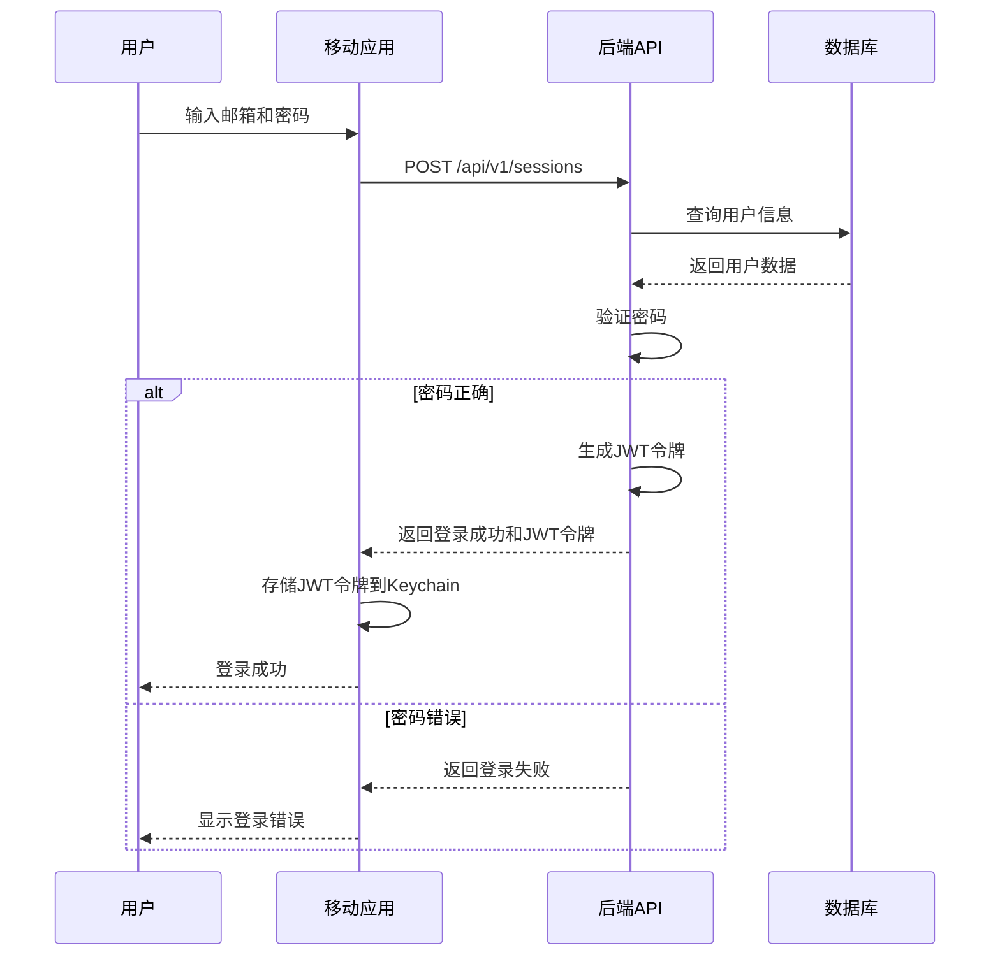

### 2.2 Apple登录流程

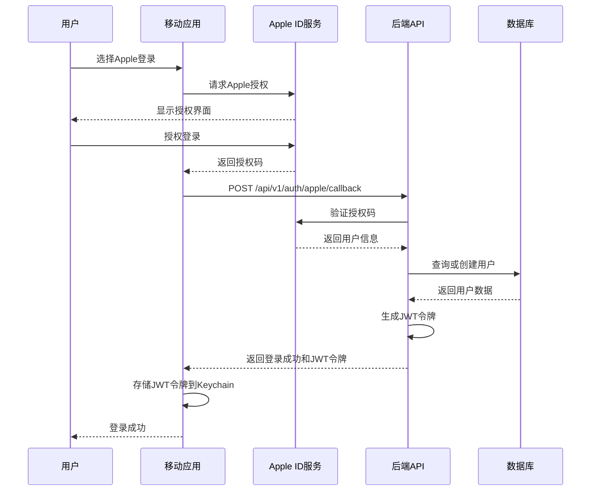

## 3. 认知模型管理流程

### 3.1 创建认知模型流程

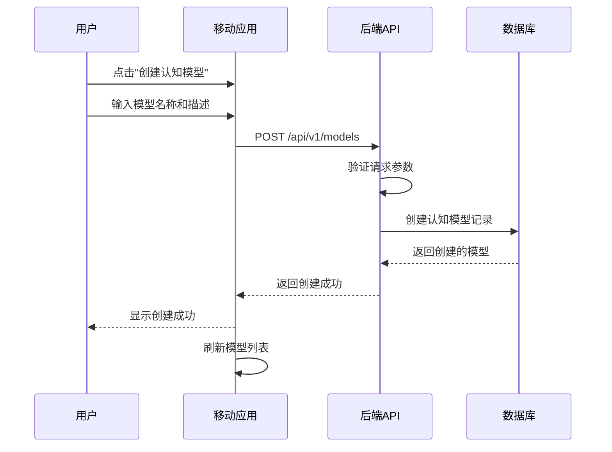

### 3.2 认知模型更新流程

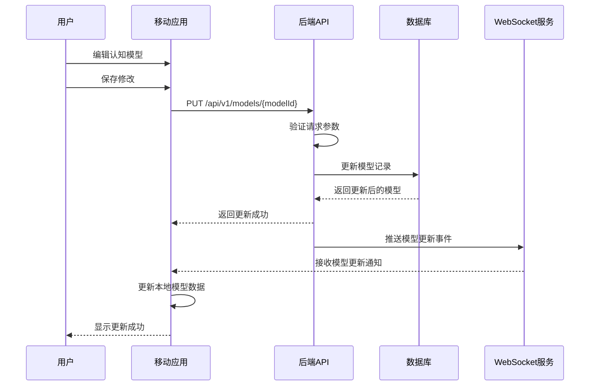

## 4. 思想片段处理流程

### 4.1 文本思想片段处理流程

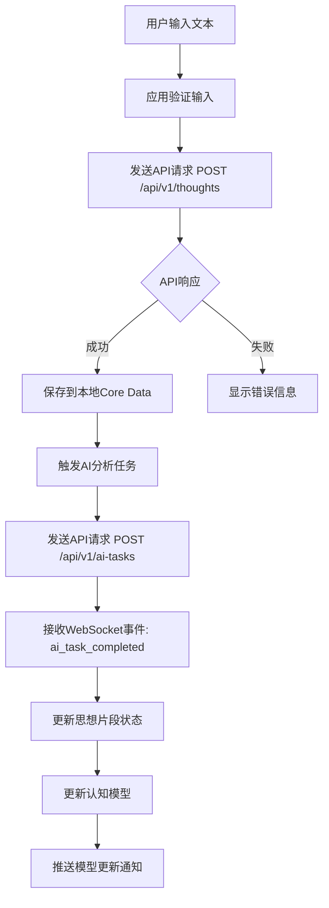

### 4.2 语音思想片段处理流程

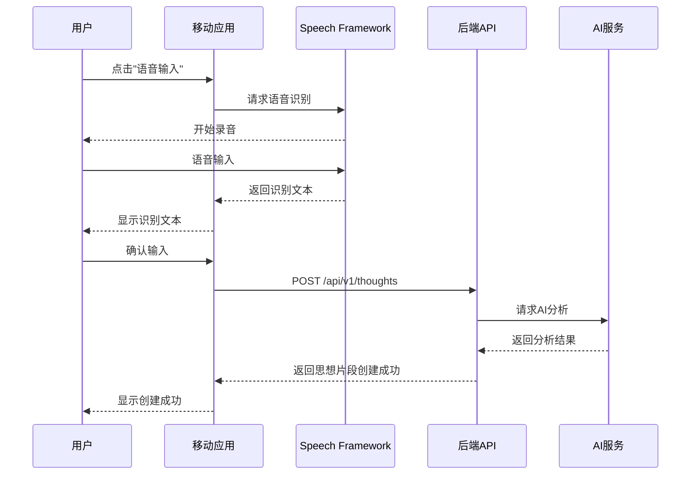

## 5. AI任务处理流程

### 5.1 AI认知模型构建流程

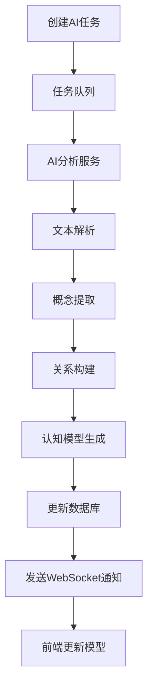

### 5.2 认知洞察生成流程

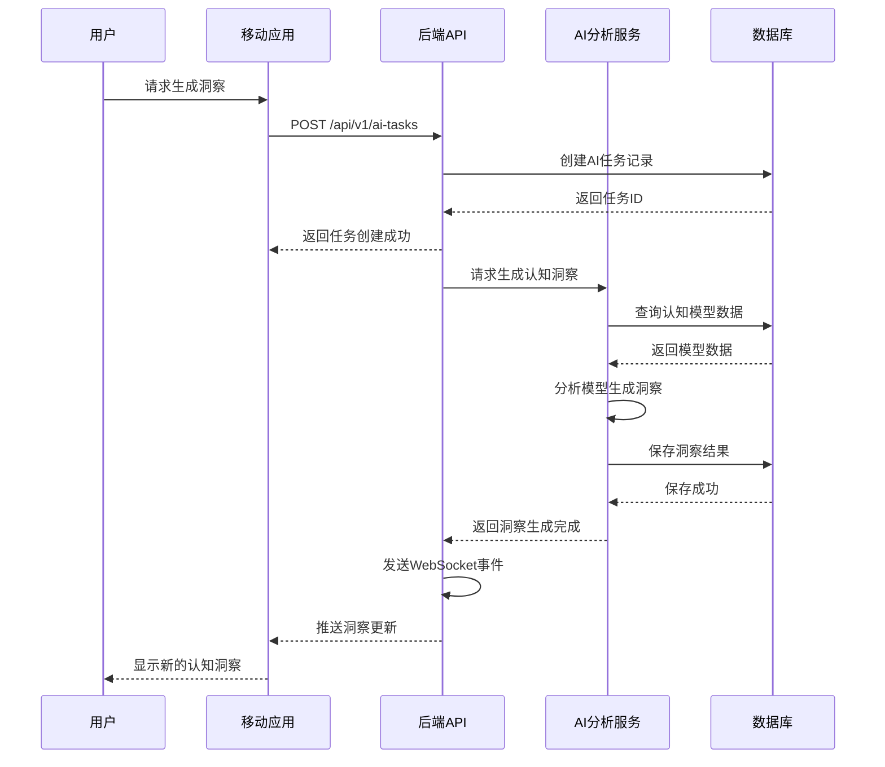

## 6. 建议生成与处理流程

### 6.1 建议生成流程

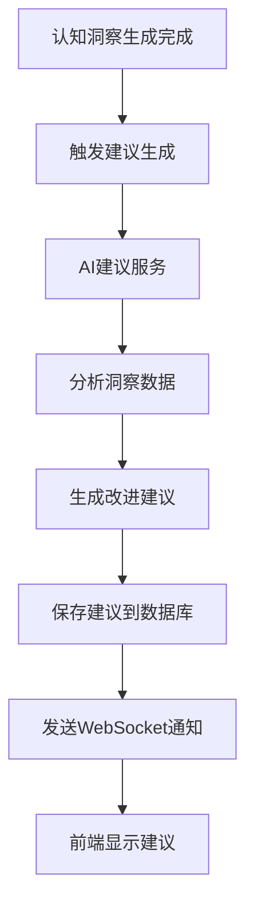

### 6.2 建议处理流程

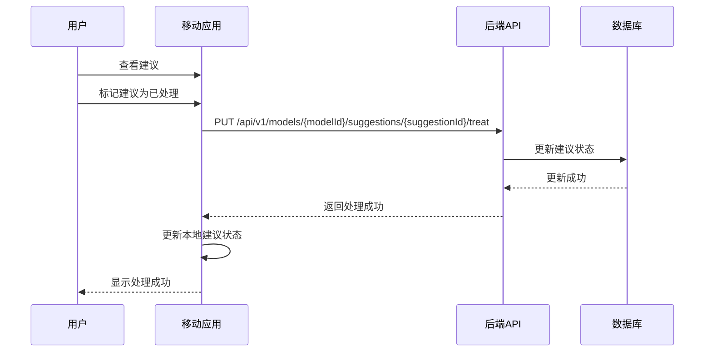

## 7. 认知模型可视化流程

### 7.1 概念图生成流程

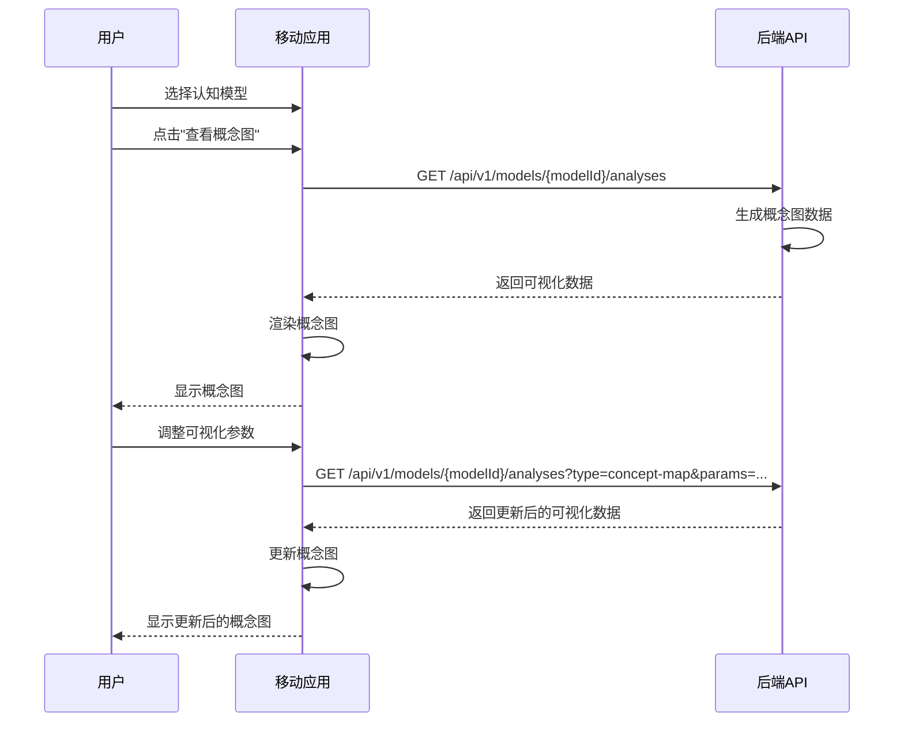

## 8. 通知流程

### 8.1 系统通知发送流程

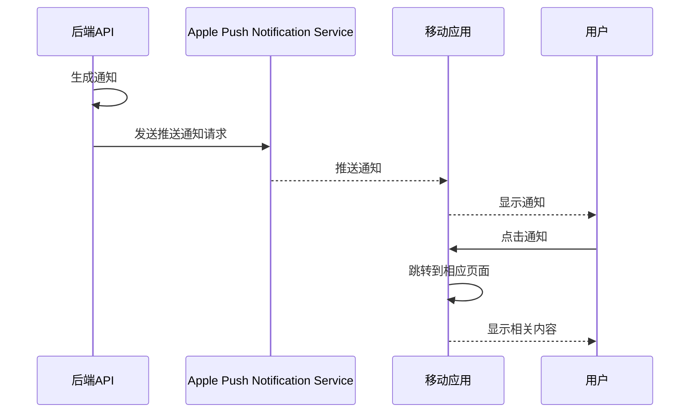

## 9. 数据同步流程

### 9.1 本地数据与服务器同步流程

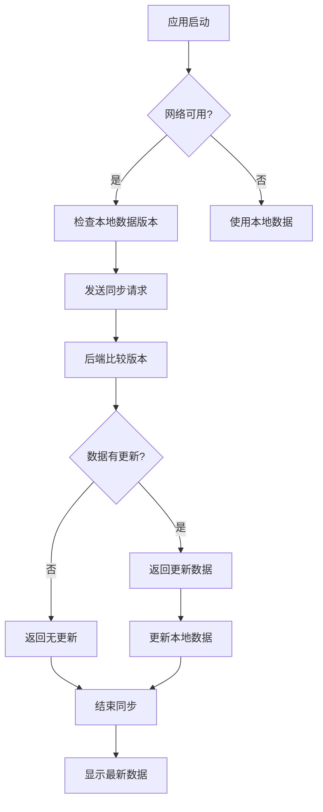

## 10. 用户偏好设置流程

### 10.1 更新用户偏好流程

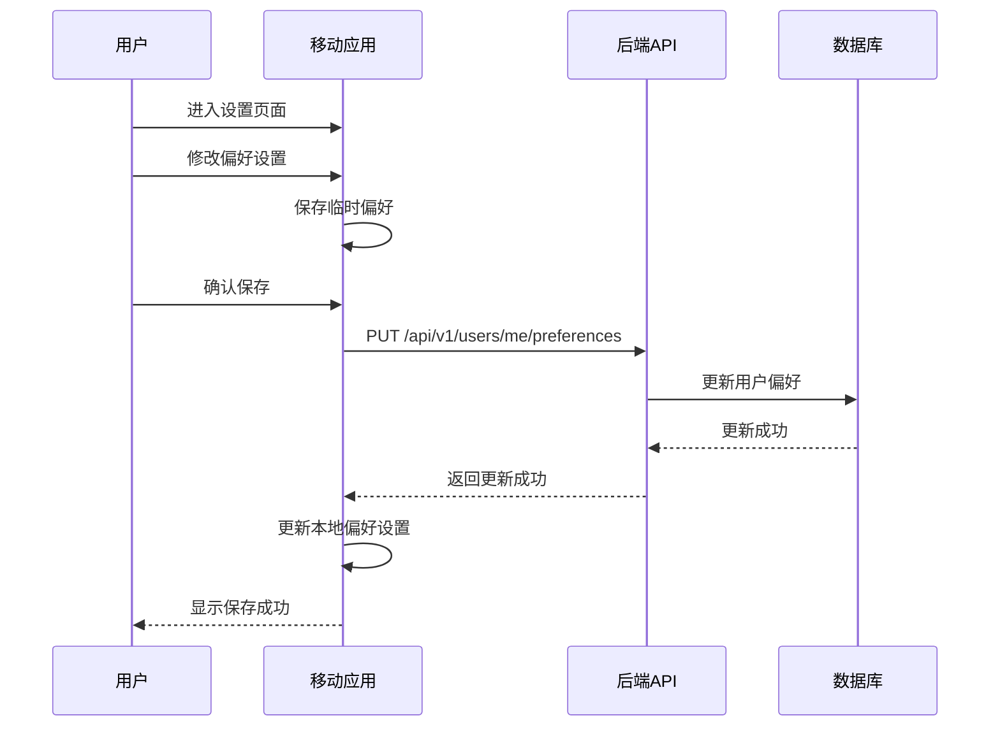

## 11. Mermaid图表使用说明

### 11.1 图表类型

- **Sequence Diagram**：用于描述对象之间的交互流程
- **Flow Chart**：用于描述流程的决策和分支

### 11.2 图表语法

- 使用Mermaid语法编写图表
- 支持嵌套图表和复杂逻辑
- 可以在Markdown文档中直接使用

### 11.3 查看方式

- 使用支持Mermaid的Markdown编辑器查看
- 在GitHub、GitLab等平台直接查看
- 使用Mermaid Live Editor在线查看：https://mermaid.live/

## 12. 流程维护

- **流程更新**：当业务流程发生变化时，及时更新相应的流程图
- **流程评审**：定期评审流程图，确保与实际业务逻辑一致
- **流程培训**：使用流程图对新团队成员进行培训

## 13. 参考资料

- [Mermaid Documentation](https://mermaid-js.github.io/mermaid/)
- [Sequence Diagram Syntax](https://mermaid-js.github.io/mermaid/syntax/sequenceDiagram.html)
- [Flow Chart Syntax](https://mermaid-js.github.io/mermaid/syntax/flowchart.html)
