# 交互流程图文档

## 模块关联索引

### 所属环节
- **阶段**：文档优化
- **开发主题**：交互流程可视化

### 相关核心文档
- [前端架构设计](frontend-architecture.md)
- [业务流程流程图](business-process-flowcharts.md)
- [API集成规范](../core-features/api-integration-spec.md)
- [WebSocket集成](../core-features/websocket-integration.md)

## 1. 概述

本文档使用Mermaid图表描述AI认知辅助系统的用户交互流程，包括语音交互流程、认知模型可视化操作流程、思想片段输入流程等，明确前后端数据流转路径，帮助设计和开发团队理解用户交互设计。

## 2. 语音交互流程

### 2.1 语音输入与分析流程

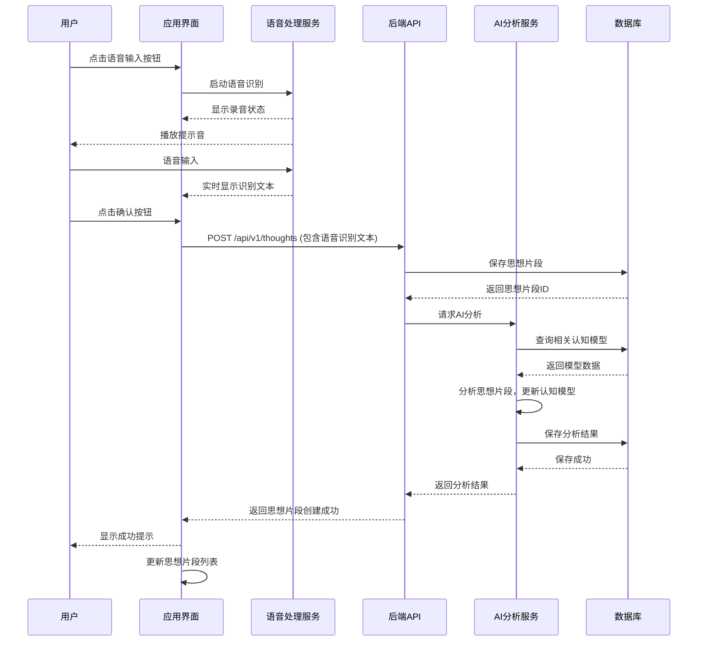

### 2.2 语音输出流程

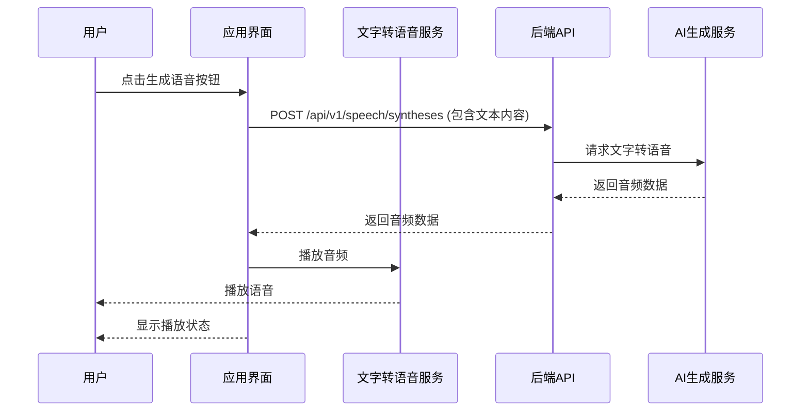

## 3. 认知模型可视化交互流程

### 3.1 概念图交互流程

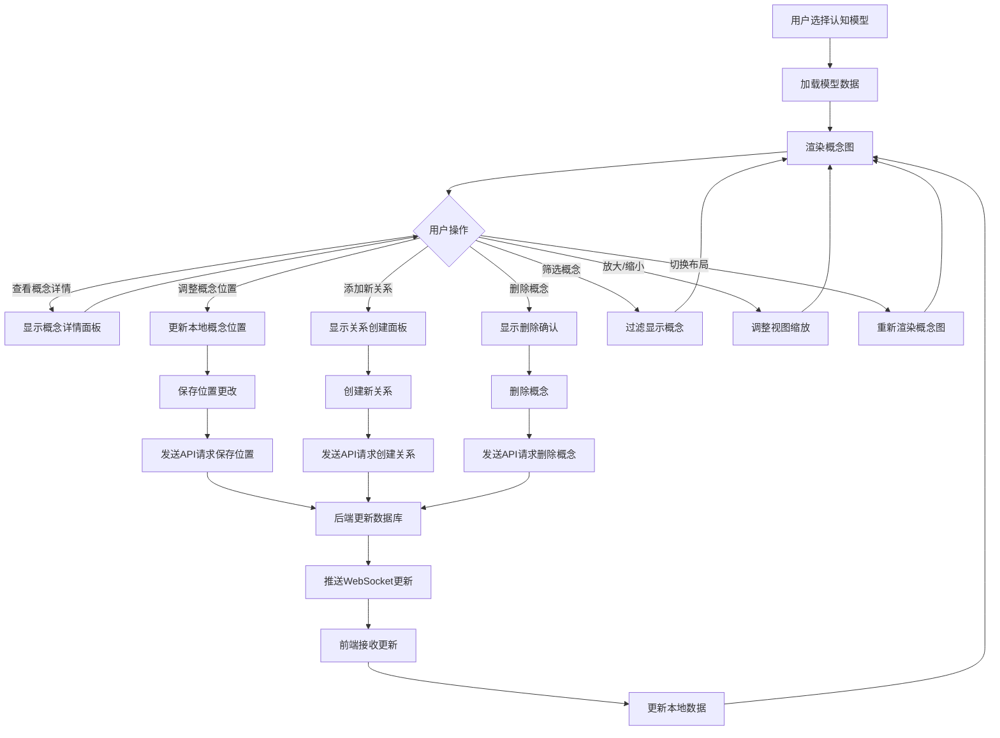

### 3.2 概念详情查看流程

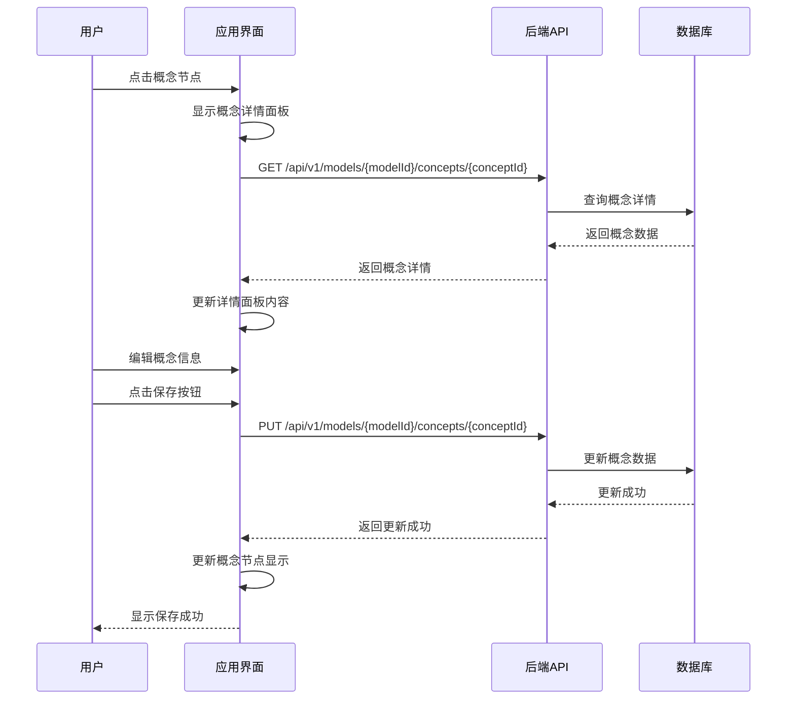

## 4. 思想片段管理流程

### 4.1 思想片段输入与编辑流程

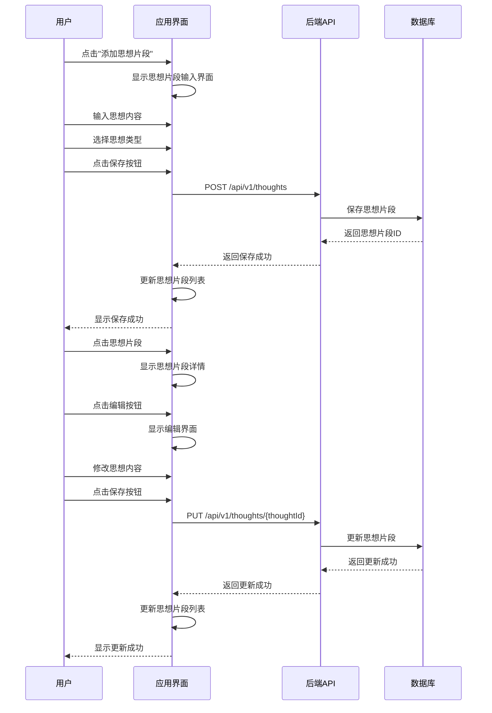

### 4.2 思想片段分析结果查看流程

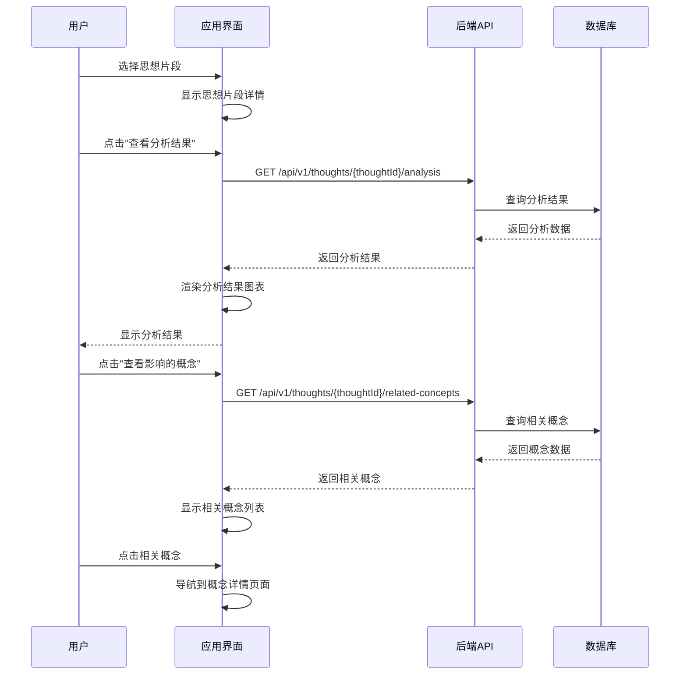

## 5. 认知模型管理流程

### 5.1 认知模型创建与配置流程

```mermaid
flowchart TD
    A[用户点击"创建模型"] --> B[显示创建模型表单]
    B --> C[用户输入模型名称和描述]
    C --> D[选择模型类型]
    D --> E[点击"创建"按钮]
    E --> F[发送API请求 POST /api/v1/models]
    F --> G[后端创建模型记录]
    G --> H[返回模型ID]
    H --> I[显示模型创建成功]
    I --> J[导航到模型详情页面]
    J --> K[显示模型配置选项]
    K --> L{用户配置操作}
    L -->|添加概念| M[显示添加概念表单]
    L -->|导入数据| N[显示数据导入选项]
    L -->|调整模型设置| O[显示模型设置表单]
    
    M --> P[用户输入概念信息]
    N --> Q[用户选择导入源]
    O --> R[用户调整设置]
    
    P --> S[发送API请求创建概念]
    Q --> T[发送API请求导入数据]
    R --> U[发送API请求更新设置]
    
    S --> V[后端保存概念]
    T --> W[后端处理数据导入]
    U --> X[后端更新模型设置]
    
    V --> Y[返回创建成功]
    W --> Y
    X --> Y
    
    Y --> Z[更新模型详情视图]
```

### 5.2 认知模型切换与比较流程

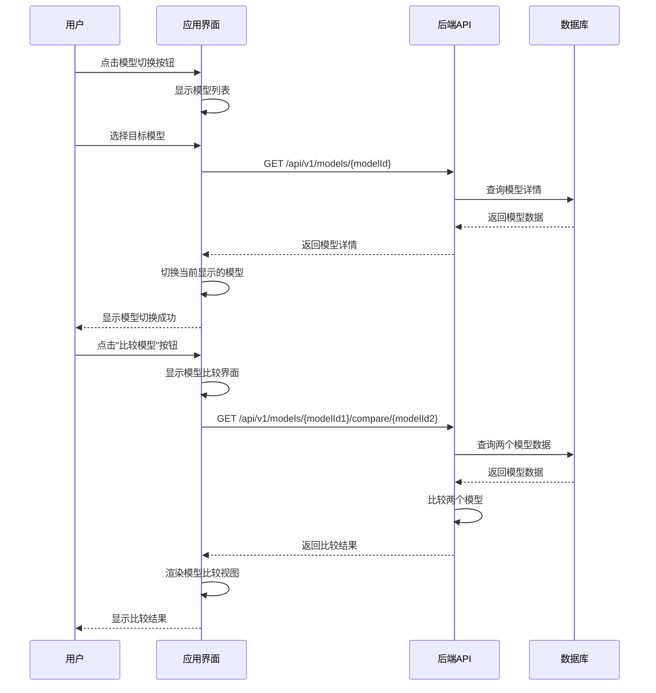

## 6. 洞察与建议流程

### 6.1 认知洞察查看与处理流程

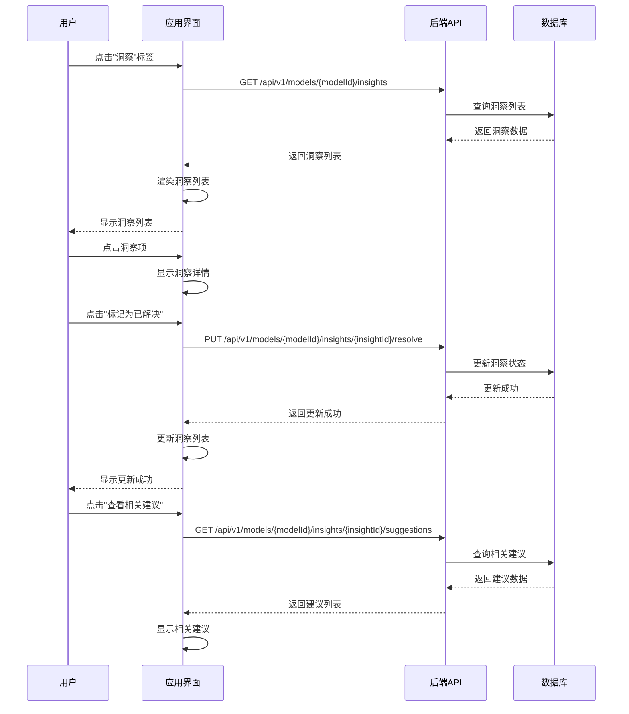

### 6.2 建议处理与反馈流程

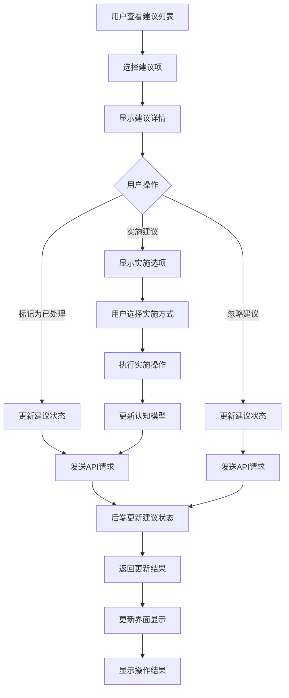

## 7. 应用设置与个性化流程

### 7.1 用户偏好设置流程

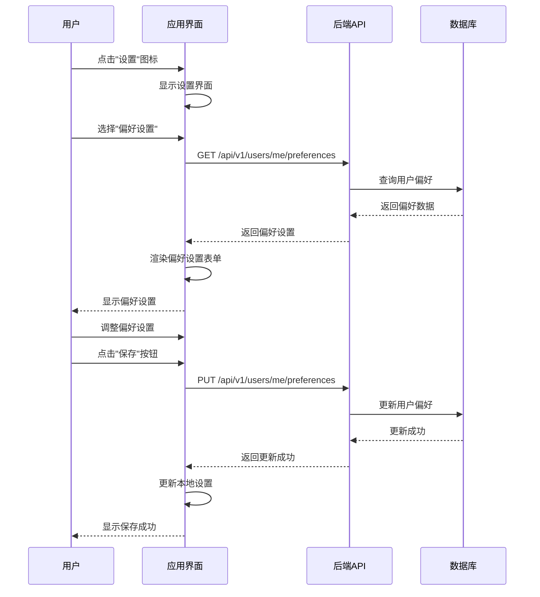

### 7.2 个性化推荐流程

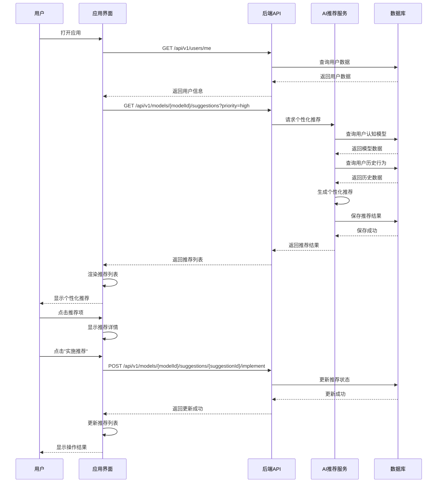

## 8. 数据导入与导出流程

### 8.1 数据导入流程

```mermaid
flowchart TD
    A[用户点击"导入数据"] --> B[显示导入选项]
    B --> C{选择导入类型}
    C -->|文件导入| D[显示文件选择器]
    C -->|手动输入| E[显示输入表单]
    C -->|第三方导入| F[显示第三方服务列表]
    
    D --> G[用户选择文件]
    E --> H[用户输入数据]
    F --> I[用户选择第三方服务]
    
    G --> J[上传文件到服务器]
    H --> K[发送API请求保存数据]
    I --> L[授权第三方服务]
    
    J --> M[后端处理文件]
    L --> M
    
    M --> N[解析数据]
    N --> O[验证数据格式]
    
    O --> P{数据有效?}
    P -->|是| Q[保存到数据库]
    P -->|否| R[返回错误信息]
    
    Q --> S[返回导入成功]
    R --> T[显示错误信息]
    
    K --> Q
    
    S --> U[更新界面显示]
    T --> U
    
    U --> V[显示导入结果]
```

## 9. 流程图使用指南

### 9.1 阅读和理解流程

1. **从左到右**：流程通常从左侧开始，向右流动
2. **参与者角色**：每个参与者代表系统的一个组件或角色
3. **交互方向**：箭头表示消息或数据的流动方向
4. **关键操作**：重点关注用户操作和系统响应
5. **数据流转**：注意前后端数据的传递路径

### 9.2 更新和维护流程

1. **流程变更**：当交互设计发生变化时，及时更新相应的流程图
2. **版本控制**：为流程图添加版本号，便于跟踪变更
3. **定期审查**：定期审查流程图，确保与实际产品一致
4. **反馈收集**：收集用户和开发团队的反馈，优化流程图

### 9.3 设计参考

- 使用流程图指导UI设计，确保界面元素与流程匹配
- 流程图可作为用户测试的参考，验证交互设计的合理性
- 开发团队可根据流程图理解前后端数据流转，实现相应功能

## 10. 参考资料

- [Mermaid Documentation](https://mermaid-js.github.io/mermaid/)
- [User Experience Design Process](https://www.nngroup.com/articles/ux-design-process/)
- [Interaction Design Principles](https://www.interaction-design.org/literature/topics/interaction-design)
