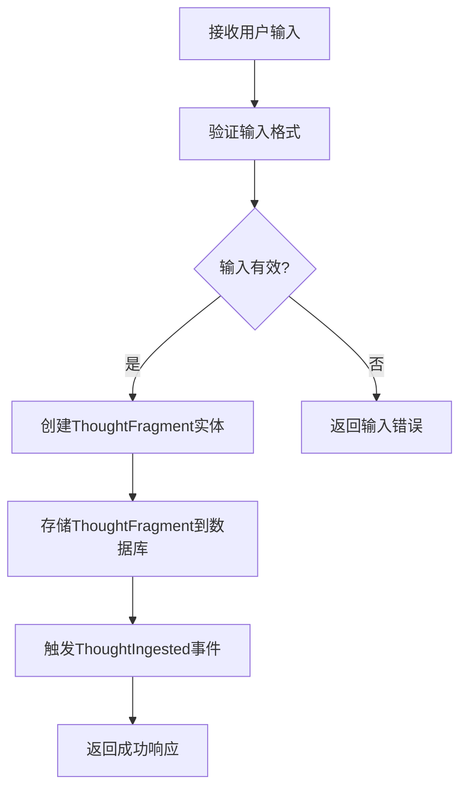
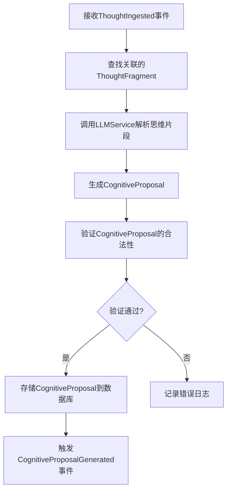
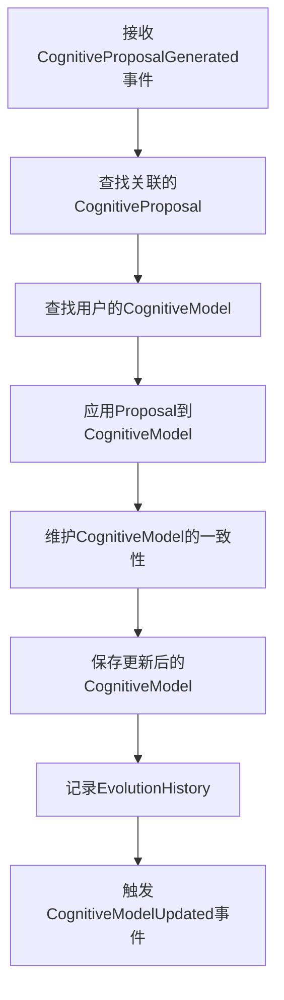
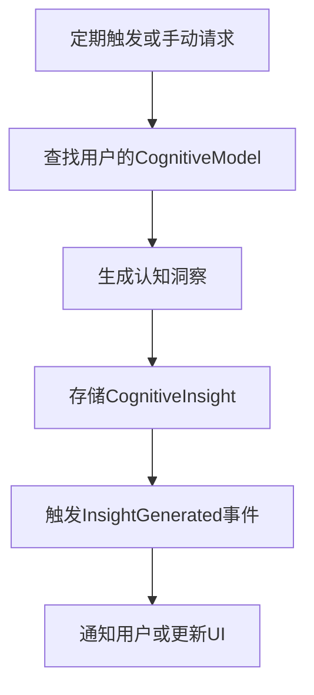

# 后端项目代码实现文档

## 1. 项目概述与架构设计

### 1.1 项目目标
- 构建一个认知辅助型AI软件，持续分析用户的认知结构模型
- 基于认知模型给出结构性反馈与思考建议
- 系统关注用户的思考模式、概念结构和认知空洞
- 帮助用户发现思维盲点和认知断裂

### 1.2 架构设计

#### 1.2.1 分层架构
```
┌──────────────────────────────┐
│ Presentation Layer            │
│  - HTTP API                    │
└───────────────▲──────────────┘
                │
┌───────────────┴──────────────┐
│ Application Layer              │
│  - Use Cases                    │
│  - Workflow Orchestration       │
└───────────────▲──────────────┘
                │
┌───────────────┴──────────────┐
│ Domain Layer                   │
│  - Cognitive Model              │
│  - Business Rules               │
└───────────────▲──────────────┘
                │
┌───────────────┴──────────────┐
│ Infrastructure Layer           │
│  - Persistence                 │
│  - AI Providers                │
│  - Message / Event             │
└───────────────▲──────────────┘
                │
┌───────────────┴──────────────┐
│ AI Capability Layer             │
│  - LLM                          │
│  - Embeddings                   │
│  - Reasoning                    │
└──────────────────────────────┘
```

#### 1.2.2 核心设计原则
- **Clean Architecture六大原则**：单一职责原则、开放封闭原则、里式替换原则、接口隔离原则、依赖倒置原则、迪米特法则
- **Domain First设计理念**：认知模型优先于技术选型
- **高内聚低耦合**：模块功能单一，依赖关系清晰
- **依赖倒置**：高层模块不依赖低层模块，通过接口实现依赖
- **AI作为依赖而非核心**：AI是外部能力，不是系统中心

## 2. 模块划分与接口定义

### 2.1 Domain层模块

#### 2.1.1 实体（Entities）

**UserCognitiveModel**
```typescript
interface UserCognitiveModel {
  id: string; // 模型唯一标识
  userId: string; // 用户ID
  concepts: CognitiveConcept[]; // 概念集合
  relations: CognitiveRelation[]; // 关系集合
  evolutionHistory: EvolutionHistory[]; // 演化历史
  createdAt: Date; // 创建时间
  updatedAt: Date; // 更新时间
  
  // 方法
  addConcept(concept: CognitiveConcept): void;
  removeConcept(conceptId: string): void;
  updateConcept(concept: CognitiveConcept): void;
  addRelation(relation: CognitiveRelation): void;
  removeRelation(relationId: string): void;
  updateRelation(relation: CognitiveRelation): void;
  applyProposal(proposal: CognitiveProposal): void;
}
```

**CognitiveConcept**
```typescript
interface CognitiveConcept {
  id: string; // 概念唯一标识
  semanticIdentity: string; // 语义标识
  abstractionLevel: number; // 抽象级别（1-5）
  confidenceScore: number; // 置信度评分（0-1）
  description: string; // 概念描述
  createdAt: Date; // 创建时间
  updatedAt: Date; // 更新时间
}
```

**CognitiveRelation**
```typescript
interface CognitiveRelation {
  id: string; // 关系唯一标识
  sourceConceptId: string; // 源概念ID
  targetConceptId: string; // 目标概念ID
  relationType: RelationType; // 关系类型
  confidenceScore: number; // 置信度评分（0-1）
  createdAt: Date; // 创建时间
  updatedAt: Date; // 更新时间
}
```

**ThoughtFragment**
```typescript
interface ThoughtFragment {
  id: string; // 思维片段唯一标识
  content: string; // 思维片段内容
  metadata: Record<string, any>; // 元数据
  userId: string; // 用户ID
  createdAt: Date; // 创建时间
}
```

**CognitiveProposal**
```typescript
interface CognitiveProposal {
  id: string; // 建议唯一标识
  thoughtId: string; // 关联的思维片段ID
  concepts: ConceptCandidate[]; // 概念候选列表
  relations: RelationCandidate[]; // 关系候选列表
  confidence: number; // 整体置信度
  reasoningTrace: string[]; // 推理过程
  createdAt: Date; // 创建时间
}
```

**CognitiveInsight**
```typescript
interface CognitiveInsight {
  id: string; // 洞察唯一标识
  modelId: string; // 关联的认知模型ID
  coreThemes: string[]; // 核心主题
  blindSpots: string[]; // 思维盲点
  conceptGaps: string[]; // 概念空洞
  structureSummary: string; // 认知结构摘要
  createdAt: Date; // 创建时间
}
```

#### 2.1.2 值对象（Value Objects）

**RelationType**
```typescript
enum RelationType {
  DEPENDS_ON = 'depends_on',
  GENERALIZES = 'generalizes',
  CONTRADICTS = 'contradicts',
  IS_A = 'is_a',
  RELATED_TO = 'related_to'
}
```

**EvolutionHistory**
```typescript
interface EvolutionHistory {
  timestamp: Date;
  changeType: 'add' | 'update' | 'remove';
  conceptId?: string;
  relationId?: string;
  description: string;
}
```

**ReasoningTrace**
```typescript
type ReasoningTrace = string[];
```

**ConceptCandidate**
```typescript
interface ConceptCandidate {
  semanticIdentity: string;
  abstractionLevel: number;
  confidenceScore: number;
  description: string;
}
```

**RelationCandidate**
```typescript
interface RelationCandidate {
  sourceSemanticIdentity: string;
  targetSemanticIdentity: string;
  relationType: RelationType;
  confidenceScore: number;
}
```

#### 2.1.3 领域服务（Domain Services）

**CognitiveModelService**
```typescript
interface CognitiveModelService {
  validateProposal(proposal: CognitiveProposal): boolean;
  maintainConsistency(model: UserCognitiveModel): void;
  generateInsight(model: UserCognitiveModel): CognitiveInsight;
}
```

### 2.2 Application层模块

#### 2.2.1 Use Cases

**IngestThoughtUseCase**
```typescript
interface IngestThoughtUseCase {
  execute(input: ThoughtInputDto): Promise<ThoughtOutputDto>;
}

interface ThoughtInputDto {
  content: string;
  metadata?: Record<string, any>;
  userId: string;
}

interface ThoughtOutputDto {
  id: string;
  content: string;
  metadata?: Record<string, any>;
  userId: string;
  createdAt: Date;
}
```

**GenerateProposalUseCase**
```typescript
interface GenerateProposalUseCase {
  execute(thoughtId: string): Promise<CognitiveProposal>;
}
```

**UpdateCognitiveModelUseCase**
```typescript
interface UpdateCognitiveModelUseCase {
  execute(proposalId: string): Promise<UserCognitiveModel>;
}
```

**GenerateInsightUseCase**
```typescript
interface GenerateInsightUseCase {
  execute(modelId: string): Promise<CognitiveInsight>;
}
```

#### 2.2.2 接口定义

**ThoughtRepository**
```typescript
interface ThoughtRepository {
  save(thought: ThoughtFragment): Promise<ThoughtFragment>;
  findById(id: string): Promise<ThoughtFragment | null>;
  findByUserId(userId: string): Promise<ThoughtFragment[]>;
  delete(id: string): Promise<void>;
}
```

**CognitiveModelRepository**
```typescript
interface CognitiveModelRepository {
  save(model: UserCognitiveModel): Promise<UserCognitiveModel>;
  findById(id: string): Promise<UserCognitiveModel | null>;
  findByUserId(userId: string): Promise<UserCognitiveModel | null>;
}
```

**CognitiveProposalRepository**
```typescript
interface CognitiveProposalRepository {
  save(proposal: CognitiveProposal): Promise<CognitiveProposal>;
  findById(id: string): Promise<CognitiveProposal | null>;
  findByThoughtId(thoughtId: string): Promise<CognitiveProposal[]>;
}
```

**CognitiveInsightRepository**
```typescript
interface CognitiveInsightRepository {
  save(insight: CognitiveInsight): Promise<CognitiveInsight>;
  findById(id: string): Promise<CognitiveInsight | null>;
  findByModelId(modelId: string): Promise<CognitiveInsight[]>;
}
```

**LLMService**
```typescript
interface LLMService {
  generateProposal(thoughtContent: string): Promise<CognitiveProposal>;
  generateInsight(model: UserCognitiveModel): Promise<CognitiveInsight>;
}
```

**EmbeddingService**
```typescript
interface EmbeddingService {
  generateEmbedding(text: string): Promise<number[]>;
  storeEmbedding(id: string, embedding: number[], metadata: any): Promise<void>;
  searchSimilarEmbeddings(query: number[], limit: number): Promise<any[]>;
}
```

### 2.3 Infrastructure层模块

#### 2.3.1 数据持久化

**SQLiteConnection**
```typescript
interface SQLiteConnection {
  query(sql: string, params?: any[]): Promise<any[]>;
  execute(sql: string, params?: any[]): Promise<void>;
}
```

**ThoughtRepositoryImpl**
```typescript
class ThoughtRepositoryImpl implements ThoughtRepository {
  private connection: SQLiteConnection;
  
  constructor(connection: SQLiteConnection) {
    this.connection = connection;
  }
  
  async save(thought: ThoughtFragment): Promise<ThoughtFragment> {
    // 实现存储逻辑
  }
  
  async findById(id: string): Promise<ThoughtFragment | null> {
    // 实现查询逻辑
  }
  
  async findByUserId(userId: string): Promise<ThoughtFragment[]> {
    // 实现查询逻辑
  }
  
  async delete(id: string): Promise<void> {
    // 实现删除逻辑
  }
}
```

#### 2.3.2 AI服务

**LLMClient**
```typescript
interface LLMClient {
  callApi(prompt: string, context: any): Promise<any>;
}
```

**EmbeddingService**
```typescript
interface EmbeddingService {
  generateEmbedding(text: string): Promise<number[]>;
  storeEmbedding(id: string, embedding: number[], metadata: any): Promise<void>;
  searchSimilarEmbeddings(query: number[], limit: number): Promise<any[]>;
}
```

#### 2.3.3 事件系统

**EventBus**
```typescript
interface EventBus {
  subscribe<T>(eventType: string, handler: EventHandler<T>): void;
  publish<T>(eventType: string, event: T): void;
}

interface EventHandler<T> {
  handle(event: T): void;
}

// 核心事件类型
interface ThoughtIngestedEvent {
  thoughtId: string;
  content: string;
  timestamp: Date;
}

interface CognitiveModelUpdatedEvent {
  modelId: string;
  timestamp: Date;
  changes: any;
}

interface InsightGeneratedEvent {
  insightId: string;
  modelId: string;
  timestamp: Date;
}
```

## 3. 核心功能实现逻辑

### 3.1 输入处理流程



### 3.2 认知解析流程



### 3.3 认知模型更新流程



### 3.4 认知反馈生成流程



## 4. 数据结构与算法设计

### 4.1 认知模型数据结构

**UserCognitiveModel**采用图结构存储，其中：
- 节点：CognitiveConcept
- 边：CognitiveRelation

### 4.2 关键算法

#### 4.2.1 认知模型一致性维护算法

```typescript
function maintainConsistency(model: UserCognitiveModel): void {
  // 检测并移除冲突关系
  const conflicts = detectConflicts(model.relations);
  conflicts.forEach(conflict => {
    model.removeRelation(conflict.id);
  });
  
  // 确保概念层次结构的正确性
  validateConceptHierarchy(model);
  
  // 更新概念的置信度评分
  updateConceptConfidence(model);
}

function detectConflicts(relations: CognitiveRelation[]): CognitiveRelation[] {
  // 检测冲突关系的逻辑
  // 例如：检测是否存在矛盾关系
}

function validateConceptHierarchy(model: UserCognitiveModel): void {
  // 验证概念层次结构的逻辑
  // 例如：使用拓扑排序确保无循环依赖
}

function updateConceptConfidence(model: UserCognitiveModel): void {
  // 更新概念置信度的逻辑
  // 例如：基于关系强度和出现频率更新置信度
}
```

#### 4.2.2 相似度搜索算法

```typescript
function searchSimilarConcepts(
  query: number[], 
  concepts: CognitiveConcept[], 
  embeddingService: EmbeddingService,
  limit: number = 10
): Promise<CognitiveConcept[]> {
  return embeddingService.searchSimilarEmbeddings(query, limit)
    .then(results => {
      // 将搜索结果映射到CognitiveConcept
      return results.map(result => {
        return concepts.find(concept => concept.id === result.id)!
      }).filter(Boolean);
    });
}
```

## 5. 错误处理机制

### 5.1 错误类型

| 错误类型 | 错误代码 | HTTP状态码 | 描述 |
|---------|---------|------------|------|
| 输入验证 | INVALID_INPUT | 400 | 输入格式无效或缺少必填字段 |
| 资源不存在 | NOT_FOUND | 404 | 请求的资源不存在 |
| 认证失败 | UNAUTHORIZED | 401 | 认证失败或令牌无效 |
| 权限不足 | FORBIDDEN | 403 | 没有权限访问资源 |
| 数据库错误 | DATABASE_ERROR | 500 | 数据库操作失败 |
| AI服务错误 | AI_SERVICE_ERROR | 500 | AI服务调用失败 |
| 系统错误 | INTERNAL_ERROR | 500 | 系统内部错误 |

### 5.2 错误处理策略

#### 5.2.1 分层错误处理
```typescript
// 在Application层捕获Domain层错误
async function execute(input: ThoughtInputDto): Promise<ThoughtOutputDto> {
  try {
    // 调用Domain层逻辑
    return await this.domainService.process(input);
  } catch (error) {
    if (error instanceof ValidationError) {
      throw new ApplicationError("INVALID_INPUT", error.message);
    } else if (error instanceof NotFoundError) {
      throw new ApplicationError("NOT_FOUND", error.message);
    } else {
      throw new ApplicationError("INTERNAL_ERROR", "An unexpected error occurred");
    }
  }
}

// 在Presentation层捕获Application层错误
app.post('/api/v1/thoughts', async (req, res) => {
  try {
    const result = await thoughtService.ingest(req.body);
    res.status(200).send(result);
  } catch (error) {
    const statusCode = mapErrorToStatusCode(error.code);
    res.status(statusCode).send({
      status: "error",
      code: error.code,
      message: error.message
    });
  }
});
```

#### 5.2.2 错误日志记录
```typescript
function logError(error: Error, context: any): void {
  logger.error({
    message: error.message,
    stack: error.stack,
    context: context,
    timestamp: new Date().toISOString()
  });
}
```

## 6. 性能优化策略

### 6.1 数据库优化

#### 6.1.1 索引设计
```sql
-- 为常用查询字段创建索引
CREATE INDEX idx_thoughts_user_id ON thought_fragments(user_id);
CREATE INDEX idx_cognitive_models_user_id ON cognitive_models(user_id);
CREATE INDEX idx_cognitive_proposals_thought_id ON cognitive_proposals(thought_id);
CREATE INDEX idx_cognitive_insights_model_id ON cognitive_insights(model_id);
```

#### 6.1.2 连接池管理
```typescript
// 使用连接池管理数据库连接
const pool = new Pool({
  max: 10,
  min: 2,
  acquire: 30000,
  idle: 10000
});
```

### 6.2 AI服务优化

#### 6.2.1 批量处理
```typescript
// 批量处理AI请求
async function batchProcessThoughts(thoughts: ThoughtFragment[]): Promise<CognitiveProposal[]> {
  // 将多个思维片段合并为一个批量请求
  const batchPrompt = createBatchPrompt(thoughts);
  const result = await llmClient.callApi(batchPrompt);
  return parseBatchResult(result);
}
```

#### 6.2.2 缓存机制
```typescript
// 缓存AI生成的结果
class CacheService {
  private cache: Map<string, any> = new Map();
  
  get(key: string): any {
    return this.cache.get(key);
  }
  
  set(key: string, value: any, ttl: number = 3600000): void {
    this.cache.set(key, value);
    // 设置缓存过期时间
    setTimeout(() => {
      this.cache.delete(key);
    }, ttl);
  }
}
```

### 6.3 系统架构优化

#### 6.3.1 异步处理
```typescript
// 使用异步处理提高系统响应性
async function handleThoughtIngested(event: ThoughtIngestedEvent): Promise<void> {
  // 使用队列异步处理AI请求
  queue.add(() => processThought(event.thoughtId));
}
```

#### 6.3.2 负载均衡
```typescript
// 使用负载均衡提高系统吞吐量
const loadBalancer = new LoadBalancer([
  'http://llm-service-1:3000',
  'http://llm-service-2:3000',
  'http://llm-service-3:3000'
]);

const llmClient = new LLMClient(loadBalancer);
```

## 7. 测试用例设计

### 7.1 单元测试

#### 7.1.1 Domain层测试

**UserCognitiveModel测试**
```typescript
describe('UserCognitiveModel', () => {
  it('should add a concept correctly', () => {
    const model = new UserCognitiveModelImpl('model-1', 'user-1');
    const concept = new CognitiveConceptImpl('concept-1', 'test concept', 3, 0.8, 'test description');
    
    model.addConcept(concept);
    
    expect(model.concepts).toContain(concept);
  });
  
  it('should remove a concept correctly', () => {
    const model = new UserCognitiveModelImpl('model-1', 'user-1');
    const concept = new CognitiveConceptImpl('concept-1', 'test concept', 3, 0.8, 'test description');
    model.addConcept(concept);
    
    model.removeConcept('concept-1');
    
    expect(model.concepts).not.toContain(concept);
  });
  
  it('should apply a proposal correctly', () => {
    const model = new UserCognitiveModelImpl('model-1', 'user-1');
    const proposal = {
      id: 'proposal-1',
      thoughtId: 'thought-1',
      concepts: [{ semanticIdentity: 'test', abstractionLevel: 3, confidenceScore: 0.8, description: 'test' }],
      relations: [],
      confidence: 0.9,
      reasoningTrace: ['reasoning'],
      createdAt: new Date()
    };
    
    model.applyProposal(proposal);
    
    expect(model.concepts.length).toBe(1);
  });
});
```

#### 7.1.2 Application层测试

**IngestThoughtUseCase测试**
```typescript
describe('IngestThoughtUseCase', () => {
  it('should ingest a thought correctly', async () => {
    // 模拟依赖
    const thoughtRepository = mock<ThoughtRepository>();
    const eventBus = mock<EventBus>();
    
    const useCase = new IngestThoughtUseCaseImpl(thoughtRepository, eventBus);
    const input = {
      content: 'test thought',
      userId: 'user-1'
    };
    
    // 设置模拟行为
    when(thoughtRepository.save(any())).thenReturn(Promise.resolve({
      id: 'thought-1',
      content: 'test thought',
      userId: 'user-1',
      metadata: {},
      createdAt: new Date()
    }));
    
    const result = await useCase.execute(input);
    
    expect(result).toBeDefined();
    expect(result.content).toBe('test thought');
    // 验证事件是否被发布
    verify(eventBus.publish('ThoughtIngested', any())).once();
  });
});
```

### 7.2 集成测试

**端到端流程测试**
```typescript
describe('End-to-End Flow', () => {
  it('should process a thought from ingestion to insight generation', async () => {
    // 完整流程测试
    const app = await createApp();
    
    // 1. 提交思维片段
    const thoughtResponse = await request(app)
      .post('/api/v1/thoughts')
      .send({
        content: 'I am learning about Clean Architecture',
        userId: 'user-1'
      });
    
    expect(thoughtResponse.status).toBe(200);
    const thoughtId = thoughtResponse.body.id;
    
    // 2. 生成认知建议
    const proposalResponse = await request(app)
      .post(`/api/v1/proposals?thoughtId=${thoughtId}`);
    
    expect(proposalResponse.status).toBe(200);
    const proposalId = proposalResponse.body.id;
    
    // 3. 更新认知模型
    const modelResponse = await request(app)
      .post(`/api/v1/models/update?proposalId=${proposalId}`);
    
    expect(modelResponse.status).toBe(200);
    const modelId = modelResponse.body.id;
    
    // 4. 生成认知洞察
    const insightResponse = await request(app)
      .post(`/api/v1/insights?modelId=${modelId}`);
    
    expect(insightResponse.status).toBe(200);
    expect(insightResponse.body.coreThemes).toBeDefined();
  });
});
```

### 7.3 性能测试

**API响应时间测试**
```typescript
// 使用Artillery进行性能测试
// artillery.yml
config:
  target: "http://localhost:3000"
  phases:
    - duration: 60
      arrivalRate: 10
      name: "Warm up"
    - duration: 120
      arrivalRate: 10
      rampTo: 50
      name: "Ramp up load"
    - duration: 60
      arrivalRate: 50
      name: "Sustain load"
scenarios:
  - name: "Submit thought"
    flow:
      - post:
          url: "/api/v1/thoughts"
          json:
            content: "Performance test thought"
            userId: "test-user"
```

## 8. 部署与运维

### 8.1 部署环境

#### 8.1.1 开发环境
- Node.js 18+
- npm 或 yarn
- SQLite
- 本地Qdrant服务

#### 8.1.2 生产环境
- Docker容器化部署
- 云服务器（AWS/GCP/Azure）
- Qdrant云服务
- 监控工具（Prometheus + Grafana）
- 日志管理（ELK Stack）

### 8.2 部署流程

```bash
# 1. 构建Docker镜像
docker build -t cognitive-assistant-backend .

# 2. 部署容器
docker-compose up -d

# 3. 初始化数据库
docker exec -it cognitive-assistant-backend npm run migrate

# 4. 验证部署
docker exec -it cognitive-assistant-backend npm test
```

### 8.3 监控与告警

#### 8.3.1 系统监控
```yaml
# Prometheus配置
scrape_configs:
  - job_name: 'cognitive-assistant'
    static_configs:
      - targets: ['app:3000']
    metrics_path: '/metrics'
```

#### 8.3.2 日志管理
```javascript
// 使用结构化日志
const logger = createLogger({
  format: format.combine(
    format.timestamp(),
    format.json()
  ),
  transports: [
    new transports.File({ filename: 'error.log', level: 'error' }),
    new transports.File({ filename: 'combined.log' })
  ]
});
```

## 9. 代码规范与最佳实践

### 9.1 命名规范
- 类名：大驼峰（CognitiveModelService）
- 函数名：小驼峰（ingestThought）
- 变量名：小驼峰（thoughtContent）
- 常量：全大写（MAX_RETRY_ATTEMPTS）
- 接口名：大驼峰，使用I前缀（IThoughtRepository）

### 9.2 代码风格
- 使用TypeScript严格模式
- 遵循ESLint和Prettier规则
- 每个函数都有清晰的JSDoc注释
- 代码结构清晰，避免深度嵌套

### 9.3 最佳实践
- 单一职责原则：每个函数只做一件事
- 开放封闭原则：对扩展开放，对修改封闭
- 依赖倒置原则：依赖抽象，不依赖具体实现
- 优先使用接口而非具体类
- 避免魔术数字，使用常量代替
- 编写可测试的代码

## 10. 总结

本文档详细描述了认知辅助型AI软件后端系统的代码实现方案，包括：

1. **项目概述与架构设计**：采用Clean Architecture和DDD设计理念，分为四层架构
2. **模块划分与接口定义**：详细定义了Domain层、Application层和Infrastructure层的模块和接口
3. **核心功能实现逻辑**：描述了输入处理、认知解析、认知模型更新和认知反馈生成的完整流程
4. **数据结构与算法设计**：采用图结构存储认知模型，实现了一致性维护和相似度搜索算法
5. **错误处理机制**：实现了分层错误处理和统一的错误格式
6. **性能优化策略**：包括数据库优化、AI服务优化和系统架构优化
7. **测试用例设计**：覆盖了单元测试、集成测试和性能测试
8. **部署与运维**：描述了开发和生产环境的部署流程和监控方案

本文档可以作为AI生成符合项目要求代码的精确指导依据，确保生成的代码符合架构设计和技术规范，具有良好的可维护性、可扩展性和可测试性。